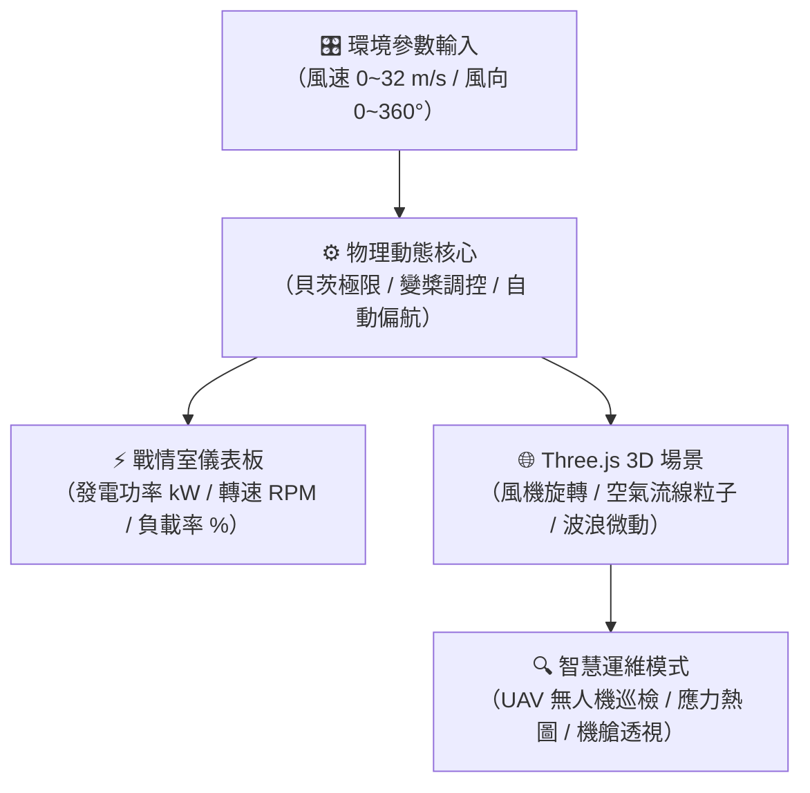

# 實戰 07：工研院綠能所專案 — 大型風機 3D 數位分身與發電動態模擬戰情室（HTML/Three.js Artifact）

> **模組類型**：企業實戰延伸模組（工研院綠能與環境研究所專屬案例）  
> **核心工具**：Claude HTML/JS Artifacts + Three.js 3D 渲染引擎 + 綠能物理動態計算  
> **輸出成品**：單一獨立高互動 3D 戰情室網頁（可於 Claude 側欄直接操作，亦可一鍵 Publish 發布）  
> **難度級別**：⭐⭐⭐⭐（進階 3D 數位分身、即時流體力學與智慧運維模擬）  

---

## 🎯 任務背景與練習目標

在綠能產學研發或大型風場專案會議上，研究人員向長官、審查委員或外部廠商簡報時，傳統的「靜態簡報投影片」或「2D 曲線圖」往往無法直觀展現風機的**動態物理響應**（如切入/額定/切出風速、葉片迎風變槳角度、偏航追風誤差與極端強颱順槳保護）。

透過本實戰單元，學員將學會如何藉由 **Claude Artifacts** 的即時網頁渲染能力，產出一個具備**工研院綠能翡翠綠識別（ITRI Brand Identity）**的高階 3D 風力發電機數位分身（Digital Twin）與動態發電模擬器。

### 🎓 核心學習成果
1. **掌握 3D 互動 Artifacts 提示技巧**：引導 Claude 運用純前端 Three.js 建立具備光影、材質、動態水面與風場粒子流線的 3D 場景。
2. **綠能工程物理公式聯動**：實作貝茨極限（Betz's Law）與風能功率立方公式 $P = \frac{1}{2} \rho A v^3 C_p$、葉尖速比（TSR $\lambda$）與即時發電負載計算。
3. **離岸 vs. 陸域基礎工程可視化**：一鍵切換離岸四腳套管基礎（Jacket Foundation + 警戒黃過渡段）與陸域混擬土基座。
4. **工研院智慧運維情境模擬**：實作「常規運轉」、「葉片應力分析（彩虹熱圖）」、「無人機 AI 巡檢與微裂紋探測」與「抗颱 90° 順槳煞車」四大維護模式。

---

## 🖥️ 實體成果即時預覽與體驗

本模組已備妥完整的可執行程式碼：
- 📂 **獨立實體檔案**：[**itri_wind_turbine_simulation.html**](./itri_wind_turbine_simulation.html)
- 💡 **快速預覽方式**：
  1. 您可直接在本地瀏覽器（Chrome / Edge / Safari）按兩下開啟該檔案，即可享受 60 FPS 的 3D 流暢互動。
  2. 或在 Claude.ai 聊天中貼上下方 RTCCF Prompt，Claude 將在右側畫布即時渲染此應用！



---

## 🚀 RTCCF 實戰 Prompt（一鍵複製貼給 Claude）

請打開全新 [Claude 對話視窗](https://claude.ai)，將以下提示詞複製貼入：

```markdown
## Role
你是一位工研院綠能與環境研究所（ITRI GEL）的資深風電系統專家兼高階 Web 3D 前端架構師，精通 Three.js 動態渲染與風力發電機電控制物理學。

## Task
請建立一個單一完整的 **HTML + CSS + JavaScript Artifact**（命名為「工研院綠能所_大型風機3D數位分身與發電模擬系統」）：
在 3D 空間中精緻建構一座 6.0 MW 大型風力發電機，支援滑鼠 360 度旋轉縮放，並提供專業戰情室儀表板與即時參數調控。

## Context
- 機構識別：工研院綠能與環境研究所（標誌配色：綠能翡翠深綠 `#0F5132`、科技薄荷綠 `#10B981`、深色半透明玻璃擬態 `#0F172A`）。
- 風機規格：
  - 額定容量：6.0 MW（6,000 kW）
  - 輪轂高度：110 公尺，轉子直徑：154 公尺（3 支空氣動力學流線型葉片，葉尖具備航管紅色警示漆）
  - 風況特性：切入風速 3.0 m/s，額定風速 12.0 m/s，切出（抗颱保護）風速 25.0 m/s。

## Constraint
1. **純前端單一檔案架構**：使用 CDN 引入 Three.js (r128) 與 OrbitControls，無任何後端依賴，可直接在 Claude 側欄執行預覽。
2. **動態 3D 特效與互動**：
   - 葉片旋轉速度依風速即時物理聯動；支援葉片節距角（Blade Pitch 0°~90°）順槳變化。
   - 機艙具備偏航系統（Yaw Control），可開啟「自動追風」跟隨環境風向平滑旋轉。
   - 包含風場空氣流線粒子系統（Airflow Particles），動態穿過風機受風面。
   - 支援離岸風場（四腳套管基礎 + 水下海浪動態）與陸域風場（混擬土基座）環境切換。
3. **智慧運維檢視模式**：
   - 標準運轉視角。
   - 葉片氣動應力分佈（受力熱圖可視化）。
   - 無人機 AI 巡檢模式（3D 浮動標籤標註 0.05mm 表面巡檢狀態）。
   - 機艙半透明透視模式。
4. **右側戰情室儀表板**：
   - 即時計算發電功率（kW）、轉子轉速（RPM）、尖速比（TSR）、發電效率（Cp）、功率負載率與減碳效益。
   - 具備風速過高（>25 m/s）自動觸發「抗颱順槳停機警告」。

## Format
- 產出為單一完整的 **HTML Artifact**，於右側側欄即時操作預覽。
```

---

## 🔄 實戰演練：長官與審查委員反饋（V2 迭代）

當長官或審查委員在會議上看過 V1 基礎版本後，往往會進一步要求增加具體工程細節。學員可在左側對話框直接提出以下指令，體驗 Artifacts 的**就地更新與版本歷史回溯**：

```markdown
長官看過初版後非常讚賞，但希望進一步強化技術審查深度，請在原 Artifact 上升級至 V2：
1. **新增抗颱順槳自動保護煞車**：當風速超過 25 m/s 時，通知橫幅請閃爍紅色警告，並自動將葉片轉速降至零，發電量歸零。
2. **新增底部快速視角按鈕**：在畫面下方中央提供「正面迎風視角」、「側面剖視」、「機艙近景」與「風場全景」四個快速導航按鈕，方便向長官切換鏡頭。
3. **增加減碳量累積換算**：依據發電功率，即時換算累計碳減排量（噸 CO2e）。
```

> 🎯 **成果驗收**：  
> Claude 會在同一個 Artifact 畫布上直接更新為 **Version 2**。長官如果想看回原本的簡約視角，隨時可以從右下角點選 `v1` 瞬間切換！

---

## 🌐 開會演示與一鍵 Publish 分享 SOP

1. **一鍵發布 (Publish)**：
   點擊右側 Artifact 視窗右上角的 **「Publish」** 按鈕，生成專屬公開網址（如 `https://claude.site/artifacts/...`）。
2. **大螢幕投影展示**：
   在會議室投影設備中直接以全螢幕開啟該網址，操作左側風速滑桿至 `12 m/s`，展示滿載 `6,000 kW` 發電；接著拉至 `27 m/s`，向委員動態演示系統自動順槳煞車的抗颱機制！
3. **跨單位同仁免登入體驗**：
   將產出的網址直接貼在研討會或產學會議群組中，與會者無須註冊 Claude 帳號，用手機或筆電瀏覽器點開即可旋轉 3D 風機模型進行體驗。

---

← [返回 Artifacts 主手冊](../../README.md) · [工研院綠能所專案指南](../../../企業專案/工研院綠能與環境研究所/README.md)
