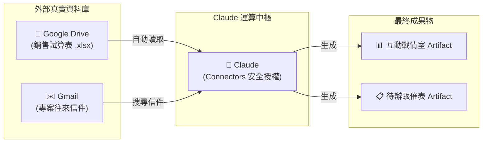

# 外部服務串接 (Connectors & MCP)：讓成品讀寫真實世界資料

> 深入解析如何透過 Claude 官方 Connectors 與 MCP 協議，讓右側的 Artifact 直接讀取 Google Drive、Gmail 中的真實資料並產出互動成果。

---

## 💡 痛點：擺脫假資料與繁瑣的上下傳流程

在過去，若想請 AI 整理一份業績報表：
1. 必須先從雲端下載 Excel / PDF 到個人電腦。
2. 手動將檔案拖曳上傳到 Claude 對話框。
3. Claude 產出分析後，又得手動複製文字存回文件。

透過 **Connectors（連接器）** 與 **MCP（Model Context Protocol）**，Claude 直接獲得讀寫外部服務的安全授權，**省去所有中間手動下載與上傳的時間浪費**！

---

## 🔌 支援的常見服務與運作機制

### 1. Google Drive 連接器
- **讀取能力**：支援讀取 Google Docs、Google Sheets、PDF、Excel、Word 等格式。
- **寫入能力**：可在 Artifact 討論定稿後，直接指令將內容存成新文件放回指定雲端資料夾。

### 2. Gmail 連接器
- **搜尋與讀取**：可依關鍵字或寄件人搜尋信件，萃取多封往來郵件中的決議事項。
- **草稿與發信**：可依 Artifact 生成的文案，直接建立 Gmail 草稿。

---

## 🏢 職場實戰三大應用情境

1. **Google Sheets ➔ 即時互動戰情室**：
   > *「請讀取我 Google Drive 中的『2026年Q1業績明細.xlsx』，在右側製作一個可按部門下拉篩選的 HTML 動態雙軸圖表 Artifact。」*
2. **Gmail 郵件串 ➔ 專案待辦清單**：
   > *「搜尋我 Gmail 中關於『機房升級專案』的近 5 封往來信件，整理出重點決議，並在右側產生一份帶核取方塊的專案進度追蹤表。」*
3. **Artifact 成品一鍵回存雲端**：
   > *「長官看過第 3 版企劃書確認無誤，請直接把這個 Artifact 儲存一份到我 Google Drive 的『2026 企劃部』資料夾中。」*

---

## 🔒 資安與隱私防護原則

- **動作授權機制（Approval-based）**：凡涉及寫入檔案、發送信件等不可逆操作，介面一定會跳出確認視窗，需由您手動點擊「核准」才會執行。
- **公開分享時安全隔離**：當您將 Artifact 發布為公開連結給長官或同事時，**外部人員絕對無法透過該連結窺探或讀取您的個人雲端硬碟私密檔案**。

---

← [返回 Artifacts 主手冊](../README.md)
