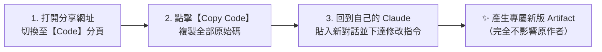

# 發布分享 (Publish) 與手動 Remix SOP

> 深入解析如何一鍵生成免登入公開展示網址、開會現場投影與群組傳閱示範技巧，以及官方下線 Remix 按鈕後的現行二次修改標準流程。

---

## 🌐 一鍵發布 (Publish & Share Link)

### 1. 操作步驟
1. 在右側 Artifact 面板右上角，點擊 **「Publish」** 或 **「Share」** 按鈕。
2. 系統會生成一個專屬的公開展示網址（格式通常為 `https://claude.site/artifacts/...`）。
3. 點擊 **Copy Link** 即可複製連結。

### 2. 開會展示的極致優勢
- **免帳號登入**：主管、同事**完全不需要註冊或登入 Claude 帳號**，任何瀏覽器點開即可完整互動。
- **免轉接頭與解壓縮**：開會時不用隨身碟、不用打包 zip 檔案，瀏覽器全螢幕直接 Demo。
- **跨設備同步**：將網址貼到會議群組（LINE / Teams / Slack），所有人可在手機、iPad 或筆電上親自操作篩選器與按鈕。

### ⚠️ 重要特性：快照機制 (Snapshot)
- 點擊 Publish 生成的網址是點擊當下版本的**「靜態快照」**。
- 若開會前長官又提出修改，而您在對話中更新成了 Version 2 或 Version 3，**請記得再次點擊「Publish / Update」更新發布**，這樣外部連結才會同步呈現最新畫面。

---

## 🔄 手動 Remix（二次修改）標準 SOP

### ❓ 為什麼介面上找不到「Remix」按鈕？
在 2024 年底改版中，Anthropic 官方已將早期的一鍵「Remix」按鈕移除（*The 'Remix' button is no longer available*）。

### 🛠️ 官方現行推薦的 3 步驟操作

若同事想在您分享的成品基礎上修改屬於他自己的版本：

1. **切換到程式碼檢視**：在分享網頁右上角點擊 **「Code」** 分頁。
2. **複製程式碼**：點擊右上角的 **「Copy Code」** 按鈕。
3. **貼上新對話並提出需求**：
   > *「這是同事做好的會議查詢小工具原始碼（貼上代碼），請在此基礎上，幫我將主要配色改為翠綠色，並新增一個列印按鈕。」*
4. **獨立版本生成**：Claude 會在同事自己的帳號中生成全新 Artifact，**完全不會影響或覆蓋到您原始的成品**！

---

← [返回 Artifacts 主手冊](../README.md)
