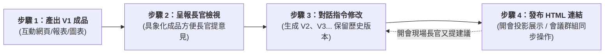

# Artifacts（成品／Canvas）

> 🟢 **方案需求**：Free（完全可用）。內嵌 Claude 模型呼叫亦在 Free 範圍內，但與整體訊息共用用量上限。

**Artifacts** 是對話中產生的**獨立成品預覽區塊**（HTML、React、SVG、Mermaid、Markdown 等）。當您要求 Claude 生成**長篇文字、程式碼、圖表或互動網頁**時，它不會將內容混雜在對話紀錄中，而是會在右側獨立開啟一個「畫布（Canvas）」視窗，可在側欄即時檢視、修改與發佈連結。

### 💡 核心思維：做成「成品」與「多版本迭代」

許多人以為用 AI 是一次就要生成完美答案，但在真實職場中：
- **它是可交付的「成品」**：不是散落的聊天對話，而是一份隨時能拿去用的實體成果物（如可點擊的 HTML 互動網頁、圖表、報表）。
- **成品無法 1 次完成，必定需要多輪修改**：通常第 1 版做出來呈交給長官／主管檢視後，長官一定會提出修改意見（例如：「版面再簡潔一點」、「加個篩選按鈕」、「色系統一」）。
- **保留不同版本，隨時切換還原**：Claude 的 Artifact 會在同一個畫布上記錄歷次修改（Version 1、Version 2、Version 3...），不怕改壞，長官如果說「還是第一版好」，隨時能一鍵切回。
- **開會展示超便利（HTML 分享連結）**：如果是互動網頁或報告，只要點擊右上角分享（Publish & Share Link），即可獲得專屬網址。開會時**不用投影機轉接線、不用打包壓縮檔發郵件，直接傳這個連結給主管或在大螢幕點開**，所有人就能立刻同步互動體驗！

你可以把它想像成：
- **對話區** = 你跟 Claude 討論需求、轉達長官回饋、修正邏輯的「工作會議室」。
- **Artifact 面板** = 兩人一起雕琢的「最終成品展示台」，版本清楚、連結可直接帶進會議室報告。


---

## 🌟 核心特性與完整功能

1. **獨立面板即時預覽**：內容直接顯示在對話旁，支援 HTML/CSS/JS、React、Tailwind CSS 等程式碼與視覺設計的即時渲染。
2. **支援多種內容格式**：
   - **文件 / 報告**：Markdown 格式文件與報告。
   - **網頁應用**：可互動的單頁網頁（HTML + CSS + JavaScript）。
   - **程式碼檔案**：各類語言（如 Python、Go 等）程式碼區塊。
   - **圖表與資料視覺化**：React 元件（如 Recharts）渲染的動態圖表。
   - **流程圖 / 心智圖**：Mermaid 語法繪製的流程圖或架構圖。
   - **向量圖像**：可縮放的 SVG 向量圖形。
3. **介面隔離**：保持主要對話視窗乾淨，方便專注於 Prompt 邏輯討論。
4. **可反覆修改、保留版本紀錄**：直接跟 Claude 說「把背景改成藍色」、「幫我加一個欄位」，Artifact 會在同一個面板上直接更新。每次修改都會產生一個「新版本」，您可以隨時往回切換查看或還原（類似 Git 或是復原功能）。
5. **一次對話可產生多個檔案（多個 Artifacts）**：一段對話中，Claude 可陸續產生多個不同的 Artifact（例如：先做一份文案，再做一張流程圖，然後做一個網頁），每個檔案各自獨立且擁有專屬的版本紀錄。
6. **AI 驅動的成品 (Claude in Claude / 讓成品裡內建 AI 大腦)**：*（進階功能）*
   - **白話意思是**：一般做出來的網頁小工具（如計算機、表單），按按鈕只能執行固定死板的程式規則；但這個功能可以**讓你在做出來的成品裡面，再塞入一顆 Claude AI 大腦**！
   - **生活比喻**：
     - *一般成品* = 做出一台「普通電子計算機」（只能按加減乘除）。
     - *Claude in Claude* = 做出一台「內建 AI 秘書的智慧機器」（你在裡面輸入隨興文字，按一下按鈕，裡面的 AI 會現場幫你動腦思考與回答）。
   - **職場實例**：
     - 你請 Claude 做一個「**公文潤飾產生器**」網頁成品。
     - 你把這個網頁分享給同仁，同仁只要在網頁的輸入框貼上粗糙草稿、點擊「AI 潤飾」，網頁**內部就會自動呼叫 Claude 替他改寫成專業公文**！
   - **最大好處**：以往要做這種 AI 應用，工程師得去買 API Key、架設後端伺服器；現在**完全零門檻、不需要 API 金鑰**，在對話中直接就能做出有 AI 生成能力的完整應用原型。
   - **❓ 常見疑惑：不用 API Key，如果分享給同事且使用量很大，費用算誰的？會不會收到天價帳單？**
     - **請完全放心！絕對不會產生任何意料之外的自費帳單，也不會把您的個人額度吃光**：
       1. **一般前端成品（佔 95% 的情境，如計算機、表單、查詢工具、動態圖表）**：完全在同事手機或電腦的瀏覽器本地執行，**零費用、零扣額度**，同事點擊幾萬次也不花一毛錢。
       2. **您自己在對話中測試 AI 功能**：扣的是您自己帳號的「方案訊息額度（Message Limits）」，與平時聊天共用同一個額度池；就算額度用完也只是暫時等待重置，**絕不會自動刷信用卡額外收費**。
       3. **同事點開連結使用 AI 功能**：官方設有防護機制，訪客**不能**透過公開網址消耗原作者的 AI 資源；同事若要觸發小工具內的 AI 生成，**必須登入同事自己的帳號，消耗的是「同事自己的用量配額」**，完全不會算在您頭上！
       4. **原型展示 vs 正式上線的分工**：Artifact 是用在「前期展示、呈報長官與開會驗證原型（$0 元、零風險）」；如果未來長官決定將此工具「推廣至全公司數百人正式營運使用」，才需要交由 IT 工程師改接官方 Claude API（由公司統籌申請金鑰並編列預算支付）。
7. **持久化資料儲存**：*（進階功能）* 可以讓 Artifact 記住資料（例如做一個記帳工具、排行榜），下次開啟時資料依然存在。
8. **可串接外部服務**：*（進階功能）* 可連結 Google Drive、Gmail 等，讓 Artifact 直接讀寫真實資料。
9. **分享與二次修改**：可產生「公開分享連結」給其他人（對方不需要 Claude 帳號也能開啟觀看與操作）。若其他同事也想在此基礎上調整，可直接複製程式碼到自己的 Claude 對話中延伸創作，不會影響到原作者的版本。
10. **自動與手動判斷**：Claude 會依內容長度、是否需要重複使用等狀況，自動決定要不要開啟 Artifact；你也可以在 Prompt 中主動要求「幫我做成 Artifact」。

詳細資訊可參考官方說明：[Prototype AI-Powered Apps with Claude artifacts](https://www.claude.com/resources/tutorials/prototype-ai-powered-apps-with-claude-artifacts)、[說明中心：Artifacts 介紹](https://support.claude.com/en/articles/9945615-intro-to-artifacts)。

**RTCCF 五段欄位**請對照 [Chats／RTCCF 欄位對照](../Chats/README.md#rtccf-欄位對照複製範本時請五段都填)。

---

## 🎯 使用時機

| 適合使用 Artifacts | 不適合 / 不需要 Artifacts |
| :--- | :--- |
| 要**可點、可捲動**的網頁小工具、儀表板、互動原型 | 簡短的問答或說明（例如：「法國首都是哪裡？」） |
| 內容超過一頁、需要反覆修改的長篇文件（報告、合約、企劃書） | 僅需一兩句回覆的對話，或是腦力激盪的討論過程 |
| 程式碼片段、特定函數、完整模組（需要複製或下載） | 一次性、用完即丟的極簡程式碼（20 行以下） |
| 可視覺化的圖表（SVG、Mermaid）與 HTML 頁面 | 只是想確認一個小觀念，不需要留存 |
| 之後需要單獨分享給別人看，或是下載為獨立檔案的成果物 | 純文字格式的隨手筆記或簡短備忘 |

> 💡 **簡單判斷原則**：「這個東西做完後，我還會想再回頭看它、改它、或拿給別人看嗎？」如果答案是「會」，就適合用 Artifact。

---

## 💼 職場實戰工作流：從「V1 初版呈報」到「長官反饋迭代」與「開會 HTML 連結展示」

在實際公務、商務與專案協作中，**Artifacts 最強大的地方在於「做成具體成品」、「消除修改焦慮」與「開會極速展示」**。



### 💡 核心優勢解析

#### 1. 為什麼「成品無法一次完成」是正常的？
- 實務上沒有任何專案能一個 Prompt 就「完美定稿」。
- **先做 V1 給長官看**：長官看純文字描述往往沒有感覺，但只要給他看一個**可點選、可預覽的具體成品（Artifact）**，長官就能立刻給出精確的反饋（例如：「按鈕換到右邊」、「字級調大」、「多加一個審核狀態」）。

#### 2. 實務四步驟操作指南

| 階段 | 實務場景與操作技巧 |
| :--- | :--- |
| **步驟一：快速產出 V1 初版** | 先求有、求具象化。不用一次寫出 500 字落落長的 Prompt，先讓 Claude 建立骨架與基礎功能。 |
| **步驟二：呈報長官檢視** | 截圖或直接把螢幕轉給長官看：「長官，這是初步規劃的查詢網頁原型，您看看架構是否符合需求？」長官通常會提出 2~3 點修改要求。 |
| **步驟三：指令式修改與版本演進** | 回到對話框，將長官原話貼給 Claude：「長官看過後希望：1. 增加匯出功能、2. 字體放大 15%、3. 配色改為機關深藍色。」Claude 會在**同一個畫布直接生成 Version 2**。<br/>📌 **防改壞保護傘**：點擊 Artifact 視窗右下角版本歷史（Version History），隨時能一秒切回 Version 1，長官反悔也不用怕重新來過！ |
| **步驟四：一鍵分享連結開會展示** | 點擊 Artifact 右上角 **Publish（發布）** 複製公開分享連結（Share Link）：<br/>• **投影展示**：開會時只要瀏覽器貼上網址即可全螢幕演示。<br/>• **跨裝置體驗**：把連結貼在會議通訊群組（Teams/LINE/Slack），所有與會主管用手機或筆電點開就能親自點擊操作（**對方不需登入 Claude 帳號**）。<br/>• **現場即時改動**：開會若長官當場又有新想法，切回 Claude 說一句立刻更新！<br/>⚠️ *官方小提醒*：Publish 是依據當前版本產生的「快照（Snapshot）」。若後續又指令修改成新版本，記得再點一次「Publish / Update」更新發布，連結就會同步顯示最新版。 |

---

## 💡 教師演示單元：官方範例實踐

以下範例改寫自 Anthropic 官方教學頁面所提供的 Prompt，講師可在課堂上直接複製貼給 Claude，向學生現場示範 Artifact 的完整互動流程。

### 示範主題：用簡單的方式解釋一個複雜的主題

#### 任務背景
講師需要在課堂上展示 Artifact 的即時生成、版本迭代與多檔案管理能力。我們透過「簡單解釋複雜主題」的任務，示範如何讓 Claude 透過提問釐清需求，並生成最合適的 Artifact。

#### RTCCF Prompt（請複製後修改）
```markdown
## Role
你是一位擅長將複雜知識「科普化」、以白話文與生活化比喻解釋學術概念的教育專家。

## Task
請協助我用簡單易懂的方式解釋一個複雜的主題。在開始之前，如果需要我提供更多資訊，請立即提出 1~2 個關鍵問題。如果你認為上傳某些文件會有幫助，也請告訴我。你可以使用你有權限存取的工具（如 Google Drive、網頁搜尋等）來協助完成此任務。請保持友善、簡短且口語化的對話語氣。

## Context
- 主題：（請填入你想被解釋的複雜概念，例如：區塊鏈 / 量子糾纏 / 機器學習）
- 讀者對象：（例如：國小五年級學生 / 完全沒有程式基礎的長輩）
- 說明目標：用一個生動的比喻，讓讀者在 3 分鐘內理解核心概念

## Constraint
- 語氣：親切、友善、對話式，避免使用過多的專業術語
- 請勿使用「分析工具（analysis tool）」
- 請以最適合呈現該主題的 **Artifact** 格式輸出（例如：互動式圖表、流程圖、說明文件或檢核清單）

## Format
- 產出為 **Artifact**，類型依主題特性而定（Visual, Interactive, Checklist, or Document）
- 完成後，我將要求你進行「簡化內容」、「加入插圖」或「提供不同受眾版本」的迭代修改
```

#### 課堂演示與觀察重點
1. **引導提問**：貼上 Prompt 後，讓學生觀察 Claude 是否會先反問 1~2 個關鍵問題以確認背景，而非直接給出大篇幅回答。
2. **自動選擇格式**：回答問題後，觀察 Claude 啟動 Artifact 時自動選擇了哪種格式（例如用 SVG 圖像繪製比喻，或用 Markdown 條列）。
3. **體驗「版本更新」（任務 A）**：請 Claude 修改內容（例如輸入：「太難了，請用更簡單的口語再修飾一次，並將背景顏色換成淡黃色」）。
   - 引導學生觀察：Artifact 是「在原本同一個畫布上更新版本」，而不是重新開一份新的。
   - 點開 Artifact 右下角的「歷史版本」按鈕，示範如何切回修改前，說明「防改壞」的備份機制。
4. **體驗「一次產生多個檔案」（任務 B）**：接著輸入：「這個主題解釋得很好！請再幫我做一份『給國小學生看的簡化版懶人包』，另外做成一個檔案。」
   - 引導學生觀察：對話中出現了**第二個獨立的 Artifact**。說明兩個檔案各自獨立、互不覆蓋，可以分開修改與分享。
5. **分享與 Remix**：示範點選右下角的分享連結功能，說明「複製連結」跟「Remix（重新混合）」的差別。

---

## 💡 實戰講義：四大核心範例全解

本講義完整收錄了官方展示的四個核心應用範例。透過這些範例，您可以深入了解如何利用 Artifacts 功能進行高效的文案創作、程式撰寫、數據視覺化以及互動式網頁應用的開發。

---

### 範例一：行銷經理的 AIGC 實踐 —— 產品文案說明

#### 任務背景
行銷人員需要快速生成結構清晰、排版美觀、具備高說服力的產品銷售頁面（Landing Page），並可依不同受眾一鍵切換語氣風格。

#### RTCCF Prompt（請複製後修改）
```markdown
## Role
你是一位擅長科技產品行銷的資深文案撰寫專家。

## Task
為一款智慧型手機撰寫一份**Markdown Artifact 格式**的產品銷售頁文案，內容包含：標題、一段簡介、核心優勢清單（至少五項，使用粗體小標）、以及差異化競爭說明段落。

## Context
- 產品名稱：（請填入您的產品名稱，例如：Techmaster X1000）
- 目標受眾：（請填入，例如：科技愛好者／商務人士／學生）
- **以下為產品核心規格（請貼上或改寫）：**
  - （例如：處理器、螢幕、相機、電池、連接規格等）

## Constraint
- 語言：繁體中文；語氣積極正向、專業但不過度艱澀
- 文案長度：核心優勢清單 5～7 項，差異化說明 2～3 句
- 請勿捏造規格數字；未確認的規格請以「TBD」標示

## Format
- 產出為 **Artifact**，格式為 **Markdown**，可於側欄即時預覽
- 完成後可要求「調整語氣至更年輕化」「改為英文版本」等迭代
```

---

### 範例二：工程師的開發助手 —— Python 邏輯函數

#### 任務背景
開發工程師需要快速產出符合 PEP 8 規範、包含 Docstring 與測試範例的乾淨 Python 程式碼，並在 Artifact 中即時預覽與驗證邏輯。

#### RTCCF Prompt（請複製後修改）
```markdown
## Role
你是一位嚴格遵守 PEP 8 規範、注重程式碼可讀性的資深 Python 工程師。

## Task
撰寫一個 Python 函數，實作**（請填入功能描述，例如：計算不超過上限值的費波那契數列）**，需包含：完整 Docstring（參數說明、回傳值說明）、核心邏輯實作、以及至少一個使用範例（含預期輸出）。

## Context
- 函數名稱建議：（請填入，例如：fibonacci_sequence）
- 輸入參數：（請填入，例如：limit: int，數列上限值）
- 回傳值：（請填入，例如：list，包含所有不超過上限的數列）
- **邊界條件或特殊需求（請填入）：**
  - （例如：limit 為負數或 0 時應如何處理）

## Constraint
- 嚴格遵守 PEP 8；函數命名使用 snake_case
- 必須包含 Google 風格 Docstring
- 不使用第三方套件，僅使用 Python 標準函式庫

## Format
- 產出為 **Artifact**，格式為 **Python 程式碼**
- 完成後可要求「改用 Generator yield 優化記憶體」「加入單元測試」等迭代
```

---

### 範例三：數據分析師的儀表板 —— 銷售與利潤率圖表

#### 任務背景
數據分析師需要將季度銷售數據快速轉化為雙軸（Dual-Axis）動態圖表，一眼看出營收與利潤的關聯，無需安裝任何工具即可在瀏覽器中預覽。

#### RTCCF Prompt（請複製後修改）
```markdown
## Role
你是一位擅長前端數據視覺化的數據分析師，熟悉 Recharts 與 React 生態系。

## Task
使用 **Recharts** 建立一個雙 Y 軸（Dual-Axis）圖表 React Artifact：左軸顯示銷售量（柱狀圖 BarChart），右軸顯示利潤率（折線圖 LineChart），X 軸為時間維度。

## Context
- **數據（請貼上或改寫）：**

| 季度 | 銷售量 (台) | 利潤率 (%) |
| --- | --- | --- |
| Q1 | 150,000 | 20 |
| Q2 | 220,000 | 22 |
| Q3 | 180,000 | 21 |
| Q4 | 280,000 | 25 |

- 圖表標題：（請填入，例如：2024 年季度銷售與利潤率總覽）

## Constraint
- 使用 Recharts 的 ComposedChart 實作雙軸；柱狀圖色系藍色，折線圖色系綠色
- 加入 Tooltip 與 Legend；圖表需有適當 margin 避免標籤被裁切
- 不使用真實 API，數據直接內嵌於元件中

## Format
- 產出為 **React Artifact**，可於側欄即時渲染互動圖表
- 完成後可要求「改為折線圖對比」「加入動畫效果」「支援 CSV 上傳」等迭代
```

---

### 範例四：產品經理的互動原型 —— 團隊內容排程行事曆

#### 任務背景
產品經理需要不依賴後端資料庫，快速建立可點擊互動的 React 前端原型，用於向團隊展示排程行事曆的 UX 流程，並收集使用者回饋。

#### RTCCF Prompt（請複製後修改）
```markdown
## Role
你是一位擅長 React 互動原型設計的產品經理，能快速打造可展示的 UI 雛形。

## Task
建立一個**月曆排程行事曆 React Artifact**，功能包含：月份網格顯示（自動對齊星期）、點擊日期彈出 Modal 新增排程（含標題輸入與部門選擇）、排程儲存後立刻顯示於對應日期格中。

## Context
- 使用對象：（請填入，例如：行銷團隊內部）
- 可選部門：（請填入，例如：行銷 / 業務 / 產品）
- **需要顯示的預設月份**：（請填入，例如：2025 年 6 月）

## Constraint
- 使用 React `useState` 管理排程狀態；不連接任何後端 API 或資料庫
- Modal 需包含「確認新增」與「取消」按鈕；關閉後焦點回到日曆
- 語言：繁體中文；介面需清楚標示年月與星期標頭

## Format
- 產出為 **React Artifact**，可於側欄即時點擊互動
- 完成後可要求「加入 localStorage 持久化」「支援拖曳移動排程」「切換月份功能」等迭代
```

---

## ✍️ 學生實作練習：五大情境體驗

每位學生可依興趣或學號尾數選擇**一種情境**，動手操作一次。五個練習將會產生**不同格式的 Artifact**，完成後可以互相比較「原來 Artifact 可以呈現這麼多種形態」。

---

### 練習一：英文單字學習小工具 (互動網頁)

#### 任務背景
學生需要一個可以自我檢測英文單字能力的工具，希望透過互動式網頁進行隨機出題，點選答案後能立刻獲得正誤回饋與提示。

#### RTCCF Prompt（請複製後修改）
```markdown
## Role
你是一位擅長設計互動式教學網頁的資深前端工程師與英文教師。

## Task
建立一個**英文單字學習網頁小工具 Artifact**，功能包含：隨機從題庫中抽出一題、以單選題（四選一）方式呈現、點選答案後即時顯示「答對」或「答錯」提示，並附帶該單字的中文解釋與例句。

## Context
- 單字庫：（請貼上您想練習的單字與中文，例如：apple-蘋果, banana-香蕉, cherry-櫻桃, date-椰棗, elderberry-接骨木莓）
- 適合對象：初學者／中級學習者
- 設計風格：活潑、清晰，字體易讀

## Constraint
- 語言：繁體中文（單字與例句保留英文）
- 使用純 HTML、CSS 與 JavaScript，將程式碼整合在單一 Artifact 內
- 答錯時，應提供該單字字首的提示或字義提示

## Format
- 產出為 **HTML Artifact**，可於右側畫布即時渲染與操作
- 完成後，可繼續要求「加入計分功能」或「倒數計時」等迭代
```

---

### 練習二：光合作用流程圖 (Mermaid 流程圖)

#### 任務背景
學生在準備自然科學科報告，需要一張結構清晰、視覺化直觀的「光合作用」流程圖來輔助簡報與理解。

#### RTCCF Prompt（請複製後修改）
```markdown
## Role
你是一位精通生物學且擅長繪製結構化思維導圖與流程圖的教學設計師。

## Task
使用 **Mermaid 語法**繪製一張**「光合作用（Photosynthesis）」的流程圖 Artifact**，清晰呈現光反應（Light Reactions）與暗反應（Calvin Cycle）的輸入物、輸出物、發生地點以及兩者之間的能量載體循環。

## Context
- 教學主題：國高中生物科 —— 植物的光合作用
- 核心要素：水、二氧化碳、光能、氧氣、葡萄糖、ATP/ADP、NADPH/NADP+
- 發生地點：葉綠體（類囊體膜、葉綠體基質）

## Constraint
- 語言：繁體中文
- 流程圖節點需清晰，使用不同的形狀或顏色區分輸入物、產物與反應階段
- 邏輯必須嚴密，呈現能量載體在光反應與暗反應之間的循環關係

## Format
- 產出為 **Mermaid 圖表 Artifact**，可在右側即時渲染成圖形
- 完成後，可迭代要求「修改某步驟的說明」或「調整流程圖配色」
```

---

### 練習三：小組會議紀錄 (Markdown 文件)

#### 任務背景
學生在小組討論後留下了許多零散的討論紀錄與待辦事項，需要整理成一份格式嚴謹、排版清晰的 Markdown 會議紀錄，以利分享給組員與留存。

#### RTCCF Prompt（請複製後修改）
```markdown
## Role
你是一位效率極高且注重排版美感的專案秘書。

## Task
將我提供的小組討論紀錄，整理成一份**結構化的 Markdown 會議紀錄 Artifact**。內容需包含：會議標題、日期時間、與會人員、核心討論重點整理（使用層級標題與條列）、決議事項清單、以及明確的「待辦事項表」（欄位含工作內容、負責人、截止日期）。

## Context
- 專案名稱：（請填入，例如：期末分組報告）
- 討論主題：（請填入，例如：簡報分工與內容大綱討論）
- **以下為原始討論紀錄（請在下方貼上口頭討論的零散文字或錄音檔摘要）：**
  - （例如：小明說要負責報告前言，小華下禮拜五前做完PPT，大家覺得主色用藍色比較好）

## Constraint
- 語言：繁體中文；口吻專業、中立且條理分明
- 待辦事項必須用 Markdown 表格（Table）呈現，確保一目了然
- 若原始紀錄中有未明示負責人或期限的事項，請在表格中標記為「TBD（待定）」

## Format
- 產出為 **Markdown Artifact**，可於右側預覽格式排版
- 完成後，可繼續要求「產生對應的簡報大綱」或「改寫成信件通知格式」等迭代
```

---

### 練習四：園遊會擺攤記帳表格 (結構化表格/試算表)

#### 任務背景
班級要在學校園遊會擺攤，總務需要一份清晰的記帳表格，列出各品項的成本、單價、預估銷量，並能自動計算預估總營收與利潤，以便進行財務規劃。

#### RTCCF Prompt（請複製後修改）
```markdown
## Role
你是一位精通試算表設計與財務規劃的班級總務股長。

## Task
建立一個**園遊會擺攤預算記帳表格 Artifact**，整理班級擬販售的品項、單價、預估銷量與成本。表格需包含：品項名稱、單價、預估銷量、預估營收、單位成本、預估總成本、預估利潤，並在表格底部計算出「預估總營收」、「預估總成本」以及「預估總利潤」。

## Context
- 活動名稱：學校園遊會班級擺攤
- **販售品項資料（請貼上或替換）：**

| 品項 | 單價 | 預估銷量 | 單位成本 |
| --- | --- | --- | --- |
| 紅茶 | 20 | 100 | 5 |
| 熱狗 | 35 | 80 | 15 |
| 雞蛋糕 | 40 | 120 | 12 |

## Constraint
- 語言：繁體中文；金額部分統一使用新台幣（NT$）標示
- 必須使用正確的數學公式進行計算（營收 = 單價 * 銷量；利潤 = 營收 - 總成本）
- 表格排版需整齊，數值欄位靠右對齊，並用粗體突出加總列

## Format
- 產出為 **React 或 HTML 表格 Artifact**（若環境支援，可使用試算表格式渲染），可在右側即時檢視計算結果
- 完成後，可迭代要求「加入新商品」、「調整預估銷量」或「計算損益兩平點」
```

---

### 練習五：班徽向量圖設計 (SVG 向量圖)

#### 任務背景
班級要設計專屬的班徽，用於印製班服與班牌。希望設計一款簡潔、現代的向量標誌，主色為藍白兩色，並融入書本的意象。

#### RTCCF Prompt（請複製後修改）
```markdown
## Role
你是一位擅長簡約風格、注重比例與結構的專業平面與 UI 設計師。

## Task
使用 **SVG 程式碼**設計一個**班徽標誌 Artifact**。設計風格為簡單、乾淨、扁平化（Flat Design），主要色調為藍色與白色。班徽中必須包含「一本書」的圖案意象，並可搭配簡單的幾何裝飾圖案（如圓形外框或盾牌外框）。

## Context
- 使用對象：學校班級（例：三年二班）
- 設計元素：書本（象徵知識）、圓形或盾牌外框（象徵團結／榮譽）
- 色彩規範：主色為經典藍（例如：#1E3A8A），輔色為純白與淡藍色

## Constraint
- 必須是**純 SVG 格式**，程式碼中不可引用 any 外部圖片連結
- 程式碼需乾淨，結構組織良好（使用 `<g>` 進行分組，並加上註解說明）
- 向量圖形需具備響應式特性（設定適當的 `viewBox`，確保放大時不會失真或裁切）

## Format
- 產出為 **SVG 圖像 Artifact**，可在右側畫布直接預覽圖案畫面
- 完成後，可要求「將主色換成綠色」、「加入班級英文名稱文字」等迭代
```

---

### 🎯 每個練習都要額外完成的兩個小任務

不論選擇上述哪一個練習，都必須額外操作並完成以下兩大挑戰，以完整體驗 Artifact 的版本控制與多檔案協作功能：

#### 任務 A：體驗「版本更新（同一檔案迭代）」
完成基本練習後，在對話區對 Claude 提出一個修改要求（例如：改顏色、調整欄位、增加題目數量、修改字型等）。
* **觀察與回答**：
  - 觀察右側面板是否是在「同一個 Artifact」上直接更新版本？還是重新開了一個新檔案？
  - 在 Artifact 面板右下角找到版本紀錄選單（History），試著點擊切換回修改前的版本，體驗 AI 的版本控制功能。

#### 任務 B：體驗「一次產生多個檔案（多檔案管理）」
接著，在原對話中對 Claude 提出另一個相關但不同的需求，要求它產出另一個檔案。
* **範例延伸要求**：
  - **練習一（英文單字小工具）** ➡️ 「請幫我製作一份『單字題庫清單』的 Markdown 說明文件，列出剛剛的所有題目與正確答案。」
  - **練習二（光合作用流程圖）** ➡️ 「請幫我寫一段 150 字的文字說明，作為搭配這張流程圖的簡報口頭講稿，並以 Markdown Artifact 呈現。」
  - **練習三（會議紀錄）** ➡️ 「請幫我把剛剛會議紀錄中的『待辦事項』單獨抽出來，製作成一張方便列印的 HTML 待辦表格。」
  - **練習四（園遊會表格）** ➡️ 「請根據剛剛的表格數據，幫我繪製一個簡單的 SVG 圓餅圖，呈現各品項預估營收的比例。」
  - **練習五（班徽 SVG）** ➡️ 「請幫我把這個班徽的使用規則，做成一份『班徽設計規範手冊』文件（Markdown 格式），列出禁用配色與應用建議。」
* **觀察與回答**：
  - 對話中現在總共出現了幾個 Artifact？它們是各自獨立存在，還是共用同一個？
  - 修改其中一個 Artifact 時，會不會影響到另一個？
  - 這種「一次對話、產出多個檔案」的方式，對你之後做報告/作業有什麼幫助？

---

## 經典範例（辦公情境）：內部「會議室／請假規則」查詢小工具

### 任務背景
總務想先做一個**可給同仁點選、查閱**的簡易網頁：顯示會議室借用規則與請假流程摘要（內容可事後改），用於內部溝通與教育訓練前預覽，不需正式上線。

### RTCCF Prompt（請複製後修改）
```markdown
## Role
你是一位擅長前端原型的行政／總務承辦人員。

## Task
建立一個**單一 HTML Artifact**（可含內嵌 CSS／JavaScript）：主題為「會議室借用與請假流程快速查詢」。頁面需有清楚標題、分頁或摺疊區塊（會議室規則／請假流程）、以及一個簡單的「常見問題」摺疊清單。

## Context
- 使用對象：公司／機關內部同仁
- **以下為我們實際規定（請貼上或改寫）：**
  - （貼上會議室開放時段、借用方式、請假天數計算方式等）

## Constraint
- 語言：繁體中文；版面清楚、字級夠大，利於螢幕閱讀
- 不連接真實資料庫；按鈕以展示流程為主即可
- 若內容涉及個資或未定案政策，請標註「範例」

## Format
- 產出為 **Artifact**，格式為**單一 HTML**（或 React Artifact，若介面預設支援），可於側欄預覽與互動
- 請在 Format 中註明：完成後我可要求「按鈕加大」「改配色」等迭代
```

### 🔄 實戰演練：長官反饋修訂 ➔ 版本切換 ➔ 開會 HTML 連結展示

完成 V1 初版網頁後，真實職場流程通常如下：

#### 步驟 1：長官檢視後給出意見，下達 V2 迭代 Prompt
將長官的具體反饋直接貼給 Claude：
```markdown
長官看過初版後，提出以下兩點修改要求：
1. 請在上方新增一個「關鍵字快速搜尋框」，同仁輸入關鍵字（例如：請假、鑰匙、投影機）時能即時過濾內容。
2. 標題與按鈕字體請放大一號，整體色系改為專業的機關深藍色（#1E3A8A）。
請直接在同一個 Artifact 上更新版本。
```
* **觀察成果**：Claude 在右側同一個畫布直接生成 **Version 2**。點擊右下角的版本選單，可在 `v1` 與 `v2` 之間自由切換與比對。

#### 步驟 2：開會展示 —— 一鍵發布 HTML 分享連結（Publish & Share Link）
1. 點擊右側 Artifact 面板右上角的 **「Publish / Share」** 按鈕。
2. 系統會生成專屬的公開展示網址（例如 `https://claude.site/artifacts/...`）。
3. **開會使用方式**：
   - **免投影轉接線、免裝軟體**：開會時只要在會議室電腦瀏覽器點開該網址，即可直接全螢幕向長官與同仁進行 Live 互動展示。
   - **現場同步體驗**：將連結貼到會議群組（如 LINE / Teams / Slack），主管與與會人員用自己的手機、平板或筆電點開，也能立即跟著操作。
   - **現場即刻微調**：如果開會現場長官又提出：「文字欄位再調寬一點」，當場對 Claude 輸入指令，幾秒鐘刷新就是最新版！

---

## 📝 課後思考與討論問題

1. **使用情境判斷**：請舉出一個「適合使用 Artifact」的例子，和一個「不適合使用 Artifact」的例子，並說明原因。
2. **多檔案管理**：如果要做一份完整的專題報告（同時需要文字說明、架構流程圖、數據表格與示意圖），你會請 Claude 全部擠在同一個 Artifact 裡，還是分開成多個 Artifact 呈現？為什麼？
3. **版本控制的妙用**：在修改程式碼或網頁時，「版本紀錄（History）」功能能為你帶來什麼好處？你通常會在什麼時候使用它？
4. **共享與 Remix**：如果你將自己設計的「記帳工具」Artifact 發布公開連結分享給同學，同學可以在不影響你原始資料的情況下拿去自己使用嗎？這跟一般的 Google 試算表共享有何不同？
5. **AI 驅動潛力**：你認為 Artifact 的「持久化儲存」與「內嵌 Claude 能力」，能讓你在不寫後端程式的情況下，做出哪些以前無法實現的智慧小工具？

---

← [上層：Claude_AI 索引](../README.md) · [Chats 範例庫](../Chats/README.md)
