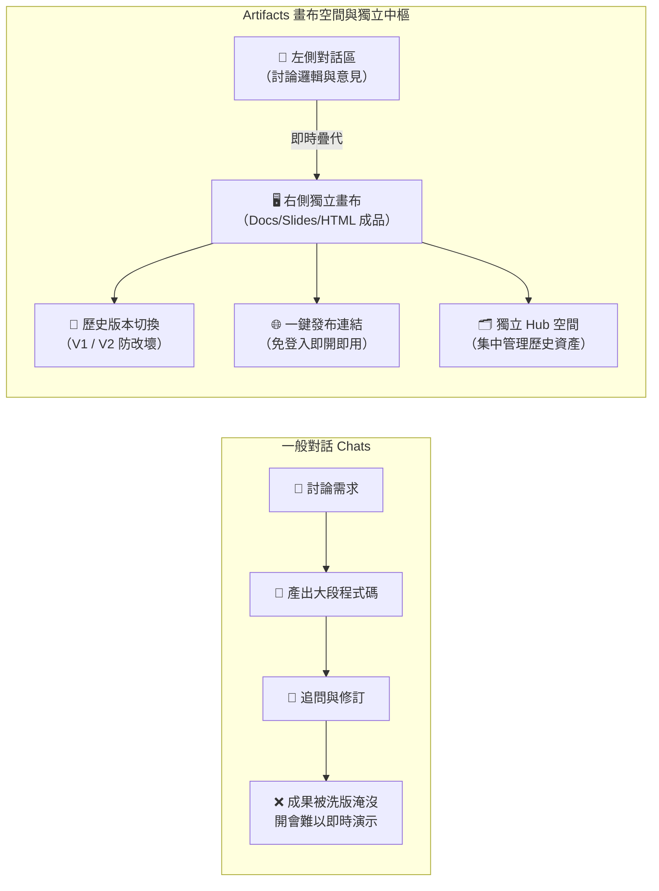
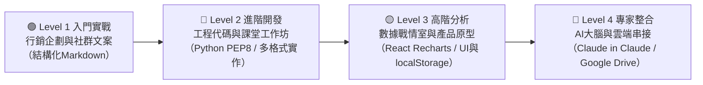

# Claude Artifacts（成品畫布與獨立創作中心）

> 專為職場人士、各領域學員與專業工作者設計。從右側獨立即時預覽的「數位成品畫布」，全面升級為 Anthropic 2026 最新「One Claude」架構下的 **Web-Native 雲端創作與資產管理中心（Artifacts Hub）**。  
> 🔗 **全域概念對照**：本單元聚焦於討論方式的內容生成（**Claude 稱為 Artifacts**，**ChatGPT 稱為 Canvas 畫布**，詳見 [ChatGPT Canvas 篇](../../chatGPT/03_Canvas/README.md)）。實戰應用請參考 [常見的 AI 應用：現代職場三大實戰範例庫](../../常見的AI應用/實戰範例/README.md)。

---

## 🚀 2026 最新版本震撼升級：走向「One Claude」獨立創作中心

Anthropic 在最新版本中完成了劃時代的整合——**Claude Design 正式全面回歸並常駐於 Artifacts**，並且推出了專屬的 **Artifacts 獨立管理大廳（Artifacts Hub / Workspace）** 與三大全新原生創作模板：

```text
┌──────────────────────────────────────────────────────────────────────────────┐
│  Artifacts                                                                   │
│  [All]  [Yours]  [Shared with you]                         [🔍] [🔲] [All types ▾]
├──────────────────────────────────────────────────────────────────────────────┤
│  📢 Claude Design lives here now                                             │
│     New Slides and Design projects are created as artifacts.                 │
│     [Visit the standalone homepage ↗]                                        │
├──────────────────────────────────────────────────────────────────────────────┤
│  Make something new                                                          │
│  ┌──────────────┐   ┌──────────────┐   ┌──────────────┐                      │
│  │   📄 Docs    │   │  📑 Slides   │   │  📱 Design   │                      │
│  │    [Beta]    │   │    [Beta]    │   │    [Beta]    │                      │
│  └──────────────┘   └──────────────┘   └──────────────┘                      │
└──────────────────────────────────────────────────────────────────────────────┘
```

### 🌟 新版三大關鍵突破：
1. **獨立數位資產中樞（Artifacts Hub）**：
   - 不再只是聊天的附屬側欄！左側選單設有獨立入口（`claude.ai/artifacts`），提供 `All`（全部）、`Yours`（我的成品）、`Shared with you`（團隊共享）分類標籤。
   - 支援即時關鍵字搜尋、卡片網格（Grid）與清單列表（List）視圖切換，以及類型篩選器（`All types`）。
2. **「Make something new」三大原生 Web-Native 模板（Beta）**：
   - 📄 **Docs (Beta)**：原生協同文件。支援劃詞編輯與即時雙向討論，可無縫匯出至 **Microsoft Word (.docx)**、**Google Docs** 或 **PDF**。
   - 📑 **Slides (Beta)**：原生簡報生成。直接產生整套完整投影片組（Deck）、支援單頁視覺排版、線上全螢幕演說放映（Presentation Mode），可匯出至 **PowerPoint (.pptx)** 或 **PDF**。
   - 📱 **Design (Beta)**：Claude Design 深度整合進案，以自然語言快速打造高保真互動 UI 原型、Dashboard 與設計視覺組件。
3. **Web-Native 雲端連結持續協作**：
   - 產出的文件、簡報與原型不再是單次對話吐出的靜態死檔案，而是具備獨立分享連結、支援版本演進、多人即時協作的動態雲端資產。

---

## 🎯 實作核心關鍵：為什麼必須「先產生 Markdown 檔案」，才可以展開人機協作？

在日常職場中，許多人直接要求 Claude「寫一份正式企劃案並直接匯出 Word 或簡報」，往往導致生成結果偏離預期，又難以在畫面上針對特定段落進行修改。**最頂級的人機協作實務工作流是：**

> 🔑 **「先產生 Markdown 檔案進入 Artifacts 畫布 ➔ 人機反覆討論與局部修訂 ➔ 確認定稿後再一鍵轉出成最終成品」**

```text
┌──────────────────────────────┐
│  步驟一：先產出 Markdown 檔案 │ ──> 明確要求：「請以 Markdown 格式產出在 Artifacts 中」，右側開啟獨立視窗
└──────────────┬───────────────┘
               │
               ▼
┌──────────────────────────────┐
│  步驟二：人機協作與反覆討論  │ ──> 針對右側 Markdown 內容提出反饋，Claude 會在右側就地更新，不被對話洗版
└──────────────┬───────────────┘
               │
               ▼
┌──────────────────────────────┐
│  步驟三：確認定稿後轉出成品  │ ──> 內容邏輯、數字完全敲定後，再指示 Claude 執行 Code 產出 Word/Excel/PPT/PDF
└──────────────────────────────┘
```

### 為什麼一定要「先出 Markdown」？
1. **結構化純文字才具備「最高協同彈性」**：Markdown 的標題、清單與表格能一目了然，讓你一眼看穿邏輯漏洞，直接要求「請針對第三點重新調整因應策略」，Claude 能在右側 Artifacts 原地替換。
2. **極致節省上下文 Token**：在討論階段使用純文字 Markdown 最省 Token，避免對話視窗太快耗盡運算額度，確保能反覆討論 10~20 輪深度精修。
3. **分工明確：先敲定「內文品質」，再處理「視覺排版」**：避免邊改格式邊改內文的混亂，確保交到主管或客戶手上的成果兼具深度與專業度！

---

## 💡 為什麼你需要 Artifacts？

如果你只使用一般對話（Chats），你一定常經歷這些「成果混雜與失焦痛點」：
- **討論過程與最終成品混在一起**：想找昨天請 AI 寫好的報告或代碼，得在長長的聊天紀錄中往上滑動幾十次。
- **長官看純文字沒有感覺**：只給長官看落落長的說明，長官抓不到重點；但若能給他一個**可點選、可操作的具體網頁原型**，長官能立刻給出精確指示。
- **改壞了無法一秒還原**：請 AI 修改局部後，如果不小心改壞了，很難回到幾輪對話前的原始狀態。
- **開會展示極度麻煩**：開會時得截圖做 PPT、或者將 HTML 程式碼打包成壓縮檔用隨身碟拷貝，極易出錯。



| 比較維度 | 一般對話 (Chats) | Claude Artifacts (2026 最新版) |
| :--- | :--- | :--- |
| **成果呈現方式** | 散落在對話流中的純文字或程式碼區塊 | **獨立側欄畫布 ＋ 獨立 Hub 空間，支援 Docs/Slides/Design/HTML 即時渲染** |
| **修改與反饋** | 每次修改都在對話中重新噴出大篇幅文字 | **在同一畫面就地更新或劃詞編輯，不干擾對話討論** |
| **版本管理機制** | 需手動往上尋找歷史訊息，容易改壞 | **內建 Version History（版本紀錄），可一秒切換回溯** |
| **開會展示便利性** | 需複製代碼、自行存檔或截圖放進 PPT | **一鍵 Presentation Mode 全螢幕播放，或 Publish 產出專屬免登入網址** |
| **多格式整合匯出** | 需手動另存代碼檔或複製純文字 | **原生支援一鍵下載 Microsoft Word (.docx)、PowerPoint (.pptx) 與 PDF** |
| **資產集中管理** | 關閉對話後需在聊天列表逐一翻找 | **專屬 Artifacts Hub，支援 All / Yours / Shared 分類與即時搜尋** |

---

## 🟢 方案需求與規格建議

- **Free 帳號**：**完全免費可用！** 支援經典 HTML、React、SVG、Mermaid 與 Markdown 格式即時渲染，可一鍵生成公開分享網址（Publish），亦可瀏覽他人分享之成品。
- **Pro / Max 帳號**：享有更高的訊息運算上限，**即刻享有全新的 Docs (Beta)、Slides (Beta)、Design (Beta) 原生創作模板**，並支援進階的 AI-powered 應用原型與 Office 原生轉出。
- **Team / Enterprise 帳號**：支援組織內部成員專屬共用與權限管理，分享網址可限定僅供內部團隊人員存取（Enterprise 需由管理員開啟 Beta 模板權限）。

> [!IMPORTANT]
> **必要前置設定**：  
> 若要順暢使用 Docs / Slides / Design 以及各種複雜代碼運算，請確認帳號已開啟代碼執行功能：  
> 前往 **`Settings` ➔ `Capabilities` ➔ 開啟「Code execution and file creation」**。

---

## 🧠 Artifacts 新世代「3 大原生模板 ＋ 6 大技術格式」架構

```text
🖥️ Claude Artifacts 完整成果物體系
├── 🌟 三大原生 Web-Native 模板 (Beta)
│   ├── 📄 Claude Docs：雲端原生協同企劃、報告、合約（支援 Word/PDF 匯出）
│   ├── 📑 Claude Slides：整套投影片 Deck、線上放映演示（支援 PPTX/PDF 匯出）
│   └── 📱 Claude Design：自然語言驅動的高保真 UI/UX 原型、儀表板與視覺素材
│
└── 🛠️ 六大經典技術渲染格式
    ├── 1. 結構化文件與報告 (Markdown)
    │   └── 企劃書、會議紀錄、合約審查表、操作手冊
    ├── 2. 單頁互動網頁 (HTML + CSS + JavaScript)
    │   └── 內部規則查詢小工具、抽籤器、單字卡、計算機
    ├── 3. 程式碼與演算法模組 (Python, Go, SQL 等)
    │   └── 乾淨代碼檔案、PEP 8 規範函數、單元測試
    ├── 4. 商業動態視覺化圖表 (React / Recharts)
    │   └── 雙軸走勢圖、柱狀圖、營運分析即時戰情室
    ├── 5. 流程圖與架構思維導圖 (Mermaid)
    │   └── 業務 SOP、系統架構圖、業務流向循環圖
    └── 6. 可縮放向量圖像 (SVG)
        └── 企業標誌、班徽、扁平化插圖、工程示意圖
```

---

## 📚 Artifacts 核心技術深度指南

在正式實作前，建議先閱讀以下深度技術專章，掌握進階應用的運作心智：

* 🚀 **[05. Artifacts 獨立工作中心與三大原生創作模板（Docs / Slides / Design）全攻略](./Guide/05_Artifacts_Hub_and_Templates.md) （2026 最新重點）**  
  *深入解析 Hub 導航中心資產管理、Docs 劃詞協同編修、Slides 原生投影片生成與 Office/PDF 匯出實務。*
* ⚡ **[01. AI 驅動成品 (Claude in Claude) 與費用安全指南](./Guide/01_AI_Powered_Artifacts.md)**  
  *解析如何在不申請 API Key 的情況下讓小工具內建 AI 大腦，以及同事大量使用時費用算誰的防護機制。*
* 📑 **[02. 持久化資料儲存 (localStorage) 原理與語法實務](./Guide/02_Persistent_Storage.md)**  
  *深入了解如何讓網頁擁有「記憶力」，F5 重新整理或關閉瀏覽器後資料依然完好保存的 Prompt 技巧。*
* 🔌 **[03. 外部服務串接 (Connectors & MCP) 真實資料讀寫](./Guide/03_External_Connectors.md)**  
  *告別手動上下傳！讓 Artifact 直接讀取 Google Drive 試算表做成圖表，或將成果一鍵存回雲端。*
* 🌐 **[04. 發布分享 (Publish) 快照更新與手動 Remix SOP](./Guide/04_Publish_and_Remix_SOP.md)**  
  *開會投影演示技巧、快照更新注意事項，以及官方移除 Remix 按鈕後的現行二次修改標準步驟。*

---

## 🧪 10 分鐘快速實作：親眼見證 Artifacts 的威力

本實作以「**內部會議室借用與請假規則查詢小工具**」為例，示範真實職場中**「產出 V1 初版 ➔ 呈報長官反饋 ➔ 指令式迭代 V2 ➔ 發布 HTML 連結開會現場 Demo」**的標準工作流。


---

### ⚙️ 步驟 1：快速產出 V1 初版原型（先求有）

開啟全新的 Claude 對話，貼入以下 RTCCF Prompt：

```markdown
## Role
你是一位擅長前端原型的行政／總務承辦人員。

## Task
建立一個**單一 HTML Artifact**：主題為「內部會議室借用與請假流程快速查詢」。頁面需有清楚標題、Tab 分頁切換（會議室規則／請假流程）、以及一個常見問題（FAQ）摺疊清單。

## Context
- 會議室時段：平日 08:30~17:30，需提前 3 天系統預約。
- 請假規定：事假提前 1 天申請，病假上班後 2 小時內補單。

## Constraint
- 語言：繁體中文；純 HTML/CSS/JS，排版乾淨現代。

## Format
- 產出為 **HTML Artifact**，於右側側欄即時操作預覽。
```

> 🚀 **執行結果**：右側側欄瞬間彈出一個精美且可點擊切換 Tab、展開 FAQ 的網頁成品！

---

### 🔄 步驟 2：呈報長官並吸收反饋（V2 迭代修訂）

長官看過具體成品後，通常會給出明確意見。直接在左側對話框轉達長官指示：

```text
長官看過初版後，提出以下兩點修改要求：
1. 請在頂部新增一個「關鍵字快速搜尋框」，同仁輸入關鍵字時 FAQ 能即時自動過濾。
2. 標題與按鈕字體請放大一號，主色系改為專業的機關深藍色（#1E3A8A）。
請直接在原本同一個 Artifact 畫布上更新版本。
```

> 🎯 **執行結果**：  
> Claude 會在右側原畫布直接更新為 **Version 2**。點擊右下角版本歷史選單，可在 `v1` 與 `v2` 之間一鍵來回切換，長官反悔也不怕改壞！

---

### 🌐 步驟 3：一鍵發布 HTML 連結，開會直接演示

1. 點擊右側 Artifact 面板右上角的 **「Publish」** 按鈕。
2. 複製專屬公開網址（例如 `https://claude.site/artifacts/...`）。
3. **開會應用**：
   - **大螢幕投影**：開會時只要在瀏覽器貼上網址，直接全螢幕向長官演示搜尋功能。
   - **群組同步操作**：將連結貼到會議群組（LINE / Teams / Slack），主管與同仁用手機點開**免登入**即可親自體驗！
   - **收納入庫**：發布或儲存後，該作品會同步出現在你的 **Artifacts Hub** 中，便於日後隨時查閱。

---

## 🚀 由淺至深：進階實戰教學範例矩陣（含工研院企業專屬模組）

除了前述「10 分鐘快速實作」的辦公行政小工具外，本手冊依**由淺入深的學習曲線**，規劃了涵蓋多種主流格式的進階範例模組與企業專屬 3D 模擬原型。每個範例皆具備獨立資料夾、詳細操作指引、一鍵複製的 RTCCF Prompt 與演練重點：



| 階梯層級 | 實戰範例模組 | 適合對象 | 產出格式 | 核心學習亮點 |
| :---: | :---| :---| :---| :---|
| **🟢 Level 1**<br/>入門實戰 | [✍️ **產品銷售頁文案守門人**](./Examples/02_Marketing_and_Copywriting/README.md) | 行銷企劃<br>社群小編 | **Markdown 文件** | 銷售賣點結構化、規格對比表、受眾語調快速切換 (A/B Test)。 |
| **🔵 Level 2**<br/>進階開發 | [💻 **工程師的 Python 邏輯函數**](./Examples/03_Software_Engineering/README.md) | 軟體工程師<br>資料分析師 | **Python 程式碼** | 嚴格 PEP 8 規範、Google Docstring、邊界異常處理與單元測試。 |
| **🔵 Level 2**<br/>進階開發 | [🧪 **學生實作多格式工作坊**](./Examples/06_Student_Lab/README.md) | 學生學員<br>跨領域自學者 | **多格式綜合**<br>(SVG/Mermaid) | 單字測驗、光合作用流程圖、園遊會記帳、班徽向量圖。 |
| **🟡 Level 3**<br/>高階分析 | [📊 **雙軸動態營運戰情室**](./Examples/04_Business_Intelligence/README.md) | 數據分析師<br>營運主管 | **React (Recharts)** | 雙 Y 軸走勢與柱狀圖、Tooltip 懸停互動、圖例自適應、開會 Live Demo。 |
| **🟡 Level 3**<br/>高階分析 | [📱 **產品經理團隊排程行事曆**](./Examples/05_Product_Management/README.md) | 產品經理 (PM)<br>UI/UX 設計師 | **React UI 原型** | 網格日曆排版、點擊彈出 Modal、`localStorage` 持久化儲存。 |
| **🔥 企業實戰**<br/>工研院專屬 | [🌪️ **工研院大型風機 3D 數位分身模擬戰情室**](./Examples/07_ITRI_Wind_Turbine_3D/README.md) | 綠能工程師<br>產學研發主管 | **HTML / Three.js** | 6.0MW 風機 3D 物理動態、貝茨極限發電計算、離岸/陸域基礎切換、無人機巡檢與抗颱順槳保護。 |

---

## 💡 進階管理與安全原則

### 1. 公開發布安全隔離 (Security & Privacy)
- **敏感資訊檢查**：發布公開連結（Publish）前，請確認代碼中未包含真實 API 金鑰、內部帳號密碼或未公開的機密財務個資。
- **外部權限防護**：外部訪客透過公開連結，**絕對無法**逆向存取您的 Claude 對話紀錄或您個人綁定的 Google Drive 雲端檔案。

### 2. 原型展示 vs. 正式上線分工界線
- **Artifacts（原型階段）**：適合概念驗證、內部呈報長官、會議展示，**花費 $0 元、免伺服器運維成本**。
- **官方 API（正式系統）**：當工具驗證成功且長官指示全公司數百人正式常態使用時，應將代碼交由工程團隊串接官方 **Claude API**，由機關/企業統籌維護。

---

← [返回上層：Claude_AI 索引](../README.md) · [Chats 範例庫](../Chats/README.md) · [Projects 專案沙盒](../Projects/README.md)
