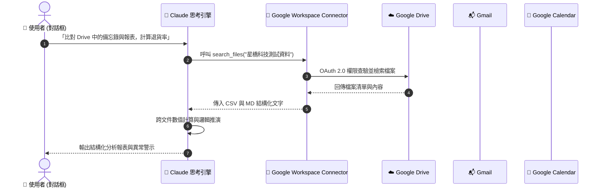

# 📂 次章節 1：Google Workspace 連接器實戰 💼

> **學習階段**：🟢 核心實戰（職場必備）　|　**預計實作時間**：25 分鐘  
> **核心目標**：打通 Google Drive、Gmail 與 Google Calendar，學會跨文件智慧交叉比對、客訴郵件摘要與回信草擬、行事曆衝突預警，並進一步在 Claude Projects 中打造具備「Human-in-the-Loop（人類在環煞車機制）」的跨系統行政自動化工作流。

---

## 🧭 實戰架構與練習導航

本章節以 **Google Drive 跨文件深度比對** 作為核心主範例進行深度拆解與動手實作；其餘練習皆備有**獨立的專屬練習資料夾、完整教學文件與配套偽資料**，點擊即可前往專屬實作空間：

| 練習項目 | 類型 | 運作模式 | 所需連接器 | 專屬資料夾與教學連結 |
| :--- | :---: | :---: | :--- | :--- |
| **實戰 1：雲端跨文件交叉比對** | 🌟 **核心主範例** | 💬 一般對話 | 🔹 **Google Drive** | [📁 01_Drive_Analysis](./01_Drive_Analysis/README.md)（本頁下方完整展開） |
| **實戰 2：緊急客訴摘要與雙語回信** | 延伸實戰 | 💬 一般對話 | 🔹 **Gmail** | [📁 02_Gmail_Automation](./02_Gmail_Automation/README.md) |
| **實戰 3：行事曆衝突排查與重構** | 延伸實戰 | 💬 一般對話 | 🔹 **Google Calendar** | [📁 03_Calendar_Scheduling](./03_Calendar_Scheduling/README.md) |
| **實戰 4：儲能審查與公文自動化** | 延伸實戰 (進階) | 📁 Claude Projects | 🔹 **Drive + Gmail + Calendar** | [📁 04_Green_Energy_Audit](./04_Green_Energy_Audit/README.md) |

---

## 🔄 Connectors 運作機制與時序圖

當您透過 Claude 下達指令時，Claude 不會下載您的整個雲端硬碟，而是透過 OAuth 2.0 授權的 MCP 工具進行精準調用：



---

## 🛠️ Step-by-Step 連線與授權流程

在開始實戰前，請確保您的 Claude 帳號已正確連結 Google Workspace：

1. 登入 [Claude.ai](https://claude.ai) ➔ 點選左下角個人頭像 ➔ 點選 **Settings** ➔ 切換至 **Connectors** 頁籤。
2. 找到 **Google Workspace**（包含 Google Drive、Gmail、Google Calendar），點擊 **Connect**。
3. 瀏覽器彈出 Google OAuth 官方授權視窗，選擇您的 Google 帳號並勾選所需權限。
4. 點擊「允許」完成連線。清單中顯示綠色勾號 `✓ Connected` 即代表連線就緒！

---

## 🌟 核心主要範例：Google Drive 跨文件深度交叉比對 (Docs + Sheets)

> 💡 **情境故事**：  
> 雅婷是星橋科技的營運主管。每季她都要打開 Google Drive 的財務試算表，再開內部備忘錄，手動肉眼比對各產品的退貨率是否符合合規門檻。現在透過 Google Drive 連接器，一句自然語言即可讓 Claude 自行穿透雲端資料夾，完成跨格式計算與問題歸納！

* **運作模式**：💬 **一般對話模式（Chat Prompts）**
* **所需連接器**：🔹 **Google Drive**（確保已連線）
* **獨立模組資料夾**：[📂 前往 01_Drive_Analysis 專屬練習資料夾](./01_Drive_Analysis/README.md)

### 📥 測試偽資料下載與 1 分鐘配置

請點擊下載本主範例的兩份測試偽資料：

| 檔案類型 | 檔案名稱（點擊檢視/下載） | 內容摘要 |
| :---: | :---| :---|
| 📊 **CSV 報表** | [**星橋科技_2026年度產品營運與客戶滿意度分析表.csv**](./sample_files/星橋科技_2026年度產品營運與客戶滿意度分析表.csv) | 4 季各產品營收、銷售量、退貨率與 CSAT 滿意度。 |
| 📄 **Markdown** | [**星橋科技_2026年度產品策略與海外擴展備忘錄.md**](./sample_files/星橋科技_2026年度產品策略與海外擴展備忘錄.md) | 包含日本與東南亞策略、技術改善方針與退貨率標準。 |

> [!TIP]
> **1 分鐘 Google Drive 配置**：
> 1. 打開個人 [Google Drive](https://drive.google.com)，在「我的雲端硬碟」建立資料夾，命名為：`星橋科技測試資料`。
> 2. 將上述兩份檔案拖入該資料夾內即完成準備！

---

### 📋 複製貼上 Prompt（立即實測）

打開 Claude [一般對話視窗](https://claude.ai)，點擊右上角一鍵複製貼入：

```markdown
## Role
你是一位資深的商業營運顧問，擅長跨格式數據整合與合規分析。

## Task
請使用 Google Workspace 連接器，讀取我 Google Drive 中「星橋科技測試資料」資料夾內的檔案：
1. 讀取《星橋科技_2026年度產品策略與海外擴展備忘錄.md》，找出公司設定的「年度平均退貨率考核標準」是幾趴？
2. 接著檢索《星橋科技_2026年度產品營運與客戶滿意度分析表.csv》，計算各產品線在 2026 全年的平均退貨率。
3. 交叉比對並指出：哪一項產品在 Q1~Q2 嚴重超標？該產品主要的客訴原因是什麼？

## Format
- 以結構化方式呈現分析結論。
- 繪製清晰的 Markdown 表格對照「產品名稱 | 目標退貨率 | 實際全年平均 | 是否達標 | 核心客訴原因」。
```

---

### ✅ 成果驗收點

- [ ] **連線精準調用**：Claude 成功觸發 Google Drive 連接器讀取兩份檔案。
- [ ] **目標標準鎖定**：準確擷取備忘錄條文：「年度平均退貨率需壓低在 1.5% 以下」。
- [ ] **精準跨表計算**：正確計算微電網網關（BridgeGrid-X）在 Q1（3.2%）與 Q2（2.8%）嚴重超標，全年平均超過 1.5%。
- [ ] **客訴根因定位**：指出主要客訴為「Modbus 協議相容性問題」與「雲端同步偶發延遲」。

---

## 📚 延伸實戰練習庫（點擊進入單案資料夾）

每個練習皆備有專屬資料夾、獨立教學說明、自包含 Prompt 與專屬測試偽資料：

---

### 📬 練習 2：Gmail 緊迫客訴摘要與高情商雙語回信

* **運作模式**：💬 一般對話（Chat）
* **所需連接器**：🔹 **Gmail**（讀取/建立草稿）
* **核心亮點**：
  - 秒速辨識高壓緊急客訴，提煉日本半導體客戶之故障現象與截止時限。
  - 起草高情商日文商務禮儀信函，並遵循 Human-in-the-Loop 規範僅寫入「草稿匣（Drafts）」。
  - 提供 **「真機直連」** 與 **「免寄信快速模擬」** 雙軌 Prompt，學生個人信箱無測試信也能 100% 獨立完成！
* **專屬偽資料**：[模擬客戶郵件資料集.md](./02_Gmail_Automation/sample_files/模擬客戶郵件資料集.md)
* 👉 **[點此進入 02_Gmail_Automation 專屬練習資料夾 ➔](./02_Gmail_Automation/README.md)**

---

### 📅 練習 3：Google Calendar 行程衝突自動排查與重構

* **運作模式**：💬 一般對話（Chat）
* **所需連接器**：🔹 **Google Calendar**（讀取日程）
* **核心亮點**：
  - 自動比對行事曆會議時間段，揪出重疊 30 分鐘的時間衝突。
  - 根據緊急重大客訴排查 vs 內部例會的商業優先級，給出最佳化時間調配線。
  - 提供 **「真機日曆直連」** 與 **「免建日曆快速模擬」** 雙軌測試方案。
* **專屬偽資料**：[模擬行事曆日程資料集.md](./03_Calendar_Scheduling/sample_files/模擬行事曆日程資料集.md)
* 👉 **[點此進入 03_Calendar_Scheduling 專屬練習資料夾 ➔](./03_Calendar_Scheduling/README.md)**

---

### 🏛️ 練習 4：工研院綠能所 — 儲能審查與跨系統行政自動化 (進階)

* **運作模式**：📁 **Claude Projects 專案模式**
* **所需連接器**：🔹 **Google Drive**、🔹 **Gmail**、🔹 **Google Calendar**
* **核心亮點**：
  - 結合 Projects 知識庫內部法規指引 + Google Drive 廠商企劃書，執行技術合規差異審查。
  - 落實 **Human-in-the-Loop 雙道煞車機制**：每完成一個階段強制煞車暫停，等待管理員通關指令才推進至起草公函與排定 Gmail 草稿。
  - 完整提供 Project Name、Description、Project Instructions、啟動 Prompt 與多階段通關代碼。
* **專屬偽資料**：
  - [儲能系統安全技術標準指引草案.md](./04_Green_Energy_Audit/sample_files/儲能系統安全技術標準指引草案.md)
  - [示範園區儲能建置企劃申請書.md](./04_Green_Energy_Audit/sample_files/示範園區儲能建置企劃申請書.md)
* 👉 **[點此進入 04_Green_Energy_Audit 專屬練習資料夾 ➔](./04_Green_Energy_Audit/README.md)**

---

## 💡 常見問題與除錯指南 (FAQ & Troubleshooting)

### Q1：Claude 提示「找不到檔案」或「搜尋不到該資料夾」？
* **原因**：Google Drive 剛上傳檔案時全文檢索索引需 15~45 秒生效；或授權時未勾選 Google Drive 存取權限。
* **解法**：請於 Prompt 中直接指名精確檔名（例如：`請讀取檔名為「星橋科技_2026年度產品營運與客戶滿意度分析表.csv」的檔案`）。

### Q2：使用 Gmail 或 Calendar 連接器時查無資料？
* **原因**：個人信箱或行事曆內沒有對應的測試郵件或日程。
* **解法**：請進入各子練習目錄，直接使用教材準備的 **【方案 B：快速模擬實測】** Prompt，即可免動用個人帳號完成驗證！

### Q3：連線 Google 帳號後，Claude 會擅自刪除檔案或寄信出去嗎？
* **解答**：**絕對不會！** Google Drive 存取以檢索與讀取為主；Gmail 寫入動作在預設規範下僅能寫入「Drafts（草稿匣）」，最終發送權限永遠掌握在人類手中。

---

## 🧭 導航地圖

← [返回 Connectors 總覽](../README.md) · [前往次章節 2：Canva 設計自動化](../02_Canva/README.md)
