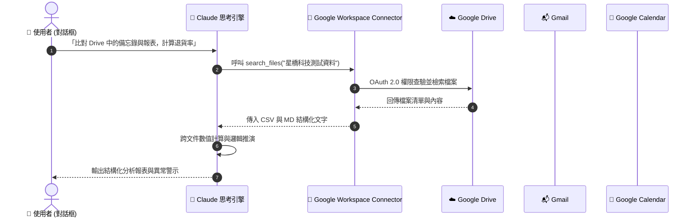

# 📂 次章節 1：Google Workspace 連接器實戰 💼

> **學習階段**：🟢 核心實戰（職場必備）　|　**預計實作時間**：25 分鐘  
> **核心目標**：打通 Google Drive、Gmail 與 Google Calendar，學會跨文件智慧交叉比對、客訴郵件摘要與回信草擬、行事曆衝突預警，並進一步在 Claude Projects 中打造具備「Human-in-the-Loop（人類在環煞車機制）」的跨系統行政自動化工作流。

---

## 🧭 實戰架構與模式總覽

為避免模式混淆，本章節設計了兩大實踐模組。在開始操作前，請參考下表確認每個實戰所需的 **連接器（Connectors）**、**運作模式** 與 **前置檔案**：

| 實戰項目 | 運作模式 | 所需連接器 (Connectors) | 核心學習重點 | 前置準備資料 |
| :--- | :---: | :--- | :--- | :--- |
| **實戰 1：雲端跨文件交叉比對** | 💬 **一般對話** | 🔹 **Google Drive**（讀取/搜尋） | Docs + Sheets 跨格式數值交叉比對與原因歸納 | 營運分析表 (.csv)<br/>策略備忘錄 (.md) |
| **實戰 2：緊急客訴摘要與回信** | 💬 **一般對話** | 🔹 **Gmail**（讀取/建立草稿） | 辨識緊急郵件、提取關鍵資訊、起草高情商雙語回函 | 模擬客戶郵件資料 |
| **實戰 3：行事曆衝突排查與重構** | 💬 **一般對話** | 🔹 **Google Calendar**（讀取日程） | 自動掃描時間重疊會議、評估事件優先級並重排時間線 | 模擬日程安排資料 |
| **實戰 4：儲能審查與公文自動化** | 📁 **Claude Projects** | 🔹 **Google Drive**<br/>🔹 **Gmail**<br/>🔹 **Google Calendar** | 結合 Projects 知識庫法規 + Google Workspace，實施 **Human-in-the-Loop 雙階段煞車審查** | 儲能標準指引 (.md)<br/>廠商建置企劃 (.md) |

---

## 📥 學生課堂實作檔案庫（偽檔案）

為了讓您在**零敏感資料負擔**的前提下完成本章所有實戰演練，我們為您準備了極度仿真的企業營運測試資料。請依指引下載並配置：

### 📁 測試檔案下載清單

| 檔案類型 | 檔案名稱（點擊檢視/下載） | 檔案內容說明 | 適用實戰 |
| :---: | :---| :---| :---|
| 📊 **CSV 報表** | [**星橋科技_2026年度產品營運與客戶滿意度分析表.csv**](./sample_files/星橋科技_2026年度產品營運與客戶滿意度分析表.csv) | 4 季各產品營收、銷售量、退貨率與 CSAT 滿意度。 | 實戰 1 |
| 📄 **Markdown** | [**星橋科技_2026年度產品策略與海外擴展備忘錄.md**](./sample_files/星橋科技_2026年度產品策略與海外擴展備忘錄.md) | 包含日本與東南亞策略、技術改善方針之內部機密備忘錄。 | 實戰 1 |
| 📬 **郵件與日程** | [**模擬客戶郵件與行事曆日程資料.md**](./sample_files/模擬客戶郵件與行事曆日程資料.md) | 包含 4 封急件客訴/詢價郵件與一週日曆衝突排程範例。 | 實戰 2、實戰 3 |
| 🏛️ **專案法規基準** | [**儲能系統安全技術標準指引草案.md**](../../Projects/Examples/06_Green_Energy_Standards/sample_files/儲能系統安全技術標準指引草案.md) | 工研院內部儲能安全技術審查指引規範。 | 實戰 4 (Projects) |
| 📝 **外部待審企劃** | [**示範園區儲能建置企劃申請書.md**](../../Projects/Examples/06_Green_Energy_Standards/sample_files/示範園區儲能建置企劃申請書.md) | 外部廠商提交之申請企劃書（內含 4 處違規暗坑供測試）。 | 實戰 4 (Google Drive) |

---

### ⚡ 1 分鐘 Google Drive 雲端無痛配置指引

> [!TIP]
> **建議存放結構**：在您的 Google Drive 建立固定資料夾，能大幅提高 Claude 連接器定位檔案的精準度與搜尋速度。

1. 下載上述的 **`星橋科技_2026年度產品營運與客戶滿意度分析表.csv`** 與 **`星橋科技_2026年度產品策略與海外擴展備忘錄.md`**。
2. 打開您的個人 [Google Drive](https://drive.google.com)，在「我的雲端硬碟」中建立新資料夾：
   ```text
   星橋科技測試資料
   ```
3. 將兩份檔案直接拖入該資料夾內即完成準備！

---

## 🔄 Connectors 運作機制與時序圖

當您透過 Claude 下達指令時，Claude 不會下載您的整個雲端硬碟，而是透過 OAuth 2.0 授權的 MCP 工具進行精準調用：



---

## 🛠️ Step-by-Step 連線與授權流程

在開始實戰前，請確保您的 Claude 帳號已正確連結 Google Workspace：

### 步驟 1：進入 Claude 連接器設定
1. 登入 [Claude.ai](https://claude.ai)。
2. 點選左下角個人頭像 ➔ 點選 **Settings**。
3. 切換至 **Connectors** 頁籤。

### 步驟 2：授權 Google Workspace
1. 在連接器清單中找到 **Google Workspace**（包含 Google Drive、Gmail、Google Calendar）。
2. 點擊 **Connect**。
3. 瀏覽器彈出 Google OAuth 官方授權視窗，選擇您存放測試資料的 Google 帳號。
4. 勾選所需的權限範圍（Google Drive 唯讀搜尋、Gmail 讀取與草稿建立、Calendar 讀取日程）。
5. 點擊「允許」完成連線。清單中顯示綠色勾號 `✓ Connected` 即代表連線就緒！

```text
Google Workspace    [ Google Drive | Gmail | Google Calendar ]    ✓ Connected
```

---

## 💬 模組 A：一般對話模式（Chat Prompts）基礎三部曲

> 💡 **操作說明**：本模組所有練習皆在 Claude 的 **一般對話聊天室（Start new chat）** 中進行，無需建立 Project。

---

### 實戰 1：Google Drive 跨文件深度交叉比對 (Docs + Sheets)

* **運作模式**：💬 一般對話（Chat）
* **所需連接器**：🔹 **Google Drive**（確保已連線）
* **前置檔案**：已上傳至 Google Drive「星橋科技測試資料」資料夾中的 CSV 與 MD 檔案。
* **任務目標**：穿透 Google Drive 讀取不同格式的檔案，比對商業標準與營運數據，精準抓出超標項目與客訴成因。

#### 📋 複製貼上 Prompt

點擊代碼區塊右上角一鍵複製，貼入 Claude 一般對話框：

```markdown
## Role
你是一位資深的商業營運顧問，擅長跨格式數據整合與合規分析。

## Task
請使用 Google Workspace 連接器，讀取我 Google Drive 中「星橋科技測試資料」資料夾內的檔案：
1. 讀取《星橋科技_2026年度產品策略與海外擴展備忘錄.md》，找出公司設定的「年度平均退貨率考核標準」是幾趴？
2. 接著檢索《星橋科技_2026年度產品營運與客戶滿意度分析表.csv》，計算各產品線在 2026 全年的平均退貨率。
3. 交叉比對並指出：哪一項產品在 Q1~Q2 嚴重超標？該產品主要的客訴原因是什麼？

## Format
- 以結構化方式呈現分析結論。
- 繪製清晰的 Markdown 表格對照「產品名稱 | 目標退貨率 | 實際全年平均 | 是否達標 | 核心客訴原因」。
```

#### ✅ 成果驗收點
- [ ] **連線成功**：Claude 成功觸發 Google Drive 連接器讀取兩份檔案。
- [ ] **目標標準鎖定**：準確擷取備忘錄條文：「年度平均退貨率需壓低在 1.5% 以下」。
- [ ] **精準計算**：正確計算微電網網關（BridgeGrid-X）在 Q1（3.2%）與 Q2（2.8%）嚴重超標。
- [ ] **根因剖析**：指出主要客訴為「Modbus 協議相容性問題」與「雲端同步偶發延遲」。

---

### 實戰 2：Gmail 緊迫客訴摘要與高情商回信草稿

* **運作模式**：💬 一般對話（Chat）
* **所需連接器**：🔹 **Gmail**（讀取與草稿建立權限）
* **前置檔案**：[模擬客戶郵件與行事曆日程資料.md](./sample_files/模擬客戶郵件與行事曆日程資料.md)

> [!NOTE]
> **兩種實測途徑（學生可自由選擇）**：
> - **方案 A（真機直連實測）**：複製下方「測試郵件素材」寄給自己的測試 Gmail，讓 Claude 透過 Gmail 連接器即時讀取。
> - **方案 B（免寄信快速實測）**：若不想動用個人 Gmail，直接使用下方附帶 Context 的 Prompt 進行測試。

#### ✉️ 方案 A 測試郵件素材（寄給自己的 Gmail 信箱）

```text
收件人：(您的 Gmail 信箱)
主旨：【緊急】九州熊本半導體示範廠 BridgeGrid-X Modbus 通訊中斷回報
內文：
星橋科技 團隊您好：
我是東京菱光商事的佐藤。
今早 8:30 九州熊本示範園區回報，現場 3 台 BridgeGrid-X 微電網網關在進行高負載測試時，突然出現 Modbus 輪詢逾時錯誤（Error Code: MB-408），導致中央 SCADA 系統無法即時讀取日照逆變器數據。
由於客戶下週二即將帶同日本經濟產業省官員前來參觀，請貴司技術團隊務必在今天下班前（台北時間 17:00 前）提供初步分析報告或遠端更新 Patch。
感謝協助。
東京菱光商事 海外事業推進部 佐藤健太郎
```

#### 📋 複製貼上 Prompt

##### 若使用【方案 A：真機 Gmail 直連】：
```markdown
## Role
你是一位具備跨國商務談判經驗的客戶成功經理（CSM）。

## Task
請透過 Gmail 連接器檢視我的收件匣中近期來自「佐藤」或主旨包含「緊急」或「BridgeGrid-X」的郵件：
1. 摘要該客訴的核心故障現象、受影響之客戶層級與緊急時限。
2. 幫我在 Gmail 草稿匣中擬妥一封專業、嚴謹且展現誠意的回覆郵件（日文與繁體中文對照版）。

## Constraints
- 信中必須提及技術團隊正在分析 Modbus 逾時問題（MB-408），並承諾於今天下午 16:30 前提供初步處置說明。
- 嚴格遵守 Human-in-the-Loop 原則：僅將回信儲存於 Gmail「草稿匣（Drafts）」，嚴禁直接自動寄出！
```

##### 若使用【方案 B：免寄信快速實測】：
```markdown
## Role
你是一位具備跨國商務談判經驗的客戶成功經理（CSM）。

## Context（模擬收到的緊急客訴郵件）
寄件人：佐藤 健太郎 <k-sato@ryoko-shoji.co.jp>
主旨：【緊急】九州熊本半導體示範廠 BridgeGrid-X Modbus 通訊中斷回報
內文：今早 8:30 九州熊本示範園區現場 3 台 BridgeGrid-X 微電網網關出現 Modbus 輪詢逾時錯誤（Error Code: MB-408），導致 SCADA 無法讀取逆變器數據。下週二經產省官員即將參訪，請於今日台北時間 17:00 前提供分析報告或遠端 Patch。

## Task
1. 摘要此客訴的核心故障現象、受影響之客戶層級與時效限制。
2. 起草一封專業商務回信草稿（日文正式商務體與繁體中文對照）。
3. 承諾於今日 16:30 前提供初步處置說明，文字需體現誠意與專業把控。
```

#### ✅ 成果驗收點
- [ ] **關鍵資訊捕捉**：精準提煉「九州熊本半導體廠」、「經產省官員參訪」、「今日 17:00 前」三大高壓關鍵字。
- [ ] **高情商商務日語**：回信草稿包含正規商務起首語（「平素は格別のご高配を賜り…」）與妥善的責任承擔語氣。
- [ ] **安全界線守護**：承諾於 16:30 提交進度，並嚴格標註僅建立為草稿，未進行危險的越權寄送。

---

### 實戰 3：Google Calendar 行程衝突自動排查與重構

* **運作模式**：💬 一般對話（Chat）
* **所需連接器**：🔹 **Google Calendar**（讀取日程權限）
* **前置檔案**：[模擬客戶郵件與行事曆日程資料.md](./sample_files/模擬客戶郵件與行事曆日程資料.md)

> [!NOTE]
> **實測途徑**：
> - **方案 A（真機直連實測）**：在您的 Google Calendar 上新增兩場時間重疊的測試會議（3/18 10:00-11:00「九州緊急故障排查」與 10:30-12:00「Q1 客戶滿意度檢討會」）。
> - **方案 B（免建日曆快速實測）**：直接使用下方整合 Context 的 Prompt 進行測試。

#### 📋 複製貼上 Prompt

##### 若使用【方案 A：真機 Calendar 直連】：
```markdown
## Role
你是一位頂尖的高階主管特助與時間管理專家。

## Task
請調用 Google Calendar 連接器，檢視我 2026 年 3 月 18 日（週三）全天的行事曆行程：
1. 檢查是否存在「時間重疊（Conflict）」的會議，明確標示重疊的時間區間與重疊的會議主題。
2. 考量當天有緊急海外客訴排查（攸關重大商務關係），請為我重新規劃當天日程的時間調配建議。

## Format
- 輸出「衝突診斷報告」與「優化後的新時間線對照表」。
```

##### 若使用【方案 B：免建日曆快速實測】：
```markdown
## Role
你是一位頂尖的高階主管特助與時間管理專家。

## Context（當日既定行事曆資料）
- 3/18 10:00 - 11:00：九州熊本示範廠緊急故障排查（線上緊急 Meet，攸關日本經產省參訪）
- 3/18 10:30 - 12:00：Q1 客戶滿意度與客訴檢討會（101 大會議室，內部例行會）
- 3/18 15:00 - 16:30：BridgeBox-Pro v2.4 韌體審查（202 會議室）

## Task
1. 指出 3/18 存在的具體衝突時間段與涉及會議。
2. 根據事件緊急程度（外部重大危機 vs 內部例行檢討），提出具體的時間重新調配建議。
3. 提供重排後的最佳時間線安排。
```

#### ✅ 成果驗收點
- [ ] **重疊精準抓取**：識別出 3/18 10:30~11:00 存在 30 分鐘的會議重疊。
- [ ] **決策優先級正確**：建議「外部重大客訴會議不可更動」，將「內部檢討會」順延或委任代理人。
- [ ] **排程邏輯嚴密**：給出優化後不重疊的全新時間規劃表。

---

## 📁 模組 B：Claude Projects 模式進階實戰（Projects + HITL）

> 🌟 **核心進階特色**：  
> 本範例展示企業級的高階用法——將 **Claude Projects 專案沙盒**（常駐法規知識庫與角色規範）與 **Google Workspace 連接器**（Drive 企劃書、Gmail 與 Calendar）深度整合，實現「法規比對 ➔ 公函草擬 ➔ 雲端郵件與日曆排程」的一條龍工作流。
>
> 🛡️ **Human-in-the-Loop（人類在環煞車機制）**：  
> 流程中設置了兩道強制中繼暫停點，AI 每完成一項任務必須強制煞車，等待管理員審核確認後才可推進，防止 AI 擅自對外發送信件或排程！

---

### 實戰 4：工研院綠能所 — 儲能建置企劃跨系統審查與行政公文自動化

* **運作模式**：📁 **Claude Projects 專案模式**
* **所需連接器**：🔹 **Google Drive**、🔹 **Gmail**、🔹 **Google Calendar**
* **資料配置**：
  - 專案知識庫（Project Knowledge）：[儲能系統安全技術標準指引草案.md](../../Projects/Examples/06_Green_Energy_Standards/sample_files/儲能系統安全技術標準指引草案.md)
  - Google Drive 待審企劃書：[示範園區儲能建置企劃申請書.md](../../Projects/Examples/06_Green_Energy_Standards/sample_files/示範園區儲能建置企劃申請書.md)

---

### 🛠️ 步驟 1：專案建置設定（Claude Projects Setup）

1. 登入 [Claude.ai](https://claude.ai)，在左側選單點擊 **Projects** ➔ 點選 **Create project**（或 **New project**）。
2. 填入專案基本資料：
   - **Project Name（專案名稱）**：
     ```text
     工研院綠能所_儲能審查與跨系統行政自動化
     ```
   - **Project Description（專案描述）**：
     ```text
     結合儲能安全技術指引草案與 Google Workspace 連接器，執行示範案場多階段合規差異審查、正式公函草擬與 Gmail/Calendar 雲端行政協調。
     ```
3. 點擊 **Create project** 建立完成。

---

### 📜 步驟 2：設定常駐專案指引（Project Instructions）

進入剛建立的專案，在右側面板點擊 **Set Project Instructions**（或 **Edit instructions**），貼入以下完整的專家規則與雙道煞車機制：

```markdown
## Role
你是一位工研院綠能與環境研究所的「資深綠能計畫審查主任秘書暨專案自動化助理」，精通儲能安全技術法規、政府公文格式與跨系統行政協調流程。

## Task（含 Workflow & Human-in-the-Loop 階段閘門）
審查外部廠商提交之工業儲能建置企劃案，並依序執行三階段多系統協同工作流。你必須嚴格落實 **Human-in-the-Loop 煞車機制**，每次只執行單一階段，絕不可跳步或合併推進：

1. **【階段一：技術合規差異審查】**：
   比對專案知識庫法規與 Google Drive 廠商企劃書，針對四大核心安全指標查核並輸出結構化缺失對照表。完成後**強制踩剎車完全停止輸出**，主動詢問：「以上審查結果是否同意列入退件修正項目？請輸入『審核通過，產出公文』或告知需微調的項目。」嚴禁擅自推進階段二！
2. **【階段二：起草正式審查意見公文函稿】**：
   必須等待使用者明確輸入「審核通過，產出公文」後才可啟動。依據確認之審核結果起草正式公函。完成後再次**強制踩剎車停止輸出**，主動詢問：「公文函稿已擬妥，確認無誤請輸入『公文確認，執行雲端行政』。」
3. **【階段三：Connectors 雲端行政對外落實】**：
   必須等待使用者明確輸入「公文確認，執行雲端行政」後，才建立 Gmail 補件通知郵件草稿（僅儲存於草稿匣中，嚴禁自動發送，必須由使用者親自檢視後手動送出）並排定 Google Calendar 補正協調會議。

## Context
- 審查基準：專案知識庫（Project Knowledge）中的內部法規《儲能系統安全技術標準指引草案.md》。
- 廠商資料：透過 Google Workspace 連接器存取之 Google Drive 待審企劃書《示範園區儲能建置企劃申請書.md》。

## Constraints
- **強制階段閘門**：嚴格禁止一次把後續階段做完！每次只執行當前單一階段，未獲明確通關指令前不得擅自推進。
- **郵件安全規範（Human-in-the-Loop）**：所有對外郵件一律僅限建立於 **Gmail「草稿匣（Drafts）」**，**嚴禁由 AI 直接發送**！必須由審查員手動檢閱後寄出。
- **條文絕對真實**：所有審查缺失必須精準對應專案知識庫《儲能系統安全技術標準指引草案》中的具體章節與數值，嚴禁捏造條文。
- **公文語言規範**：公函需符合正式行政公文格式（發文字號、受文者、主旨、說明、改善期限）。

## Format
- 階段一：Markdown 表格（查核項目 | 法規標準規格 | 廠商企劃規格 | 合規狀態 | 條文依據與缺失說明）。
- 階段二：工研院正式公函版面。
- 階段三：Gmail 郵件草稿格式（標註已存入草稿匣）+ Google Calendar 會議卡片。
```

---

### 📥 步驟 3：資料雙軌配置（Knowledge 與 Google Drive）

請將兩份關鍵文件分別部署至正確位置：

1. **上傳至 Project Knowledge（專案知識庫）**：
   - 下載 [**儲能系統安全技術標準指引草案.md**](../../Projects/Examples/06_Green_Energy_Standards/sample_files/儲能系統安全技術標準指引草案.md)。
   - 在專案頁面右側的 **Project Knowledge** 區塊，點擊 **Add content** ➔ **Upload files**，將此檔案上傳。
2. **上傳至 Google Drive（雲端待審檔案）**：
   - 下載 [**示範園區儲能建置企劃申請書.md**](../../Projects/Examples/06_Green_Energy_Standards/sample_files/示範園區儲能建置企劃申請書.md)。
   - 上傳到您個人的 Google Drive「星橋科技測試資料」資料夾（或 Google Drive 根目錄）中。

---

### 💬 步驟 4：開啟對話啟動審查（Conversation Prompt）

在該 Project 內點選 **Start new chat**，確認該對話已連線 Google Workspace 連接器，貼入啟動指令：

```markdown
## Task
請開始執行「示範園區工業儲能建置申請案」的【階段一：技術合規差異審查】。

## Context
- 審查案件：沙崙綠能示範園區 2MW/4MWh 工業儲能貨櫃建置申請案。
- 申請廠商：宏揚綠能科技股份有限公司。
- 待審企劃書：請調用 Google Workspace 連接器，讀取我 Google Drive 裡的《示範園區儲能建置企劃申請書.md》。
- 法規比對基準：專案知識庫中的《儲能系統安全技術標準指引草案.md》。
- 重點查核面向：「安全防護間距」、「初期氣體感測防爆」、「通訊斷網跳脫時限」及「EPO 緊急斷電響應」。

## Constraints
完成階段一表格後請依 Project Instructions 嚴格踩剎車暫停，等待我的確認指令！
```

---

### 🚦 步驟 5：多階段通關回覆指令（Human-in-the-Loop 逐步推進）

當 Claude 執行完當前階段，並停下來等待審核時，請依序使用以下指令推進：

#### 👉 通關指令 1：推進至階段二（起草公文）
在階段一審查表格產出、確認無誤後輸入：
```text
審核通過，產出公文
```

#### 👉 通關指令 2：推進至階段三（排定 Gmail 草稿與 Calendar 行程）
在公函草擬完成、審視無誤後輸入：
```text
公文確認，執行雲端行政
```

#### ✅ 成果驗收點
- [ ] **知識庫與雲端穿透**：Claude 同時調用專案知識庫的法規與 Google Drive 的企劃書進行真實比對。
- [ ] **暗坑全數捕獲**：成功抓出廠商企劃中的 4 處違規（間距不足 3m、缺少 H2/CO 感測、斷網跳脫時間超標、EPO 響應過慢）。
- [ ] **精準煞車停頓**：階段一產出後，Claude 絕對不自動產出公文，乖乖停下等待確認。
- [ ] **高規格行政公函**：階段二產出工研院正式公函格式，條文引用準確無誤。
- [ ] **對外安全防護**：階段三僅在 Gmail 建立「草稿」，並排定輔導會議，未越權逕行寄出。

---

## 💡 常見問題與除錯指南 (FAQ & Troubleshooting)

### Q1：Claude 提示「找不到檔案」或「搜尋不到該資料夾」？
* **原因**：Google Drive 剛上傳的檔案可能需要 15~45 秒建立全文檢索索引；或是授權時未勾選 Google Drive 存取權限。
* **解法**：
  1. 請於 Prompt 中直接指名精確檔名（例如：`請讀取檔名為「星橋科技_2026年度產品營運與客戶滿意度分析表.csv」的檔案`）。
  2. 檢查 [Claude.ai Settings ➔ Connectors]，若狀態異常，點擊 Disconnect 後重新連線並勾選完整權限。

### Q2：使用 Gmail 或 Calendar 連接器時，Claude 查無資料？
* **原因**：個人信箱或行事曆內沒有對應的測試郵件或日程。
* **解法**：
  - 建議使用本教材特別準備的 **【方案 B：免寄信/免建日曆快速實測】** Prompt，直接在 Prompt 中注入 Context，即可 100% 體驗 Claude 的深度語意解析與排程重構能力！
  - 若欲體驗真實連線，可參考教材提供的素材，花 30 秒寄一封測試信給自己。

### Q3：連線 Google 帳號後，Claude 會擅自刪除檔案或寄信出去嗎？
* **解答**：**絕對不會！**
  - Google Drive 存取以檢索與讀取為主。
  - Gmail 寫入動作在預設規範下僅能寫入「Drafts（草稿匣）」，最終的「點擊送出」永遠掌握在使用者手中。
  - 詳情可參閱 [工具權限分級與治理指南](../Guide/02_Tool_Permissions_and_Governance.md)。

---

## 🧭 導航地圖

← [返回 Connectors 總覽](../README.md) · [前往次章節 2：Canva 設計自動化](../02_Canva/README.md)
