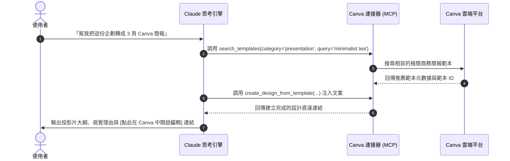

# 🎨 次章節 2：Canva 連接器實戰 🖌️

> **學習階段**：🔵 進階視覺整合（行銷與設計加速器）　|　**預計實作時間**：20 分鐘  
> **核心目標**：學會將 Claude 與 Canva 官方連接器無縫打通，將文案企劃直接轉換為專業 Canva 簡報、社群貼文範本與品牌視覺直達連結。

---

## 📥 學生課堂實作檔案下載區（偽檔案）

為了讓您能專注於體驗「從文案策劃到 Canva 視覺設計一氣呵成」的威力，我們提供了文青風格茶飲品牌「山嵐茶飲」的完整配套偽檔案：

| 檔案類型 | 檔案名稱（點擊檢視/下載） | 檔案內容說明 | 建議實測用法 |
| :--- :| :---| :---| :---|
| 📄 **企劃規格** | [**山嵐茶飲_2026夏季新品行銷企劃與視覺規格書.md**](./sample_files/山嵐茶飲_2026夏季新品行銷企劃與視覺規格書.md) | 產品賣點（冷萃蜜香烏龍）、TA 輪廓、全通路排版尺寸規格。 | 作為 Prompt 內容或上傳參考。 |
| 🎨 **視覺規範** | [**山嵐茶飲_品牌視覺規範與色彩配置表.json**](./sample_files/山嵐茶飲_品牌視覺規範與色彩配置表.json) | 標準色 Hex 色票（深霧綠、茶湯金）、字型與尺寸預設集。 | 讓 Claude 稽核 Canva 配色是否合規。 |
| 📝 **排版文案** | [**夏季新品社群文案庫與排版草案.md**](./sample_files/夏季新品社群文案庫與排版草案.md) | 包含 3 頁 Pitch Deck 投影片、IG 方形卡片與限動文案。 | 讓 Claude 直接呼叫 Canva 工具轉換排版。 |

---

## 📖 情境故事

子晴是「山嵐茶飲」的社群行銷主任。每次推出新品，她必須先在 Word 寫好企劃案，然後打開 Canva 從成千上萬個範本中手動翻找、一個字一個字複製貼到投影片或貼文畫布中，再手動修改色票 Hex Code，過程枯燥且極易出錯。

現在，子晴啟用了 Claude 的 **Canva 連接器**：
- 將企劃案餵給 Claude，Claude 能理解「侘寂、日式極簡、健康低糖」的情境風格。
- Claude 自動向 Canva 搜尋最匹配的「商業提案簡報」與「Instagram 質感貼文」範本。
- 自動將投影片標題、數據點、CTA 填入版型結構，並直接產出 **Canva 編輯直達超連結**，點開就能立即微調出圖！

---

## 🛠️ Step-by-Step 連線與授權流程

### 步驟 1：在 Claude 中開啟 Canva 連接器
1. 登入 [Claude.ai](https://claude.ai) ➔ 點選左下角頭像 ➔ **Settings** ➔ **Connectors**。
2. 找到 **Canva** 連接器，點擊 **Connect**。
3. 系統將開啟 Canva 官方 OAuth 授權頁面（若尚未登入 Canva，請先完成登入）。
4. 點選「允許授權」，確認 Claude 可存取您的 Canva 範本搜尋與設計建立能力。
5. 看到狀態顯示 `✓ Connected` 即代表授權成功！



---

## 🧪 學生實測三部曲

---

### 測試 1：從行銷企劃一鍵搜尋並生成 Canva 簡報 (Pitch Deck)

複製 [夏季新品社群文案庫與排版草案.md](./sample_files/夏季新品社群文案庫與排版草案.md) 中的「版型 1」，輸入以下 Prompt：

```markdown
## Role
你是一位頂尖的簡報視覺總監，擅長使用 Canva 進行商務溝通。

## Task
請讀取我提供的「版型 1：新品發表加盟提案投影片」文案：
1. 使用 Canva 連接器，幫我搜尋 2~3 款最符合「日式極簡、文青茶飲、高質感綠白色系」的 16:9 簡報範本（Business Presentation）。
2. 為 Slide 1（封面）、Slide 2（痛點機會）、Slide 3（優惠利潤）規劃在 Canva 中的圖文卡片配置建議。
3. 提供可直接在 Canva 中開啟或複製編輯的直達範本連結。

## Constraint
- 必須符合極簡風格，拒絕雜亂繽紛的版型。
- 語言：繁體中文。
```

**✅ 成果驗收點**：
- [ ] Claude 成功觸發 Canva 連接器搜尋極簡商務風格範本。
- [ ] 產出的 3 頁投影片邏輯清楚，標題、數據點、利潤百分比精準對位。
- [ ] 給出具體的 Canva 直達連結或精準範本名稱。

---

### 測試 2：Instagram 視覺貼文排版與品牌色票核對 (Brand Kit Compliance)

結合 [山嵐茶飲_品牌視覺規範與色彩配置表.json](./sample_files/山嵐茶飲_品牌視覺規範與色彩配置表.json) 的色票規範，輸入以下指令：

```markdown
## Role
你是一位嚴格的品牌視覺守門人（Brand Identity Specialist）。

## Task
我想為「冷萃蜜香烏龍」製作一張 1:1 (1080x1080 px) 的 Instagram 官方貼文：
1. 調用 Canva 連接器，搜尋適合放置單一商品瓶身且具有呼吸留白（Negative Space）的 IG Post 範本。
2. 根據品牌規範 JSON，幫我指定 Canva 各元素應套用的色彩代碼：
   - 貼文主標題與邊框：深霧綠（#243E36）
   - 醒目賣點標籤：茶湯金（#C59B27）
   - 背景襯底：雲霧白（#F8F7F2）
3. 幫我產出一段搭配該貼文的 Instagram 走心文案（含 5 個精選 Hashtags）。
```

**✅ 成果驗收點**：
- [ ] 正確選出方形（1:1）社群排版範本。
- [ ] 嚴格比對 JSON 規範，標註標準 Hex 代碼，防止非品牌色彩混入。
- [ ] 社群文案語調典雅溫潤，符合「山嵐茶飲」的侘寂風格。

---

### 測試 3：限時動態倒數海報與全通路橫幅尺寸轉化 (Multi-Format Adaptation)

請對 Claude 輸入以下指令：

```markdown
## Task
我們即將在全通路進行為期 3 天的開賣倒數：
1. 請幫我將上述文案自動轉化為「9:16 直立限動海報（1080x1920）」與「官網橫幅 Banner（1200x630）」兩種不同尺寸的版面排版配置。
2. 請呼叫 Canva 工具推薦這兩種尺寸分別適合的版面結構，並提醒在橫幅 Banner 中如何避免文案被手機版裁切（Safe Area 觀念）。
```

**✅ 成果驗收點**：
- [ ] 能清楚區分 9:16（直立視覺張力）與橫幅（水平視覺重心）之版面差異。
- [ ] 主動提及「安全區域（Safe Zone）」重要概念，展現專業設計交付水準。

---

## 💡 常見問題與除錯指南 (FAQ)

**Q：Canva 連接器需要 Canva Pro 付費版嗎？**  
*   **解法**：Canva 免費帳號即可使用基礎連接功能與大量免費範本！若您擁有 Canva Pro / Teams 帳號，則可在搜尋時解鎖進階品牌工具包（Brand Kit）與進階商用素材庫。

**Q：點擊 Claude 產生的 Canva 連結會覆蓋我原有的設計嗎？**  
*   **解法**：不會！Claude 連接器是調用 Canva API 建立新設計或使用副本，完全不會更動或覆蓋您帳號內的任何既有設計專案。

---

← [上一章：Google Workspace 實戰](../01_Google_Workspace/README.md) · [返回 Connectors 總覽](../README.md) · [前往次章節 3：Notion 知識庫實戰](../03_Notion/README.md)
