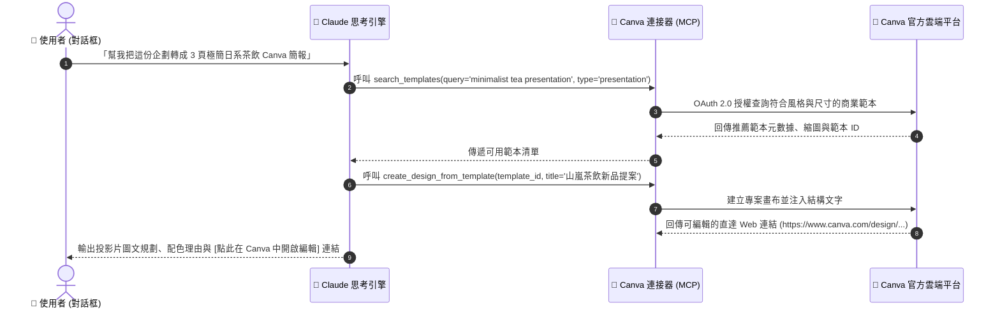

# 🎨 次章節 2：Canva 連接器實戰 🖌️

> **學習階段**：🔵 進階視覺整合（行銷與設計加速器）　|　**預計實作時間**：20 分鐘  
> **核心目標**：打通 Claude 與 Canva 官方雲端連接器，實現「文案企劃 ➔ 範本智能匹配 ➔ 品牌色票注入 ➔ 生成 Canva 編輯直達連結」的無縫自動化視覺設計工作流。

---

## 🧭 實戰架構與練習導航

本章節以 **從行銷企劃一鍵生成 Canva 簡報 (Pitch Deck)** 作為核心主範例進行深度示範；其餘練習皆備有**獨立的專屬練習資料夾、完整教學文件與配套偽資料**，點擊即可前往專屬實作空間：

| 練習項目 | 類型 | 運作模式 | 所需連接器 | 專屬資料夾與教學連結 |
| :--- | :---: | :---: | :--- | :--- |
| **實戰 1：企劃轉換 Canva 簡報** | 🌟 **核心主範例** | 💬 一般對話 | 🔹 **Canva** | [📁 01_Pitch_Deck_Presentation](./01_Pitch_Deck_Presentation/README.md)（本頁下方完整展開） |
| **實戰 2：IG 貼文與色票核對** | 延伸實戰 | 💬 一般對話 | 🔹 **Canva** | [📁 02_Instagram_Brand_Post](./02_Instagram_Brand_Post/README.md) |
| **實戰 3：全通路尺寸轉化** | 延伸實戰 | 💬 一般對話 | 🔹 **Canva** | [📁 03_Multi_Format_Banner](./03_Multi_Format_Banner/README.md) |
| **實戰 4：品牌視覺總監專案** | 延伸實戰 (進階) | 📁 Claude Projects | 🔹 **Canva** | [📁 04_Brand_Design_Projects](./04_Brand_Design_Projects/README.md) |

---

## 🔄 Connectors 運作機制與時序圖

當您在 Claude 對話中提出設計需求時，Claude 會將語意理解轉化為標準的 Canva API 調用指令，自動在雲端完成搜尋與版面構建：



---

## 🛠️ Step-by-Step 連線與授權流程

在開始實戰前，請確保您的 Claude 帳號已成功授權 Canva：

1. 登入 [Claude.ai](https://claude.ai) ➔ 點選左下角頭像 ➔ 點選 **Settings** ➔ 切換至 **Connectors** 頁籤。
2. 找到 **Canva** 連接器，點擊 **Connect**。
3. 瀏覽器將彈出 Canva 官方授權視窗（免費帳號即可完全支援）。
4. 點擊「允許授權（Authorize）」，返回 Claude 顯示綠色勾號 `✓ Connected` 即代表連線就緒！

---

## 🌟 核心主要範例：從行銷企劃一鍵搜尋並生成 Canva 簡報 (Pitch Deck)

> 💡 **情境故事**：  
> 子晴是「山嵐茶飲」的社群行銷主任。每次推出新品，她必須手動打開 Canva 從成千上萬個範本中手動翻找、逐字貼到投影片中。現在透過 Canva 連接器，將企劃需求餵給 Claude，即可自動精準檢索相容範本、填入文案並產生直達編輯超連結！

* **運作模式**：💬 **一般對話模式（Chat Prompts）**
* **所需連接器**：🔹 **Canva**（確保已授權連線）
* **獨立模組資料夾**：[📂 前往 01_Pitch_Deck_Presentation 專屬練習資料夾](./01_Pitch_Deck_Presentation/README.md)

### 📥 測試偽資料

| 檔案類型 | 檔案名稱（點擊檢視/下載） | 說明 |
| :---: | :---| :---|
| 📄 **企劃規格** | [**山嵐茶飲_2026夏季新品行銷企劃與視覺規格書.md**](./sample_files/山嵐茶飲_2026夏季新品行銷企劃與視覺規格書.md) | TA 輪廓、冷萃蜜香烏龍核心賣點與全通路規格。 |
| 📝 **排版文案** | [**夏季新品社群文案庫與排版草案.md**](./sample_files/夏季新品社群文案庫與排版草案.md) | 包含 3 頁 Pitch Deck 投影片文案。 |

---

### 📋 複製貼上 Prompt（立即實測）

下方 Prompt 已內嵌完整提案文案，打開 Claude [一般對話視窗](https://claude.ai)，點擊右上角一鍵複製貼入：

```markdown
## Role
你是一位頂尖的商務簡報視覺總監，擅長整合行銷企劃與 Canva 快速出圖工作流。

## Context（新品發表加盟提案文案）
- 品牌名稱：山嵐茶飲（ShanLan Tea）
- 核心產品：冷萃蜜香烏龍（Cold Brew Honey Oolong）
- Slide 1 (封面)：
  * 主標題：山嵐茶飲 2026 夏季新品策略提案
  * 副標題：冷萃蜜香烏龍 — 重新定義年輕世代的無糖文青茶飲
- Slide 2 (市場痛點與契機)：
  * 核心洞察：78% 年輕上班族尋求「低卡無負擔、原葉無香精」之手搖替代品
  * 競爭優勢：契作高山烏龍原葉低溫慢萃 12 小時，保留 95% 天然蜜香甘甜
- Slide 3 (加盟與利潤方案)：
  * 首發早鳥方案：毛利率達 68%，首批加盟門市免收首年品牌授權金

## Task
1. 調用 Canva 連接器，搜尋最符合「日式極簡、文青茶飲、高質感綠白色系」的 16:9 簡報範本（Presentation）。
2. 為上述 3 頁投影片規劃具體的圖文卡片排版配置（Layout Structure）與視覺重心建議。
3. 透過 Canva 工具建立或推薦該簡報的直達編輯連結，供團隊直接點開進行細部調整。

## Constraints
- 風格嚴格保持極簡留白（Negative Space），拒絕雜亂花俏的模板。
- 全程使用繁體中文說明。
```

---

### ✅ 成果驗收點

- [ ] **連接器調用成功**：Claude 成功觸發 Canva 連接器搜尋相應簡報範本。
- [ ] **風格精準符合**：推薦之範本契合「極簡、日系、茶飲」之視覺基調。
- [ ] **結構化版面建議**：3 頁簡報的標題、數據亮點、商業誘因層次分明。
- [ ] **編輯直達入口**：產出可點擊開啟的 Canva 直達設計連結或明確範本 ID。

---

## 📚 延伸實戰練習庫（點擊進入單案資料夾）

---

### 📱 練習 2：Instagram 視覺貼文排版與品牌色票核對

* **運作模式**：💬 一般對話（Chat）
* **所需連接器**：🔹 **Canva**
* **核心亮點**：
  - 挑選 1:1 方形大面積留白社群排版範本。
  - 嚴格比對 JSON 規範，標註法定 Hex 色碼（`#243E36` 深霧綠、`#C59B27` 茶湯金、`#F8F7F2` 雲霧白）。
  - 產出極具共鳴的侘寂文青風 IG 社群文案。
* **專屬偽資料**：[山嵐茶飲_品牌視覺規範與色彩配置表.json](./02_Instagram_Brand_Post/sample_files/山嵐茶飲_品牌視覺規範與色彩配置表.json)
* 👉 **[點此進入 02_Instagram_Brand_Post 專屬練習資料夾 ➔](./02_Instagram_Brand_Post/README.md)**

---

### 🖼️ 練習 3：全通路海報尺寸轉化與安全區規範

* **運作模式**：💬 一般對話（Chat）
* **所需連接器**：🔹 **Canva**
* **核心亮點**：
  - 將開賣倒數核心視覺迅速轉化為 9:16 直立限動海報與 1200x630 官網橫幅 Banner。
  - 掌握 Safe Area（安全防裁切區）概念，防止行動端 UI 遮擋重要文案。
* **專屬偽資料**：[全通路開賣倒數海報與橫幅規格說明.md](./03_Multi_Format_Banner/sample_files/全通路開賣倒數海報與橫幅規格說明.md)
* 👉 **[點此進入 03_Multi_Format_Banner 專屬練習資料夾 ➔](./03_Multi_Format_Banner/README.md)**

---

### 🎨 練習 4：打造「山嵐茶飲」品牌行銷視覺總監專案 (進階)

* **運作模式**：📁 **Claude Projects 專案模式**
* **所需連接器**：🔹 **Canva**
* **核心亮點**：
  - 將官方 VI 色票與字型常駐於 Projects 知識庫，打造 24 小時在線的品牌視覺守門員。
  - 任何企劃需求自動遵循法定色碼，產出風格高度一致的品牌素材。
* **專屬偽資料**：[山嵐茶飲_品牌視覺規範與色彩配置表.json](./04_Brand_Design_Projects/sample_files/山嵐茶飲_品牌視覺規範與色彩配置表.json)
* 👉 **[點此進入 04_Brand_Design_Projects 專屬練習資料夾 ➔](./04_Brand_Design_Projects/README.md)**

---

## 💡 常見問題與除錯指南 (FAQ & Troubleshooting)

### Q1：Canva 連接器搜尋不到特定中文關鍵字的範本？
* **原因**：Canva 官方資料庫的多數範本索引是以英文為主。
* **解法**：在對話中提醒 Claude「請使用英文關鍵字向 Canva 搜尋範本（如 `minimalist tea presentation`），但以繁體中文向我解說」，命中率將大幅提升！

### Q2：使用 Canva 連接器需要 Canva Pro 付費帳號嗎？
* **解答**：**不需要！** Canva 免費帳號即可使用所有搜尋與建立基礎免費範本的功能。

### Q3：點擊 Claude 產生的 Canva 連結會覆蓋我原有的設計嗎？
* **解答**：**絕對不會！** 連接器永遠是建立獨立的設計新副本，不會更動您帳號內既有的專案。

---

## 🧭 導航地圖

← [上一章：Google Workspace 實戰](../01_Google_Workspace/README.md) · [返回 Connectors 總覽](../README.md) · [前往次章節 3：Notion 知識庫實戰](../03_Notion/README.md)
