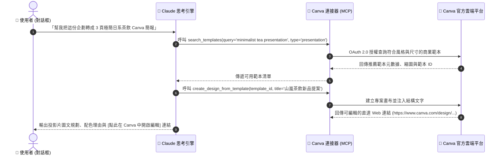

# 🎨 次章節 2：Canva 連接器實戰 🖌️

> **學習階段**：🔵 進階視覺整合（行銷與設計加速器）　|　**預計實作時間**：20 分鐘  
> **核心目標**：打通 Claude 與 Canva 官方雲端連接器，實現「文案企劃 ➔ 範本智能匹配 ➔ 品牌色票注入 ➔ 生成 Canva 編輯直達連結」的無縫自動化視覺設計工作流。

---

## 🧭 實戰架構與模式總覽

為方便學員循序漸進並清楚掌握工具搭配，本章節設計了基礎對話實測與進階專案應用：

| 實戰項目 | 運作模式 | 所需連接器 (Connectors) | 核心學習重點 | 前置準備資料 |
| :--- | :---: | :--- | :--- | :--- |
| **實戰 1：行銷企劃轉換 Canva 簡報** | 💬 **一般對話** | 🔹 **Canva**（範本搜尋與建立） | 商業 Pitch Deck 結構化提煉、風格範本精準搜尋、生成直達編輯連結 | 新品行銷企劃書 (.md)<br/>排版草案 (.md) |
| **實戰 2：IG 貼文排版與品牌色票核對** | 💬 **一般對話** | 🔹 **Canva**（視覺版型推薦） | 1:1 社群留白排版、嚴格套用品牌 JSON 色票代碼、文青走心文案生成 | 品牌色彩配置表 (.json) |
| **實戰 3：全通路尺寸轉化與安全區規範** | 💬 **一般對話** | 🔹 **Canva**（多尺寸轉化） | 9:16 直動海報 vs 橫幅 Banner 跨尺寸排版適配、Safe Area 防裁切 | 開賣倒數文案素材 |
| **實戰 4：品牌行銷沙盒專案（進階）** | 📁 **Claude Projects** | 🔹 **Canva** | 常駐品牌視覺規範（Tone & Manner）+ Canva 直連，產出一制性的全套行銷圖面 | 品牌視覺手冊 (.md) |

---

## 📥 學生課堂實作檔案庫（偽檔案）

為了讓您能專注於體驗「從文案策劃到 Canva 視覺設計一氣呵成」的威力，我們為文青風格茶飲品牌「山嵐茶飲」準備了完整配套偽檔案：

### 📁 測試檔案下載清單

| 檔案類型 | 檔案名稱（點擊檢視/下載） | 檔案內容說明 | 適用實戰 |
| :---: | :---| :---| :---|
| 📄 **企劃規格** | [**山嵐茶飲_2026夏季新品行銷企劃與視覺規格書.md**](./sample_files/山嵐茶飲_2026夏季新品行銷企劃與視覺規格書.md) | 產品核心賣點（冷萃蜜香烏龍）、TA 輪廓、全通路尺寸規範。 | 實戰 1、實戰 4 |
| 🎨 **視覺規範** | [**山嵐茶飲_品牌視覺規範與色彩配置表.json**](./sample_files/山嵐茶飲_品牌視覺規範與色彩配置表.json) | 標準色 Hex 色票（深霧綠、茶湯金、雲霧白）、字型與間距預設集。 | 實戰 2、實戰 4 |
| 📝 **排版文案** | [**夏季新品社群文案庫與排版草案.md**](./sample_files/夏季新品社群文案庫與排版草案.md) | 包含 3 頁 Pitch Deck 投影片、IG 方形卡片與限動倒數文案。 | 實戰 1、實戰 3 |

> [!TIP]
> **免手動翻找小提示**：下文的所有實測 Prompt 皆已**內建自包含（Self-contained）文案與數值**，您可以直接點擊複製貼上立即執行！若需進行客製化練習，可再下載上述檔案進行微調。

---

## 🔄 Connectors 運作機制與時序圖

當您在 Claude 對話中提出設計需求時，Claude 會將語意理解轉化為標準的 Canva API 調用指令，自動在雲端完成搜尋與版面構建：



---

## 🛠️ Step-by-Step 連線與授權流程

在開始實戰前，請確保您的 Claude 帳號已成功授權 Canva：

### 步驟 1：在 Claude 中開啟 Canva 連接器
1. 登入 [Claude.ai](https://claude.ai)。
2. 點選左下角頭像 ➔ 點選 **Settings** ➔ 切換至 **Connectors** 頁籤。
3. 找到 **Canva** 連接器，點擊 **Connect**。

### 步驟 2：授權 Canva 官方 OAuth 存取
1. 瀏覽器將自動彈出 Canva 官方授權視窗（若尚未登入 Canva，請先完成登入；免費帳號即可完全支援）。
2. 點擊「允許授權（Authorize）」，確認授予 Claude 範本搜尋與畫布建立權限。
3. 返回 Claude 設定頁面，狀態顯示綠色勾號 `✓ Connected` 即代表連線就緒！

```text
Canva    [ Templates Search | Design Creation ]    ✓ Connected
```

---

## 💬 模組 A：一般對話模式（Chat Prompts）實測三部曲

> 💡 **操作說明**：本模組三項練習皆在 Claude 的 **一般對話聊天室（Start new chat）** 中進行，確保已連線 Canva 連接器。

---

### 實戰 1：從行銷企劃一鍵搜尋並生成 Canva 簡報 (Pitch Deck)

* **運作模式**：💬 一般對話（Chat）
* **所需連接器**：🔹 **Canva**（確保已連線）
* **前置資料**：下方 Prompt 已完整包含「山嵐茶飲」Pitch Deck 提案文案。
* **任務目標**：讓 Claude 解析企劃重點，自動呼叫 Canva 工具檢索「日系極簡、文青茶飲」風格的 16:9 簡報範本，並給予各頁視覺配置與直達編輯連結。

#### 📋 複製貼上 Prompt

點擊代碼區塊右上角一鍵複製，貼入 Claude 一般對話框：

```markdown
## Role
你是一位頂尖的商務簡報視覺總監，擅長整合行銷企劃與 Canva 快速出圖工作流。

## Context（新品發表加盟提案文案）
- 品牌名稱：山嵐茶飲（ShanLan Tea）
- 核心產品：冷萃蜜香烏龍（Cold Brew Honey Oolong）
- Slide 1 (封面)：
  * 主標題：山嵐茶飲 2026 夏季新品策略提案
  * 副標題：冷萃蜜香烏龍 — 重新定義年輕世代的無糖文青茶飲
- Slide 2 (市場痛點與契機)：
  * 核心洞察：78% 年輕上班族尋求「低卡無負擔、原葉無香精」之手搖替代品
  * 競爭優勢：契作高山烏龍原葉低溫慢萃 12 小時，保留 95% 天然蜜香甘甜
- Slide 3 (加盟與利潤方案)：
  * 首發早鳥方案：毛利率達 68%，首批加盟門市免收首年品牌授權金

## Task
1. 調用 Canva 連接器，搜尋最符合「日式極簡、文青茶飲、高質感綠白色系」的 16:9 簡報範本（Presentation）。
2. 為上述 3 頁投影片規劃具體的圖文卡片排版配置（Layout Structure）與視覺重心建議。
3. 透過 Canva 工具建立或推薦該簡報的直達編輯連結，供團隊直接點開進行細部調整。

## Constraints
- 風格嚴格保持極簡留白（Negative Space），拒絕雜亂花俏的模板。
- 全程使用繁體中文說明。
```

#### ✅ 成果驗收點
- [ ] **工具成功調用**：Claude 成功觸發 Canva 連接器搜尋相應簡報範本。
- [ ] **精準風格定位**：推薦之範本符合「極簡、日系、茶飲」之視覺基調。
- [ ] **結構化版面建議**：3 頁簡報的標題、數據亮點、商業誘因邏輯分明。
- [ ] **編輯直達入口**：產出精確的 Canva 直達設計連結或明確的範本 ID。

---

### 實戰 2：Instagram 視覺貼文排版與品牌色票核對 (Brand Kit Compliance)

* **運作模式**：💬 一般對話（Chat）
* **所需連接器**：🔹 **Canva**（版型與素材推薦）
* **前置資料**：下方 Prompt 已完整注入品牌色票代碼（Hex Code）。
* **任務目標**：透過 Canva 連接器挑選 1:1 方形貼文版型，並嚴格遵循色彩系統代碼，同時撰寫文青風社群文案。

#### 📋 複製貼上 Prompt

點擊代碼區塊右上角一鍵複製，貼入 Claude 一般對話框：

```markdown
## Role
你是一位嚴格的品牌視覺守門人（Brand Identity Specialist）兼社群文案大師。

## Context（山嵐茶飲官方品牌規範）
- 品牌調性：侘寂、留白、自然純粹、溫潤沉靜
- 官方指定 Hex 色票：
  * 主品牌色（Primary）：深霧綠 `#243E36`（用於主標題、核心框線）
  * 輔助點綴色（Accent）：茶湯金 `#C59B27`（用於關鍵亮點、標籤、按鈕）
  * 背景基底色（Background）：雲霧白 `#F8F7F2`（不可使用純死白 #FFFFFF）
  * 正文字體色（Text）：冷杉深灰 `#2C3531`

## Task
我需要為新品「冷萃蜜香烏龍」製作一張 1:1 (1080x1080 px) 的 Instagram 官方宣傳貼文：
1. 請調用 Canva 連接器，搜尋適合展示「單一商品瓶身、大面積留白、高質感文青」的 Instagram Post 範本。
2. 針對範本中的各視覺元素，明確指定應套用的官方色彩 Hex 代碼，確保符合 Brand Kit 規範。
3. 撰寫一段搭配此貼文的 Instagram 走心社群文案（150 字以內，語調溫柔沉靜，並附上 5 個精選 Hashtags）。

## Constraints
- 嚴格禁止使用非規範之顏色。
- 貼文文案需傳達出「在喧囂都市中慢下來喝一口好茶」的品牌心境。
```

#### ✅ 成果驗收點
- [ ] **尺寸比例正確**：選取標準 1:1 方形（Instagram Post）版型。
- [ ] **色票代碼零容錯**：精準套用 `#243E36`（深霧綠）、`#C59B27`（茶湯金）、`#F8F7F2`（雲霧白）。
- [ ] **文案情境到位**：社群文案溫潤文青，不落俗套，展現優異的文案質素。

---

### 實戰 3：全通路尺寸轉化與安全區規範 (Multi-Format Adaptation)

* **運作模式**：💬 一般對話（Chat）
* **所需連接器**：🔹 **Canva**
* **前置資料**：開賣倒數宣傳需求。
* **任務目標**：將單一核心視覺迅速拆解為不同通路的版面尺寸，並提醒重要內容防裁切的安全區（Safe Area）概念。

#### 📋 複製貼上 Prompt

點擊代碼區塊右上角一鍵複製，貼入 Claude 一般對話框：

```markdown
## Role
你是一位資深的視覺設計指導與全通路行銷排版顧問。

## Task
我們即將在全通路進行為期 3 天的「新品開賣倒數」宣傳。請為我進行跨尺寸版面轉化：
1. **尺寸一：9:16 直立限時動態海報（1080 x 1920 px）**
   - 呼叫 Canva 連接器搜尋適合倒數計時、垂直視覺張力的 Story 範本。
   - 說明視覺焦點（標題、產品瓶身、倒數天數「3 DAYS LEFT」）由上至下的佈局動線。
2. **尺寸二：官網與電商橫幅 Banner（1200 x 630 px）**
   - 呼叫 Canva 連接器推薦水平重心穩固的橫幅範本。
   - 特別說明「Safe Area（安全區域）」規範：如何避免文案在手機行動版網頁顯示時遭到左右兩側邊緣裁切。

## Format
- 以清晰的結構化對照表輸出兩款尺寸的「視覺動線規劃 | 元素佈局 | 安全區注意事項 | 推薦 Canva 範本關鍵字」。
```

#### ✅ 成果驗收點
- [ ] **版面邏輯清晰**：能清楚區分 9:16 縱向流暢感與 1200x630 橫向橫幅的構圖重心理念。
- [ ] **專業安全區提示**：主動提示上下或兩側各預留 10~15% 的 Safe Margin，防止社群 UI 遮擋。

---

## 📁 模組 B：Claude Projects 模式進階實戰（進階視覺治理沙盒）

> 🌟 **進階亮點**：  
> 當您需要常態性地為品牌產出視覺素材時，反覆複製貼上色票非常繁瑣。將 **Claude Projects 專案沙盒** 結合 **Canva 連接器**，即可打造 24 小時在線的「品牌專屬視覺總監」！

---

### 實戰 4：打造「山嵐茶飲」品牌行銷視覺總監專案

* **運作模式**：📁 **Claude Projects 專案模式**
* **所需連接器**：🔹 **Canva**
* **前置檔案**：
  - [山嵐茶飲_2026夏季新品行銷企劃與視覺規格書.md](./sample_files/山嵐茶飲_2026夏季新品行銷企劃與視覺規格書.md)
  - [山嵐茶飲_品牌視覺規範與色彩配置表.json](./sample_files/山嵐茶飲_品牌視覺規範與色彩配置表.json)

---

### 🛠️ 步驟 1：專案建置設定（Claude Projects Setup）

1. 登入 [Claude.ai](https://claude.ai) ➔ 點選左側 **Projects** ➔ **Create project**。
2. 填入專案基本資訊：
   - **Project Name（專案名稱）**：
     ```text
     山嵐茶飲_品牌視覺設計總監
     ```
   - **Project Description（專案描述）**：
     ```text
     內建山嵐茶飲官方視覺識別手冊與色票庫，直連 Canva 官方連接器，一鍵產出符合品牌規範之投影片、社群海報與直達編輯連結。
     ```
3. 點擊 **Create project**。

---

### 📜 步驟 2：設定常駐專案指引（Project Instructions）

在專案頁面右側點擊 **Set Project Instructions**，貼入以下常駐視覺總監指引：

```markdown
## Role
你是「山嵐茶飲」的專屬品牌視覺總監與 Canva 設計智囊。

## Core Mission
每當使用者提出任何宣傳行銷企劃時，你必須嚴格基於專案知識庫（Project Knowledge）中的《品牌視覺規範與色彩配置表.json》，調用 Canva 連接器推薦最佳版型，並確保每一項產出皆 100% 符合品牌色票與留白哲學。

## Strict Design Guidelines
1. **絕對禁色**：嚴禁出現純黑（#000000）、死白（#FFFFFF）或高飽和霓虹色。
2. **法定色票**：
   - 主視覺：深霧綠 `#243E36`
   - 點睛色：茶湯金 `#C59B27`
   - 底色：雲霧白 `#F8F7F2`
3. **Canva 調用規範**：每次推薦範本時，優先選擇支援日系極簡、負空間（Negative Space）的版型，並主動提供一鍵開啟直達編輯連結。
```

---

### 📥 步驟 3：上傳專案知識庫（Project Knowledge）

在專案頁面的 **Project Knowledge** 區塊，點擊 **Add content** ➔ **Upload files**，上傳：
- [山嵐茶飲_2026夏季新品行銷企劃與視覺規格書.md](./sample_files/山嵐茶飲_2026夏季新品行銷企劃與視覺規格書.md)
- [山嵐茶飲_品牌視覺規範與色彩配置表.json](./sample_files/山嵐茶飲_品牌視覺規範與色彩配置表.json)

---

### 💬 步驟 4：對話實測指令（Prompt）

點擊 **Start new chat**，確認連線 Canva 連接器後，輸入一句簡短的自然語言需求：

```markdown
我們下個月要舉辦「茶園漫步・品茶茶席」線下 VIP 體驗會，請呼叫 Canva 連接器幫我產出一份典雅的邀請函明信片（Postcard，5x7 吋）版面建議與 Canva 編輯連結。
```

#### ✅ 成果驗收點
- [ ] **全自動套用色票**：無需重新提醒色票，Claude 自動引用知識庫中的 `#243E36` 與 `#C59B27`。
- [ ] **精準推薦**：調用 Canva 工具推薦 5x7 吋明信片邀請函範本，並給予典雅邀請文案。

---

## 💡 常見問題與除錯指南 (FAQ & Troubleshooting)

### Q1：Canva 連接器搜尋不到特定中文關鍵字的範本？
* **原因**：Canva 官方資料庫的多數範本索引是以英文為主（如 `minimalist tea presentation`, `japanese aesthetics flyer`）。
* **解法**：在對話中提醒 Claude「請使用英文關鍵字向 Canva 搜尋範本，但以繁體中文向我解說」，搜尋精準度將提升 300%！

### Q2：使用 Canva 連接器需要 Canva Pro 付費帳號嗎？
* **解答**：**不需要！** Canva 免費帳號即可使用所有搜尋與建立基礎免費範本的功能。若您擁有 Canva Pro 帳號，則可在點開連結後解鎖付費級的高階字體與去背素材庫。

### Q3：點擊 Claude 產生的 Canva 連結會覆蓋我帳號內的既有設計嗎？
* **解答**：**絕對不會！** Canva 連接器是透過 API 建立全新的設計專案畫布（Copy/New Design），不會對您帳號中現有的任何檔案造成更動。

---

## 🧭 導航地圖

← [上一章：Google Workspace 實戰](../01_Google_Workspace/README.md) · [返回 Connectors 總覽](../README.md) · [前往次章節 3：Notion 知識庫實戰](../03_Notion/README.md)
