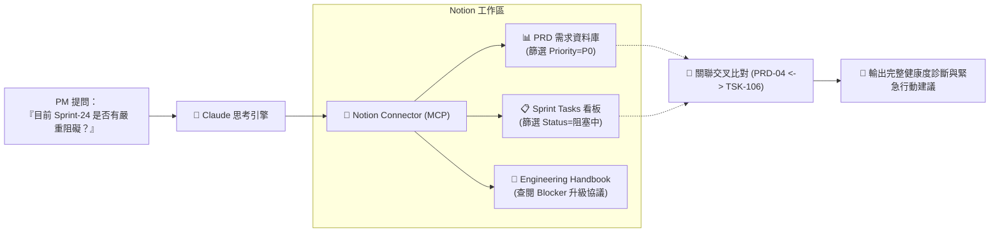

# 📝 次章節 3：Notion 連接器實戰 🧠

> **學習階段**：🟡 高階知識庫與專案治理（PM 與工程主管利器）　|　**預計實作時間**：25 分鐘  
> **核心目標**：學會將 Claude 與 Notion 工作區（Workspace）打通，實現自然語言跨資料庫檢索（PRD 庫 + Sprint 任務看板）、專案進度風險稽核、以及依據團隊手冊規範自動撰寫結構化 PRD 頁面。

---

## 📥 學生課堂實作檔案下載區（偽檔案）

為了讓您能零摩擦體驗 Notion 連接器的實戰威力，我們準備了符合現代科技公司標準的專案管理與敏捷偽檔案。下載後可直接**一鍵匯入 Notion**：

| 檔案類型 | 檔案名稱（點擊檢視/下載） | 檔案內容說明 | 建議實測用法 |
| :---: | :---| :---| :---|
| 📊 **CSV 資料庫** | [**星橋科技_產品需求規格庫_PRD.csv**](./sample_files/星橋科技_產品需求規格庫_PRD.csv) | 包含 PRD-01~08 之功能名稱、優先級、Owner、目標 Sprint 與驗收準則。 | 於 Notion 點擊 **Import -> CSV** 建立 PRD 資料庫。 |
| 📋 **CSV 資料庫** | [**團隊任務與衝刺看板_Sprint_Tasks.csv**](./sample_files/團隊任務與衝刺看板_Sprint_Tasks.csv) | 15 項工程任務之狀態、估時、負責人、截止日與阻塞原因（Blocked Reason）。 | 於 Notion 點擊 **Import -> CSV** 建立 Task 資料庫。 |
| 📑 **Wiki 文件** | [**星橋科技_工程與設計協作手冊_Engineering_Handbook.md**](./sample_files/星橋科技_工程與設計協作手冊_Engineering_Handbook.md) | 包含敏捷開發規範、P0~P3 優先級定義與 Blocker 通報協議之規範 Wiki。 | 複製貼入 Notion 作為公司內部 Wiki 頁面。 |

> 💡 **1 分鐘無痛匯入指引（超級簡單！）**：  
> 1. 打開您的 [Notion](https://www.notion.so) 工作區，在左側邊欄點選 **Add a page**，命名為 `星橋科技專案管理測試空間`。  
> 2. 在該頁面內輸入 `/import` ➔ 選擇 **CSV** ➔ 分別將 `星橋科技_產品需求規格庫_PRD.csv` 與 `團隊任務與衝刺看板_Sprint_Tasks.csv` 匯入。  
> 3. Notion 會在 2 秒內自動為您生成兩張具備完整欄位（Status, Priority, Assignee）的標準 Database！

---

## 📖 情境故事

宗憲是星橋科技的資深產品經理（PM）。團隊在 Notion 上維護了數十個專案資料庫與工程文件。每當管理層詢問：「下週即將上線的 Sprint-24 目前有哪些阻礙？有沒有卡在 P0 級任務上的負責人？」

宗憲過去必須手動在 PRD 庫和 Task 庫之間切換比對，逐一肉眼比對任務關聯與截止日期。

現在，宗憲啟用了 **Notion 連接器**：
- Claude 具備直接讀取與搜尋 Notion Database 屬性與 Page 內容的能力。
- 一句自然語言：「請幫我審查 Sprint-24 的健康度」，Claude 秒速跨資料庫關聯運算，立刻抓出 Modbus-408 障礙卡住了 P0 任務，並點名負責工程師！

---

## 🛠️ Step-by-Step 連線與授權流程

### 步驟 1：在 Claude 中授權 Notion
1. 登入 [Claude.ai](https://claude.ai) ➔ 點選左下角頭像 ➔ **Settings** ➔ **Connectors**。
2. 找到 **Notion**，點擊 **Connect**。
3. 系統將跳轉至 Notion 官方授權畫面。

### 步驟 2：精準指定授權頁面（安全最佳實踐！）
1. 在 Notion 授權視窗中，點擊 **Select pages**（選擇頁面）。
2. **切勿選取整個 Workspace**！僅勾選剛才建立的 `星橋科技專案管理測試空間` 頁面（以及其子頁面）。
3. 點擊 **Allow access**（允許存取）。
4. 回到 Claude，顯示 `✓ Connected` 即代表授權成功！



---

## 🧪 學生實測三部曲

---

### 測試 1：跨資料庫自然語言檢索與關聯比對 (Relational Cross-Search)

請對 Claude 下達以下指令：

```markdown
## Role
你是一位經驗豐富的技術專案經理（Technical PM）。

## Task
請檢索我的 Notion 工作區中的「產品需求規格庫（PRD）」與「團隊任務看板（Tasks）」：
1. 找出所有歸屬於「Sprint-24」且優先級為「P0」的需求項目有哪些？
2. 檢查對應的任務中，是否有任何一項目前的狀態為「阻塞中（Blocked）」？
3. 列出該阻塞任務的負責人、截止日期，以及具體的阻塞原因（Blocked Reason）。

## Format
- 使用 Markdown 結構化卡片與警告標記（⚠️）清楚回報。
```

**✅ 成果驗收點**：
- [ ] 準確鎖定 Sprint-24 中的 P0 項目（OTA 更新、2FA 認證、Modbus 逾時復原）。
- [ ] 敏銳揪出 `TSK-106`（Modbus-408 逾時排查）處於「阻塞中」。
- [ ] 明確指出負責人為「張志偉」、截止日為 3/19，且阻塞原因為「等待東京菱光商事提供現場封包日誌」。

---

### 測試 2：依據內部協作手冊進行阻礙事件升級 (Eskalation Protocol)

接著輸入以下 Prompt：

```markdown
## Task
請閱讀 Notion 中的《星橋科技 工程與產品協作手冊》：
1. 依據手冊規範，當「P0 級任務處於阻塞中」時，團隊標準的處置協議（Protocol）為何？
2. 針對剛才發現的 TSK-106 阻塞事件，請幫我草擬一份要發在內部 Slack #product-alert 頻道的緊急警示訊息，督促相關窗口立刻跟進。
```

**✅ 成果驗收點**：
- [ ] 正確引用手冊條文：「P0 任務阻塞超過 48 小時，Scrum Master 需主動發起跨組 Eskalation」。
- [ ] 產出格式乾淨、語氣緊迫的 Slack 告警草案，包含任務代碼、受影響客戶、與呼籲行動。

---

### 測試 3：規範守門員 — 自動生成符合標準的全新 PRD 頁面草稿

請對 Claude 輸入以下指令：

```markdown
## Task
我們最近需要新增一個功能：「AI 產線自動異常停機安全保護機制（Fail-Safe Interlock）」。
請嚴格依據《工程與產品協作手冊》的格式規範：
1. 為這項功能給予合理的優先級評級（P0~P3）並說明原因。
2. 依手冊標準寫出包含「量化指標、極端異常處置、可驗收測試路徑」三要素的驗收準則（Acceptance Criteria）。
3. 產出可直接新增至 Notion PRD 資料庫的一列標準資料與頁面內容草稿。
```

**✅ 成果驗收點**：
- [ ] 辨識出安全停機屬於阻斷性安全議題，自動評為 **P0** 級別。
- [ ] 嚴格遵循手冊三要素規範撰寫驗收準則，展現一致的團隊標準。

---

## 💡 常見問題與除錯指南 (FAQ)

**Q：為什麼 Claude 說「找不到某個資料庫」？**  
*   **解法**：這是 Notion 最常見的授權問題！請至 Notion 該頁面右上角點擊 `...` ➔ **Connections** ➔ 確認已將 **Claude** 加入該頁面的連線清單中。若無連線，Claude 是看不到該頁面及其子頁面的。

**Q：Notion 連接器可以直接幫我新增或修改資料庫欄位嗎？**  
*   **解法**：可以！但請參考 [工具權限分級指南](../Guide/02_Tool_Permissions_and_Governance.md)，強烈建議將寫入型工具設定為 **`Ask`**，在 AI 更新資料庫前由您點擊確認，避免團隊看板被意外覆寫。

---

← [上一章：Canva 設計自動化](../02_Canva/README.md) · [返回 Connectors 總覽](../README.md)
