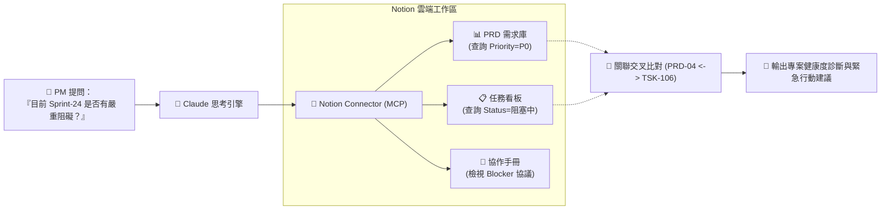

# 📝 次章節 3：Notion 連接器實戰 🧠

> **學習階段**：🟡 高階知識庫與專案治理（PM 與工程主管利器）　|　**預計實作時間**：25 分鐘  
> **核心目標**：打通 Claude 與 Notion 工作區（Workspace），學會跨資料庫檢索（PRD 需求庫 + Sprint 任務看板）、敏捷阻塞事件風險稽核、標準 PRD 自動撰寫，並進一步在 Claude Projects 中建立常態化的「敏捷專案治理中心」。

---

## 🧭 實戰架構與練習導航

本章節以 **跨資料庫自然語言檢索與關聯比對** 作為核心主範例進行深度示範；其餘練習皆備有**獨立的專屬練習資料夾、完整教學文件與配套偽資料**，點擊即可前往專屬實作空間：

| 練習項目 | 類型 | 運作模式 | 所需連接器 | 專屬資料夾與教學連結 |
| :--- | :---: | :---: | :--- | :--- |
| **實戰 1：跨資料庫檢索與關聯** | 🌟 **核心主範例** | 💬 一般對話 | 🔹 **Notion** | [📁 01_Database_Cross_Search](./01_Database_Cross_Search/README.md)（本頁下方完整展開） |
| **實戰 2：阻塞事件升級通報** | 延伸實戰 | 💬 一般對話 | 🔹 **Notion** | [📁 02_Blocker_Escalation](./02_Blocker_Escalation/README.md) |
| **實戰 3：自動生成標準 PRD** | 延伸實戰 | 💬 一般對話 | 🔹 **Notion** | [📁 03_Automated_PRD_Spec](./03_Automated_PRD_Spec/README.md) |
| **實戰 4：敏捷專案治理中心** | 延伸實戰 (進階) | 📁 Claude Projects | 🔹 **Notion** | [📁 04_Agile_PM_Projects](./04_Agile_PM_Projects/README.md) |

---

## 🔄 Connectors 運作機制與架構圖

Claude 透過 Notion 官方 MCP 連接器，可即時穿透並關聯多張獨立資料庫與頁面區塊：



---

## 🛠️ Step-by-Step 連線與授權流程

Notion 連接器採用精準的**頁面級授權機制**，安全且不洩漏個人其他私密頁面：

### 步驟 1：在 Claude 中開啟 Notion 連接器
1. 登入 [Claude.ai](https://claude.ai) ➔ 點選左下角頭像 ➔ **Settings** ➔ **Connectors**。
2. 找到 **Notion**，點擊 **Connect**。
3. 系統將跳轉至 Notion 官方授權畫面。

### 步驟 2：精準指定授權頁面（避坑關鍵！）
1. 在 Notion 授權頁面中，點擊 **Select pages**（選擇頁面）。
2. **切勿選取整個 Workspace**！請精準勾選建立的 `星橋科技專案管理測試空間`（此操作會自動包含其子頁面與 Database）。
3. 點擊 **Allow access**（允許存取）。
4. 返回 Claude 設定頁面，顯示綠色勾號 `✓ Connected` 即代表大功告成！

> [!WARNING]
> **授權常見地雷**：若連線後 Claude 回應「找不到該頁面」，請在 Notion 該頁面右上角點選 `...` ➔ 進入 **Connections** ➔ 確認已將 **Claude** 加入連線清單中！

---

## 🌟 核心主要範例：跨資料庫自然語言檢索與關聯比對 (Relational Cross-Search)

> 💡 **情境故事**：  
> 宗憲是星橋科技的資深 PM。團隊在 Notion 上維護了 PRD 規格庫與工程任務看板。過去管理層詢問「下週上線的 Sprint-24 有無嚴重卡關？」時，宗憲必須手動切換兩張表逐一肉眼比對。現在透過 Notion 連接器，一句自然語言即可秒速交叉運算，揪出被 Modbus 障礙卡住的 P0 核心任務！

* **運作模式**：💬 **一般對話模式（Chat Prompts）**
* **所需連接器**：🔹 **Notion**（確保已授權連線）
* **獨立模組資料夾**：[📂 前往 01_Database_Cross_Search 專屬練習資料夾](./01_Database_Cross_Search/README.md)

### 📥 測試偽資料與 1 分鐘匯入指引

請點擊下載本主範例的兩張標準 CSV 資料庫：

| 檔案類型 | 檔案名稱（點擊檢視/下載） | 說明 |
| :---: | :---| :---|
| 📊 **PRD 庫** | [**星橋科技_產品需求規格庫_PRD.csv**](./sample_files/星橋科技_產品需求規格庫_PRD.csv) | 包含 PRD-01~08 之功能名稱、優先級、Owner 與目標 Sprint。 |
| 📋 **任務看板** | [**團隊任務與衝刺看板_Sprint_Tasks.csv**](./sample_files/團隊任務與衝刺看板_Sprint_Tasks.csv) | 包含 15 項工程任務之狀態、估時、負責人與阻塞原因。 |

> [!TIP]
> **1 分鐘無痛匯入指引**：
> 1. 在 Notion 新增一頁，命名為 `星橋科技專案管理測試空間`。
> 2. 在頁面輸入 `/import` ➔ 選擇 **CSV**，分別將兩份檔案匯入。
> 3. Notion 會在 2 秒內自動生成兩張具備完整欄位的標準 Database！

---

### 📋 複製貼上 Prompt（雙軌實測）

打開 Claude [一般對話視窗](https://claude.ai)，依個人狀況選擇任一方案貼入：

#### 若使用【方案 A：真機 Notion 直連】
```markdown
## Role
你是一位經驗豐富的技術專案經理（Technical PM）。

## Task
請使用 Notion 連接器，檢索我的 Notion 工作區中的「產品需求規格庫（PRD）」與「團隊任務看板（Tasks）」：
1. 找出所有歸屬於「Sprint-24」且優先級為「P0」的需求項目有哪些？
2. 檢查對應的任務中，是否有任何一項目前的狀態為「阻塞中（Blocked）」？
3. 列出該阻塞任務的負責人、截止日期，以及具體的阻塞原因（Blocked Reason）。

## Format
- 使用 Markdown 結構化卡片與警告標記（⚠️）清楚回報。
```

#### 若使用【方案 B：免匯入快速實測】
```markdown
## Role
你是一位經驗豐富的技術專案經理（Technical PM）。

## Context（Notion 既有資料庫內容）
- PRD 需求庫：
  * PRD-01 (P1): 即時能耗監控面板 (Sprint-24)
  * PRD-03 (P0): OTA 韌體更新機制 (Sprint-24)
  * PRD-04 (P0): Modbus 異常斷線自動重試 (Sprint-24)
- Sprint Tasks 任務看板：
  * TSK-102: OTA 封包驗證介面 (Owner: 李雅婷, Status: 進行中)
  * TSK-106: Modbus 408 逾時修復 (Owner: 張志偉, Status: 阻塞中, Due: 3/19, Blocked Reason: 等待東京菱光商事提供現場封包日誌)

## Task
1. 篩選 Sprint-24 中優先級為 P0 的項目。
2. 交叉檢查是否有任何任務處於「阻塞中」？
3. 指出該阻塞任務的負責人、時限與具體瓶頸。
```

---

### ✅ 成果驗收點

- [ ] **精準跨庫比對**：準確鎖定 Sprint-24 的 P0 項目（OTA 韌體更新、Modbus 斷線自動重試）。
- [ ] **敏銳揪出障礙**：識別出 `TSK-106`（Modbus-408 逾時排查）處於「阻塞中」。
- [ ] **關鍵細節無遺漏**：指出負責人為「張志偉」、截止日為 3/19，阻塞原因為「等待日本現場封包日誌」。

---

## 📚 延伸實戰練習庫（點擊進入單案資料夾）

---

### 🚨 練習 2：依據內部手冊進行阻塞事件升級 (Eskalation Protocol)

* **運作模式**：💬 一般對話（Chat）
* **所需連接器**：🔹 **Notion**
* **核心亮點**：
  - 檢索內部工程手冊 Wiki，查證 P0 阻塞任務超過 48 小時之升級規範。
  - 自動起草規格嚴謹、具備時限倒數與對象呼叫（@負責人）的 Slack #product-alert 緊急告警。
* **專屬偽資料**：
  - [星橋科技_工程與設計協作手冊_Engineering_Handbook.md](./02_Blocker_Escalation/sample_files/星橋科技_工程與設計協作手冊_Engineering_Handbook.md)
  - [Sprint-24_嚴重阻塞任務通報案例.md](./02_Blocker_Escalation/sample_files/Sprint-24_嚴重阻塞任務通報案例.md)
* 👉 **[點此進入 02_Blocker_Escalation 專屬練習資料夾 ➔](./02_Blocker_Escalation/README.md)**

---

### 📐 練習 3：規範守門員 — 自動生成符合標準的全新 PRD 規格

* **運作模式**：💬 一般對話（Chat）
* **所需連接器**：🔹 **Notion**
* **核心亮點**：
  - 自動評估新功能安全等級，判定為阻斷性最高級別 P0。
  - 嚴格落實手冊三要素：「量化性能指標」、「邊界異常處置（Fail-Safe）」與「驗收測試路徑」，杜絕空泛詞彙。
* **專屬偽資料**：[PRD標準撰寫範本與檢核清單.md](./03_Automated_PRD_Spec/sample_files/PRD標準撰寫範本與檢核清單.md)
* 👉 **[點此進入 03_Automated_PRD_Spec 專屬練習資料夾 ➔](./03_Automated_PRD_Spec/README.md)**

---

### 🏛️ 練習 4：打造星橋科技「敏捷專案治理中心」專案 (進階)

* **運作模式**：📁 **Claude Projects 專案模式**
* **所需連接器**：🔹 **Notion**
* **核心亮點**：
  - 將工程手冊常駐於專案知識庫，直連線上 Notion 任務看板。
  - 執行例行性「Sprint 健康度自動巡檢」，輸出完成率、阻塞率與三級警示燈號。
* **專屬偽資料**：包含完整手冊、PRD 庫與任務看板偽資料集。
* 👉 **[點此進入 04_Agile_PM_Projects 專屬練習資料夾 ➔](./04_Agile_PM_Projects/README.md)**

---

## 💡 常見問題與除錯指南 (FAQ & Troubleshooting)

### Q1：為什麼 Claude 回應「找不到某個資料庫」或「權限不足」？
* **原因**：Notion 的 OAuth 僅會開放您明確指定的頁面。
* **解法**：打開該 Notion 頁面，點擊右上角 `...` ➔ 最下方 **Connections** ➔ **Add connection** ➔ 加入 **Claude**。

### Q2：Claude 能直接幫我在 Notion 新增或修改資料庫欄位嗎？
* **解答**：可以！但建議在 [Claude Settings ➔ Connectors] 中將寫入權限維持預設的 **`Ask`（每次詢問確認）**，防止團隊看板被誤改。

---

## 🧭 導航地圖

← [上一章：Canva 設計自動化](../02_Canva/README.md) · [返回 Connectors 總覽](../README.md)
