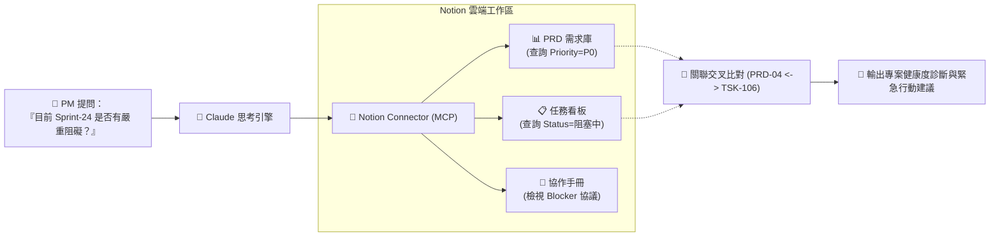

# 📝 次章節 3：Notion 連接器實戰 🧠

> **學習階段**：🟡 高階知識庫與專案治理（PM 與工程主管利器）　|　**預計實作時間**：25 分鐘  
> **核心目標**：打通 Claude 與 Notion 工作區（Workspace），學會跨資料庫檢索（PRD 需求庫 + Sprint 任務看板）、敏捷阻塞事件風險稽核、標準 PRD 自動撰寫，並進一步在 Claude Projects 中建立常態化的「敏捷專案治理中心」。

---

## 🧭 實戰架構與模式總覽

為方便學員循序漸進並清楚掌握工具搭配，本章節設計了基礎對話實測與進階專案治理沙盒：

| 實戰項目 | 運作模式 | 所需連接器 (Connectors) | 核心學習重點 | 前置準備資料 |
| :--- | :---: | :--- | :--- | :--- |
| **實戰 1：跨資料庫自然語言檢索與關聯** | 💬 **一般對話** | 🔹 **Notion**（讀取/搜尋） | 自然語言穿透多張 Database、篩選 P0 核心任務、比對關聯狀態 | PRD 規格庫 (.csv)<br/>Sprint 任務看板 (.csv) |
| **實戰 2：依據內部手冊進行阻塞升級** | 💬 **一般對話** | 🔹 **Notion**（讀取 Page） | 引用工程手冊標準、辨識 Blocker 超時風險、起草 Slack 緊急通報 | 協作手冊 (.md) |
| **實戰 3：規範守門員 — 生成標準 PRD** | 💬 **一般對話** | 🔹 **Notion**（資料結構化） | 優先級量化評定、嚴格依三要素撰寫驗收準則（Acceptance Criteria） | 協作手冊規範 |
| **實戰 4：敏捷專案治理中心（進階）** | 📁 **Claude Projects** | 🔹 **Notion** | 常駐敏捷交付準則 + Notion 連接器直連，實現 24 小時健康度自動診斷 | 專案協作手冊 (.md) |

---

## 📥 學生課堂實作檔案庫（偽檔案）

為了讓您能零摩擦體驗 Notion 連接器的實戰威力，我們準備了符合現代敏捷團隊標準的專案管理與工程協作偽檔案：

### 📁 測試檔案下載清單

| 檔案類型 | 檔案名稱（點擊檢視/下載） | 檔案內容說明 | 適用實戰 |
| :---: | :---| :---| :---|
| 📊 **CSV 資料庫** | [**星橋科技_產品需求規格庫_PRD.csv**](./sample_files/星橋科技_產品需求規格庫_PRD.csv) | 包含 PRD-01~08 之功能名稱、優先級、Owner、目標 Sprint 與驗收準則。 | 實戰 1、實戰 4 |
| 📋 **CSV 資料庫** | [**團隊任務與衝刺看板_Sprint_Tasks.csv**](./sample_files/團隊任務與衝刺看板_Sprint_Tasks.csv) | 15 項工程任務之狀態、估時、負責人、截止日與阻塞原因（Blocked Reason）。 | 實戰 1、實戰 4 |
| 📑 **Wiki 文件** | [**星橋科技_工程與設計協作手冊_Engineering_Handbook.md**](./sample_files/星橋科技_工程與設計協作手冊_Engineering_Handbook.md) | 包含敏捷規範、P0~P3 定義與 Blocker 升級協議之內部 Wiki 手冊。 | 實戰 2、實戰 3、實戰 4 |

---

### ⚡ 1 分鐘 Notion 無痛匯入與授權避坑指引

> [!TIP]
> **Notion 匯入超級簡單（只需 30 秒）**：
> 1. 打開您的 [Notion](https://www.notion.so) 工作區，在左側點擊 **Add a page**，命名為 `星橋科技專案管理測試空間`。
> 2. 在該頁面空白處輸入 `/import` ➔ 選擇 **CSV** ➔ 分別將 `星橋科技_產品需求規格庫_PRD.csv` 與 `團隊任務與衝刺看板_Sprint_Tasks.csv` 匯入。
> 3. Notion 會立即為您生成兩張具備完整欄位（Status, Priority, Assignee）的標準 Database！

---

## 🔄 Connectors 運作機制與架構圖

Claude 透過 Notion 官方 MCP 連接器，可即時解析結構化 Database 屬性與頁面區塊：



---

## 🛠️ Step-by-Step 連線與授權流程

Notion 連接器採用精準的**頁面級授權機制**，安全且不洩漏個人其他私密頁面：

### 步驟 1：在 Claude 中開啟 Notion 連接器
1. 登入 [Claude.ai](https://claude.ai) ➔ 點選左下角頭像 ➔ **Settings** ➔ **Connectors**。
2. 找到 **Notion**，點擊 **Connect**。
3. 系統將跳轉至 Notion 官方授權畫面。

### 步驟 2：精準指定授權頁面（避坑關鍵！）
1. 在 Notion 授權頁面中，點擊 **Select pages**（選擇頁面）。
2. **切勿選取整個 Workspace**！請精準勾選剛才建立的 `星橋科技專案管理測試空間`（此操作會自動包含其子頁面與 Database）。
3. 點擊 **Allow access**（允許存取）。
4. 返回 Claude 設定頁面，顯示綠色勾號 `✓ Connected` 即代表大功告成！

> [!WARNING]
> **授權常見地雷**：若連線後 Claude 回應「找不到該頁面」，請在 Notion 該頁面右上角點選 `...` ➔ 進入 **Connections** ➔ 確認已將 **Claude** 加入連線清單中！

---

## 💬 模組 A：一般對話模式（Chat Prompts）實測三部曲

> 💡 **雙軌實測機制**：  
> - **方案 A（真機直連實測）**：適用已將 CSV 匯入 Notion 的學員。
> - **方案 B（免匯入快速實測）**：若臨時不想登入 Notion，可直接使用方案 B 內建資料的 Prompt，100% 體驗相同邏輯！

---

### 實戰 1：跨資料庫自然語言檢索與關聯比對 (Relational Cross-Search)

* **運作模式**：💬 一般對話（Chat）
* **所需連接器**：🔹 **Notion**（讀取/搜尋權限）
* **任務目標**：穿透 Notion 工作區，跨 PRD 資料庫與任務看板進行關聯運算，揪出影響 Sprint-24 上線的重大阻塞風險。

#### 📋 複製貼上 Prompt

##### 若使用【方案 A：真機 Notion 直連】：
```markdown
## Role
你是一位經驗豐富的技術專案經理（Technical PM）。

## Task
請使用 Notion 連接器，檢索我的「星橋科技專案管理測試空間」中的「產品需求規格庫（PRD）」與「團隊任務看板（Tasks）」：
1. 找出所有歸屬於「Sprint-24」且優先級為「P0」的需求項目有哪些？
2. 檢查對應的任務中，是否有任何一項目前的狀態為「阻塞中（Blocked）」？
3. 列出該阻塞任務的負責人、截止日期，以及具體的阻塞原因（Blocked Reason）。

## Format
- 使用 Markdown 結構化卡片與警告標記（⚠️）清楚回報。
```

##### 若使用【方案 B：免匯入快速實測】：
```markdown
## Role
你是一位經驗豐富的技術專案經理（Technical PM）。

## Context（Notion 既有資料庫內容）
- PRD 需求庫：
  * PRD-01 (P1): 即時能耗監控面板 (Sprint-24)
  * PRD-03 (P0): OTA 韌體更新機制 (Sprint-24)
  * PRD-04 (P0): Modbus 異常斷線自動重試 (Sprint-24)
- Sprint Tasks 任務看板：
  * TSK-102: OTA 封包驗證介面 (Owner: 李雅婷, Status: 進行中)
  * TSK-106: Modbus 408 逾時修復 (Owner: 張志偉, Status: 阻塞中, Due: 3/19, Blocked Reason: 等待東京菱光商事提供現場封包日誌)

## Task
1. 篩選 Sprint-24 中優先級為 P0 的項目。
2. 交叉檢查是否有任何任務處於「阻塞中」？
3. 指出該阻塞任務的負責人、時限與具體瓶頸。
```

#### ✅ 成果驗收點
- [ ] **精準鎖定目標**：正確鎖定 Sprint-24 中的 P0 項目（OTA 更新、Modbus 斷線修復）。
- [ ] **敏銳揪出障礙**：識別出 `TSK-106`（Modbus-408 逾時排查）處於「阻塞中」。
- [ ] **關鍵細節無遺漏**：指出負責人為「張志偉」、截止日為 3/19，阻塞原因為「等待日本現場封包日誌」。

---

### 實戰 2：依據內部手冊進行阻礙事件升級 (Eskalation Protocol)

* **運作模式**：💬 一般對話（Chat）
* **所需連接器**：🔹 **Notion**
* **任務目標**：查閱內部 Engineering Handbook 規範，針對 P0 阻塞任務啟動標準通報，草擬發往 Slack 的高警示訊息。

#### 📋 複製貼上 Prompt

##### 若使用【方案 A：真機 Notion 直連】：
```markdown
## Role
你是一位注重專案節奏與危機處理的資深 Scrum Master。

## Task
請檢索 Notion 中的《星橋科技 工程與設計協作手冊》：
1. 依據手冊規範，當「P0 級任務處於阻塞中（Blocked）」時，團隊標準的處置協議（Protocol）與升級時限為何？
2. 針對剛才發現的 TSK-106 阻塞事件，請幫我起草一份發在 Slack #product-alert 頻道的緊急警示訊息，督促相關窗口立刻跟進。

## Constraints
- Slack 訊息需包含：任務代碼、受影響客戶、阻塞時限倒數、具體呼叫對象（@張志偉、@海外業務窗口）。
```

##### 若使用【方案 B：免匯入快速實測】：
```markdown
## Role
你是一位注重專案節奏與危機處理的資深 Scrum Master。

## Context（工程手冊規範條文）
- 手冊規範：凡 P0 級任務處於 Blocked 狀態超過 24 小時，負責人必須通報；若超過 48 小時，Scrum Master 需立即啟動跨組 Eskalation，並於 Slack #product-alert 頻道發布緊急公告，指派代理人或協調外部資源。

## Task
針對 TSK-106（Modbus 408 逾時修復，負責人：張志偉，卡在等待日本菱光商事日誌，距離截止日僅剩 48 小時）起草一份 Slack #product-alert 緊急公告。
```

#### ✅ 成果驗收點
- [ ] **條文規範正確引用**：指出 P0 任務阻塞之強制升級時限。
- [ ] **Slack 警示格式專業**：產出排版緊湊、行動導向明確的通報訊息。

---

### 實戰 3：規範守門員 — 自動生成符合標準的全新 PRD 頁面草稿

* **運作模式**：💬 一般對話（Chat）
* **所需連接器**：🔹 **Notion**
* **任務目標**：評估新功能優先級，並嚴格遵循「量化指標、極端異常處置、可驗收測試路徑」三要素撰寫標準 PRD。

#### 📋 複製貼上 Prompt

```markdown
## Role
你是一位嚴謹的首席產品經理（Lead PM）。

## Task
我們最近需要為能源管理系統新增一項功能：「AI 產線自動異常停機安全保護機制（Fail-Safe Interlock）」。
請嚴格依據標準敏捷工程手冊規範：
1. **優先級判定**：為這項功能給予合理的優先級評級（P0~P3）並詳細說明判斷邏輯。
2. **驗收準則（Acceptance Criteria）**：必須包含「量化性能指標」、「極端異常處置機制（Edge Cases）」與「客觀驗收測試路徑」三大要素。
3. **Notion PRD 結構**：產出可直接複製貼入 Notion PRD 頁面的標準 Markdown 格式內容。

## Constraints
- 避免模糊空洞詞彙（如「速度很快」、「高穩定性」），必須給出具體數值指標（例如響應時間 < 100ms）。
```

#### ✅ 成果驗收點
- [ ] **精準定級**：辨識出「產線停機安全保護」涉及重大工安與硬體損壞風險，判定為最高級別 **P0**。
- [ ] **嚴格落實三要素**：驗收準則具備量化指標（如延遲 < 50ms）、邊界條件（如斷網跳脫保護）與測試驗證手法。

---

## 📁 模組 B：Claude Projects 模式進階實戰（敏捷專案治理中心）

> 🌟 **進階亮點**：  
> 將 **Claude Projects 專案沙盒**（常駐團隊工程規範手冊）與 **Notion 連接器**（直連即時 PRD 與 Task 資料庫）結合，打造全天候自動稽核專案進度與風險的「AI 專案治理總監」！

---

### 實戰 4：打造星橋科技「敏捷專案治理中心」專案

* **運作模式**：📁 **Claude Projects 專案模式**
* **所需連接器**：🔹 **Notion**
* **前置檔案**：
  - [星橋科技_工程與設計協作手冊_Engineering_Handbook.md](./sample_files/星橋科技_工程與設計協作手冊_Engineering_Handbook.md)

---

### 🛠️ 步驟 1：專案建置設定（Claude Projects Setup）

1. 登入 [Claude.ai](https://claude.ai) ➔ 點擊左側 **Projects** ➔ **Create project**。
2. 填入專案基本資料：
   - **Project Name（專案名稱）**：
     ```text
     星橋科技_敏捷專案治理中心
     ```
   - **Project Description（專案描述）**：
     ```text
     結合工程協作手冊與 Notion 連接器，即時監控 Sprint 衝刺健康度、稽核 P0 阻礙事件並自動產出合規 PRD。
     ```
3. 點擊 **Create project** 建立完成。

---

### 📜 步驟 2：設定常駐專案指引（Project Instructions）

進入專案，在右側點擊 **Set Project Instructions**，貼入以下常駐治理規則：

```markdown
## Role
你是「星橋科技敏捷專案管理委員會」的 AI 執行秘書，精通 Scrum 框架、Notion 資料庫關聯治理與技術規格把關。

## Core Mission
每當使用者詢問專案進度、審查需求或查詢任務看板時：
1. 嚴格對照專案知識庫中的《工程與設計協作手冊》，檢驗各項任務是否符合 SLA 時限。
2. 主動穿透 Notion 連接器比對 PRD 與 Task 資料庫，主動揭露卡關超過 24 小時的 P0 隱性風險。
3. 撰寫任何 PRD 或驗收規格時，若未包含量化指標（SLA/TPS/Latency），一律判定為不合規並要求補正。
```

---

### 📥 步驟 3：上傳專案知識庫（Project Knowledge）

在專案頁面右側 **Project Knowledge** 區塊，點選 **Add content** ➔ **Upload files**，上傳：
- [星橋科技_工程與設計協作手冊_Engineering_Handbook.md](./sample_files/星橋科技_工程與設計協作手冊_Engineering_Handbook.md)

---

### 💬 步驟 4：對話實測指令（Prompt）

點選 **Start new chat**，確認該對話已連線 Notion 連接器，貼入以下健康度巡檢指令：

```markdown
請執行每週例行「Sprint 健康度自動巡檢」：
1. 透過 Notion 連接器，掃描當前進行中的 Sprint 所有任務。
2. 列出目前的完成率（Completion Rate）與阻塞率（Blocked Ratio）。
3. 依據協作手冊規範，給出本週的衝刺風險燈號（綠燈/黃燈/紅燈），並列出前三大待辦行動建議。
```

#### ✅ 成果驗收點
- [ ] **知識庫條文常駐**：Claude 自動將知識庫的手冊規則與 Notion 線上資料庫進行即時交叉診斷。
- [ ] **產出健康度儀表板**：給出明確的燈號警示與高風險任務改善行動方針。

---

## 💡 常見問題與除錯指南 (FAQ & Troubleshooting)

### Q1：為什麼 Claude 回應「找不到某個資料庫」或「權限不足」？
* **原因**：這是 Notion 最常見的授權保護機制！Notion 的 OAuth 僅會開放您明確指定的頁面。
* **解法**：
  1. 打開該 Notion 頁面，點擊右上角 `...`。
  2. 滾動至最下方找到 **Connections**（連線）。
  3. 點擊 **Add connection**，搜尋並加入 **Claude**。完成後刷新對話即可立即檢索！

### Q2：Claude 能直接幫我在 Notion 新增或修改資料庫欄位嗎？
* **解答**：**可以！** 但為確保團隊協作安全，建議在 [Claude Settings ➔ Connectors] 中將寫入權限維持預設的 **`Ask`（每次詢問確認）**，由您在畫面上點擊確認後才執行寫入，防止意外更動團隊看板。

---

## 🧭 導航地圖

← [上一章：Canva 設計自動化](../02_Canva/README.md) · [返回 Connectors 總覽](../README.md)
