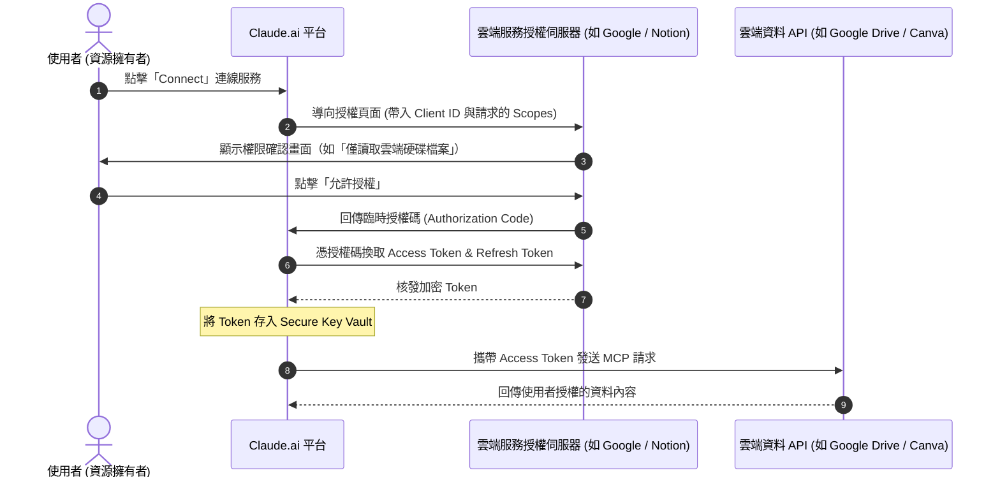

# 01. OAuth 2.0 授權機制與雲端隱私安全指南

> 本指南深入探討 Claude Connectors 背後最關鍵的安全基石——**OAuth 2.0 授權架構**，以及 Anthropic 如何透過雲端金鑰保險庫（Secure Vault）保護您的組織敏感資料。

---

## 🔐 什麼是 OAuth 2.0？為什麼 AI 不需要知道你的密碼？

在傳統系統整合中，最危險的做法是將「帳號與密碼」直接交給第三方應用程式。這種做法有兩大致命隱患：
1. **權限過大**：第三方能拿到你帳號的所有權限（包含變更密碼、刪除帳號）。
2. **無法單獨撤銷**：若要收回權限，你必須變更主要密碼，導致所有其他整合全部中斷。

**OAuth 2.0（開放授權協議）** 徹底解決了這個問題。它就像飯店發給房客的「感應房卡」：
- 它不是萬能鑰匙，只能打開特定房間（**範疇 Scopes**）。
- 它有有效期限，時間到了就失效（**過期 Expiration**）。
- 櫃檯可以隨時將房卡作廢，不需要更換房門鎖（**撤銷 Revocation**）。

---

## 🏛️ Anthropic 安全金鑰保險庫架構

當您在 Claude.ai 授權連接器後，產生的憑證是如何被保管的？

1. **靜態與傳輸加密**：
   - 所有 Access Token 與 Refresh Token 在傳輸過程中強制使用 **TLS 1.3** 加密。
   - 存放於 Anthropic 的專屬雲端金鑰保險庫（Secure Key Vault），採用 **AES-256** 軍規級靜態加密。
2. **沙盒與租戶隔離（Tenant Isolation）**：
   - 您的 OAuth Token 僅綁定在您的帳號與特定工作區（Workspace）。其他使用者或對話無法存取您的連線憑證。
3. **即時過期與自動展期**：
   - Access Token 通常僅有 1 小時效期。過期後，系統透過 Refresh Token 向授權方換發新 Token，整個過程在背景加密完成，無需使用者反覆重新登入。

---

## 🛡️ 最小授權原則（Least Privilege Principle）

使用 Connectors 時，最安全的實踐是**「只給予完成任務所需的最小權限」**：

| 連接器服務 | 建議請求權限 | 應避免的危險權限 |
| :--- | :--- | :--- |
| **Google Drive** | `drive.readonly` 或 `drive.file`（僅存取透過 Claude 開啟或指定之檔案） | `drive`（完整讀寫並具備永久刪除權限） |
| **Gmail** | `gmail.readonly`（僅讀取郵件內容與標籤） | `gmail.send` 或 `mail.google.com`（具備代表寄信與刪除信件全權） |
| **Google Calendar** | `calendar.readonly` 或 `calendar.events`（檢視與新增特定行程） | `calendar`（管理行事曆共用對象與擁有權） |
| **Notion** | 指定特定頁面與資料庫（Select Pages）授權 | 整個 Workspace 根目錄無差別完全開放 |
| **Canva** | `design:read`、`design:content:read` | 未限制的團隊管理員層級權限 |

---

## 🚪 如何隨時斬斷連線（緊急撤銷機制）

如果您不再需要某個連接器，或者懷疑帳號異常，您可以隨時從兩端立即撤銷權限：

### 方法 A：從 Claude.ai 介面中斷
1. 點選左下角使用者頭像 ➔ **Settings**。
2. 進入 **Connectors** 頁籤。
3. 找到目標服務，點擊 **Disconnect**，Claude 將立即銷毀儲存在金鑰保險庫中的 Token。

### 方法 B：從第三方服務端強制撤銷（最高優先級）
即使忘記在 Claude 斷開，也可以直接到來源平台終止第三方 App 存取：
- **Google**：前往 [Google 帳戶安全性 ➔ 第三方應用程式](https://myaccount.google.com/permissions) ➔ 移除 Claude 存取權。
- **Notion**：前往 **Settings & Members** ➔ **My connections** ➔ 撤銷 Claude Integration。
- **Canva**：前往 **帳號設定** ➔ **已連結的應用程式** ➔ 撤銷存取權。

---

← [返回 Connectors 總覽](../README.md) · [前往下一篇：工具權限分級與治理](./02_Tool_Permissions_and_Governance.md)
