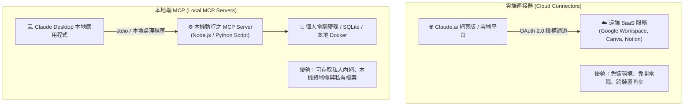

# 03. 雲端連接器 (Connectors) vs 本地端 MCP (Local MCP) 架構評估與成本決策

> Claude 的延伸生態系中，「Connectors」與「Local MCP」究竟有何差別？什麼情境該點擊網頁版「Connect」？什麼時候該在本地設定 `claude_desktop_config.json`？本指南為您深入剖析兩者的架構優缺、Token 成本以及選型矩陣。

---

## 🏗️ 雙軌架構深度對照



| 比較維度 | 雲端連接器 (Cloud Connectors) | 本地端 MCP (Local MCP) |
| :--- | :--- | :--- |
| **運作環境** | Anthropic 雲端伺服器 ➔ 遠端 SaaS API | 使用者本機電腦 (macOS / Windows / Linux) |
| **安裝門檻** | 🟢 **零門檻**（點擊 Connect ➔ 登入授權完成） | 🟡 **需開發知識**（需安裝 Node/Python、編輯 JSON） |
| **支援客戶端** | Claude.ai 網頁版、手機 App、桌面版均可使用 | **僅限 Claude Desktop 桌面版**（手機/網頁無法連本機） |
| **存取範圍** | 雲端公開/授權服務（Google Drive, Notion, Canva） | 本機檔案系統、內網伺服器、本地資料庫、本機指令列 |
| **權限驗證** | OAuth 2.0 / API Key 託管於 Secure Vault | 依賴本機作業系統權限與 process 隔離 |
| **連線維護** | 服務商自動維護，隨時在線 | 電腦關機或 Terminal 結束即中斷連線 |

---

## 💸 Token 基礎開銷與快取機制（Prompt Caching）

許多人不知道：**每開啟一個連接器，都在消耗你的上下文空間（Context Window）！**

### 1. 工具宣告（Tool Definition）開銷
當連接器連線後，該服務所支援的所有工具說明（包含工具名稱、參數格式、描述字串）都會在每一輪對話開始前，被自動注入到 **System Prompt** 中：
- 一個典型的 Google Workspace 連接器（含 Drive、Sheets、Gmail、Calendar）約佔用 **1,500 ~ 3,000 Tokens**。
- 若同時掛載 5 個連接器，光是基礎工具清單就可能吃掉 **10,000+ Tokens**。

### 2. 最佳化防護：專案隔離原則 (Project Isolation)
為了避免「工具臃腫（Tool Bloat）」導致 AI 判斷混亂並徒增 Token 消耗，請務必遵循以下實踐：
- **一般對話保持乾淨**：只開啟日常最常用的 1~2 個通用連接器。
- **專案專用（Project-Level Connectors）**：
  - 設計與行銷專案：僅掛載 **Canva**。
  - 產品與工程管理專案：僅掛載 **Notion**。
  - 財務分析與跨部門報告專案：僅掛載 **Google Workspace**。
- **善用 Prompt Caching**：重複使用的工具宣告具備快取能力，大幅降低持續對話的計費與延遲。

---

## 🧭 架構選型決策樹（何時用哪種？）

```text
你想讓 Claude 存取的資料在哪裡？
│
├── 📂 在個人電腦硬碟、本地端資料庫或公司內部網域 (Intranet)
│   └── 👉 選擇【本地端 MCP (Local MCP)】
│       （參考：Local_MCP 模組，使用 stdio 協議連接本機檔案系統）
│
└── ☁️ 在主流雲端 SaaS 平台（Google, Notion, Canva, GitHub）
    │
    ├── 只需要跨裝置隨時取用、手機也想用、不想安裝本機環境
    │   └── 👉 選擇【雲端連接器 (Connectors)】（首選推薦！）
    │
    └── 該平台尚未推出官方雲端連接器，但社群有開源 MCP Server
        └── 👉 選擇【本地端 MCP 或自建 Remote MCP】
```

---

← [上一篇：工具權限分級與治理](./02_Tool_Permissions_and_Governance.md) · [返回 Connectors 總覽](../README.md)
