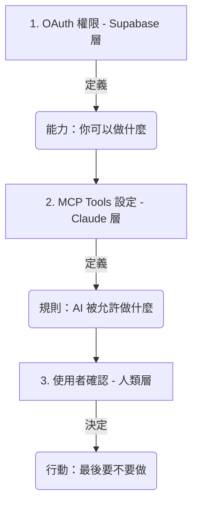

# OAuth 2.0 授權機制與安全控解

在 AI 與雲端服務整合的世界中，**OAuth 2.0** 是最核心的安全標準。它讓 Claude 能夠在「不得知您密碼」的前提下，獲得您的授權來存取特定的資料。

這份文件將以 **Supabase** 為例，深入探討 OAuth 的運作方式，以及它與 **MCP (Model Context Protocol)** 權限機制的協作。

---

## 🧠 觀念釐清：Connectors vs. Skills

這兩個功能在 Claude 生態系中各司其職，但也經常協作：

| 特性 | Connectors（連接器） | Skills（技能） |
| :--- | :--- | :--- |
| **核心公式** | **OAuth + Remote MCP** | **Instructions + Resources + (Tools)** |
| **本質** | 基礎設施層（建立安全資料通道） | 行為應用層（封裝專業工作流） |
| **功能呼叫** | 主要由模型自動觸發 API | **可主動調用 Function Calling** |
| **工具整合** | 連接雲端 SaaS (如 Supabase) | **可串接本地 MCP Server 或執行程式碼** |
| **主要角色** | **「資料管道」** | **「調度員 / 專家」** |

> **進階觀念**：
> Skills 不只是靜態指令。一個強大的 Skill 可以包含**程式碼執行能力**，或是指引 Claude 如何使用特定的 **本地 MCP 工具** 來完成任務。
> - **Connector** 解決的是「我如何安全地拿到遠端資料」。
> - **Skill** 解決的是「我拿到資料後，要用什麼工具（Function Calling）處理它」。

---

## 🛠️ MCP 的兩大居住地：本地 vs. 遠端

### 1. 本地 MCP (Local MCP)
- **位置**：執行在您的個人電腦上。
- **與 Skills 關係**：Skills 經常會調用本地 MCP 提供的 Tools（如讀取檔案、操作資料庫）。

### 2. 遠端連接器 (Remote Connectors / Connectors)
- **位置**：由服務商託管在雲端。
- **與 OAuth 關係**：因為在雲端，必須搭配 OAuth 識別身分。

---

## ⚡ Token 消耗與效能管理

- **工具定義（靜態）**：連線越多，工具說明佔用的 System Prompt 越多。
- **最佳實踐**：善用 **Project Isolation (專案隔離)**，只在特定專案開啟必要的連線。

---

## 🎯 教學用的三層安全模型

1.  **OAuth (Supabase)**：賦予 AI 「能力」。
2.  **MCP Tools (Claude)**：將能力拆解為具體的「工具」，並設定行為限制。
3.  **使用者確認 (Human-in-the-loop)**：人進行「最後把關」。

---

← [返回 Connectors README](./README.md)
