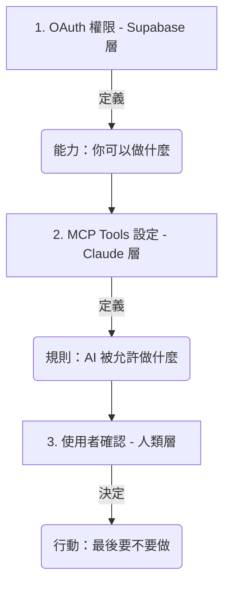

# OAuth 2.0 授權機制與安全控解

在 AI 與雲端服務整合的世界中，**OAuth 2.0** 是最核心的安全標準。它讓 Claude 能夠在「不得知您密碼」的前提下，獲得您的授權來存取特定的資料。

這份文件將以 **Supabase** 為例，深入探討 OAuth 的運作方式，以及它與 **MCP (Model Context Protocol)** 權限機制的協作。

---

## 為什麼需要 OAuth？（代客泊車的比喻）

想像您將車交給**代客泊車員**：
- **傳統做法（不安全）**：您交出整串鑰匙（包含家門、保險箱鑰匙）。他可以開走您的車，甚至進去您的家。
- **OAuth 做法（安全）**：您交給他一把「泊車專用鑰匙」。這把鑰匙**只能發動車子**，且**不能開後車廂**，並在**一小時後失效**。

在 Connectors 的情境中：
- **您**：車主。
- **Claude** : 代客泊車員。
- **Supabase / Google**：汽車與停車場。
- **Access Token (存取權杖)**：那把限權、限時的專用鑰匙。

---

## 🧠 觀念釐清：Connectors vs. Skills

很多學生會混淆這兩個功能，其實它們的底層邏輯完全不同：

| 特性 | Connectors（連接器） | Skills（技能） |
| :--- | :--- | :--- |
| **核心公式** | **OAuth + Remote MCP** | **Instructions + Resources** |
| **本質** | 基礎設施層（建立安全資料通道） | 行為應用層（封裝專業工作流） |
| **安全機制** | 外部 OAuth 驗證 + MCP 權限控制 | 內部指令約束 + 程式碼執行權限 |
| **資料來源** | 遠端雲端資料（SaaS, DB） | 靜態資源、腳本或動態載入的知識 |
| **主要目的** | **「連結」**外部世界 | **「執行」**特定專長任務 |

> **結論**：Connectors 本質上就是 **Server-side MCP** 的產品化呈現。如果您需要「取回資料」，找 Connector；如果您需要「專業處理流程」，找 Skill。

---

## 🛠️ MCP 的兩大居住地：本地 vs. 遠端

### 1. 本地 MCP (Local MCP)
- **位置**：執行在您的個人電腦上。
- **通訊**：透過 `stdio` 與 Claude Desktop 通訊。

### 2. 遠端連接器 (Remote Connectors / Connectors) —— **Supabase 屬於此類**
- **位置**：由服務商託管在**雲端伺服器**。
- **設定**：免設定檔，透過「OAuth 一鍵連線」即可。

---

## ⚡ Token 消耗與效能管理

- **工具定義（靜態）**：連線越多，工具說明佔用的 System Prompt 越多。
- **資料讀取（動態）**：實際抓回資料時才會大量消耗 Context Window。
- **最佳實踐**：善用 **Project Isolation (專案隔離)**，只在特定專案開啟必要的連線。

---

## 🎯 教學用的三層安全模型

1.  **OAuth (Supabase)**：賦予 AI 「能力」。
2.  **MCP Tools (Claude)**：將能力拆解為具體的「工具」，並設定行為限制。
3.  **使用者確認 (Human-in-the-loop)**：人進行「最後把關」。

---

← [返回 Connectors README](./README.md)
