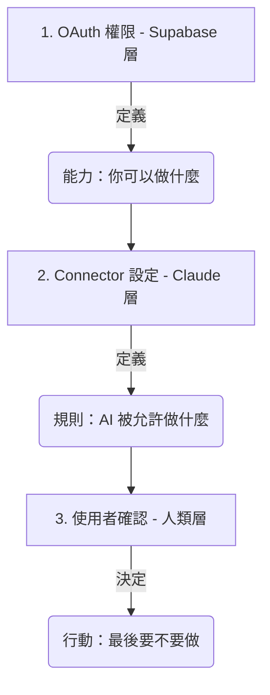

# OAuth 2.0 授權機制與安全控解

在 AI 與雲端服務整合的世界中，**OAuth 2.0** 是最核心的安全標準。它讓 Claude 能夠在「不得知您密碼」的前提下，獲得您的授權來存取特定的資料。

這份文件將以 **Supabase** 為例，深入探討 OAuth 的運作方式，以及它如何與 Claude 內部的安全控管機制協作。

---

## 為什麼需要 OAuth？（代客泊車的比喻）

想像您將車交給**代客泊車員**：
- **傳統做法（不安全）**：您交出整串鑰匙（包含家門、保險箱鑰匙）。他可以開走您的車，甚至進去您的家。
- **OAuth 做法（安全）**：您交給他一把「泊車專用鑰匙」。這把鑰匙**只能發動車子**，且**不能開後車廂**，並在**一小時後失效**。

在 Connectors 的情境中：
- **您**：車主。
- **Claude**：代客泊車員。
- **Supabase / Google**：汽車與停車場。
- **Access Token (存取權杖)**：那把限權、限時的專用鑰匙。

---

## OAuth 的四大角色

| 角色 | 專業術語 | 在 Supabase Connector 中是誰？ |
| :--- | :--- | :--- |
| **資源擁有者** | Resource Owner | **您**（擁有 Supabase 專案權限的人）。 |
| **客戶端** | Client | **Claude (Anthropic)**（想要存取資料的應用程式）。 |
| **授權伺服器** | Authorization Server | **Supabase 的登入系統**（負責核發鑰匙）。 |
| **資源伺服器** | Resource Server | **Supabase API / Database**（存放您實際資料的地方）。 |

---

## 核心重點：OAuth Scope vs. Claude Connector 控管

當我們談論「權限」時，實際上存在兩個完全不同層級的安全檢查。

### 🧠 一句話總結
- **OAuth Scope**：決定 Claude 「**技術上能不能做**」。
- **Connector 設定**：決定 Claude 「**行為上願不願意幫你做**」。

---

### 第一層：OAuth Access Token（外部權限層）
當您連接 Supabase 時，Supabase 會核發一個 Access Token 並帶有 **Scopes**（例如：`read`, `write`, `admin`）。
- 這代表了 Claude **在技術層面上擁有的最高權力**。
- 如果 Scope 只有 `read`，Claude 就算想刪除資料也絕對做不到。

### 第二層：Claude Connector 設定（內部安全閥）
在 Claude 的設定介面中，您可以看到針對不同操作的控管開關：
- **Always allow** (自動執行)
- **Needs approval** (詢問確認)
- **Blocked** (完全禁止)

這是 Claude 為了防止 AI 誤操作而設計的「**自我限制**」。即使 OAuth Token 擁有權限，Claude 也會依照您的設定決定是否執行。

---

## 🔁 實戰案例：Supabase 資料操作

假設您的 **OAuth Token** 擁有完整的 `read`, `write`, `delete` 權限，但您在 **Claude Connector** 做了以下設定：

| 功能 | Connector 安全設定 | 結果 |
| :--- | :--- | :--- |
| **查詢資料 (SELECT)** | Always allow | ✅ 直接執行並顯示結果 |
| **寫入資料 (INSERT)** | Needs approval | ⚠️ Claude 會彈出視窗請您確認 |
| **刪除資料 (DELETE)** | Blocked | ❌ 即使 Token 允許，Claude 也拒絕執行 |

### 為什麼要這樣設計？
為了防止 AI 因為理解錯誤而造成災難。例如：
> **使用者提問**：「幫我清掉測試資料。」
> **AI 誤解**：執行 `DELETE FROM users;` (清空所有用戶)
> **安全機制**：因為您設定了 `Blocked` 或 `Needs approval`，這一秒鐘的確認能挽救整個資料庫。

---

## 🎯 教學用的三層安全模型

您可以將這個機制整理為以下三層模型，非常適合用於教學：

1.  **OAuth (Supabase)**：賦予 AI 「能力」。
2.  **Claude Connector**：設定 AI 的「行為限制」。
3.  **使用者確認 (Human-in-the-loop)**：人進行「最後把關」。

---

## 🔥 總結：進階觀念

- **OAuth Scope 是「粗粒度」的**：例如 `read` 代表能讀取整個專案。
- **Claude Control 是「細粒度」的**：它可以根據對話脈絡、特定表單、或操作性質（如刪除 vs 查詢）來觸發不同的安全機制。

> **最後的比喻**：
> - **OAuth** = 您擁有的「駕照」（證明您有開車的能力）。
> - **Connector** = 車子有沒有「上鎖」（決定車子何時能動）。
> - **Approval** = 您握著「方向盤」（決定這段路要不要開過去）。

---

← [返回 Connectors README](./README.md)
