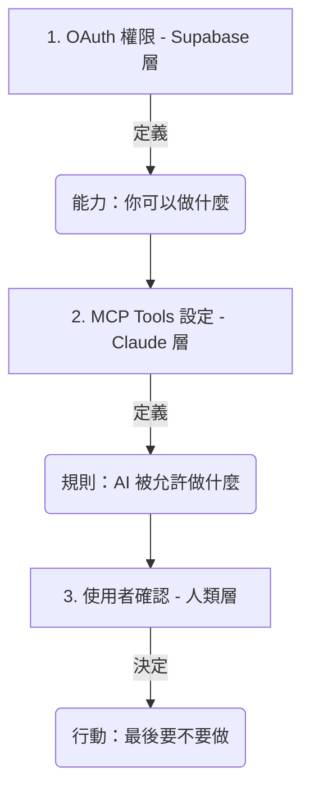

# OAuth 2.0 授權機制與安全控解

在 AI 與雲端服務整合的世界中，**OAuth 2.0** 是最核心的安全標準。它讓 Claude 能夠在「不得知您密碼」的前提下，獲得您的授權來存取特定的資料。

這份文件將以 **Supabase** 為例，深入探討 OAuth 的運作方式，以及它與 **MCP (Model Context Protocol)** 權限機制的協作。

---

## 為什麼需要 OAuth？（代客泊車的比喻）

想像您將車交給**代客泊車員**：
- **傳統做法（不安全）**：您交出整串鑰匙（包含家門、保險箱鑰匙）。他可以開走您的車，甚至進去您的家。
- **OAuth 做法（安全）**：您交給他一把「泊車專用鑰匙」。這把鑰匙**只能發動車子**，且**不能開後車廂**，並在**一小時後失效**。

在 Connectors 的情境中：
- **您**：車主。
- **Claude** : 代客泊車員。
- **Supabase / Google**：汽車與停車場。
- **Access Token (存取權杖)**：那把限權、限時的專用鑰匙。

---

## 🛠️ MCP 的兩大居住地：本地 vs. 遠端

### 1. 本地 MCP (Local MCP)
- **位置**：執行在您的個人電腦（Mac/PC）上。
- **通訊**：透過 `stdio` (標準輸入輸出) 與 Claude Desktop 通訊。
- **情境**：存取本機檔案、執行本機腳本。

### 2. 遠端連接器 (Remote Connectors / Connectors) —— **Supabase 屬於此類**
- **位置**：由服務商（如 Supabase）或 Anthropic 託管在**雲端伺服器**。
- **設定**：免設定檔，透過「OAuth 一鍵連線」即可。
- **情境**：存取雲端資料庫、GitHub、Gmail 等 SaaS 服務。

---

## 🔐 Access Token 儲存在哪裡？

當您完成授權後，Access Token 會被儲存在您的**本地裝置**中。

| 作業系統 | 儲存位置 | 安全機制 |
| :--- | :--- | :--- |
| **macOS** | **鑰匙圈 (Keychain Access)** | 使用系統級硬體加密保護。 |
| **Windows** | **認證管理員 (Credential Manager)** | 整合 Windows 帳戶權限保護。 |

---

## 🔍 如何在 Supabase 管理授權？

- **管理已授權 App**：`Organization Settings` -> `Authorized apps`。
- **中斷連線 ≠ 撤銷授權**：若要徹底斷開，請至 Supabase **Authorized apps** 點擊垃圾桶圖示。

---

## ⚡ Token 消耗與效能管理

這是一個進階的實作問題：**啟用過多 Connectors 會佔用太多 Token 嗎？**

### 1. 工具定義的「靜態消耗」
當您啟用一個連線時，Claude 的每一則對話背景中都會加入該工具的「說明書」（功能名稱、參數、描述）。
- **影響**：連線越多，工具定義就越多，會佔用部分 **System Prompt** 的空間。
- **程度**：通常每項工具約佔數十到數百個 Tokens。

### 2. 資料讀取的「動態消耗」
- **影響**：只有當 Claude 真正去執行工具、抓回資料（如讀取 10 封郵件）時，這些資料才會大量佔用您的 **Context Window**。

> **最佳實踐建議**：
> - **精簡連線**：只開啟目前任務需要的 Connectors。
> - **專案隔離**：善用 Claude 的 **Projects** 功能，在不同專案中啟用不同的連線，避免單一對話背景過於臃腫，維持 AI 的推理精確度。

---

## 🎯 教學用的三層安全模型

1.  **OAuth (Supabase)**：賦予 AI 「能力」。
2.  **MCP Tools (Claude)**：將能力拆解為具體的「工具」，並設定行為限制。
3.  **使用者確認 (Human-in-the-loop)**：人進行「最後把關」。

---

← [返回 Connectors README](./README.md)
