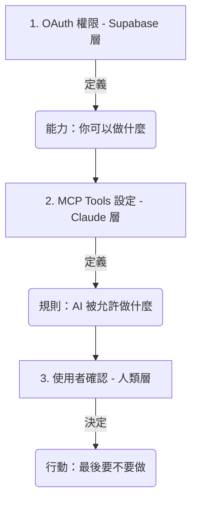

# OAuth 2.0 授權機制與安全控解

在 AI 與雲端服務整合的世界中，**OAuth 2.0** 是最核心的安全標準。它讓 Claude 能夠在「不得知您密碼」的前提下，獲得您的授權來存取特定的資料。

這份文件將以 **Supabase** 為例，深入探討 OAuth 的運作方式，以及它與 **MCP (Model Context Protocol)** 權限機制的協作。

---

## 為什麼需要 OAuth？（代客泊車的比喻）

想像您將車交給**代客泊車員**：
- **傳統做法（不安全）**：您交出整串鑰匙（包含家門、保險箱鑰匙）。他可以開走您的車，甚至進去您的家。
- **OAuth 做法（安全）**：您交給他一把「泊車專用鑰匙」。這把鑰匙**只能發動車子**，且**不能開後車廂**，並在**一小時後失效**。

在 Connectors 的情境中：
- **您**：車主。
- **Claude**：代客泊車員。
- **Supabase / Google**：汽車與停車場。
- **Access Token (存取權杖)**：那把限權、限時的專用鑰匙。

---

## 為什麼 Connectors 能運作？（技術底層的對接）

### 1. Claude Desktop 作為「OAuth Client」
**Claude Desktop** 內建了符合標準的 OAuth 客戶端功能。它懂得如何發起授權請求、開啟瀏覽器引導您登入、並安全地管理 Token。

### 2. Supabase 作為「OAuth Server」
**Supabase** 提供了完整的 OAuth 伺服器功能（基於 GoTrue/Auth 模組）。它負責驗證您的身分並核發鑰匙給 Claude。

---

## 🛠️ MCP 的兩大居住地：本地 vs. 遠端

MCP 伺服器根據執行的位置，主要分為兩大類型。了解這點能幫您釐清為何有些工具需要設定檔，而有些只要登入：

### 1. 本地 MCP (Local MCP)
- **位置**：執行在您的個人電腦（Mac/PC）上。
- **通訊**：透過 `stdio` (標準輸入輸出) 與 Claude Desktop 通訊。
- **設定**：需手動修改 `claude_desktop_config.json`。
- **情境**：存取本機檔案、執行本機腳本。

### 2. 遠端連接器 (Remote Connectors / Connectors) —— **Supabase 屬於此類**
- **位置**：由服務商（如 Supabase）或 Anthropic 託管在**雲端伺服器**。
- **通訊**：透過 HTTPS 與 OAuth 安全協議進行遠端通訊。
- **設定**：免設定檔，透過「OAuth 一鍵連線」即可。
- **情境**：存取雲端資料庫、GitHub、Gmail 等 SaaS 服務。

> **結論**：您所使用的 Supabase Connector 是由 Supabase 提供的 **Server-side MCP**，因為它運行在雲端，所以必須搭配 **OAuth** 來識別您的身分。

---

## 🔍 MCP Tools —— AI 的「功能清單」

當您完成 OAuth 授權後，Claude 會透過 MCP 協議來查看這個連線具體能做什麼。

- **MCP Server** = 功能的提供者（如雲端託管的 Supabase 整合程式）。
- **Tools** = 伺服器開放出來的「個別能力」（如：查詢資料庫）。
- **Tool Permissions** = 每一項能力的「安全開關」（Always allow / Needs approval / Blocked）。

---

## 🔐 核心重點：OAuth Scope vs. Claude Connector 控管

當我們談論「權限」時，實際上存在兩個不同層級的安全檢查。

### 🧠 一句話總結
- **OAuth Scope**：決定 Claude 「**技術上能不能做**」（外部權限）。
- **Connector / Tool 設定**：決定 Claude 「**行為上願不願意幫你做**」（內部控管）。

---

## 🎯 教學用的三層安全模型

1.  **OAuth (Supabase)**：賦予 AI 「能力」。
2.  **MCP Tools (Claude)**：將能力拆解為具體的「工具」，並設定行為限制。
3.  **使用者確認 (Human-in-the-loop)**：人進行「最後把關」。

---

## 🔥 技術總結

- **Access Token**：安全儲存於本地或加密於雲端（依 Connectors 類型）。
- **MCP Server**：可分為本地與遠端（Supabase 為遠端託管）。
- **權限控制**：實作了 AI 安全中的「細粒度控管」與「人在回路」。

---

← [返回 Connectors README](./README.md)
