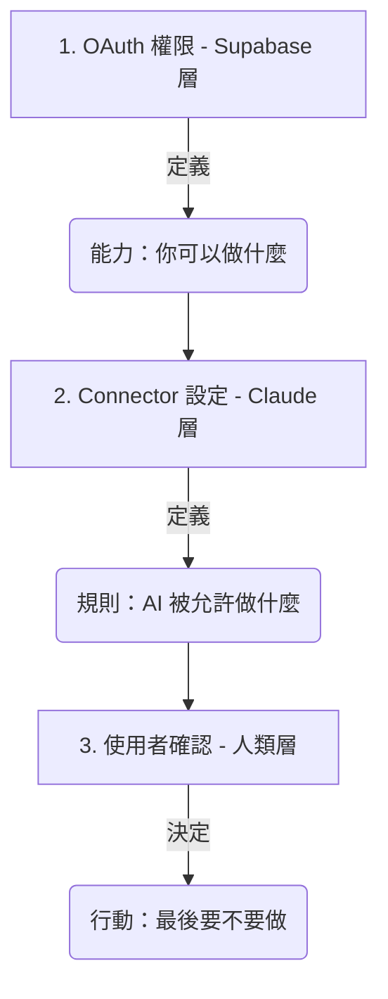

# OAuth 2.0 授權機制與安全控解

在 AI 與雲端服務整合的世界中，**OAuth 2.0** 是最核心的安全標準。它讓 Claude 能夠在「不得知您密碼」的前提下，獲得您的授權來存取特定的資料。

這份文件將以 **Supabase** 為例，深入探討 OAuth 的運作方式，以及它如何與 Claude 內部的安全控管機制協作。

---

## 為什麼需要 OAuth？（代客泊車的比喻）

想像您將車交給**代客泊車員**：
- **傳統做法（不安全）**：您交出整串鑰匙（包含家門、保險箱鑰匙）。他可以開走您的車，甚至進去您的家。
- **OAuth 做法（安全）**：您交給他一把「泊車專用鑰匙」。這把鑰匙**只能發動車子**，且**不能開後車廂**，並在**一小時後失效**。

在 Connectors 的情境中：
- **您**：車主。
- **Claude**：代客泊車員。
- **Supabase / Google**：汽車與停車場。
- **Access Token (存取權杖)**：那把限權、限時的專用鑰匙。

---

## 為什麼 Connectors 能運作？（技術底層的對接）

Connectors 之所以能建立連線，是因為兩端在技術規範上達成了「完美的對接」：

### 1. Claude Desktop 作為「OAuth Client」
**Claude Desktop** 內建了符合標準的 OAuth 客戶端功能。它懂得如何發起授權請求、開啟瀏覽器引導您登入、並安全地接收與存取授權後的「權杖 (Token)」。

### 2. Supabase 作為「OAuth Server」
**Supabase** 不僅僅是個資料庫，它還提供了完整的 OAuth 伺服器功能（基於 GoTrue/Auth 模組）。它能提供登入介面、驗證您的身分、確認授權範圍 (Scopes)，並最終核發鑰匙給 Claude。

---

## 🔐 Access Token 儲存在哪裡？

當您完成授權後，Access Token 會被儲存在您的**本地裝置**中。

| 作業系統 | 儲存位置 | 安全機制 |
| :--- | :--- | :--- |
| **macOS** | **鑰匙圈 (Keychain Access)** | 使用系統級硬體加密保護。 |
| **Windows** | **認證管理員 (Credential Manager)** | 整合 Windows 帳戶權限保護。 |
| **Linux / 其他** | **加密後的本地設定檔** | 通常位於 `~/.claude/` 目錄。 |

---

## 🔍 如何在 Supabase 查詢與管理授權？

如果您想管理目前發出的授權，可以透過 Supabase 後台進行以下操作：

### 1. 管理「已授權應用程式」(Authorized Apps)
這是使用者最常用的管理畫面，可以看到哪些第三方 App 拿到了您的權限。
- **路徑**：`Organization Settings` -> `Authorized apps`。
- **常見現象：為什麼會出現兩個 Claude？**
    - 當您在 Claude Desktop 連結、中斷、又重新連結時，會產生兩次不同的授權記錄。
    - **中斷連結 (App 端)**：通常只是刪除您電腦上的鑰匙。
    - **撤銷授權 (Supabase 端)**：必須在 Authorized apps 畫面點擊**垃圾桶圖示 (Delete)**。這才會真正讓該次核發的鑰匙失效。
- **建議**：定期清理舊的連線記錄（參考 AUTHORIZED 授權時間），只保留最新的一筆。

### 2. 審計授權紀錄 (Audit Logs)
- **路徑**：`Logs` -> `Auth`。
- **觀察**：尋找 `token_issued` 事件。這會顯示核發權杖的精確時間與 IP。

### 3. 開發者層級管理 (OAuth Apps)
- **路徑**：`Project Settings` -> `Authentication` -> `OAuth Apps`。
- **用途**：如果您是開發者，在此管理您自己建立的 Client ID 與 Redirect URIs。

---

## 核心重點：OAuth Scope vs. Claude Connector 控管

### 🧠 一句話總結
- **OAuth Scope**：決定 Claude 「**技術上能不能做**」。
- **Connector 設定**：決定 Claude 「**行為上願不願意幫你做**」。

---

## 🎯 教學用的三層安全模型

1.  **OAuth (Supabase)**：賦予 AI 「能力」。
2.  **Claude Connector**：設定 AI 的「行為限制」。
3.  **使用者確認 (Human-in-the-loop)**：人進行「最後把關」。

---

## 🔥 技術對接總結

- **Claude Desktop** = OAuth Client（發起者）
- **Supabase** = OAuth Server（驗證者）
- **中斷連結 ≠ 撤銷授權**：若要徹底斷開，請至 Supabase **Authorized apps** 點擊垃圾桶。

---

← [返回 Connectors README](./README.md)
