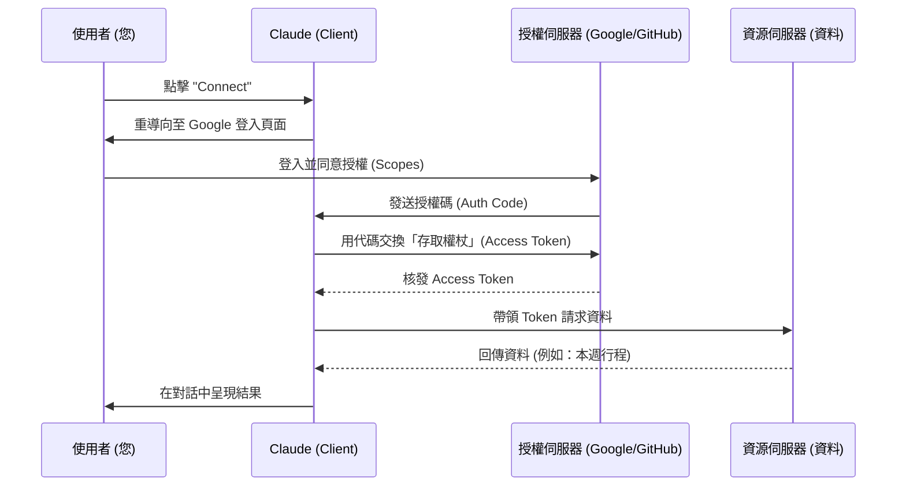

# OAuth 2.0 授權機制詳解

在 AI 與雲端服務整合的世界中，**OAuth 2.0** 是最核心的安全標準。它讓 Claude 能夠在「不得知您密碼」的前提下，獲得您的授權來讀取特定的資料。

---

## 為什麼需要 OAuth？（代客泊車的比喻）

想像您去餐廳吃飯，將車交給**代客泊車員**：
- **傳統做法（不安全）**：您把整串鑰匙（包含家門鑰匙、保險箱鑰匙）交給他。他可以開走您的車，甚至進去您的家。
- **OAuth 做法（安全）**：您交給他一把「泊車專用鑰匙」。這把鑰匙**只能發動車子**，且**不能開後車廂**，並在**一小時後失效**。

在 Connectors 的情境中：
- **您**：車主。
- **Claude**：代客泊車員。
- **Google / GitHub**：汽車與停車場。
- **Access Token (存取權杖)**：那把限權、限時的專用鑰匙。

---

## OAuth 的四大角色

| 角色 | 專業術語 | 在 Claude Connectors 中是誰？ |
| :--- | :--- | :--- |
| **資源擁有者** | Resource Owner | **您**（擁有 Google 帳號或 GitHub 帳號的人）。 |
| **客戶端** | Client | **Claude (Anthropic)**（想要存取資料的應用程式）。 |
| **授權伺服器** | Authorization Server | **Google/GitHub 的登入系統**（負責核發鑰匙）。 |
| **資源伺服器** | Resource Server | **Gmail / GitHub API**（存放您實際資料的地方）。 |

---

## 運作流程圖 (The OAuth Dance)

---

## 關鍵術語解釋

### 1. 範圍 (Scopes)
這是 OAuth 最重要的安全機制。它定義了應用程式「可以做什麼」。
- `google.calendar.readonly`：只能讀取日曆。
- `google.calendar.events`：可以讀取並編輯。
- **建議**：在使用 Connector 時，請務必檢查授權頁面上列出的 Scopes，確保沒有過度授權。

### 2. 存取權杖 (Access Token)
這是一串亂碼字串，充當數位通行證。它有時效性，過期後 Claude 必須重新請求（或使用 Refresh Token）來維持連線。

### 3. 重導向 (Redirect URI)
授權完成後，網頁會自動跳轉回來的網址（例如 `claude.ai`）。這確保了「鑰匙」只會發送回正確的應用程式。

---

## 安全性優勢

1.  **密碼隔離**：您不需要在 Claude 輸入 Google 密碼。
2.  **權限最小化**：可以只給予「讀取」權限，而不給予「刪除」權限。
3.  **可隨時撤銷**：您可以前往 [Google 帳號安全性設定](https://myaccount.google.com/permissions) 隨時斷開連線，而不需要更改密碼。
4.  **連線透明**：每一次存取都有日誌記錄，提高企業端管理的安全性。

---

← [返回 Connectors README](./README.md)
