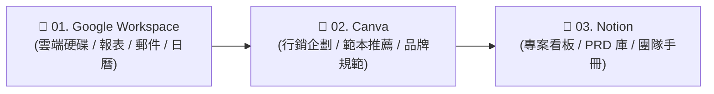

# Connectors（連接器）：打通雲端服務與組織數據的 AI 橋樑 🔌

> 專為職場專業人士與知識工作者設計，學習如何透過官方雲端連接器（Connectors），讓 Claude 安全連線至 **Google Workspace**、**Canva** 與 **Notion**，告別無休止的複製貼上與檔案搬運，建立自動化資料高速通道。

---

## 💡 為什麼你需要 Connectors？

在沒有連接器之前，你的日常 AI 工作流程充滿了瑣碎的「人肉搬運」痛點：
- **下載又上傳**：從 Google Drive 下載報表 ➔ 拖進對話框 ➔ 關掉對話後下次又要再下載一次。
- **視窗切換地獄**：開著郵件複製內容、開著日曆查空檔、開著 Notion 找規格，手忙腳亂。
- **設計與文案斷層**：在 AI 產生了行銷文案，卻要手動打開 Canva 一個字一個字貼上、手動翻找符合風格的範本。

```mermaid
graph LR
    subgraph 傳統手動搬運 ❌
        S1["☁️ 雲端服務<br/>(Drive / Gmail / Notion)"] -->|手動下載 / 複製| PC["💻 個人電腦剪貼簿"]
        PC -->|手動上傳 / 貼入| C1["💬 Claude 聊天室"]
    end

    subgraph Connectors 智能直連 ✅
        S2["☁️ 雲端服務<br/>(Google / Canva / Notion)"] <===>|OAuth 2.0 安全雙向通道| C2["🤖 Claude 智能核心<br/>(自動檢索 / 分析 / 排版 / 更新)"]
    end
```

| 比較維度 | 傳統手動搬運 ❌ | 使用 Connectors 直連 ✅ |
|:---|:---|:---|
| **跨文件搜尋** | 手動翻找資料夾、下載多份檔案逐一上傳 | **自然語言一句話：「搜尋 Drive 裡 Q1 的客訴報表」** |
| **即時通訊與郵件** | 複製信件內文 ➔ 貼給 AI ➔ 複製回信草稿貼回信箱 | **Claude 直接讀取 Gmail 收件匣並自動擬妥回覆草稿** |
| **設計視覺化** | 複製文案 ➔ 打開 Canva 搜尋範本 ➔ 手工排版換色 | **一鍵匹配 Canva 範本，注入文字並生成直達設計連結** |
| **團隊知識與看板** | 在 Notion 各頁面間迷航，肉眼比對任務關聯 | **直接跨 Notion Database 查詢 PRD 狀態與 Blocker** |

---

## 🟢 方案需求與規格建議

- **Free 帳號**：可免費使用 Google Workspace、Canva、Notion 等官方雲端連接器，享有基礎工具調用額度。
- **Pro / Max 帳號**：享有高達 5 倍以上的訊息用量額度與運算優先級，適合處理大量雲端文件與高頻率跨系統呼叫。
- **Team / Enterprise 帳號**：支援組織級集中管理、SSO 單一登入、統一網域白名單與完整 Audit Log 稽核日誌。

---

## 🧠 Connectors 四維安全運作架構

一個健全的 Claude 連接器整合體系，由四大安全基石所支撐：

```text
🔌 Claude Connectors 整合體系
├── 1. OAuth 2.0 授權機制（通行證）
│   └── 無需暴露密碼，透過權限代碼（Token）進行限時、限權之雲端存取
├── 2. Remote MCP 協議（通訊語言）
│   └── 依據 Model Context Protocol 標準，將雲端 API 轉換為模型可理解的 Tools
├── 3. Tool Permissions（治理閘門）
│   └── 支援 Allow（放行）、Ask（每次確認）、Deny（禁用）三級防護
└── 4. Project-Level Attachment（專案隔離）
    └── 可在不同 Project 沙盒中獨立開啟所需連接器，避免 Context 污染與 Token 浪費
```

---

## 📚 Connectors 核心技術與安全深度指南

在正式連線外部系統前，建議先閱讀以下深度技術指南，建立完整的雲端資料安全防護意識：

* 🔐 **[01. OAuth 2.0 授權機制與雲端隱私安全指南](./Guide/01_OAuth_and_Security.md)**  
  *深入解析授權碼流程（Auth Code Flow）、Token 儲存機制、最小授權原則與隨時撤銷連線技巧。*
* 🚦 **[02. 工具權限分級（Tool Permissions）與企業級治理架構](./Guide/02_Tool_Permissions_and_Governance.md)**  
  *剖析 Allow / Ask / Deny 三級管控策略、防範間接提示詞注入（Indirect Prompt Injection）與人機協作安全閉環。*
* 🏗️ **[03. 雲端連接器 (Connectors) vs 本地端 MCP (Local MCP) 架構評估與成本決策](./Guide/03_Connectors_vs_Local_MCP.md)**  
  *比較雲端託管與本機環境的優缺點，揭密 Tool Definitions 對 System Prompt Token 開銷的影響與最佳配置策略。*

---

## 🧪 10 分鐘快速實作：親身體驗「直連 vs 搬運」

本實作以**「查詢最新產品滿意度與客訴」**為例，透過 Before / After 的直接對照，讓您在 10 分鐘內親身感受 Connectors 如何省去重複下載與檔案搬移。

---

### 📥 步驟 0：下載實測練習檔案（偽檔案）
請先下載下方這份極度仿真的營運分析表（零個資疑慮，放心使用）：
- 📊 [**星橋科技_2026年度產品營運與客戶滿意度分析表.csv**](./01_Google_Workspace/sample_files/星橋科技_2026年度產品營運與客戶滿意度分析表.csv)

---

### ❌ 步驟 1：傳統方式（Before：手動搬運）
1. 開啟一般對話，在電腦裡找到剛才下載的 CSV 檔案。
2. 手動將檔案拖入對話框，輸入指令：
   ```text
   請告訴我 2026 年哪一季的客戶滿意度最低？主要客訴原因是什麼？
   ```
> 📉 **痛點體驗**：  
> 當您明天開了一個新對話，想要再問：「那這項產品在 Q4 的營收是多少？」，您又必須**再手動上傳一次檔案**！對話一多，電腦下載區塞滿重複檔案。

---

### ⚙️ 步驟 2：啟用 Connectors 直連（After）
1. 將下載的 `星橋科技_2026年度產品營運與客戶滿意度分析表.csv` 上傳到您的 [Google Drive](https://drive.google.com)。
2. 在 Claude.ai 點選 **Settings ➔ Connectors ➔ 找到 Google Workspace 點擊 Connect** 完成授權。
3. 回到 Claude 開啟全新對話，**完全不附帶任何檔案**，直接提問：
   ```text
   請搜尋我 Google Drive 裡的「星橋科技_2026年度產品營運與客戶滿意度分析表」，告訴我全年度客戶滿意度最低的產品是哪一項？主要客訴原因是什麼？
   ```

> 🚀 **執行結果（效果見證）**：  
> Claude 自動調用 Google Drive 搜尋工具，在 3 秒內精準回覆：「微電網網關（BridgeGrid-X）在 Q1 滿意度最低（4.1 分），主要原因為 Modbus 協議相容性問題」。  
> **您的雲端硬碟正式成為 Claude 的外掛知識大腦，隨時提問、即時穿透讀取！**

---

## 🚀 三大主軸實戰次章節矩陣

本模組精選職場最核心的三大雲端生態系，規劃了三個由淺入深的實戰次章節。每個次章節皆自帶獨立目錄、Step-by-Step 操作說明、實測提問 Prompt，以及**完整的實體偽檔案（Mock Sample Files）**供您直接下載演練：



| 次章節模組 | 適合對象 | 配套偽檔案清單（點擊直接檢視/下載） | 核心實戰學習亮點 |
| :--- | :--- | :--- | :--- |
| [📂 **01. Google Workspace 實戰**](./01_Google_Workspace/README.md) | 營運主管<br>行政特助<br>專案經理 | 📊 [產品營運與滿意度分析表.csv](./01_Google_Workspace/sample_files/星橋科技_2026年度產品營運與客戶滿意度分析表.csv)<br>📄 [海外擴展策略備忘錄.md](./01_Google_Workspace/sample_files/星橋科技_2026年度產品策略與海外擴展備忘錄.md)<br>📬 [模擬客戶郵件與行事曆日程.md](./01_Google_Workspace/sample_files/模擬客戶郵件與行事曆日程資料.md) | 跨文件語意比對（Docs + Sheets 交叉分析）、緊急客訴郵件辨識與日文/中文雙語回信草擬、行事曆重疊衝突智慧調配。 |
| [🎨 **02. Canva 設計自動化**](./02_Canva/README.md) | 社群行銷企劃<br>內容創作者<br>視覺設計師 | 📄 [夏季新品行銷企劃規格書.md](./02_Canva/sample_files/山嵐茶飲_2026夏季新品行銷企劃與視覺規格書.md)<br>🎨 [品牌視覺規範與色彩配置表.json](./02_Canva/sample_files/山嵐茶飲_品牌視覺規範與色彩配置表.json)<br>📝 [新品社群文案庫與排版草案.md](./02_Canva/sample_files/夏季新品社群文案庫與排版草案.md) | 文案一鍵搜尋匹配 Canva 商業簡報（Pitch Deck）、Instagram 貼文自動套用 Brand Kit 品牌色票、直立限動海報版型生成與直達編輯連結。 |
| [📝 **03. Notion 知識庫與專案管理**](./03_Notion/README.md) | 產品經理 (PM)<br>工程主管<br>敏捷教練 | 📊 [產品需求規格庫_PRD.csv](./03_Notion/sample_files/星橋科技_產品需求規格庫_PRD.csv)<br>📋 [團隊任務看板_Sprint_Tasks.csv](./03_Notion/sample_files/團隊任務與衝刺看板_Sprint_Tasks.csv)<br>📑 [工程與設計協作手冊.md](./03_Notion/sample_files/星橋科技_工程與設計協作手冊_Engineering_Handbook.md) | 一鍵匯入 CSV 生成標準 Notion Database、跨資料庫多對多關聯排查、P0 級阻礙任務（Blocker）自動挖掘、依據內部手冊自動產生標準 PRD。 |

---

## 🔍 配套偽檔案檢查清單（Checklist）

為確保每位學員在沒有企業真實私有資料的情況下，依然能 100% 順暢走完所有範例，本章節所有偽檔案均已完成以下驗證：

- [x] **格式相容性**：所有 `.csv` 均採用標準 UTF-8 編碼與逗號分隔，可被 Google Sheets、Excel 與 Notion 一鍵完美解析。
- [x] **情境一致性**：虛擬案例貫穿「星橋科技（硬體/微電網）」與「山嵐茶飲（生活品牌）」，數據與故事環環相扣。
- [x] **零外部相依**：所有偽檔案均儲存於本倉庫各次章節的 `sample_files/` 目錄中，離線或線上皆可隨時取用。
- [x] **去識別化安全**：所有姓名、電子郵件（`.example.com`）、電話與數據皆為虛構，符合嚴格資訊安全規範。

---

## 🖥️ 管理面板狀態速查

在 Claude Desktop 或網頁版的 `Settings -> Connectors` 中：

| 狀態圖示 | 意義說明 | 建議處置 |
| :---: | :--- | :--- |
| **`✓ Connected`** | 連接器已成功認證，工具正常載入 | 可直接在對話中下達調用指令 |
| **`Connect` 按鈕** | 處於未連線狀態 | 點擊按鈕完成 OAuth 登入授權 |
| **`⚠️ Connection issue`** | 授權憑證到期或連線超時 | 點擊重新登入授權或檢查遠端網路狀態 |
| **`—`（破折號）** | 本機端 Extension 尚未在設定中啟用 | 前往 `Settings -> Extensions` 開啟權限 |

---

← [返回上層：Claude_AI 導覽總索引](../README.md) · [前往次章節 1：Google Workspace 實戰](./01_Google_Workspace/README.md)