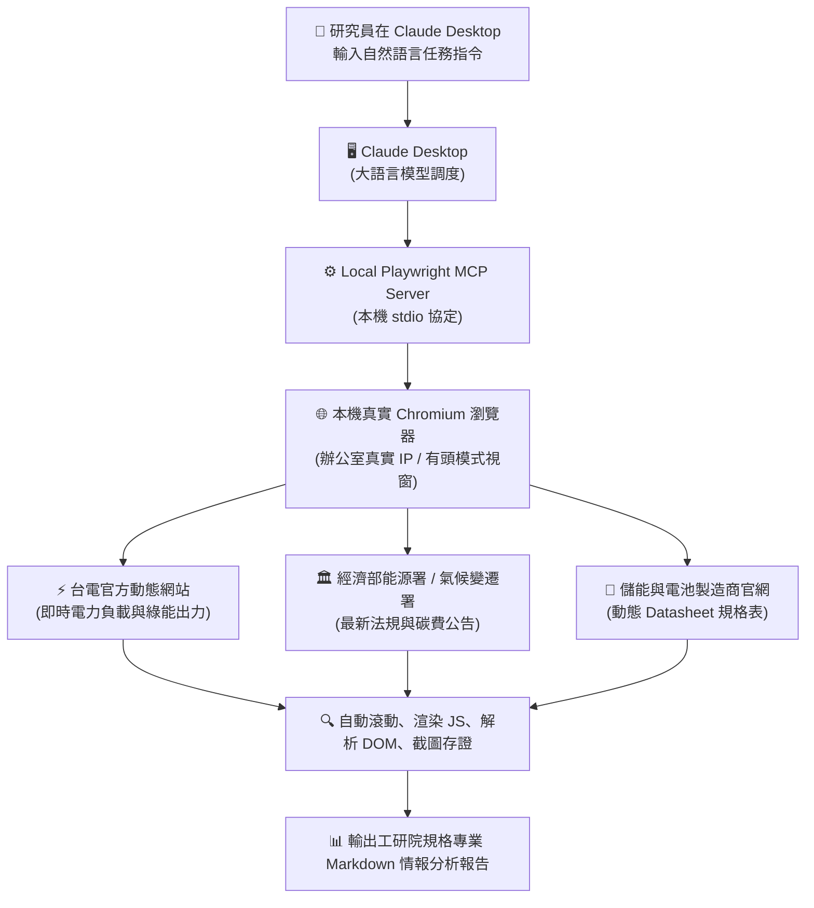

# 🌿 實戰範例：工研院綠能所 Playwright MCP 本地自動化爬蟲與動態情報調研

> 📌 **適用情境**：台電即時電力資訊爬取、能源署/氣候變遷署動態公告追蹤、無 API 綠能網站儀表板截圖存證  
> 🛠️ **核心工具**：Claude Desktop + `playwright` Local MCP Server  
> 💼 **適用角色**：電力系統研發人員、電網韌性分析師、淨零碳排政策幕僚、綠能與儲能技術評審  

---

## 📑 本篇目錄

1. [為什麼綠能所研究員使用 Playwright MCP「特別有感」？](#-為什麼綠能所研究員使用-playwright-mcp特別有感)
2. [本地運作架構圖與運作流程](#-本地運作架構圖與運作流程)
3. [前置準備與環境確認](#-前置準備與環境確認)
4. [三階段實作演練任務](#-三階段實作演練任務)
   - [任務 A：台電即時電力供需與再生能源佔比監控（電網調度）](#-任務-a台電即時電力供需與再生能源佔比監控)
   - [任務 B：主管機關淨零政策與碳費法規追蹤（法規幕僚）](#-任務-b主管機關淨零政策與碳費法規追蹤)
   - [任務 C：儲能新創官網動態規格解析與截圖存證（技術審查）](#-任務-c儲能新創官網動態規格解析與截圖存證)
5. [預期交付成果展示範例](#-預期交付成果展示範例台電今日電力資訊)
6. [實作驗證檢核清單（Checklist）](#-實作驗證檢核清單checklist)
7. [綠能所研究員實務技巧與常見問題 (FAQ)](#-綠能所研究員實務技巧與常見問題-faq)

---

## 💡 為什麼綠能所研究員使用 Playwright MCP「特別有感」？

工研院綠能所同仁在進行電網監控、法規研析與新創評估時，傳統工具（靜態 Python 爬蟲、Curl、雲端 AI 網頁版）常面臨**動態渲染失敗**與**機關 IP 阻擋**等瓶頸：

### 傳統困境 vs. 本地 Playwright MCP 解決方案

| 比較維度 | 傳統工具困境（靜態爬蟲 / 雲端 AI 網頁版） | Playwright 本地 MCP 解決方案 | 綠能所研究員實務效益 |
| :--- | :--- | :--- | :--- |
| **動態網頁渲染** | 動態 JS/圖表加載不完全，僅抓到空白骨架或載入中動畫 | 本機啟動真實 Chromium，完整渲染複雜圖表與動態數據 | 台電即時發電量與負載動態圖表 100% 準確抓取 |
| **網路連線權限** | 海外雲端伺服器 IP 易遭政府機關或電力單位防火牆阻擋 | 直接以研究員辦公室本機真實網路與 IP 權限發送請求 | 徹底突破雲端白名單限制，國內公部門網站暢行無阻 |
| **視覺紀錄存證** | 缺乏視覺存證，即時數據瞬息萬變，事後口說無憑 | 支援有頭模式自動滾動網頁，精準執行高解析度截圖 | 瞬時備轉容量率與法規公告具備截圖佐證，眼見為憑 |
| **使用技術門檻** | 需手寫維護 Selenium/Python 程式碼，非資訊同仁門檻高 | 全程使用自然語言下指令，Claude 自動驅動瀏覽器操作 | 零程式碼門檻，研究員 5 秒內即可產出結構化專業報告 |

---

## 🏗️ 本地運作架構圖與運作流程



---

## 🛠️ 前置準備與環境確認

在開始實測前，請確認您的電腦已完成以下配置：

1. **已安裝 Claude Desktop**：已下載安裝電腦桌面版。
2. **已設定 Playwright MCP**：在 `claude_desktop_config.json` 的 `mcpServers` 區塊已加入：
   ```json
   {
     "mcpServers": {
       "playwright": {
         "command": "npx",
         "args": ["@playwright/mcp@latest"]
       }
     }
   }
   ```
3. **確認服務狀態**：開啟 Claude Desktop，點擊右下角設定或輸入框旁的工具圖示，確認 `playwright` 呈現連線綠燈狀態。

---

## 📝 三階段實作演練任務

---

### 🔹 任務 A：台電即時電力供需與再生能源佔比監控

* **角色定位**：電力系統調度專家、電網韌性分析師
* **情境說明**：自動造訪台電官網，等待 JavaScript 動態圖表計算完畢，擷取今日負載、最大供電能力、備轉容量率燈號與風光出力。

#### 1. 自然語言口語輸入（點擊直接複製）：

```markdown
請使用 Playwright MCP 幫我造訪台灣電力公司「今日電力資訊」網頁（https://www.taipower.com.tw）：
1. 開啟頁面並等待動態負載與發電數據完全載入。
2. 擷取目前用電量 (MW)、最大供電能力 (MW)、備轉容量率 (%) 與太陽能/風力發電量。
3. 整理成「今日即時電力供需狀況報告」Markdown 表格，
   並從工研院綠能所角度提出 2 點儲能調度觀察。
```

#### 2. 進階結構化提示詞（點擊展開）：

<details>
<summary><b>點擊展開：進階 RTCCF 結構化提示詞</b></summary>
<br>

```markdown
## Role
你是一名任職於工研院綠能所的**資深電力系統調度專家**與**電網韌性分析師**。

## Task
請調用本機 **Playwright MCP** 啟動 Chromium 瀏覽器，造訪台灣電力公司官方網站（`https://www.taipower.com.tw`）之「今日電力資訊」儀表板，完成動態數據解析與電網情勢研判：
1. 等待網頁動態 JavaScript 與負載圖表完全渲染加載完成。
2. 精確擷取以下 4 組核心電網指標：
   - **目前用電量 (MW)** 與 **預估最高用電量 (MW)**
   - **目前最大供電能力 (MW)**
   - **目前備轉容量率 (%)** 與 **供電充裕燈號狀態**
   - **再生能源即時出力**（**太陽光電** 與 **風力發電** 之即時發電量 MW 與發電佔比）
3. 整理成結構完整的 Markdown 監控表格，並依據工研院綠能所專業角度，提出 2 點電網調度與儲能快速反應資源之評估建議。

## Context
- 目標機構：台灣電力公司 (Taipower)
- 官方網址：`https://www.taipower.com.tw`
- 執行工具：本機 Playwright Local MCP（有頭模式，支援真實動態圖表渲染）

## Constraint
- 必須確保 Highcharts/ECharts 數據完全載入完畢，嚴禁在骨架畫面未完成時提早擷取。
- 所有 MW 數據與百分比必須精確對齊畫面當前數值，**嚴禁憑空推估**。
- 使用**繁體中文**輸出。

## Format
輸出標準 Markdown 專業情資報告：
1. **今日即時電力供需與再生能源出力總覽表**
2. **工研院綠能所電網調度與儲能應對專家觀察（2 點策略解析）**
```

</details>

---

### 🔹 任務 B：主管機關淨零政策與碳費法規追蹤

* **角色定位**：淨零政策法規幕僚、永續轉型資深研究員
* **情境說明**：針對碳費徵收標準、示範儲能補助要點與地熱獎勵，自動至氣候變遷署或能源署搜尋最新一個月公告，產出政策衝擊矩陣。

#### 1. 自然語言口語輸入（點擊直接複製）：

```markdown
請使用 Playwright MCP 造訪環境部氣候變遷署（https://cca.moenv.gov.tw）或經濟部能源署（https://www.moeaea.gov.tw）最新消息區：
1. 搜尋近一個月內關於「碳費徵收機制」、「儲能系統示範」或「地熱發電獎勵」的最新公告。
2. 擷取最新 3 筆關鍵公告的發布日期、主管機關/政策名稱與核心條文/要點。
3. 製作 Markdown 摘要表格，並列出對能源產業的衝擊與工研院綠能所的因應建議。
```

#### 2. 進階結構化提示詞（點擊展開）：

<details>
<summary><b>點擊展開：進階 RTCCF 結構化提示詞</b></summary>
<br>

```markdown
## Role
你是一名工研院綠能所的**淨零政策法規幕僚**與**永續轉型資深研究員**。

## Task
請調用本機 **Playwright MCP** 造訪環境部氣候變遷署（`https://cca.moenv.gov.tw`）或經濟部能源署（`https://www.moeaea.gov.tw`）最新消息公開專區，執行最新淨零法規動態情報檢索：
1. 檢索近一個月內與 **碳費徵收機制**、**儲能系統示範** 或 **地熱發電獎勵** 相關的最新行政命令與法規公告。
2. 篩選出最具政策影響力的 **最新 3 筆重大公告**，精準擷取：
   - **發布日期**
   - **主管機關與政策/要點完整名稱**
   - **核心條文要旨與補助/費率標準**
3. 製作 Markdown 結構化政策摘要矩陣，並針對每項法規提出工研院綠能所研發端之因應策略。

## Context
- 目標主管機關：環境部氣候變遷署 / 經濟部能源署
- 執行工具：本機 Playwright Local MCP（突破海外伺服器 IP 白名單阻擋，以本機真實網路直連）

## Constraint
- 每一筆公告必須附帶真實政策名稱與官方來源連結。
- 因應行動需具體對齊綠能科技研發路徑，切忌空泛口號。
- 使用**繁體中文**輸出。

## Format
輸出標準政策情報快報：
1. **近期重大淨零法規與儲能政策彙整表**
2. **產業衝擊影響與工研院研發端 3 大因應建議**
```

</details>

---

### 🔹 任務 C：儲能新創官網動態規格解析與截圖存證

* **角色定位**：儲能硬體評測專家、新能源技術審查委員
* **情境說明**：針對特定儲能廠商動態規格頁（Datasheet），自動滾動並高解析度截圖存證，解析電池類型、C-rate 與 UL 9540A 延燒認證。

#### 1. 自然語言口語輸入（點擊直接複製）：

```markdown
請使用 Playwright MCP 造訪指定的新能源/儲能系統技術官網（例如特定儲能或電芯廠商官網）：
1. 開啟產品介紹頁面，向下滾動確保動態 JS 渲染的規格參數表（Datasheet）完全載入。
2. 對產品外觀與核心規格區塊進行網頁截圖保存。
3. 提煉該系統的核心技術參數（電池技術類型、容量、C-rate、循環壽命、UL 9540A 認證）。
4. 依工研院技術審查標準，產出一份「儲能技術初步審查速報」。
```

#### 2. 進階結構化提示詞（點擊展開）：

<details>
<summary><b>點擊展開：進階 RTCCF 結構化提示詞</b></summary>
<br>

```markdown
## Role
你是一名工研院綠能所的**儲能硬體評測專家**與**新能源技術評估審查委員**。

## Task
請調用本機 **Playwright MCP** 造訪目標儲能設備或電芯製造商官方網站，執行技術規格深度解析與存證截圖：
1. 導航至目標產品頁面，模擬滾動網頁（Scroll），確保動態 JavaScript 渲染之 **Datasheet 規格參數表** 完整加載。
2. 對關鍵產品架構圖與技術規格表區域執行 **高解析度網頁截圖存證**。
3. 結構化提煉該儲能系統的核心規格指標：
   - **電芯技術路線**（LFP / NMC / 全固態 / 釩液流等）
   - **系統額定容量 (kWh/MWh)**、**充放電倍率 (C-rate)** 與 **預期循環壽命 (Cycles)**
   - **國際安全安規認證**（**UL 9540**、**UL 9540A 延燒測試**、**IEC 62619**、**CNS 62933**）
4. 依照工研院科研評審規範，完成技術可行性與安全合規初步診斷。

## Context
- 調研對象：國內外儲能系統或電芯新創廠商官方網站
- 執行工具：本機 Playwright Local MCP（支援有頭模式滾動與視覺截圖存證）

## Constraint
- 規格數據必須精準萃取自官方技術白皮書或規格表，缺乏之欄位標註為 **待補件 (TBD)**。
- 安全規範判定須明確對齊國際標準，特別標註是否具備機櫃級延燒報告。
- 使用**繁體中文**輸出。

## Format
輸出包含以下兩大部分之 Markdown 技術評審速報：
1. **儲能新創系統關鍵規格參數與安全認證盤點總表**
2. **工研院綠能所技術成熟度與安全合規初步審查結論**
```

</details>

---

## 📋 預期交付成果展示範例（台電今日電力資訊）

執行任務 A 後，Claude 將自動回傳類似以下的結構化專業情報：

### 1. 今日即時電力供需與再生能源出力總覽表

| 電網營運指標 | 即時數值 | 單位 | 狀態 / 備註說明 |
| :--- | :---: | :---: | :--- |
| **目前用電量** | 33,420 | MW | 尖峰時段負載高點 |
| **目前最大供電能力** | 38,150 | MW | 系統全開供電能力 |
| **預估最高用電量** | 34,200 | MW | 預計發生於 14:00 - 15:30 |
| **目前備轉容量率** | **14.15%** | % | 🟢 綠燈（供電充裕系統無虞） |
| **太陽光電即時出力** | 5,820 | MW | 佔總發電量約 17.4% |
| **風力發電即時出力** | 1,120 | MW | 佔總發電量約 3.3% |

> 🕒 **資料擷取時間**：`2026-09-13 13:45:10 (GMT+8)`  
> 🌐 **資料來源**：台灣電力公司今日電力資訊官方儀表板

### 2. 工研院綠能所電網調度與儲能應對專家觀察

1. **日間「鴨子曲線」腹部擴大，需強化雙向削峰填谷能力**：  
   正午光電發電量已突破 5.8 GW，系統備轉充裕；但傍晚 16:30 至 18:30 光電快速退場時，系統淨負載爬升斜率極陡，建議加速推進 E-dReg 儲能電站雙向調度測試。
2. **風光瞬時波動因應**：  
   風電受沿海陣風影響瞬時波動約 ±150 MW，可由本機即時監控數據驅動自動化告警，輔助調度員快速配置 dReg 0.25 快速反應儲能資源。

---

## ✅ 實作驗證檢核清單（Checklist）

完成演練時，請逐一勾選確認以下項目：

- [ ] **MCP 服務連線正常**：在 Claude Desktop 中確認 `playwright` 狀態顯示為綠色或藍色正常連線。
- [ ] **真實瀏覽器視窗彈出**：下達指令後，電腦桌面上能看到真實 Chromium 視窗啟動並自動前往目標網站。
- [ ] **動態圖表成功解析**：成功等待 JavaScript 動態資料完全加載，未出現資料空白或骨架畫面。
- [ ] **視覺截圖存證有效**：Playwright 自動滾動並產出解析度清晰之關鍵儀表板或規格截圖。
- [ ] **結構化專業報告產出**：Claude 將數據整理為 Markdown 專業報告，並附帶具體技術與法規評估建議。

---

## 💡 綠能所研究員實務技巧與常見問題 (FAQ)

> [!TIP]
> ### 1. 為什麼建議保持「有頭模式（Headed Mode）」？
> 預設有頭模式下，瀏覽器會在桌面上即時彈出。研究員能親眼看見台電或政府網站當前的即時數據，確保 AI 擷取的數據與真實畫面 100% 一致，杜絕 AI 幻覺，符合科研嚴謹度要求。

> [!TIP]
> ### 2. 遇到政府網站驗證碼（CAPTCHA）或公文憑證登入怎麼辦？
> 由於視窗是直接跑在您本機上，若遇到驗證碼或需要智慧卡/公文憑證登入時，您可以**直接在彈出的瀏覽器視窗手動完成驗證**，隨後在 Claude 輸入：「我已完成登入，請繼續後續資料抓取」，Claude 就會順暢接手後續自動化解析！

> [!TIP]
> ### 3. 如何將爬取資料延伸至其他研發工作流？
> 爬取到的法規或規格數據，可無縫銜接其他工研院工具鏈：
> - 丟給 [綠能專案技術摘要與規格評核專家](../../Skills/ITRI_Creator/README.md) 自動產出科研技術白皮書。
> - 透過 [風電技術評估 PPTX Skill](../../Skills/GWorkspace/05_ITRI_Green_Energy_PPTX/README.md) 一鍵生成高階主管會報簡報。

---

← [返回 Local MCP 主手冊](../README.md)
