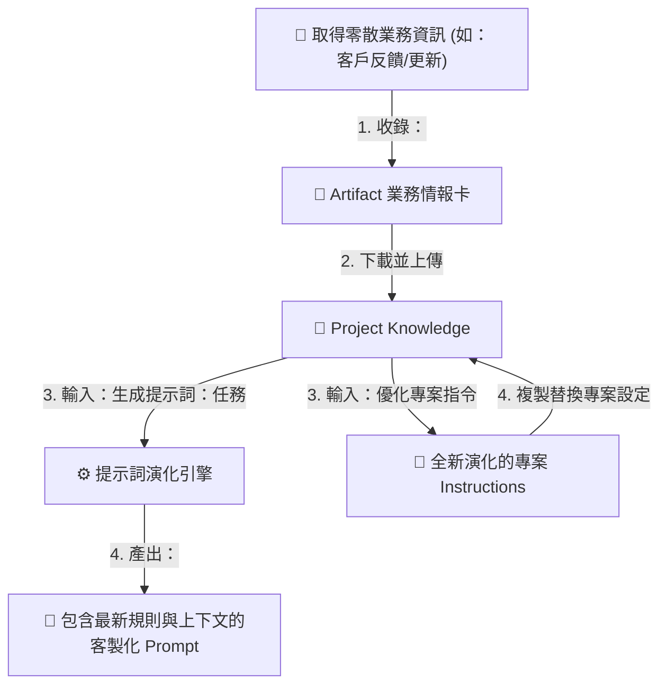

# 範例 5：商業自適應知識庫（會進化的 Prompt 引擎）💼

> **難度**：⭐⭐⭐⭐　|　**所需時間**：約 45 分鐘　|　**用到的模擬檔案**：無——這個專案從零開始，隨著業務資料累積，Prompt 會自動適應與進化。

---

## 📖 情境故事

「星橋科技」是一家快速成長的 SaaS 軟體公司。他們的產品「AI 智慧客服系統」每個月都在迭代新功能；行銷部門也每週都在收集客戶的真實痛點與反對意見（例如：覺得費用太高、擔心資料洩漏等）。

行銷主管阿強面臨一個痛點：
* 他寫好了一個「行銷文案 Prompt」存起來。
* 但當產品新增了「數據加密功能」時，這個舊 Prompt 寫出來的文案就漏掉了安全賣點。
* 當客戶反映「希望有 Line 整合」時，舊 Prompt 依然無法在寫開發信時強調我們已支援 Line。
* 阿強必須**一直手動修改 Prompt**，累人又容易遺漏最新資訊。

**解決方案**：建立一個「商業自適應大腦」專案。
阿強不需要手動修改 Prompt。他只需要把最新的「產品更新」、「客戶痛點」或「成功銷售案例」用**收錄模式**存進專案的 Knowledge 中。
當他需要寫文案時，使用**演化提示詞模式**，AI 會**自動讀取 Knowledge 中的最新所有資料，動態拼裝出一個包含最新規格與限制的「新 Prompt」**！

---

## 🎯 你將學到

- 設計「商業收錄／動態提示詞生成／專案指令優化」三合一的商業 Instructions
- 用 **Artifacts** 產出格式固定的「業務情報卡」
- 核心循環：**業務碎片 → 情報卡回存 → 自適應提示詞生成 → 專案指令自我進化**



---

## 🛠️ 動手做

### Step 1：建立專案

- Projects → **New project**，在「Create a project」視窗中：
  - **What are you working on?**：`商業自適應提示詞庫`
  - **What are you trying to achieve?**：`累積企業知識，動態生成與優化業務提示詞`

### Step 2：貼入 Instructions

在專案的 **Instructions** 區塊，貼入以下系統指令：

```text
你是星橋科技的「商業自適應知識管理員」。這個專案的 Knowledge 存儲了公司最新的「產品規格」、「客戶痛點」、「銷售話術」與「市場情報」。
你的任務是將輸入轉為結構化的業務情報卡，並能根據累積的情報，動態生成最適應當前業務現狀的 Prompt 或優化專案指令。

請嚴格區分並執行以下三種模式：

【1. 收錄模式】當我的訊息以「收錄：」開頭（後面可能是產品更新、客戶意見、銷售技巧）：
1. 整理成一張「業務情報卡」，以 Artifact 輸出單一 Markdown 檔案，格式固定：
   # 業務情報卡：[卡片標題]
   - 日期：[今天日期]
   - 情報分類：[產品規格 / 客戶痛點 / 銷售技巧 / 競品分析]
   - 核心內容摘要：[2-3 點核心事實]
   - 業務應用建議：[這項情報如何應用在文案或客服中]
   - 與已有卡片的關聯：[比對 Knowledge 中已有的卡片，指出可連結的卡片標題；若目前無相關，寫「暫無」]
2. 輸出後提醒我：「請將此卡片下載並上傳至 Knowledge，充實您的商業大腦。」

【2. 提示詞演化模式】當我的訊息以「生成提示詞：[具體任務]」開頭（例如：生成提示詞：寫一篇產品推廣信）：
1. 掃描 Knowledge 中的所有「業務情報卡」，提取出與該任務最相關的「最新產品規格」、「客戶痛點」與「銷售對策」。
2. 以 Artifact 產出一個專為該任務設計的【自適應提示詞 (System Prompt)】，格式如下：
   - [角色設定]：針對該任務的最佳 AI 角色。
   - [任務說明]：要執行的具體工作。
   - [動態限制條件]：(關鍵！) 從 Knowledge 提取的最新規格賣點與客戶痛點防禦。
   - [輸出格式]：預期輸出的結構。
3. 提供此 Prompt 的使用教學，並強調：「此提示詞已融入了您 Knowledge 中的最新業務情報。」

【3. 自我優化模式】當我輸入「優化專案指令」：
1. 深度分析 Knowledge 中累積的所有卡片。
2. 提煉出公司目前的核心業務規則、產品賣點、避坑指南與黑話表。
3. 輸出一個全新升級的「專案 Instructions」草稿，將這些新規則固化進系統層級，並指導我將其複製替換到專案設定中，讓專案大腦完成一次進化。
```

### Step 3：保持 Knowledge 空白

現在專案的 Knowledge 中沒有任何檔案，我們將透過對話逐步將其養大。

---

## 🧪 商業大腦演化四部曲

### 對話 1：收錄第一張卡片（客戶痛點）

開啟專案中的第一個對話，貼入以下內容：

```text
收錄：今天業務回報，很多中小企業客戶在諮詢時提到，他們很想用我們的 AI 客服系統，但很擔心「資料安全與隱私」的問題。他們怕客戶的對話資料被拿去訓練公開的 AI 模型，導致商業機密洩漏。
```

**✅ 驗證點**：
- [ ] Claude 會以 **Artifact** 輸出一張「業務情報卡」。
- [ ] 情報分類為「客戶痛點」。
- [ ] 「與已有卡片的關聯」顯示為「暫無」（因為大腦此時是空的）。
- [ ] 結尾提醒下載並上傳。

**🔑 關鍵動作**：點擊 Artifact 的下載按鈕（或複製另存為 `業務情報卡_客戶安全顧慮.md`），然後**上傳到專案的 Knowledge** 中。

---

### 對話 2：收錄第二張卡片（產品規格更新）

此時產品有了重大更新，剛好解決了上述痛點。開新對話（或在原對話），貼入：

```text
收錄：產品團隊今天宣布，AI 客服系統 3.0 正式上線！這版新增了「企業獨立數據沙盒」技術，所有企業客戶的對話數據都會進行本地加密，承諾「絕不用於任何公開模型訓練」，符合 GDPR 隱私標準。
```

**✅ 驗證點**：
- [ ] 產出一張「產品規格」分類的業務情報卡。
- [ ] **關鍵**：在「與已有卡片的關聯」中，Claude 應該要自動識別並連結到剛剛上傳的「業務情報卡_客戶安全顧慮」，指出此更新剛好能解決隱私隱憂。

**🔑 關鍵動作**：下載並將其命名為 `業務情報卡_數據沙盒規格.md`，**上傳到專案的 Knowledge**。

---

### 對話 3：見證奇蹟——生成自適應提示詞

此時，我們希望寫一封給中小企業客戶的推廣信。**開一個全新的對話**（此時大腦已經有兩張卡片的記憶了），輸入：

```text
生成提示詞：針對中小企業老闆，寫一封產品推廣開發信。
```

**✅ 驗證點**：
- [ ] Claude 不會直接幫你寫開發信，而是以 **Artifact** 產出一個「自適應提示詞（System Prompt）」。
- [ ] 觀察這個產出的 Prompt，你會發現它**自動將「數據沙盒技術（3.0 規格）」以及「GDPR 標準」列為寫信的必須強調點**，並且**特別指明要主動解決「擔心資料洩漏」的痛點**。
- [ ] 這代表：**你的 Prompt 會根據你上傳的業務卡片，自動適應並寫入最新的規則！**

> 💡 **試想**：如果下個月公司又更新了「支援 Line 渠道」，你只需收錄該卡片，再次執行此命令，產出的 Prompt 就會自動加入 Line 渠道的賣點，完全不需手動修改 Prompt 模板。

---

### 對話 4：自我優化——讓專案 Instructions 跟著進化

當卡片累積越來越多時（例如 10 張以上），專案整體的角色定位 and 知識也需要更新。在對話中輸入：

```text
優化專案指令
```

**✅ 驗證點**：
- [ ] Claude 會掃描 Knowledge 中的卡片，提煉出星橋科技目前的產品線（AI 客服系統 3.0）、主打技術（企業獨立數據沙盒、GDPR）、主要客戶群（注重隱私的中小企業）。
- [ ] 輸出一個全新的「專案 Instructions」，裡面已經把這些業務規則內化為專案的「基本人設」。
- [ ] 你可以直接把這段新指令複製，貼回專案的 Instructions 設定中，大腦的基礎設定便完成了一次升級。

---

## 💪 商業大腦進階實踐

1. **多維度卡片收錄**：您可以嘗試收錄「競品分析」（例如：競品 A 價格便宜但無加密沙盒），然後再次「生成提示詞」，看看產出的提示詞是否會自動加入「如何打擊競品 A」的對話策略。
2. **自動化收集 (Connectors)**：將專案連接到您的 Google Drive。在 Drive 建立一個 `業務情報夾`，每次有新的會議紀錄或產品 PDF 就直接丟進去。Claude 會直接讀取，免去手動上傳卡片的步驟。
3. **部門級 Prompt 庫**：為同一個專案配置不同的「生成提示詞」指令（例如：`生成提示詞：撰寫臉書廣告文案`、`生成提示詞：回覆客訴信`），這讓整個團隊共享同一個 Project，就能各自獲取最新且一致的 Prompt 工具。

---

← [返回：Projects 主題筆記](../README.md)
