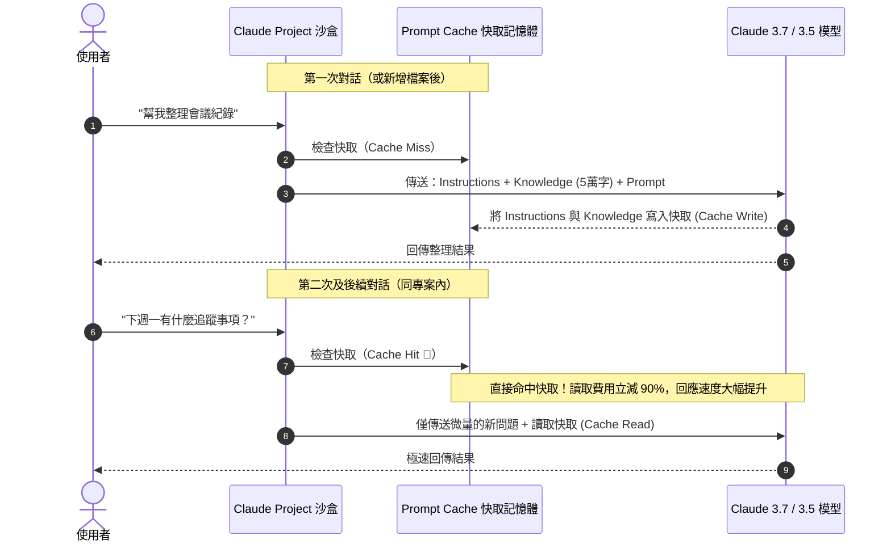

# Claude Projects 的 Prompt Caching 機制與 Token 成本精算

> 了解 Projects 的底層快取機制，是掌握 Claude 長期記憶與控管 Token 成本的關鍵。

---

## 💡 為什麼 Projects 不會越用越貴？

許多初學者對 Projects 有一個常見的恐懼：
> *「如果我在專案 Knowledge 裡上傳了 5 萬字的技術文件或三本操作手冊，那我在這個專案裡每聊一句話，是不是都要重新付 5 萬字的 Token 費用？」*

答案是：**完全不會！因為 Claude 有強大的 Prompt Caching（提示詞快取）技術。**

---

## ⚡ Prompt Caching 核心原理

1. **快取建立（Cache Write）**：
   - 當您在 Project 中開新對話，Claude 會將專案中的 **Instructions（專案指令）** 以及 **Knowledge（上傳檔案）** 作為前綴（Prefix）進行快取寫入。
   - 快取的生命週期通常在幾分鐘到數小時內持續保鮮（只要專案持續有人提問互動）。
2. **快取讀取（Cache Read）**：
   - 專案內的所有後續對話、或同一對話的後續回合，只要 Instructions 與 Knowledge 內容沒有更動，這部分龐大的背景資料**全部算 Cache Read**。
   - **成本優勢**：在 API / Enterprise 定價下，Cache Read 的價格通常是原始輸入 Token 的 **10%（折讓高達 90%）**！
   - **速度優勢**：模型不需要逐字重新計算龐大文字的注意力矩陣 (Attention Matrix)，首字回覆時間 (Time to First Token) 縮短數倍。

---

## ⚠️ 什麼情況會導致「快取失效 (Cache Invalidation)」？

當快取失效時，Claude 就必須在下一次對話中重新執行一次「Cache Write」：

| 操作動作 | 快取是否失效？ | 說明與建議 |
|:---|:---:|:---|
| **修改 Instructions（專案指令）** | 🔴 是 | 修改專案角色或格式指令，整個前綴變動，下次提問需重新快取。 |
| **新增/刪除/更新 Knowledge 檔案** | 🔴 是 | 知識庫內容變動，快取需要重新建構。建議將檔案全部準備好後一次上傳。 |
| **在專案裡開全新對話 (New Chat)** | 🟢 否 | **完美命中快取！** 開新對話不會重算知識庫，成本極低。 |
| **切換不同模型（如 Sonnet 換 Haiku）** | 🔴 是 | 快取是依模型獨立儲存的，切換模型會需要該模型重新快取。 |

---

## 📊 Token 消耗與容量建議表

| 方案類型 | 專案數量上限 | 知識庫建議容量 | 最佳適用場景 |
|:---|:---:|:---|:---|
| **Free 方案** | 5 個專案 | 總計 < 50,000 Tokens (~3 萬中文字) | 個人英文教練、日常行政術語表、單一品牌指南。 |
| **Pro 方案** | 無限制 | 200,000 Tokens (~12 萬中文字) | 商業季度數據庫、中型合約比對、技術手冊。 |
| **Team / Enterprise** | 無限制 | 200,000+ Tokens (並享團隊共用專案) | 企業 SOP 知識庫、創投投資審查專案、產品研發規格書。 |

---

## 🎯 節省 Token 與提昇效率的黃金法則

1. **集中修改原則**：
   在調整專案設定時，先把 Instructions 寫好、知識檔案整理妥當後一次上傳，避免改一個字測一次，減少重複 Cache Write 的開銷。
2. **一任務一專案（Project Isolation）**：
   不要建立一個「包山包海的超級大專案」把法務合約、程式碼、行銷文案全丟進去。專案內容越聚焦，Token 消耗越小，AI 的注意力越精準。
3. **優先轉為乾淨的純文字格式**：
   Office 文件（Word, Excel, PDF）帶有大量格式標籤與 XML 封裝，將其轉為 Markdown 或 CSV 上傳，能為您省下 40%~70% 的無效 Token。詳見下一篇：[《知識庫工程：檔案餵養與防幻覺心法》](./02_Knowledge_Engineering.md)。
