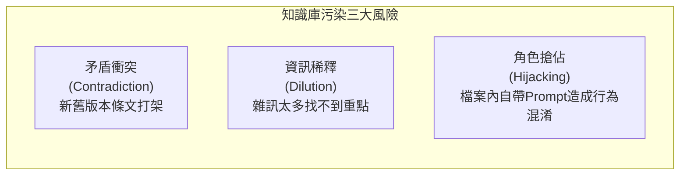

# Claude Projects 知識庫工程 (Knowledge Engineering)

> 垃圾進，垃圾出（Garbage in, garbage out）。餵給 Projects 正確格式與結構的檔案，是發揮 100% 推理能力與根除 AI 幻覺的秘密。

---

## 📄 檔案格式的抉擇：Markdown vs. CSV vs. PDF

很多使用者習慣將漂亮的 `.pdf` 或排版華麗的 `.docx` 直接丟進 Knowledge。然而，不同格式在大型語言模型眼中有著天壤之別：

| 格式 | Token 效率 | 檢索精準度 | 適用情境 | 避坑提醒 |
|:---|:---:|:---:|:---|:---|
| **Markdown (`.md`)** | 🟢 極高 | 🟢 最高 | 規章、標準作業流程 (SOP)、會議紀錄、術語表、法規。 | **首選格式**。語意標籤清晰（`#` 標題、`-` 清單），AI 幾乎 100% 能精準識別結構。 |
| **CSV (`.csv`)** | 🟢 高 | 🟢 極高 | 財務數據表、產品規格表、庫存表、銷售數據。 | 純文字逗號分隔，易於 Python 分析工具 (Analysis Tool) 直接載入運算。 |
| **純文字 (`.txt`)** | 🟢 高 | 🟡 中 | 零散筆記、程式碼片段、純對話紀錄。 | 缺少結構階層，若內容過長容易失去層次感。 |
| **Word (`.docx`)** | 🟡 中 | 🟡 中 | 原生企劃書、合約草稿。 | 建議去除頁首頁尾、裝飾性外框後再上傳，或轉存為 Markdown。 |
| **Excel (`.xlsx`)** | 🟡 中 | 🟡 中 | 含多個工作表 (Sheets) 或複雜巨集的報表。 | 跨工作表容易造成模型混淆；建議將關鍵 Sheet 另存為獨立 CSV。 |
| **PDF (`.pdf`)** | 🔴 低至中 | 🔴 易踩坑 | 官方公告、掃描檔、法律判決書。 | **陷阱**：掃描圖檔 PDF 若無 OCR，Claude 會當成圖片處理消耗極大 Token；多欄排版 (Multi-column) 容易造成文字讀取順序錯亂。 |

---

## 🛠️ 打造高效率 Knowledge 檔案的三大心法

### 1. 結構化標題階層（Header Hierarchy）
在 Markdown 檔案中，務必善用一級 (`#`)、二級 (`##`)、三級 (`###`) 標題。Claude 在進行檢索時，會依賴標題快速定位「這段文字屬於哪一條規範」。

```markdown
# 星橋科技資訊安全管理規範
## 第三章：密碼與帳號安全
### 3.1 密碼複雜度要求
- 至少 12 個字元
- 必須包含大小寫英文字母、數字與特殊符號
```

### 2. 資料自帶情境（Contextual Metadata）
如果上傳表格或數據，請在檔案頂部加上「2~3 行中繼資料說明」：
```markdown
# 2026 Q1-Q2 華東與華南區銷售明細表
> 資料來源：ERP 財務模組匯出
> 幣別：新台幣 (TWD) 單位：萬元
> 最後更新時間：2026/06/30
```
這樣能避免 Claude 詢問「請問幣別是美金還是台幣？」或自行腦補年份。

---

## 🚫 避免「知識庫污染 (Context Contamination)」

當專案 Knowledge 塞入過多檔案時，常見以下三大翻車狀況：



### 狀況 A：新舊版本衝突（Version Conflict）
- **現象**：同時上傳了《2023 差旅辦法.pdf》與《2026 最新差旅規範.docx》，Claude 有時引用舊規定、有時引用新規定。
- **解法**：
  1. 徹底移除舊版檔案。
  2. 若必須同時保留歷史版本，請在 Instructions 明確指定：「若規章條文有衝突，一律以檔名帶有 2026 之最新版本為準。」

### 狀況 B：檔案內自帶 System Prompt 造成干擾
- **現象**：上傳的文件裡面寫著「你是一個英文翻譯助理...」，導致專案原本設定的「行政特助」角色被文件內的字句帶偏。
- **解法**：在 Knowledge 檔案中只保留**客觀事實、數據、規則與條文**，移除所有針對 AI 的角色扮演呼籲。

---

## 🔄 知識庫更新維護 SOP

1. **增量更新（Incremental）**：例如銷售數據庫，每季只需上傳新的一季 CSV，不需覆蓋舊季度。
2. **覆蓋更新（Overwrite）**：規章、術語表或合約範本若有修訂，先在本地更新後，在 Claude 專案中將舊檔刪除並重新上傳。
3. **驗證測試**：每次更新 Knowledge 檔案後，**務必開一個全新對話**，測試新加入的事實是否能被精準檢索。
