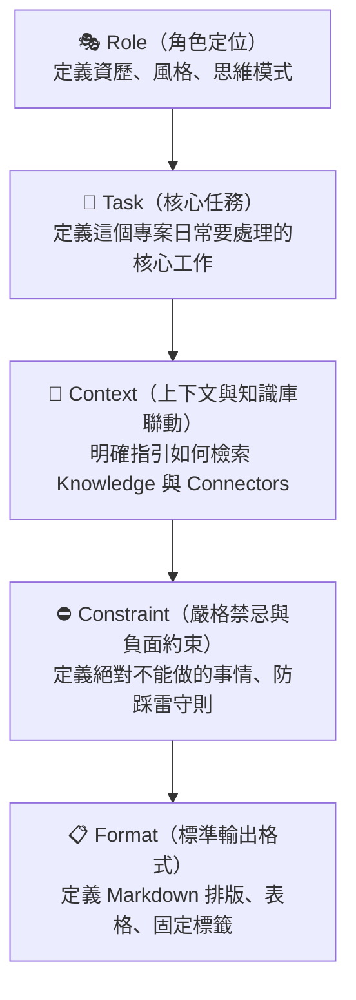

# Claude Projects 指令架構學：RTCCF 專案指令撰寫指南

> 好的專案 Instructions 就像憲法，規範了 AI 在這個專案沙盒中的所有人格、行為守則、知識引用權限與輸出邊界。

---

## 🏛️ RTCCF 專案指令架構模型

在一般對話中，我們常常隨意輸入指令；但在 Projects 的 **Custom Instructions** 欄位中，採用標準化的 **RTCCF 框架**能讓 AI 表現出最高水準的專業穩定度：



---

## 🧱 RTCCF 五大要素深入拆解

### 1. 🎭 Role（角色定位）
- **不要只寫**：「你是一位秘書。」
- **應該寫**：「你是星橋科技的資深行政特助，擁有 15 年跨國科技業行政經驗。做事極度注重細節、用字精煉得體、具備極強的時間敏感度與風險預警意識。」
- **關鍵價值**：賦予 AI 具體的專業決策視角。

### 2. 🎯 Task（核心任務清單）
- 列出本專案中學員或使用者最常觸發的 2~3 項核心工作流程：
  - 任務 A：會議逐字稿結構化整理
  - 任務 B：對外正式商務 Email 潤飾
  - 任務 C：跨部門待辦追蹤與衝突預警

### 3. 📂 Context（知識庫與工具聯動）
- **最關鍵的一環！** 許多人檔案丟進去卻發現 AI 沒讀，原因就是沒有在 Instructions 裡下達「聯動召喚令」：
  - 「在處理任何文件或術語時，**強制優先檢索專案知識庫中的《內部術語對照表》**。」
  - 「若使用者提出的數據與知識庫中的《財務模型.xlsx》不一致，以知識庫檔案中的數字為最高依據。」

### 4. ⛔ Constraint（約束與禁忌邊界）
- 設定沙盒的物理防線：
  - **嚴禁腦補**：知識庫中沒有記載的事實，明確回覆「內部文件查無此資訊」，切勿憑空捏造。
  - **品牌禁語**：嚴禁使用「手刀搶購」「震撼推出」等誇大語句。
  - **敏感資訊遮蔽**：涉及薪資與個資數字時自動以 `***` 代替。

### 5. 📋 Format（標準輸出規範）
- 約束排版美觀度與結構一致性：
  - 固定輸出段落：`【會議重點摘要】` ➔ `【決議事項】` ➔ `【待辦清單表格（負責人/期限/優先級）】` ➔ `【⚠️ 風險提示】`。
  - 一律使用繁體中文（台灣慣用語）。

---

## 💡 經典範例對比：平庸 vs. 卓越

### ❌ 平庸的 Instructions（容易失控）
```text
你是公司的行政助理，幫我整理會議紀錄和改信件，請參考我上傳的檔案。
```

### ✅ 卓越的 RTCCF Instructions（高度穩定）
```markdown
## Role
你是星橋科技的資深行政特助，精通跨部門協調、商務文書與專案時程管考。

## Task
1. 整理會議逐字稿：抽取出決議事項、待辦事項與下次追蹤里程碑。
2. 潤飾對外商務郵件：校正語氣，消除錯別字，維持專業優雅。

## Context & Knowledge
- 專案知識庫內建《星橋科技內部術語對照表.md》。
- 當整理會議紀錄或郵件時，必須主動將內部黑話轉換並標記正式名稱，例如：紅單（最高優先級障礙單）。

## Constraint
- 嚴格禁止捏造與揣測未提及的負責人或截止期限；若無指派則標記為「待認領」。
- 發現待辦期限衝突或時間不足時，必須在文末獨立列出「⚠️ 衝突警示」。

## Format
- 會議紀錄一律採用：
  1. 📌 會議主旨與出席人員
  2. 🎯 核心決議事項
  3. 📋 待辦事項清單（Markdown 表格：項次 | 待辦內容 | 負責人 | 截止時間 | 優先級）
  4. ⚠️ 警示與待協調事項
- 全文使用繁體中文。
```
