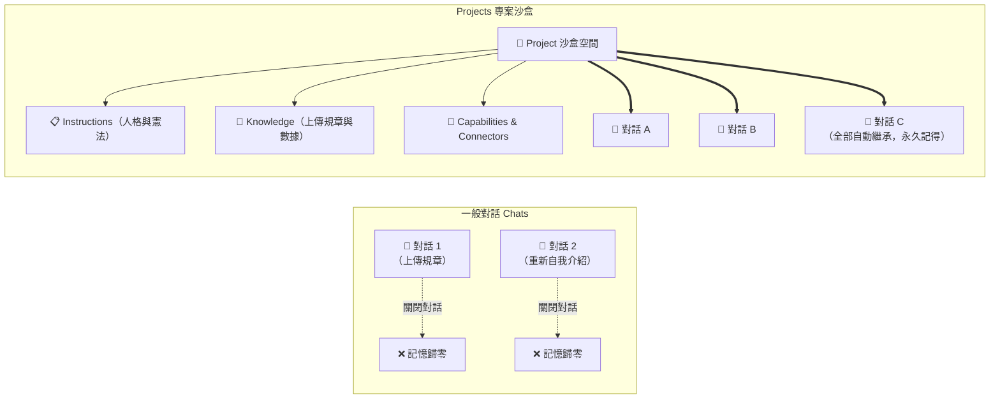
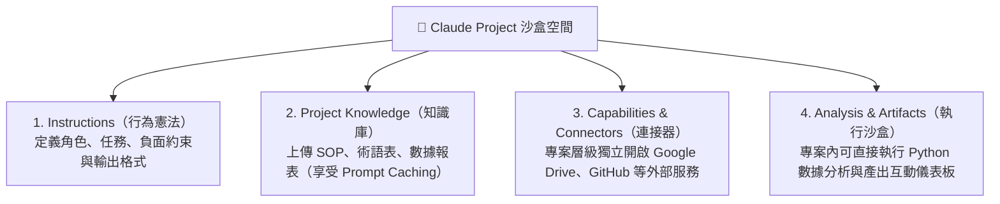
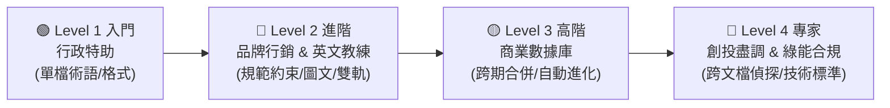

# Claude Projects（專案沙盒）：打造具備長期記憶的專屬工作空間

> 專為職場人士與各領域學員設計，學習如何將 Claude 轉變為擁有組織記憶、熟悉業務規範且具備專屬邊界的「長期工作站」。

---

## 💡 為什麼你需要 Projects？

如果你只使用一般對話（Chats），你一定常經歷這些「金魚腦痛點」：
- **每次開新對話都要重新交代背景**：「我們是科技公司、主管叫王大明、請用台灣繁體中文……」
- **同一份參考手冊/規章上傳了幾十次**，對話一關閉，記憶立刻煙消雲散。
- **精心調校好的 System Prompt 只能存在記事本**，每次提問前手動複製貼上。



| 比較維度 | 一般對話 (Chats) | Claude Projects |
|:---|:---|:---|
| **角色與語氣設定** | 每次提問需重新輸入 Prompt | **一次設定，所有對話永久生效** |
| **參考文件與數據** | 每次開新對話需重新上傳 | **上傳一次，沙盒內所有對話共用** |
| **組織術語與黑話** | 每次都要逐句解釋 | **讀過知識庫，全對話無縫理解** |
| **外部資料庫連線** | 難以針對單一專案隔離授權 | **可針對特定專案獨立掛載 Google Drive/GitHub** |

---

## 🟢 方案需求與規格建議

- **Free 帳號**：可免費建立最多 **5 個專案**（額度足夠完成本章所有 Level 1 ~ Level 4 練習）。
- **Pro / Max 帳號**：可建立**無限個專案**，並享有 200K Tokens 大容量知識庫與更高運算額度。
- **Team / Enterprise 帳號**：支援跨成員**專案共用與協作 (Shared Projects)**，為團隊建立中央標準知識庫。

---

## 🧠 Projects 四位一體現代架構

一個完整的現代 Claude Project 由四大核心柱構成：



---

## 📚 Projects 核心技術與設定深度指南

在正式動手建立專案前，建議先閱讀以下深度指南，幫助您建立正確的架構思維：

* ⚡ **[01. Prompt Caching 與 Token 成本精算指南](./Guide/01_Prompt_Caching_and_Tokens.md)**  
  *深入解密為什麼專案知識庫上傳大量文件不會越聊越貴？快取如何幫您節省高達 90% 的成本。*
* 📑 **[02. 知識庫工程：檔案格式挑選與防污染心法](./Guide/02_Knowledge_Engineering.md)**  
  *Markdown vs. CSV vs. PDF 效率大評比、標題階層規劃、以及如何避免新舊文件打架導致 AI 產生幻覺。*
* 🏛️ **[03. RTCCF 專案指令撰寫架構學](./Guide/03_Instructions_Architecture.md)**  
  *以 Role, Task, Context, Constraint, Format 五大維度撰寫堅不可摧的專案 Instructions。*

---

## 🧪 10 分鐘快速實作：親眼見證 Projects 的威力

> 📥 **課堂模擬檔案下載**：
> - [📄 **內部術語對照表.md**](./Examples/01_Office_Administration/sample_files/內部術語對照表.md)（點擊下載/另存檔案）：星橋科技內部黑話對照表。
> - [📝 **會議逐字稿_產品週會.md**](./Examples/01_Office_Administration/sample_files/會議逐字稿_產品週會.md)（點擊下載/另存檔案）：包含內部黑話的真實會議逐字稿。

### 第一步：在「一般對話」測試（Before）
開一個普通對話，貼上 [會議逐字稿](./Examples/01_Office_Administration/sample_files/會議逐字稿_產品週會.md) 全文並輸入：
```text
幫我把這份逐字稿整理成會議紀錄，列出決議事項與待辦清單。
```
**觀察結果**：Claude 只能照字面胡亂猜測——它不知道「紅單」是最高優先級障礙單、「過橋」是部署到正式環境。

### 第二步：建立你的第一個 Project（After）
1. 點擊左側選單 **Projects** ➔ **New project**。
2. 專案名稱輸入：`星橋科技行政特助`，目標輸入：`整理會議紀錄`，點擊建立。
3. 在 **Instructions** 貼入：
   ```text
   你是星橋科技的資深行政特助。整理文件時，先比對專案知識庫中的「內部術語對照表」，將所有內部術語標註正式名稱（例如：紅單/最高優先級障礙單）。會議紀錄固定包含：會議重點、決議事項、待辦清單（含負責人與期限）。
   ```
4. 在 **Project Knowledge** 區塊，點擊 **Add content** 上傳下載好的 [內部術語對照表.md](./Examples/01_Office_Administration/sample_files/內部術語對照表.md)。

### 第三步：在 Project 裡重做同一件事
在該專案內開新對話，貼上同一份逐字稿、輸入同一句指令。  
**觀察結果**：Claude 自動寫出「收到兩張紅單（最高優先級障礙單，需 24 小時內回應）」「需經 CAB 核准後過橋（部署至正式環境）」——**你一個字都不需要多解釋！**

### 第四步：跨對話殺手級驗證
在該專案裡**再開一個全新對話**，什麼檔案都不貼，直接問：
```text
我們公司的「小火箭」是什麼？T0 客戶紅單的時限是多久？
```
**觀察結果**：Claude 秒回「90 天新人入職培訓計畫，T0 紅單為 24 小時內回應」——**知識上傳一次，每個新對話永遠記得！**

---

## 🚀 由淺至深：六大模組化實戰教學矩陣

本教學設計遵循**由淺入深的四階學習曲線**，每個範例皆自帶獨立資料夾、詳細操作指引、一鍵複製的 `Instructions.md` 與**完整的實體偽資料/圖片下載連結**：



| 階梯層級 | 實戰範例模組 | 適合對象 | 配套偽資料（點擊下載） | 核心學習亮點 |
|:---:|:---|:---|:---|:---|
| **🟢 Level 1**<br/>基礎入門 | [💼 **專業辦公行政特助**](./Examples/01_Office_Administration/README.md) | 一般上班族<br>行政 / 助理 | [📄 內部術語對照表.md](./Examples/01_Office_Administration/sample_files/內部術語對照表.md)<br>[📝 會議逐字稿_產品週會.md](./Examples/01_Office_Administration/sample_files/會議逐字稿_產品週會.md) | 掌握 Projects 三步驟建置、術語對照轉譯、跨對話長期記憶。 |
| **🔵 Level 2**<br/>進階應用 | [✍️ **品牌行銷文案守門人**](./Examples/02_Brand_and_Marketing/README.md) | 社群小編<br>行銷企劃 | [📄 品牌語調指南_山嵐茶飲.md](./Examples/02_Brand_and_Marketing/sample_files/品牌語調指南_山嵐茶飲.md)<br>[🖼️ 蜜香烏龍冷萃_商品示意圖.jpg](./Examples/02_Brand_and_Marketing/sample_files/山嵐茶飲_蜜香烏龍冷萃_商品示意圖.jpg) | 品牌語調約束、**實體商品圖看圖寫文**、防聳動違規字詞過濾。 |
| **🔵 Level 2**<br/>進階應用 | [🎓 **個人化英語學習教練**](./Examples/03_Personal_Coach/README.md) | 學生<br>跨國職場人士 | [📄 英文寫作樣本_自我介紹.md](./Examples/03_Personal_Coach/sample_files/英文寫作樣本_自我介紹.md)<br>[📝 英文求職信草稿_Cover_Letter.md](./Examples/03_Personal_Coach/sample_files/英文求職信草稿_Cover_Letter.md) | 建立個人寫作基準線、雙軌回饋機制（地道改寫＋觀念解析）、老毛病盲點追蹤。 |
| **🟡 Level 3**<br/>高階分析 | [📊 **商業數據分析庫**](./Examples/04_Business_Intelligence/README.md) | 主管 / 營運<br>商業分析師 | [📄 sales_Q1.md](./Examples/04_Business_Intelligence/sample_files/sales_Q1.md)<br>[📄 sales_Q2.md](./Examples/04_Business_Intelligence/sample_files/sales_Q2.md)<br>[📊 上半年銷售數據.xlsx](./Examples/04_Business_Intelligence/sample_files/星橋科技_2026上半年產品銷售數據.xlsx) | 多季資料動態合併、**不改 Prompt 僅增新檔見證圖表自動進化**、Artifact 互動圖表。 |
| **🔴 Level 4**<br/>專家審查 | [🔍 **創投盡調與政府合規審查**](./Examples/05_Due_Diligence_and_Audit/README.md) | 創投 (VC/PE)<br>法務 / 財務風控 | [📄 WeWork S-1 招股書.md](./Examples/05_Due_Diligence_and_Audit/sample_files/WeWork_2019_SEC_S1_Registration_Statement.md)<br>[📊 WeWork 財務表.xlsx](./Examples/05_Due_Diligence_and_Audit/sample_files/WeWork_2018_2019_Financial_Breakdown_BurnRate.xlsx)<br>[📊 Gogoro 車輛毛利.xlsx](./Examples/05_Due_Diligence_and_Audit/sample_files/Gogoro_車輛毛利與補助依存度.xlsx)<br>[📝 產發署國產化審查公文.md](./Examples/05_Due_Diligence_and_Audit/sample_files/經濟部產發署_睿能馬達國產化審查意見書.md) | 跨文檔偵探抓包、Non-GAAP 指標粉飾破解、**美股 SPAC 招股書對接台灣產發署補助法規**。 |
| **🔴 Level 4**<br/>專家審查 | [⚡ **工研院綠能所：儲能安全標準審查**](./Examples/06_Green_Energy_Standards/README.md) | 綠能所研究員<br>能源工程師 / 顧問 | [📄 儲能安全標準指引草案.md](./Examples/06_Green_Energy_Standards/sample_files/儲能系統安全技術標準指引草案.md)<br>[📝 示範園區儲能企劃申請書.md](./Examples/06_Green_Energy_Standards/sample_files/示範園區儲能建置企劃申請書.md)<br>[🖼️ 儲能系統安全配置示意圖.jpg](./Examples/06_Green_Energy_Standards/sample_files/工業級儲能系統_BESS_安全配置示意圖.jpg) | 綠能法規與技術標準 RAG 檢索、**建置企劃跨文檔條文合規差異抓包 (Gap Analysis)**、工程配置圖視覺審查。 |

---

## 💡 進階管理與安全原則

### 1. 專案隔離原則 (Project Isolation)
- **一個任務領域，一個專案**。
- 切勿將法務、工程代碼、行銷與個人日程全塞在同一個超級專案中。過於雜亂的檔案會擠壓 Context Window 與 Prompt Cache，造成模型注意力分散並增加幻覺機率。

### 2. Connectors 授權與金鑰安全性
- **雲端 Connectors（如 Google Drive / Gmail）**：OAuth 憑證存放在 Anthropic 雲端的 Secure Vault 中，專案間彼此隔離。
- **本地 MCP 伺服器**：連線憑證存在您的本地電腦中，專案雲端不持有您的本機檔案長期金鑰。

---

← [返回上層：Claude_AI 索引](../README.md)
