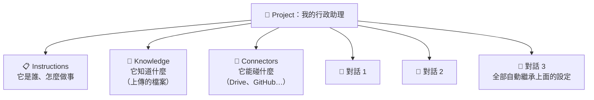

# Projects（專案）：讓 Claude 記得你的一切

> 🟢 **方案需求**：**Free 帳號可建立最多 5 個專案**；Pro 帳號（$20/月起）可建立無限個專案，並享有更大容量的知識庫 (RAG) 與進階模型。
>
> **使用建議**：Free 帳號的 5 個專案額度足夠完成本章全部練習。若額度不夠，可封存或刪除舊專案。

---

## 😩 你是否遇過這些情況？

- 每次開新對話，都要**重新自我介紹一次**：「我是行政人員，我們公司的報告格式是……」
- 同一份檔案**上傳了五次**，因為每個對話都不記得上一個對話看過什麼
- 精心調校好的指令存在記事本裡，每次都要**複製貼上**

一般對話就像金魚腦——**對話關掉，一切歸零**。

**Projects 就是解藥**：把角色指令（Instructions）、參考檔案（Knowledge）、工具連線（Connectors）**設定一次**，之後在這個專案裡開的**每一個對話**都自動繼承這些設定。

## 🧠 一分鐘看懂 Projects



| | 一般對話 | Project |
|---|---|---|
| 角色設定 | 每次重新輸入 | 設定一次，永久生效 |
| 參考檔案 | 每次重新上傳 | 上傳一次，所有對話共用 |
| 專業術語 | 不認識 | 讀過你的檔案，全都認識 |

---

## 🧪 10 分鐘實作：親眼見證差異

> 這個實驗會用到兩份模擬檔案：[內部術語對照表](./Examples/sample_files/內部術語對照表.md) 和 [會議逐字稿](./Examples/sample_files/會議逐字稿_產品週會.md)。
> 它們來自虛構公司「星橋科技」——裡面有「紅單」「過橋」「北極星」這種**只有內部人才懂的黑話**。

### 第一步：先在「一般對話」做實驗（Before）

開一個**一般對話**，貼上[會議逐字稿](./Examples/sample_files/會議逐字稿_產品週會.md)的內容，然後輸入：

```text
幫我把這份逐字稿整理成會議紀錄，包含決議事項與待辦清單。
```

**觀察結果**：Claude 只能照字面猜——它不知道「紅單」是最高優先級障礙單、「過橋」是部署到正式環境、「北極星」是智慧客服系統 2.0。整理出來的紀錄，新同事看了還是一頭霧水。

### 第二步：建立你的第一個 Project

1. 在 Claude 左側欄點選 **Projects** → **New project**，會出現「**Create a project**」視窗
2. **What are you working on?**（專案名稱）輸入：`星橋科技行政助理`
3. **What are you trying to achieve?**（目標描述）輸入：`整理會議紀錄、潤飾商務郵件`，然後按 **Create project**
4. 進入專案頁面後，找到 **Instructions**（專案指令）區塊，貼入：

```text
你是星橋科技的資深行政特助。
整理會議紀錄時，請比對專案知識庫中的「內部術語對照表」，
將所有內部術語標註正式名稱，例如：北極星（智慧客服系統 2.0）。
會議紀錄固定包含：會議重點、決議事項、待辦清單（負責人＋期限）。
```

5. 在 **Knowledge**（或 Files）區塊，上傳[內部術語對照表](./Examples/sample_files/內部術語對照表.md)（可先下載檔案，或複製內容另存成 .md / .txt 上傳）

### 第三步：在 Project 裡重做同一件事（After）

在這個 Project 中開新對話，貼上**同一份逐字稿**、輸入**同一句指令**。

**觀察結果**：這次 Claude 會自動寫出「收到兩張紅單（最高優先級障礙單，需 24 小時內回應）」「需經 CAB（變更諮詢委員會）核准後過橋（部署至正式環境）」——你**一個字都沒有多解釋**。

### 第四步：殺手級驗證——開第二個全新對話

在同一個 Project 裡**再開一個全新對話**，什麼都不貼，直接問：

```text
我們公司的「小火箭」是什麼？下一梯什麼時候開始？
```

Claude 直接回答「90 天新人入職培訓計畫」——**不用重新上傳、不用重新解釋**。

> 💡 這就是 Projects 的本質：**知識上傳一次，每個對話都記得。**

---

## 🚀 四個實戰範例

做完上面的實驗後，挑一個貼近你身分的範例，跟著做完整版：

| 範例 | 適合對象 | 難度 | 核心亮點 |
|------|----------|:---:|----------|
| [💼 專業辦公行政助手](./Examples/Office_Assistant.md) | 上班族 | ⭐ | 術語表＋逐字稿的完整工作流 |
| [✍️ 社群行銷文案大師](./Examples/Marketing_Copywriter.md) | 社群小編 | ⭐⭐ | 上傳品牌指南，AI 自動守住品牌語調 |
| [🎓 英語學習與口語教練](./Examples/English_Learning.md) | 學生 | ⭐⭐ | 上傳寫作樣本，得到個人化錯誤診斷 |
| [📊 商業數據分析庫（會自動進化的圖表）](./Examples/Business_Brain.md) | 業務/行銷/主管 | ⭐⭐⭐ | 透過多種方式更新資料表，免改 Prompt 見證圖表自動合併新數據 |

---

## 🧠 現在你懂了：Projects 的本質

做完實驗再回頭看理論，就很好懂了。Project 是一個**雲端知識沙盒**：

1. **知識沙盒 (Knowledge Sandbox)**：上傳的檔案只在這個專案內有效，專案之間互相隔離。
2. **行為約束器 (Custom Instructions)**：Instructions 定義沙盒內的「物理規則」——AI 的角色、格式、禁忌。
3. **運算沙盒 (Execution Sandbox)**：內建 Analysis Tool，可以在專案內執行 Python 運算。

## 🛠️ 客製化專案能力 (Capabilities)

每個專案可以**獨立勾選**要開啟哪些 Connectors（如 Google Drive、GitHub）——行政助理專案連 Drive、程式專案連 GitHub，互不干擾。

## 💡 進階技巧：專案隔離 (Project Isolation)

**一個任務，一個專案**，且只開啟必要的 Connectors。過多的工具定義（Tool Definitions）會擠壓系統 Token 空間，讓背景資訊臃腫，降低 AI 的推理精確度與反應速度。

## 🔐 安全性 QA：我的 Token 放在哪？

**Q：授權雲端服務（如 Gmail、Supabase）後，鑰匙存在哪裡？**
A：存在 **Anthropic 雲端伺服器的加密保險箱 (Secure Vault)**。因為專案在雲端執行，雲端的 Claude 需要這把鑰匙即時讀取資料。Token 與你的帳號綁定，僅在授權的專案中有效。

**Q：本地 MCP 的鑰匙呢？**
A：**完全存在你的電腦上**（macOS Keychain 或 Windows Credential Manager），雲端伺服器不持有任何長期存取鑰匙。

---

## 🏆 課後挑戰

為**你自己的真實需求**建立一個 Project：

1. 想一個你每週重複做超過三次的任務（整理筆記？回覆固定類型的訊息？）
2. 寫 Instructions、上傳 1–2 份你真實會用到的參考檔案
3. 驗收標準：開兩個不同的對話測試，**兩邊都不需要重新解釋背景**就能得到正確結果

---

← [返回上層：Claude_AI 索引](../README.md)
