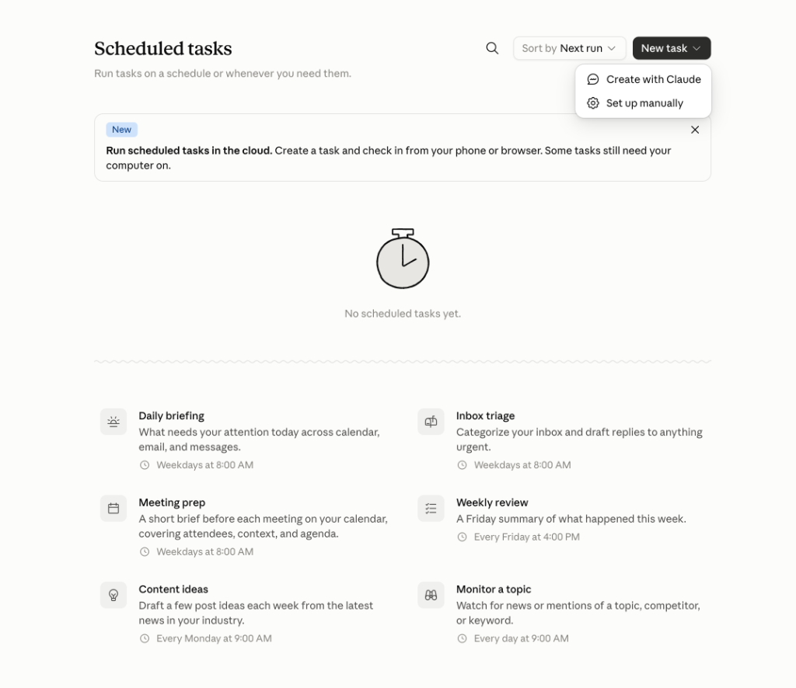
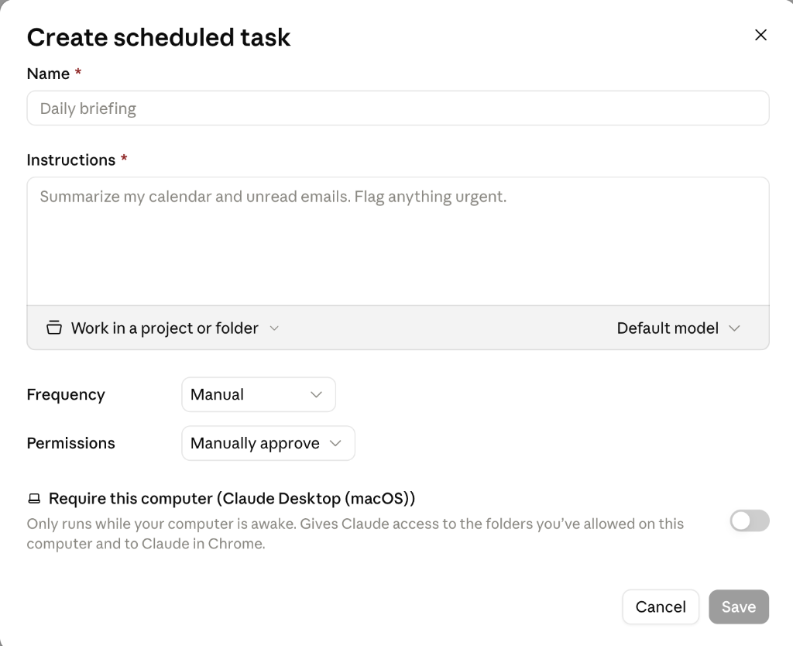

# ⏱️ Scheduled（排程任務）：讓 Claude 定時自動幫你工作

> 🔵 **方案需求**：**Pro / Max / Team / Enterprise 付費方案**皆可使用；目前 Claude Cowork 與 Scheduled 功能支援 Claude 網頁版、電腦桌面版（Claude Desktop）及行動版 App。  
> 🔗 **官方支援文件**：[Schedule recurring tasks in Claude Cowork](https://support.claude.com/en/articles/13854387-schedule-recurring-tasks-in-claude-cowork)

**Scheduled（排程任務）**讓你把日常的重複性工作「**設定一次、定期自動執行**」。不再需要每次手動開新對話或重複輸入指令，Claude 會依照你指定的頻率自動在背景運作，並在指定時間交付完整的報告、分析摘要或行動清單。

---

## 🖥️ 最新 Scheduled 介面總覽

進入 [Claude.ai](https://claude.ai) 或開啟 **Claude Desktop**，點選左側選單的 **「Scheduled」**，即可進入排程任務控制台：



### 📌 介面核心區塊說明
1. **頂部操作列**：
   - 🔍 **搜尋列**：快速篩選與尋找已建立的排程任務。
   - **Sort by（排序）**：可依照「Next run（下次執行時間）」或「Name（任務名稱）」進行排序。
   - **New task ˇ（建立新任務按鈕）**：點開可選擇「💬 **Create with Claude**（對話引導建立）」或「⚙️ **Set up manually**（手動表單設定）」。
2. **雲端通知橫幅 (New Banner)**：
   - `Run scheduled tasks in the cloud`：說明排程任務支援**純雲端排程**，即使電腦關機也能在雲端自動跑，可直接透過手機或網頁查收成果。
3. **6 大官方推薦範本 (Templates)**：
   - 官方精選職場最高頻的 6 大自動化情境，點擊卡片即可快速載入設定（詳細實戰請見後文範例庫）。

---

## ⚡ 核心概念：雲端執行 vs 電腦本機執行

在新版 Scheduled 介面中，Anthropic 引入了重大的架構升級——讓使用者自由選擇「**純雲端執行**」或「**電腦本機桌面執行**」：

| 比較維度 | ☁️ 雲端排程 (Run in Cloud - 預設) | 💻 本機排程 (Require this computer) |
| :--- | :--- | :--- |
| **開關設定** | `Require this computer` 開關保持 **關閉 (OFF)** | `Require this computer` 開關切換為 **開啟 (ON)** |
| **電腦關機/休眠** | ✅ **完全不受影響**，雲端伺服器準時自動運作 | ⚠️ **僅在電腦開機且喚醒 (Awake) 時執行** |
| **可存取的資料來源** | • Claude 帳號中的雲端專案與檔案<br/>• 雲端 Connectors (Google Drive, Slack, Gmail 等)<br/>• 雲端網路搜尋 (Web Search) 與 Python 運算 | • **你授權給 Claude 的本機資料夾與檔案**<br/>• **本機 Chrome 瀏覽器 (Claude in Chrome)**<br/>• 本機應用程式連動 |
| **結果查收方式** | 手機 App、平板、任何電腦瀏覽器隨時查閱 | 電腦本機 Claude Desktop 與雲端同步檢視 |
| **最佳適用場景** | 晨間產業新聞監控、雲端試算表定期報表、每日郵件摘要 | 定期整理本機下載資料夾、呼叫本機專案檔案、本機自動化 |

---

## 🚀 建立排程任務的手把手教學

建立排程任務有兩種方式，建議初學者先使用 **「方式二：手動設定」** 完整熟悉所有欄位。

### 方式一：與 Claude 對話建立 (`Create with Claude`)

1. 點選左側選單 **Scheduled** ➔ 點選右上角 **New task ˇ** ➔ 選擇 **Create with Claude**。
2. 系統會自動開起一個對話視窗，預載提示問你想建立什麼排程。
3. 你可以用自然語言描述需求，例如：「*請幫我設定一個每週五下午 5 點自動整理專案進度並產出 Markdown 週報的任務*」。
4. Claude 會以**多選題**或追問方式與你確認執行細節（頻率、檔案來源、輸出格式）。
5. 確認無誤後，Claude 會整理出排程摘要，點擊確認框上的 **「Schedule」** 即完成建立！

---

### 方式二：手動表單設定 (`Set up manually` - 推薦)

點選右上角 **New task ˇ** ➔ 選擇 **Set up manually**，會彈出完整的排程設定視窗：



#### 📝 全表單 7 大欄位詳細解析與填寫指引：

```
┌─────────────────────────────────────────────────────────────┐
│ 1. Name *                                                   │
│    例：每日晨報與行程排程 (Daily Briefing)                    │
├─────────────────────────────────────────────────────────────┤
│ 2. Instructions * (支援 RTCCF 結構化提示詞)                 │
│    例：讀取 mock_calendar_events.json 與未讀信件，比對衝突... │
│    [📁 Work in a project or folder ˇ]   [Default model ˇ]  │
├─────────────────────────────────────────────────────────────┤
│ 3. Frequency:    [ Weekdays (每個工作日) ˇ ]                │
│ 4. Permissions:  [ Manually approve (手動核准) ˇ ]          │
│ 5. Require this computer (Claude Desktop (macOS)): [ 關閉 ] │
├─────────────────────────────────────────────────────────────┤
│                                  [ Cancel ]    [ Save ]     │
└─────────────────────────────────────────────────────────────┘
```

1. **Name \*（任務名稱 - 必填）**：
   - 請取一個明確、好辨識的名稱，例如：`每日晨報與行程排程` 或 `每週團隊進度報告`。
2. **Instructions \*（任務指令 - 必填）**：
   - 這是 Claude 定期執行的核心 Prompt。**強烈建議使用 RTCCF 架構**（Role 角色、Task 任務、Context 背景檔案、Constraint 限制、Format 格式）。
   - **底部工具列左側：`Work in a project or folder ˇ`**：
     - 可指定此任務要在哪個 Claude Project（雲端專案）或本地已授權資料夾內運作。
   - **底部工具列右側：`Default model ˇ`**：
     - 可指定執行的 AI 模型（例如保持預設，或指定思考能力最強的 `Claude 3.7 Sonnet`）。
3. **Frequency（執行頻率）**：
   - 下拉選單提供：`Manual`（手動觸發）、`Hourly`（每小時）、`Daily`（每日）、`Weekly`（每週）、`Weekdays`（每個工作日）。
   - 選擇頻率後可自訂具體執行時間（例如 `08:00 AM` 或 `17:00 PM`）。
4. **Permissions（權限核准模式）**：
   - `Manually approve`（手動批准）：Claude 執行各項工具動作前需使用者點擊核准，適合剛建好排程時除錯驗證。
   - `Auto approve`（自動批准）：完全無人值守自動執行，適合成熟穩定的排程工作。
5. **Require this computer（本機電腦開關）**：
   - 若任務使用的檔案已存在於 Claude 專案中，請保持 **關閉**（享有純雲端 24 小時不關機自動跑）。
   - 若任務必須讀寫你 Mac/PC 上的本機資料夾，請切換為 **開啟**。
6. **點選「Save」**：即刻儲存並啟動排程！

---

## 🎓 6 大實戰演練庫（含擬真偽檔案與 Prompt）

為了讓學生在沒有綁定真實公司 Gmail、行事曆或 ERP 的情況下也能 **100% 完整照步驟練習**，本單元為每個情境皆製作了專屬的**擬真偽檔案（Mock Files）**：

| # | 官方對應範本 | 實戰範例名稱與說明 | 建議頻率 | 學員專屬擬真偽檔案 (`sample_files/`) | 實戰教學文件 |
| :---: | :--- | :--- | :---: | :--- | :---: |
| **1** | **Weekly review** | [**每週團隊進度與風險排程報告**](./Examples/01_Weekly_Brief/README.md)<br/>自動合併同仁週報、分析卡點風險並填入週會簡報。 | 每週五 17:00 | • `team_weekly_updates.csv`<br/>• `weekly_brief_template.md` | [查看步驟](./Examples/01_Weekly_Brief/README.md) |
| **2** | **系統監控巡檢** | [**每日庫存與供應鏈異常定時巡檢**](./Examples/02_Inventory_Monitor/README.md)<br/>定時調用背景 Code Execution 計算安全天數並發出缺貨預警。 | 每日 09:00 | • `daily_inventory_status.csv`<br/>• `reorder_threshold_rules.md` | [查看步驟](./Examples/02_Inventory_Monitor/README.md) |
| **3** | **Monitor a topic** | [**每週競品價格與促銷變化排程追蹤**](./Examples/03_Price_Monitor/README.md)<br/>定時比對我方與競品定價，分析價差比並給予動態調價建議。 | 每週一 08:00 | • `our_product_catalog.csv`<br/>• `competitor_market_prices.csv` | [查看步驟](./Examples/03_Price_Monitor/README.md) |
| **4** | **Daily briefing** | [**每日晨報與行程郵件排程**](./Examples/04_Daily_Briefing/README.md)<br/>主動偵測會議衝突、篩選緊急郵件並產出今日開工備忘錄。 | 工作日 08:00 | • `mock_calendar_events.json`<br/>• `mock_unread_emails.csv`<br/>• `daily_briefing_template.md` | [查看步驟](./Examples/04_Daily_Briefing/README.md) |
| **5** | **Inbox triage** | [**收件匣分類與緊急回覆草擬排程**](./Examples/05_Inbox_Triage/README.md)<br/>依據 P0~P3 優先級矩陣分流，針對系統障礙直接寫好回覆草稿。 | 工作日 08:00 | • `customer_inquiries.csv`<br/>• `triage_rules.md` | [查看步驟](./Examples/05_Inbox_Triage/README.md) |
| **6** | **Meeting prep** | [**重要會議前置調查與簡報排程**](./Examples/06_Meeting_Prep/README.md)<br/>比對利害關係人檔案，生成會議前攻防戰略與通關檢核清單。 | 工作日 08:00 | • `upcoming_meetings.json`<br/>• `client_background_dossier.md` | [查看步驟](./Examples/06_Meeting_Prep/README.md) |

---

## 🛠️ 排程任務的日常管理與維護

在 **Scheduled tasks** 儀表板中，你可以對已建立的任務進行以下操作：

1. **手動立即測試 (Run on demand / Run now)**：
   - 設定好排程後，**不需要苦等到明天早上**！點擊任務右側選單的 **「Run now」**，Claude 就會立刻以該任務的設定執行一次，方便你即時驗證 Prompt 與輸出效果。
2. **檢視執行歷程 (Run history)**：
   - 點進個別任務，可查閱過去每次執行的時間、執行狀態以及產出的完整工作成果。
3. **編輯任務 (Edit instructions & cadence)**：
   - 隨時修改 Prompt 指令、更換關聯專案或調整執行時間。
4. **暫停 / 恢復 (Pause / Resume)**：
   - 若遇到國定假日或暫時不需執行，可一鍵暫停排程，不需刪除重新建立。

---

## ❓ 常見問題與排錯指南 (FAQ)

### Q1：為什麼我的左側側欄沒有出現「Scheduled」按鈕？
1. **方案限制**：Scheduled 屬於 Claude Cowork 的進階功能，僅提供給 **Pro / Max / Team / Enterprise 付費方案**。免費版 (Free plan) 暫無此功能。
2. **分階段開放 (Gradual Rollout)**：目前 Cowork 仍處於 Beta 階段，會依據帳號權限逐步推播。若未看見請確保桌面版已更新至最新版，或嘗試登入網頁版確認。

### Q2：如果我開啟了「Require this computer」，但執行時間到了我的電腦正好休眠怎麼辦？
- 當 `Require this computer` 開啟時，任務**僅會在電腦喚醒 (Awake) 狀態下執行**。
- 若時間到了電腦處於休眠或關機狀態，該次任務會延遲或跳過，直到電腦再次喚醒時依系統排程補跑。因此，若任務不依賴本機資料夾，建議**關閉此開關**，交由純雲端無痛執行！

### Q3：如何讓排程讀取我準備好的「偽檔案」？
- **方法 A (純雲端推薦)**：在 Claude 網頁版建立一個 Project（專案），將範例中的 `sample_files/` 檔案上傳到該 Project。在建立排程表單的 `Work in a project or folder` 選擇該 Project 即可。
- **方法 B (本機資料夾)**：開啟 Claude Desktop，勾選 `Require this computer`，在 `Work in a project or folder` 選擇電腦本地存放 `sample_files/` 的資料夾。

---

← [返回 Claude_AI 主講義](../README.md) | 🏠 [返回專案總首頁](../../README.md)
