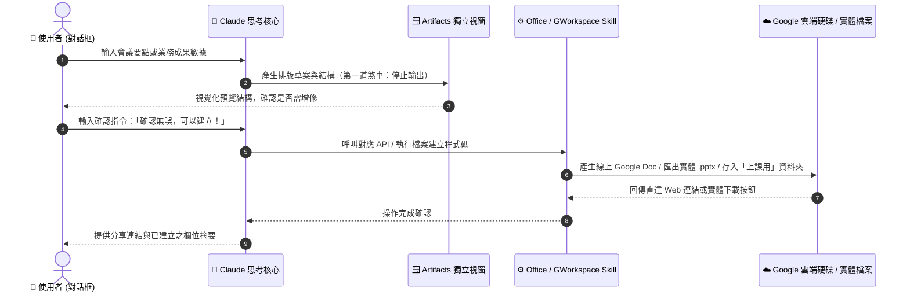

# 📂 次章節：Google Workspace 與辦公自動化 Skills 實戰 💼

> **學習階段**：🟢 核心實戰（職場必備）　|　**預計實作時間**：25 分鐘  
> **核心目標**：學會調用 Claude 官方現有之 Google Workspace 與 Office 相關 Skills（Docs、Sheets、PPTX、Gmail），掌握「Artifacts 人機討論確認 ➔ 呼叫 Skill 輸出實體檔案與線上連結」的標準人機在環（Human-in-the-Loop）工作流。

---

## 🧭 實戰架構與練習導航

本章節以 **Google Docs 會議紀錄整理與雲端自動歸檔** 作為核心主範例進行深度示範；其餘練習皆備有**獨立的專屬練習資料夾、完整教學文件與配套 Office / 圖片實體偽資料**，點擊即可前往專屬實作空間：

| 練習項目 | 類型 | 運作模式 | 所需 Skill / 工具 | 專屬偽資料類型 | 專屬資料夾與教學連結 |
| :--- | :---: | :---: | :--- | :--- | :--- |
| **實戰 1：Docs 會議紀錄與歸檔** | 🌟 **核心主範例** | 💬 一般對話 | 🔹 **Google Docs Skill** | 📄 Word (.docx)<br/>📝 逐字稿 (.md) | [📁 01_Docs_Meeting_Notes](./01_Docs_Meeting_Notes/README.md)（本頁下方完整展開） |
| **實戰 2：Sheets 敏捷任務追蹤表** | 延伸實戰 | 💬 一般對話 | 🔹 **Google Sheets Skill** | 📈 Excel (.xlsx)<br/>📋 待辦清單 (.csv) | [📁 02_Sheets_Task_Tracker](./02_Sheets_Task_Tracker/README.md) |
| **實戰 3：PPTX 商業簡報製作** | 延伸實戰 | 💬 一般對話 | 🔹 **Anthropic PPTX Skill** | 🖥️ PowerPoint (.pptx)<br/>🖼️ 商務圖表 (.png) | [📁 03_PPTX_Presentation](./03_PPTX_Presentation/README.md) |
| **實戰 4：Gmail 採購確認與標籤** | 延伸實戰 | 💬 一般對話 | 🔹 **Gmail Skill** | 📄 簽核單 (.docx)<br/>📊 料件清單 (.csv) | [📁 04_Gmail_Draft_Dispatch](./04_Gmail_Draft_Dispatch/README.md) |

---

## 🔄 Skills 運作機制與時序圖

本單元所有練習皆嚴格導入 **Human-in-the-Loop（人機在環煞車機制）**，先在獨立視窗驗收草稿，再輸出實體檔案：



---

## 🛠️ 前置步驟（只需設定一次）

在開始實作前，請確認您的環境已具備執行能力：

1. **開啟程式碼與檔案建立功能**：
   - 開啟 **Claude Desktop** ➔ 點選左下角頭像 ➔ **Settings** ➔ **Capabilities**。
   - 確認已將 **Code execution and file creation** 切換為 **開啟 (On)** 狀態（此為呼叫 PPTX Skill 與建立實體檔案的關鍵前提）。
2. **連接 Google 雲端帳號**：
   - 前往 **Settings** ➔ **Connectors** ➔ 授權連接 **Google Drive** 與 **Gmail**。
   - Docs 與 Sheets 會共用 Google Drive 權限，無需額外單獨設定。

---

## 🌟 核心主要範例：Google Docs 智慧會議紀錄整理與雲端歸檔

> 💡 **情境故事**：  
> 每週開完業務會，行政特助都要面對長達數頁的零散速記與逐字稿。傳統做法是手動整理成 Word 再上傳雲端，不僅耗時且版面格式混亂。現在透過 Google Docs Skill，Claude 先在 Artifacts 呈現專業會議紀錄草稿供您過目，一聲令下自動在 Google Drive 建立線上文件並分門別類歸檔至「上課用」資料夾！

* **運作模式**：💬 **一般對話模式（Chat Prompts）**
* **所需 Skill / 工具**：🔹 **Google Docs Skill**（確保已連線 Google Drive）
* **獨立模組資料夾**：[📂 前往 01_Docs_Meeting_Notes 專屬練習資料夾](./01_Docs_Meeting_Notes/README.md)

### 📥 測試偽資料下載（Office Word 與文字版）

請點擊下載本主範例的專屬測試偽資料：

| 檔案類型 | 檔案名稱（點擊檢視/下載） | 說明 | 建議實測用法 |
| :---: | :---| :---| :---|
| 📄 **Word 文件** | [**2026_Q2_業務檢討會_會議手記.docx**](./sample_files/2026_Q2_業務檢討會_會議手記.docx) | 包含 Q1 達成率 87%、中南部擴展爭取與 3 項待辦清單之實體 Word 檔案。 | 可直接將檔案拖入 Claude 對話框中發問。 |
| 📝 **Markdown** | [**2026_Q2_業務檢討會_原始錄音逐字稿與筆記.md**](./sample_files/2026_Q2_業務檢討會_原始錄音逐字稿與筆記.md) | 相同會議之純文字版本，方便直接複製內文。 | 適合快速複製貼上或當作 Prompt Context。 |

---

### 📋 複製貼上 RTCCF Prompt（立即實測）

下方 Prompt 已內建完整會議背景資訊與四階段工作流程規範，打開 Claude [一般對話視窗](https://claude.ai)，點擊右上角一鍵複製貼入：

```markdown
## Role
你是一位資深的辦公室行政顧問兼高階主管特助，擅長整理結構嚴謹的正式商務會議紀錄，並能運用 Google Workspace 工具管理雲端檔案。

## Task
請將我提供的會議要點，整理成一份正式專業的會議紀錄：
1. 先於 Claude Artifacts 中以 Markdown 格式呈現草稿與我討論確認。
2. 待我輸入確認指令後，再調用 Google Docs 工具在我的雲端硬碟建立正式文件，並存放於「上課用」資料夾中。

## Context
會議資訊：
- 會議名稱：2026 年第二季業務檢討會
- 開會日期：2026-06-09
- 主持人員：王小明（業務部資深主管）
- 與會人員：李小華（客戶成功經理）、陳小美（商務開發專員）
- 討論要點摘錄：
  - Q1 業績達成率結算為 87%，較前一季略有回升，但距離年度預算仍有 13% 缺口；Q2 團隊共識目標需上調 10% 以補足差距。
  - 新客戶開發成效：本季成功簽約 3 家製造業大廠（台北 2 家、新竹 1 家），但中南部科學園區覆蓋率嚴重不足，急需加強在地經銷網絡佈建。
  - 產品線反饋：微電網網關（BridgeGrid-X）受到半導體客戶高度評價，但客戶反映希望改善 Modbus 輪詢逾時告警機制。
  - 下次進度追蹤會議排定於 6 月 23 日（二）上午 10:00，由李小華負責統整中南部 5 家主力競爭對手之競品定價分析。

## Constraint
- 語言：繁體中文
- 文件結構：會議基本資訊 → 核心討論摘要 → 決議事項 → 行動追蹤清單（表格呈現：`任務` | `負責人` | `截止日`）。
- **四階段嚴格工作流程（Human-in-the-Loop）**：
  1. **第一步（草稿產出）**：請先使用 Claude Artifacts 呈現會議紀錄草稿。
  2. **第二步（停頓確認）**：在此步驟**嚴禁**調用 Google 工具！主動詢問我是否需要增修微調。
  3. **第三步（建立文件）**：待我明確回覆「可以建立」後，才呼叫 Google Docs 工具建立雲端文件。
  4. **第四步（資料夾歸檔）**：將該文件存放在 Google Drive 根目錄下的 **「上課用」** 資料夾中（若「上課用」資料夾不存在，請自動建立該資料夾再將文件移入）。

## Format
- 建立 Google Docs 文件，命名為「2026-06-09 2026年第二季業務檢討會 會議紀錄」
- 完成後回傳 Google Docs 的線上直達分享連結
```

---

### 🚦 課堂雙輪互動推進

1. **第一輪**：送出 Prompt ➔ Claude 於 Artifacts 呈現精美的排版草案，並在文末停下詢問。
2. **第二輪（確認建立）**：在對話框輸入：
   ```text
   確認無誤，可以建立！
   ```
3. Claude 將呼叫工具在 Google Drive「上課用」資料夾建立線上文件，回傳文件直達連結！

---

### ✅ 成果驗收點

- [ ] **Artifacts 討論閘門**：第一階段未自動建立雲端檔案，展現人機在環把關。
- [ ] **結構化清單完整**：包含基本資訊、摘要、決議與行動清單（李小華 6/20 競品分析、王小明 6/15 目標分配、陳小美 6/22 簡報）。
- [ ] **Google Docs 成功建立**：回傳線上可點擊分享之 Google Docs 連結。
- [ ] **「上課用」資料夾歸檔**：雲端檔案正確歸檔於指定資料夾內。

---

## 📚 延伸實戰練習庫（點擊進入單案資料夾）

每個練習皆備有專屬資料夾、獨立教學說明、自包含 Prompt 與專屬測試 Office/圖片偽檔案：

---

### 📈 練習 2：Google Sheets 敏捷任務追蹤表與自動試算

* **運作模式**：💬 一般對話（Chat）
* **所需 Skill**：🔹 **Google Sheets Skill**
* **核心亮點**：
  - 輸入多部門交辦之零散任務，自動依照截止日期由近至遠排序。
  - 規劃任務編號、優先級、狀態與備註，經審核後一鍵建立雲端 Google Sheets。
* **專屬偽檔案**：
  - 📈 [2026年度專案排程與任務追蹤表.xlsx](./02_Sheets_Task_Tracker/sample_files/2026年度專案排程與任務追蹤表.xlsx)
  - 📋 [2026年度各部門待辦事項原始清單.csv](./02_Sheets_Task_Tracker/sample_files/2026年度各部門待辦事項原始清單.csv)
* 👉 **[點此進入 02_Sheets_Task_Tracker 專屬練習資料夾 ➔](./02_Sheets_Task_Tracker/README.md)**

---

### 🖥️ 練習 3：使用 Anthropic PPTX Skill 製作商業簡報 (.pptx)

* **運作模式**：💬 一般對話（Chat）
* **所需 Skill**：🔹 **Anthropic PPTX Skill**（內建於 Code execution）
* **核心亮點**：
  - 將業務報告要點轉化為 5 頁商務投影片大綱。
  - 支援 10 套官方商務配色主題（預設套用 Midnight Executive 深藍冰藍風）。
  - 自動在雲端生成實體 PowerPoint 簡報檔案 (.pptx) 並提供直接下載連結！
* **專屬偽檔案**：
  - 🖥️ [2026_Q2_業務成果報告_示範簡報.pptx](./03_PPTX_Presentation/sample_files/2026_Q2_業務成果報告_示範簡報.pptx)
  - 🖼️ [2026_業務增長趨勢與成果視覺圖.png](./03_PPTX_Presentation/sample_files/2026_業務增長趨勢與成果視覺圖.png)
  - 📄 [2026_Q2_業務成果報告大綱與數據亮點.md](./03_PPTX_Presentation/sample_files/2026_Q2_業務成果報告大綱與數據亮點.md)
* 👉 **[點此進入 03_PPTX_Presentation 專屬練習資料夾 ➔](./03_PPTX_Presentation/README.md)**

---

### 📬 練習 4：Gmail 商業採購交期確認信草擬與標籤自動化

* **運作模式**：💬 一般對話（Chat）
* **所需 Skill**：🔹 **Gmail Skill**
* **核心亮點**：
  - 根據採購發包重點，起草專業正式且具時限威嚴的供應商確認回函。
  - 嚴格遵守 Human-in-the-Loop 規範，僅將郵件儲存於「草稿匣（Drafts）」，絕不自動外寄。
  - 自動為該郵件掛載名稱為「**上課用**」之 Gmail 分類標籤。
* **專屬偽檔案**：
  - 📄 [採購訂單_PO-2026-0609_核准簽核單.docx](./04_Gmail_Draft_Dispatch/sample_files/採購訂單_PO-2026-0609_核准簽核單.docx)
  - 📊 [採購訂單_PO-2026-0609_料件明細表.csv](./04_Gmail_Draft_Dispatch/sample_files/採購訂單_PO-2026-0609_料件明細表.csv)
  - 📝 [採購訂單_PO-2026-0609_規格與交期備忘錄.md](./04_Gmail_Draft_Dispatch/sample_files/採購訂單_PO-2026-0609_規格與交期備忘錄.md)
* 👉 **[點此進入 04_Gmail_Draft_Dispatch 專屬練習資料夾 ➔](./04_Gmail_Draft_Dispatch/README.md)**

---

## 💡 常見問題與除錯指南 (FAQ & Troubleshooting)

### Q1：為什麼在對話框輸入 `/` 沒有看到 Skills 選單？
* **解答**：Claude 官方網頁版與桌面版的 Skills 機制是**由對話意圖與 Prompt 自動觸發**的！只要您在 Settings 開啟 `Code execution and file creation` 並下達對應的 RTCCF 指令，Claude 就會在背景自動調用相應 Skill，無須手動輸入斜線指令。

### Q2：產生 PPTX 檔案時出現錯誤？
* **原因**：通常是因為 Capabilities 中的「Code execution and file creation」未開啟，導致 Claude 無法執行生成檔案的 Python 沙盒程式碼。
* **解法**：請至 Claude Desktop ➔ **Settings** ➔ **Capabilities** 確認該開關為 **On**。

### Q3：Google Docs 或 Sheets 可以存到我原本就有的其他資料夾嗎？
* **解答**：可以！只要在 Prompt 中的 `Constraint` 將「上課用」替換為您 Google Drive 中的真實資料夾名稱即可。

---

## 🧭 導航地圖

← [返回 Skills 總覽](../README.md) · [前往下一單元：自訂 Skills 實戰](../../Skills/VC_Playwright/README.md)
