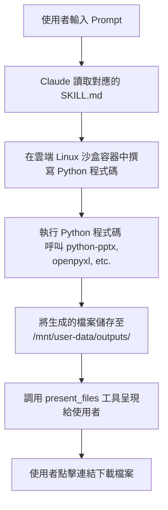

# Claude Skills 安裝與啟用指南

> [!IMPORTANT]
> **🚀 課堂第一步：3 分鐘快速實驗（檢查技能狀態與整合驗證）**
> 
> 由於班上同學的帳號包含 **Free 免費版** 與 **Pro/Team 專業版**，且不同方案對 Skills 的支援度與代碼執行權限不同。請在授課開始時，請全班同學一起進行以下兩項「快速實驗」，即可立刻釐清每位學生的環境狀態並驗證功能！
> 
> **🧪 實驗一：探測已啟用的核心（Public）與範例（Examples）技能**
> 1. 確認已在個人 Settings → **Capabilities** 中將 **Code execution and file creation** 功能切換為**開啟 (On)**。
> 2. 開啟一個新對話，直接複製發送以下 Prompt 給 Claude：
>    > *「請檢查目前此環境的 `/mnt/skills/public/` 目錄，告訴我有哪些已加載的**核心技能 (Public Skills)**？接著檢查 `/mnt/skills/examples/` 目錄，告訴我這底下共有多少個**範例技能 (Examples Skills)**？請簡要列出清單與總個數。」*
> 3. **驗證與診斷**：
>    - **順利回覆（如：Public 核心技能有 9 個，Examples 範例技能有 24 個）** 🎉：代表您的 Claude 帳號具備完整的沙盒磁碟存取與程式碼執行能力，已成功啟用！
>    - **出現「您的帳號方案目前不支援」或提示升級** ⚠️：此時無法使用雲端代碼執行。教學重點請引導該生走 **「手動建立/下載自訂 Skill (內含 SKILL.md)，並點擊『+』上傳 .zip 檔」** 的自訂技能路徑（免費版仍支援手動上傳）。
> 
> **🧪 實驗二：實戰功能驗證（核心技能 🤝 Examples 技能整合）**
> 請引導學生嘗試以下三個簡單的整合型範例，快速驗證「核心技能」與「Examples 範例模板」是否能成功協同運作：
> 
> *   **📊 範例 1：設計主題簡報（`pptx` 核心 + `theme-factory` 範例）**
>     - **Prompt**：*「請幫我規劃一份 3 頁的『AI 在辦公室的應用』簡報大綱。請先讀取 `theme-factory` 範例技能，為我推薦 3 種配色，並將其中最適合科技感的主題色彩（例如深藍配橘色）直接套用到簡報設計中，最後使用內建的 `pptx` 技能生成實體 `.pptx` 簡報檔案供我下載。」*
>     - **驗證點**：Claude 會先讀取 `theme-factory` 規範，再執行 Python 代碼在右側生成一個套用該主題配色的實體簡報檔案。
> *   **📈 範例 2：品牌配色銷售報表（`xlsx` 核心 + `brand-guidelines` 範例）**
>     - **Prompt**：*「請為我模擬一份本月電子產品銷售數據 Excel。請先參考 `brand-guidelines` 範例技能中的 Anthropic 官方品牌配色規範，利用 `xlsx` 技能在 Python 沙盒中生成一個套用該官方色彩的 Excel 報表供我下載。」*
>     - **驗證點**：Claude 能否依據 `brand-guidelines` 色彩樣式，利用 `pandas` 或 `openpyxl` 產出具備官方品牌設計感的實體 `.xlsx` 檔案。
> *   **🎨 範例 3：無障礙前端元件（`frontend-design` 核心 + `web-artifacts-builder` 範例）**
>     - **Prompt**：*「我需要一個具有深色模式切換功能的『個人待辦事項 (Todo List)』React 元件。請使用 `web-artifacts-builder` 的多頁面/狀態管理架構，並搭配內建的 `frontend-design` 無障礙 UI 規範，為我建立一個可在對話右側即時展示與操作的網頁看板（HTML Artifact）。」*
>     - **驗證點**：Claude 是否會在對話右側產生一個符合現代 UI 無障礙規範、支援即時互動的 React 網頁 Artifact。


---

## 🔍 核心觀念：認識 Claude 的 Skills 運作機制

當您進行完上述實驗時，可能會發現：**「有些免費版帳號沒有手動安裝，卻一樣能產出 PPTX 或 Excel 檔案！」** 這是因為 Claude 背後有著獨特的運作邏輯。

### 1. 雲端沙盒與 Python 代碼執行
當您在 Capabilities 中開啟了 **Code execution**（代碼執行），即便帳號中沒有正式安裝 `pptx` 或 `xlsx` 技能，Claude 也能在雲端 Linux 沙盒中**直接撰寫並執行 Python 程式碼**（利用內建的 `python-pptx`、`pandas`、`openpyxl` 等庫）來為您生成與下載實體檔案。

### 2. 📂 自動觸發 (Public) vs. 需指名調用 (Examples)
為了方便向學生說明，老師可以使用以下的「員工入職比喻」：

| 比較維度 | 📂 `public/`（自動觸發） | 📂 `examples/`（需明確指名） |
| :--- | :--- | :--- |
| **生動比喻** | 公司給你的**正式工作手冊**（一入職就發在桌上） | 放在**公司檔案室裡的歷史參考檔案**（要自己去查或被交代才看） |
| **存放路徑** | `/mnt/skills/public/` | `/mnt/skills/examples/` |
| **Claude 的認知** | 預設就知道（寫在系統提示詞中） | 預設不知道（但可用磁碟讀取工具讀取） |
| **是否需提醒？** | **不需要**，直接要求「幫我做一個簡報」即可觸發 | **需要**，必須在對話中明確說「使用 `theme-factory` 技能」 |
| **主要功能** | 生成簡報、試算表、Word 等實體檔案 | 主題套用、畫布排版、寫作風格學習等進階功能 |

> [!WARNING]
> **⚠️ 釐清斜線指令（Slash command）的迷思**
> 
> 在網頁版或桌面版 **claude.ai** 中，輸入 `/` **並不會**像終端機一樣彈出 `/pptx` 或 `/theme-factory` 這類的指令選單。Skills 是在對話背後被自動觸發或根據你的 Prompt 指名啟用的，不需要（也無法）手動輸入斜線指令。

---

## 📂 1. 已啟用核心技能（📂 `/mnt/skills/public/`）

這 9 個核心 Skills 會自動預載於系統提示詞中，當 Claude 偵測到對應任務時會自動啟用：

| 技能名稱 (Skill) | 類別 | 核心功能說明 | 依賴庫 / 資源 |
| :--- | :--- | :--- | :--- |
| **`pptx`** | 文件製作 | 建立或編輯 PowerPoint 簡報（.pptx） | `python-pptx` |
| **`docx`** | 文件製作 | 建立、編輯、讀取 Word 文件（.docx） | `python-docx` |
| **`xlsx`** | 文件製作 | 建立或編輯 Excel 試算表（.xlsx） | `openpyxl`、`pandas` |
| **`pdf`** | 文件製作 | 處理 PDF：讀取、合併、分割、建立等 | `pypdf`、`PyPDF2` |
| **`frontend-design`** | 工程開發 | 現代前端 UI 設計、無障礙設計與元件生成 | React, Tailwind, Lucide |
| **`skill-creator`** | 工程開發 | 逐步引導設計、建立或優化自訂技能 | 官方技能模板 |
| **`file-reading`** | 核心讀取 | 讀取與解析上傳的各類檔案內容 | 系統底層 parser |
| **`pdf-reading`** | 核心讀取 | 專門讀取與解析 PDF 內容與表格 | pdfminer 等 |
| **`product-self-knowledge`** | 核心知識 | Anthropic 產品知識與說明文件查詢 | 官方知識庫 |

---

## 📂 2. 範例技能庫（📂 `/mnt/skills/examples/`）

這些是存放於沙盒磁碟上的 24 個範例技能，平時不會主動生效。**您必須在 Prompt 中明確指名，或引導 Claude 前往該目錄讀取 `SKILL.md`，它才能完全遵循該範本的規範來執行任務！**

我們將這 24 個 Skills 依功能整理如下，並提供對應的觸發 Prompt：

### ⭐ 核心工具與開發類（與創作、開發直接相關）

| 技能名稱 (Skill) | 說明與核心功能 | 建議觸發 Prompt 範例 |
| :--- | :--- | :--- |
| **`theme-factory`** | 為 PPT、文件、網頁套用 10 種預設主題配色與字型，或自訂主題。 | *「幫我做一份 AI 趨勢 PPT，完成後用 **theme-factory** 讓我選主題套用」* |
| **`web-artifacts-builder`** | 使用 React + Tailwind + shadcn/ui 建立複雜的多元件 HTML Artifact（支援路由與多頁面）。 | *「用 **web-artifacts-builder** 幫我做一個有路由切換、多頁面的 React 記帳儀表板」* |
| **`canvas-design`** | 導入 2D 畫布與圖層定位概念，製作海報、藝術品、視覺設計（輸出 .png / .pdf）。 | *「用 **canvas-design** 幫我設計一張科技感的活動海報，輸出 PNG」* |
| **`algorithmic-art`** | 運用 p5.js 製作生成式演算法藝術、粒子系統、流場等程序化視覺藝術。 | *「用 **algorithmic-art** 幫我用 p5.js 生成一個粒子流場的演算法藝術作品」* |
| **`slack-gif-creator`** | 在伺服器端運行 Python 代碼，製作適合 Slack 規格的動態 GIF 表情包。 | *「用 **slack-gif-creator** 幫我做一個 128x128 的跳動火箭動態 GIF，適合 Slack 用」* |
| **`mcp-builder`** | 規劃並自動生成 MCP（Model Context Protocol）伺服器架構代碼與整合 Schema。 | *「用 **mcp-builder** 幫我建立一個 MCP Server，串接 GitHub API」* |
| **`skill-creator`** | Meta Skill。引導使用者撰寫、測試與優化自訂技能（自訂 `SKILL.md`）。 | *「用 **skill-creator** 幫我從頭建立一個新的 Skill，功能是自動生成週報」* |

---

### ✍️ 寫作與溝通類（風格學習與內容協作）

| 技能名稱 (Skill) | 說明與核心功能 | 建議觸發 Prompt 範例 |
| :--- | :--- | :--- |
| **`setup-writing-style`** | 分析並學習使用者的文字風格，讓 AI 草寫的郵件或文章聽起來像您本人。 | *「**learn my writing style**，我貼幾封我寫的 Email 給你分析」* |
| **`doc-coauthoring`** | 協作撰寫長篇文件，以「給予潤飾建議與旁註」為主，不粗暴改寫以保留原作風。 | *「用 **doc-coauthoring** 工作流程幫我寫一份產品需求文件（PRD）」* |
| **`internal-comms`** | 撰寫公司內部溝通文件、公告、專案狀態報告（強調 TL;DR 與責任劃分）。 | *「用 **internal-comms** 幫我寫一份本週的 3P 團隊狀態更新（Progress/Plans/Problems）」* |
| **`brand-guidelines`** | 強制套用 Anthropic 官方品牌色彩（橘、藍）與字型排版風格。 | *「用 **brand-guidelines** 幫我把這份規格書套用 Anthropic 官方品牌配色與排版」* |
| **`learn`** | 學習輔助。引導 Claude 採用蘇格拉底問答方式或特定模型進行循序漸進的教學。 | *「用 **learning mode** 教我理解 Transformer 架構，用蘇格拉底問答方式」* |

---

### 💰 財務與費用類（試算與報銷輔助）

| 技能名稱 (Skill) | 說明與核心功能 | 建議觸發 Prompt 範例 |
| :--- | :--- | :--- |
| **`financial-calculator`** | 財務計算與決策試算：稅務估算、房貸比較、退休預測、租買比較等。 | *「用 **financial-calculator** 幫我比較貸款 20 年 vs 30 年的總利息差距」* |
| **`file-expenses`** | 協助在各費用報銷平台（Expensify, Brex, Concur 等）提交報銷與上傳單據。 | *「用 **file-expenses** 幫我在 Expensify 提交一筆餐費報銷」* |
| **`benepass-reimbursement`**| 專門針對 Benepass 福利平台提交員工福利費用申報與退款申請。 | *「用 **benepass-reimbursement** 幫我在 Benepass 申請健身房費用報銷」* |

---

### 🛒 生活服務類（⚠️ 需具備 Computer Use 能力）

| 技能名稱 (Skill) | 說明與核心功能 | 建議觸發 Prompt 範例 |
| :--- | :--- | :--- |
| **`grocery-shopping`** | 協助訂購外送雜貨，包括選店、建立清單、核對預算並下單。 | *「用 **grocery-shopping** 幫我訂本週的蔬菜水果外送，預算 NT$1000」* |
| **`meal-delivery`** | 訂外賣餐點，從目標到達時間反推最佳下單點，並監控配送狀態。 | *「用 **meal-delivery** 幫我訂晚餐，要在晚上 7 點準時到」* |
| **`hire-help`** | 在 TaskRabbit、Thumbtack 等平台篩選、媒合並預約居家修繕或組裝服務人員。 | *「用 **hire-help** 幫我在 TaskRabbit 找一個週末來家裡組 IKEA 家具的人」* |
| **`event-planning`** | 從預算、場地、賓客到時程排定，自動化規劃與管理各類中大型活動。 | *「用 **event-planning** 幫我規劃一個 20 人的生日派對，預算 NT$15000」* |

---

### 📋 行政與手續類（⚠️ 需具備 Computer Use 能力）

| 技能名稱 (Skill) | 說明與核心功能 | 建議觸發 Prompt 範例 |
| :--- | :--- | :--- |
| **`file-form`** | 處理小型行政手續：如陪審義務回覆、停車罰單線上申訴、護照更新等。 | *「用 **file-form** 幫我處理一張停車罰單，我想線上申訴」* |
| **`return-refund`** | 協助向任何零售商發起退貨流程、填寫退貨理由並追蹤退款進度。 | *「用 **return-refund** 幫我退一個在 Amazon 買的商品」* |
| **`prescription-refill`** | 協助在指定連鎖藥局補充慢箋處方藥（透過線上或電話自動化）。 | *「用 **prescription-refill** 幫我在藥局補充我的血壓藥處方」* |
| **`cancel-unsubscribe`** | 自動化取消定期訂閱或服務，可批量審計歷史帳單並進行訂閱退訂。 | *「用 **cancel-unsubscribe** 幫我取消 Netflix 訂閱」* |
| **`call-to-book`** | 打電話進行預約（需取得使用者明確同意，通話時會主動告知對方是 AI 代理人）。 | *「用 **call-to-book** 幫我打電話預約下週四的牙醫門診」* |

> [!CAUTION]
> **⚠️ 生活與行政類技能的執行限制**
> 
> 生活服務類與行政手續類的 Skills 大多依賴 **Computer Use（電腦操作/瀏覽器自動化）** 機制。在目前一般網頁版 `claude.ai` 對話框中因為沒有開啟電腦模擬操作權限，故**無法完整運行**。這類技能通常只適合在具備對應執行權限或自動化代理 (Agentic CLI) 的環境下使用。

---

## 🛠️ 實戰操作：如何安裝與調用 Skills？

### 1. 如何在對話中直接向 Claude 查詢可用 Skills 與範例？

不需要到 GitHub 去找文件，只要在對話中開啟「Code execution」後，您可以直接複製並發送以下 Prompt 詢問 Claude，它就會報告目前已經為您載入的所有 Skills，甚至提供對應的 Prompt 範例！

#### 📋 一鍵查詢 Skills 魔法 Prompt
```markdown
## Role
你是 Claude 系統大師，對目前已載入、可用的 Skills (技能) 系統瞭若指掌。

## Task
請幫我查詢並報告目前此對話中，已經為我載入或可用的所有 Skills 清單。並針對每一個可用的 Skill，提供一個具體的、可直接複製使用的應用範例提示詞 (Prompt)。

## Constraint
- 語言：繁體中文。
- 若有內建的 pdf, docx, xlsx, pptx 等文件 Skills，也請一併列出。
- 格式：以表格呈現 Skill 名稱與核心功能，並在表格下方以程式碼區塊 (Code block) 條列式提供每一個 Skill 的應用 Prompt 範例。
```

---

### 2. 網頁版/桌面版如何手動上傳自訂 Skill 壓縮檔？
若您想要體驗或向學生示範如何載入自訂的 Skill，請依循以下步驟：
1. 前往官方 GitHub 倉庫 [anthropics/skills](https://github.com/anthropics/skills)。
2. 進入 `skills/` 資料夾，下載您要的技能資料夾（例如 `canvas-design`）。
3. 將該技能資料夾整個**壓縮成 `.zip` 檔**（內部必須包含 `SKILL.md` 指引檔案）。
4. 在 Claude.ai 介面點擊左下角個人頭像 → **Settings** → **Capabilities**。
5. 捲動至下方的 **Skills** 區段，點擊右上角的「**+**」按鈕上傳該 `.zip` 檔。
6. 上傳完成後，將其開關切換為**開啟 (Toggle On)** 即可。

---

### 3. Claude Code（終端機 / 開發者專用 CLI）的安裝方式
如果您是工程師或習慣使用終端機的開發者，在 **Claude Code** 環境下，Skills 是以 **Plugin (外掛)** 的形式被安裝與管理的。

```bash
# 1. 註冊官方 Marketplace 插件庫
/plugin marketplace add anthropics/skills

# 2. 安裝官方 Skill 插件包
/plugin install document-skills@anthropic-agent-skills
/plugin install example-skills@anthropic-agent-skills

# 3. 本機手動複製安裝
# 下載技能資料夾後，直接複製到以下路徑即可自動載入：
# - 個人全域路徑：~/.claude/skills/
# - 專案專屬路徑：./.claude/skills/（位於您的專案根目錄）
```

---

## ⚙️ 產生簡報與文件的背景執行流程

當我們對話中調用如 `pptx` 或 `theme-factory` 等技能時，背後的技術流程如下：



← [返回 Skills 主頁](../README.md)
