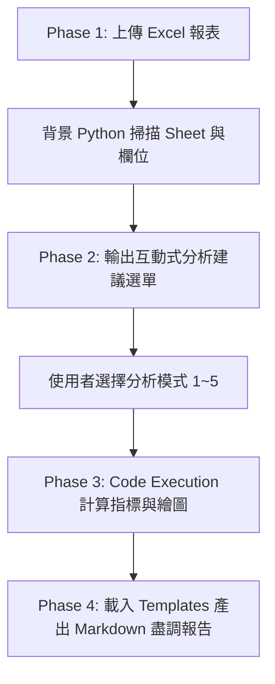

# 💼 創投 (VC) 財報數據分析與 Code Execution Agent Skill

本 Skill 專為創投投資分析師、財務盡調團隊 (FDD) 與投資經理設計，具備 **Excel 報表結構自動掃描**、**零程式基礎的背景 Python 運算繪圖** 與 **互動式分析選單** 之能力。

---

## 🎯 零程式基礎專用：測試 Excel 報表自動生成機制

若使用者表示手邊沒有檔案或要求「`請幫我生成測試用的創投財務報表`」，直接在背景執行以下 Python 代碼產出一份標準 Excel 檔並提供下載按鈕：

```python
import pandas as pd
import numpy as np

# 生成測試財報數據 (包含 P&L, Cash Flow, KPIs 三張 Sheet)
months = pd.date_range(start="2025-01-01", periods=12, freq="MS").strftime("%Y-%m")
mrr = np.array([50000, 54000, 59000, 65000, 72000, 80000, 89000, 98000, 108000, 119000, 130000, 142000])
total_revenue = mrr + np.random.randint(5000, 15000, size=12)
cogs = (total_revenue * 0.22).astype(int)
gross_profit = total_revenue - cogs

df_pnl = pd.DataFrame({"月份": months, "總營收": total_revenue, "毛利": gross_profit})
with pd.ExcelWriter("sample_startup_financials.xlsx") as writer:
    df_pnl.to_excel(writer, sheet_name="損益表 P&L", index=False)
```

---

## ⚙️ 4 階段標準自動化執行流程 (SOP)



---

## 🔹 Phase 1: 報表上傳與結構自動掃描 (File Inspection)

當使用者提供 Excel 或 CSV 財報時，**在背景**執行以下 Python 腳本掃描檔案（不要顯示龐大程式碼給使用者看，僅輸出結構結果）：

```python
import pandas as pd

# 讀取檔案結構
excel_path = "uploaded_file.xlsx"
xl = pd.ExcelFile(excel_path)
print(f"📊 偵測到的工作表 (Sheets)：{xl.sheet_names}")

# 預覽每個 Sheet 前 3 行欄位
for sheet in xl.sheet_names:
    df_preview = pd.read_excel(excel_path, sheet_name=sheet, nrows=3)
    print(f"Sheet [{sheet}] 欄位：{list(df_preview.columns)}")
```

---

## 🔹 Phase 2: 輸出互動式分析建議選單 (Interactive Menu Generation)

掃描完欄位後，依據偵測到的數據內容（如損益表 P&L、現金流 Cash Flow、營運指標 KPI），輸出以下格式的互動選單詢問使用者：

> 💡 **偵測結果**：已成功讀取財報檔案！包含 `{{SHEET_NAMES}}` 等工作表。
>
> 請選擇您希望進行的財務分析模式（可回覆數字或指定模式）：
>
> 1. **📊 模式 1：財務健康度與 Cash Runway 深度診斷**  
>    * 焦點：現金餘額變化、月淨燒錢率 (Net Burn)、Runway 斷裂點預警與損益平衡點。
> 2. **📈 模式 2：營收與成本結構成長趨勢分析**  
>    * 焦點：MRR / ARR 成長率、毛利率 (Gross Margin) 趨勢、OpEx 費用占比 (R&D / S&M / G&A)。
> 3. **🎯 模式 3：SaaS Unit Economics 與客戶動態分析**  
>    * 焦點：ARPU 趨勢、客戶流失率 (Churn Rate)、淨營收留存率 (NDR) 與 LTV/CAC 估算。
> 4. **🚨 模式 4：財務異常與 Red Flags 風險預警**  
>    * 焦點：對照創投規章，檢測毛利率驟降、S&M 異常暴爆增、應收帳款異常等紅燈風險。
> 5. **🏆 模式 5：全方位創投 IC 委員會財務盡調簡報 (推薦)**  
>    * 焦點：涵蓋上述 1~4 全面向數據運算、生成雙張視覺化圖表與 IC 創辦人必問 3 大考題。

---

## 🔹 Phase 3: Python Code Execution 數據運算與圖表渲染

當使用者確認選擇後，依據 [references/code-execution-rules.md](file:///Users/roberthsu2003/Documents/GitHub/workflow-productivity/Claude_ai/Skills/VC_Financial_Analyzer/references/code-execution-rules.md) 之規範：

1. **資料計算**：
   - 引用 [references/financial-metrics-guide.md](file:///Users/roberthsu2003/Documents/GitHub/workflow-productivity/Claude_ai/Skills/VC_Financial_Analyzer/references/financial-metrics-guide.md) 之公式計算所有 KPI。
   - 算出的精準數值絕不憑空猜測。
2. **圖表繪製**：
   - 執行 Python matplotlib/seaborn 繪製專業圖表。
   - 輸出圖片至 `charts/financial_trend.png` 與 `charts/cash_runway_chart.png`。

---

## 🔹 Phase 4: 套用範本產出報告 (Report Generation)

載入 [templates/financial-report-template.md](file:///Users/roberthsu2003/Documents/GitHub/workflow-productivity/Claude_ai/Skills/VC_Financial_Analyzer/templates/financial-report-template.md) 樣板，將 Python 算出的精確數據與生成的圖片連結填入對應變數中，產出完整且高品質的 Markdown 財務盡調報告。
