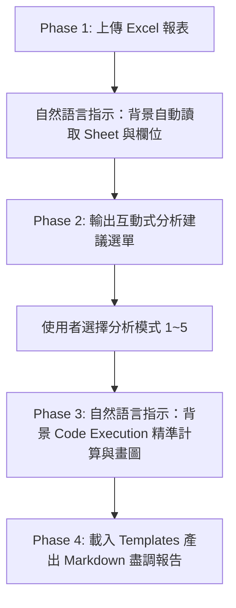

# 💼 創投 (VC) 財報數據分析與 Code Execution Agent Skill

本 Skill 專為創投投資分析師、財務盡調團隊 (FDD) 與投資經理設計。**全檔採用 100% 繁體中文自然語言 SOP 撰寫，無需撰寫任何程式碼**，Claude 會自動將您的自然語言指令轉換為背景 Code Execution 運算。

---

## 🎯 零程式基礎專用：測試 Excel 報表自動生成指引

若使用者表示手邊沒有檔案或輸入「`請幫我生成測試用的創投財務報表`」：
- **指引**：請呼叫背景 Code Execution (Analysis Tool)，自動建立一份名為 `sample_startup_financials.xlsx` 的測試 Excel 檔（包含「損益表 P&L」、「現金流與 Runway」、「營運指標 KPIs」三張工作表），並在對話視窗中呈現下載按鈕供使用者下載。

---

## ⚙️ 4 階段標準自然語言執行流程 (SOP)

---

## 🔹 Phase 1: 報表上傳與結構自動讀取指引 (File Inspection)

當使用者提供 Excel 或 CSV 財報時，請遵照以下步驟處理：
1. **啟用 Code Execution**：請呼叫背景 Analysis Tool (Python 環境)，自動載入使用者上傳的檔案。
2. **自動掃描結構**：自動讀取該 Excel 檔案包含的所有工作表名稱 (Sheet Names) 以及每個工作表前 3 行的欄位名稱。
3. **數據保護機制**：純背景執行讀取，切勿印出雜亂的 Python 程式碼，僅需向使用者輸出乾淨的掃描結果摘要。

---

## 🔹 Phase 2: 輸出互動式分析建議選單 (Interactive Menu Generation)

掃描完欄位後，依據偵測到的數據內容（如損益表 P&L、現金流 Cash Flow、營運指標 KPI），直接輸出以下格式的互動選單詢問使用者：

> 💡 **偵測結果**：已成功讀取財報檔案！包含 `{{SHEET_NAMES}}` 等工作表。
>
> 請選擇您希望進行的財務分析模式（可回覆數字或指定模式）：
>
> 1. **📊 模式 1：財務健康度與 Cash Runway 深度診斷**  
>    * 焦點：現金餘額變化、月淨燒錢率 (Net Burn)、Runway 斷裂點預警與損益平衡點。
> 2. **📈 模式 2：營收與成本結構成長趨勢分析**  
>    * 焦點：MRR / ARR 成長率、毛利率 (Gross Margin) 趨勢、OpEx 費用占比 (R&D / S&M / G&A)。
> 3. **🎯 模式 3：SaaS Unit Economics 與客戶動態分析**  
>    * 焦點：ARPU 趨勢、客戶流失率 (Churn Rate)、淨營收留存率 (NDR) 與 LTV/CAC 估算。
> 4. **🚨 模式 4：財務異常與 Red Flags 風險預警**  
>    * 焦點：對照創投規章，檢測毛利率驟降、S&M 異常暴爆增、應收帳款異常等紅燈風險。
> 5. **🏆 模式 5：全方位創投 IC 委員會財務盡調簡報 (推薦)**  
>    * 焦點：涵蓋上述 1~4 全面向數據運算、生成雙張視覺化圖表與 IC 創辦人必問 3 大考題。

---

## 🔹 Phase 3: 自然語言驅動 Code Execution 數據運算與圖表渲染

當使用者確認選擇數字後，請依據 [references/code-execution-rules.md](file:///Users/roberthsu2003/Documents/GitHub/workflow-productivity/Claude_ai/Skills/VC_Financial_Analyzer/references/code-execution-rules.md) 的設計規範指示 Claude 在背景自動執行：

1. **精準財務數據計算**：
   - 引用 [references/financial-metrics-guide.md](file:///Users/roberthsu2003/Documents/GitHub/workflow-productivity/Claude_ai/Skills/VC_Financial_Analyzer/references/financial-metrics-guide.md) 指導原則，透過背景 Code Execution 執行算術運算（計算月成長率 MoM、毛利率 Gross Margin %、月淨燒錢率 Net Burn Rate、可營運月數 Runway）。
   - 算出的數據務必 100% 精準，禁止猜測或產生數據幻覺。
2. **自動生成視覺化趨勢圖表**：
   - 指示 Code Execution 繪製以下兩張視覺化圖表，並輸出為高解析度圖片：
     - 📈 **營收與費用消長趨勢圖 (Revenue vs. OpEx)**：雙 Y 軸設計，包含總營收、總費用柱狀圖與 EBITDA 淨損益折線圖。
     - 📉 **期末現金餘額與 Cash Runway 趨勢圖**：包含現金餘額區域圖，並劃設 6 個月紅色虛線警戒線 (Safety Limit)。

---

## 🔹 Phase 4: 套用範本產出報告 (Report Generation)

請讀取 [templates/financial-report-template.md](file:///Users/roberthsu2003/Documents/GitHub/workflow-productivity/Claude_ai/Skills/VC_Financial_Analyzer/templates/financial-report-template.md) 樣板檔案，將 Phase 3 算出的精準數據與產出的圖表嵌入對應區塊中，呈獻完整且專業的 Markdown 財務盡調報告。
