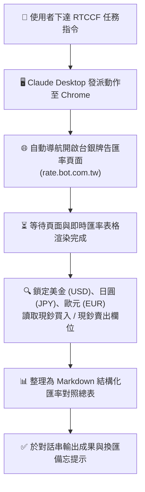

# 💱 範例 1：台灣銀行即時牌告匯率自動爬取與結構化換算表

> 🟢 **難度等級**：**Level 1（入門體驗・公開網頁免登入數據擷取）**  
> 💻 **適用環境**：Chrome 瀏覽器（已安裝 Claude in Chrome 擴充功能）+ Claude Desktop / Web  
> 💼 **適用角色**：財務會計、外貿出納、海外採購、差旅行政、跨國電商營運。  
> 🎯 **核心體驗**：
> - 🌐 **公開網頁自動導航**：指令一下，Claude 自動在 Chrome 中開啟台灣銀行牌告匯率頁面。
> - 📖 **結構化表格精準解析**：自動識別網頁 HTML 結構，精準鎖定指定幣別的「現鈔買入」與「現鈔賣出」價格。
> - 📊 **自動化成果交付**：將分散的網頁數據一秒彙整為乾淨的 Markdown 總表，完全免去手動查表與手動輸入。

---

## 🎭 職場痛點劇場：出納每天早上的「查表拷貝手」

> *「每天早上 9:30，出納小陳都要準時打開台灣銀行網頁，把美金、日圓、歐元的現鈔買入與賣出匯率一個字一個字抄進財務系統與 Excel 表格中。遇到月底結帳或海外請款高峰，還要手動比對價差……只要一個小數點抄錯，整張傳票就得重跑。」*

**現在，讓 Claude in Chrome 替您直接打開網頁，5 秒精準擷取牌告數據！**

---

## 🛠️ 前置準備與網站授權

1. **安裝擴充功能**：確認 Chrome 已安裝官方 **Claude in Chrome** 擴充功能，且右上方圖示顯示為正常連線狀態。
2. **授權網站存取**：
   - 台灣銀行牌告匯率網址為：`https://rate.bot.com.tw`
   - 若在 Claude Desktop 設定中將預設權限設為「Allow」，或點擊擴充功能彈窗允許存取該網域即可順暢執行。
3. **安全核准模式建議**：
   - 本任務為純公開網頁讀取，無任何帳號密碼或表單提交風險，建議選擇 **Auto**（自動審核）模式流暢執行。

---

## 🔄 任務運作流程圖



---

## 🤖 RTCCF 結構化實戰 Prompt

請直接複製以下經過嚴格排版與結構化設計的 Prompt，貼入已開啟 Claude in Chrome 連線的對話框中：

```markdown
## Role
你是一名專業的企業**外匯風險管理師**與**出納財務分析助理**。

## Task
請使用 **Claude in Chrome** 開啟台灣銀行牌告匯率官方網頁（`https://rate.bot.com.tw`），擷取今日最新的外幣牌告數據，並完成以下任務：
1. 鎖定以下 3 種核心外幣：**美金 (USD)**、**日圓 (JPY)**、**歐元 (EUR)**。
2. 讀取並記錄各幣別的 **現鈔買入** 與 **現鈔賣出** 牌告匯率。
3. 整理成結構清晰的 Markdown 比較表格，並於表格下方標註資料擷取之系統時間。

## Context
- 目標網址：`https://rate.bot.com.tw`（台灣銀行牌告匯率首頁）
- 執行工具：Claude in Chrome 瀏覽器擴充功能

## Constraint
- 匯率數值必須百分之百對齊當前網頁所載數字，**嚴禁憑空推估**。
- 若網頁載入延遲，請確認表格內容完整載入後再行讀取。
- 輸出語言一律使用**繁體中文**。

## Format
輸出標準 Markdown 格式，包含：
1. **今日核心外幣牌告匯率總表**（欄位：**幣別名稱**、**幣別代碼**、**現鈔買入**、**現鈔賣出**、**點差/備註**）
2. **資料擷取時間與外匯結算備忘**（包含擷取時間戳記與企業換匯小提醒）
```

---

## 📋 預期交付成果展示（Markdown 範例）

執行完成後，Claude 將回傳類似以下的結構化報告：

### 今日核心外幣牌告匯率總表

| 幣別名稱 | 幣別代碼 | 現鈔買入 | 現鈔賣出 | 買賣價差 (點差) | 備註說明 |
| :--- | :---: | :---: | :---: | :---: | :--- |
| **美金** | USD | 31.8500 | 32.5200 | 0.6700 | 企業進出口主要結算幣別 |
| **日圓** | JPY | 0.2085 | 0.2213 | 0.0128 | 現鈔差旅常用幣別 |
| **歐元** | EUR | 33.5000 | 34.8400 | 1.3400 | 歐洲採購與差旅結算 |

> 🕒 **資料擷取時間**：`2026-09-13 10:15:24 (GMT+8)`  
> 💡 **外匯結算備忘**：
> - 臨櫃提領或兌換現鈔請參考「現鈔匯率」；若為帳戶間外幣存款轉帳或電子海外匯款，請改參考「即期匯率」。
> - 若單日結匯金額超過新台幣 50 萬元，出納同仁需依規定備齊相關交易合約填寫大額結匯申報書。

---

## 💡 實戰技巧與常見問題 (FAQ)

> [!TIP]
> 1. **想查更多幣別？**  
>    您可以直接在 Prompt 中追加人民幣 (CNY)、英鎊 (GBP)、澳幣 (AUD) 等，Claude 會自主在同一個頁面中向下捲動並比對幣別代碼。
> 2. **如果網頁版面微調怎麼辦？**  
>    Claude in Chrome 具備視覺與 DOM 雙重理解能力，即使網頁欄位排版有輕微更新，只要標籤語意仍在，依然能精準鎖定現鈔買賣價。

---

← [返回 Claude in Chrome 主講義](../../README.md) | 🏠 [返回專案總首頁](../../../README.md)
