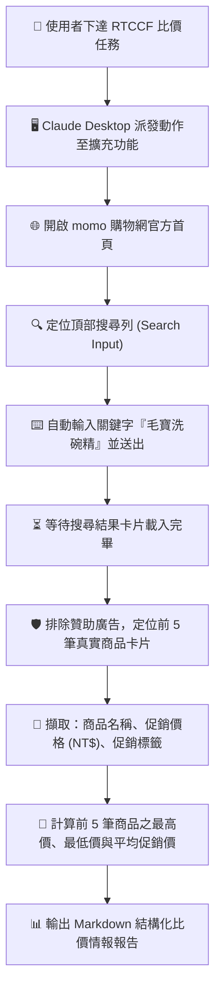

# 🛒 範例 2：momo 購物網動態搜尋與商品定價情報比價

> 🟢 **難度等級**：**Level 2（實用技能・動態表單與電商搜尋）**  
> 💻 **適用環境**：Chrome 瀏覽器（已安裝 Claude in Chrome 擴充功能）+ Claude Desktop / Web  
> 💼 **適用角色**：電商營運人員、採購專員、品牌行銷、通路經理、市場行銷企劃。  
> 🎯 **核心體驗**：
> - ⌨️ **動態表單自動化互動**：模擬真實使用者在網頁搜尋欄輸入關鍵字並觸發搜尋。
> - 📜 **動態渲染與頁面滾動**：應對現代電商 SPA 動態載入結構，自主翻閱並提取卡片資訊。
> - 💰 **價格情報即時萃取**：擷取前 5 筆熱銷商品品名與促銷定價，自動換算平均價格帶。

---

## 🎭 職場痛點劇場：促銷檔期的「比價查核噩夢」

> *「雙十一／中秋檔期前夕，主管要求立刻確認主力商品在 momo 上的曝光狀況與目前同類商品的前 5 名定價水準。採購與行銷人員必須手動開啟瀏覽器、輸入關鍵字、跳過一堆廣告橫幅、一邊按計算機算平均單價、一邊謄寫至報告中……」*

**現在，只要一句指令，Claude in Chrome 會自動幫您打開 momo、搜尋商品、抓取前 5 名價格並算出平均行情！**

---

## 🛠️ 前置準備與網站授權

1. **連線狀態確認**：確定 Chrome 右上角之 Claude in Chrome 擴充功能處於綠燈連線狀態。
2. **授權網域存取**：
   - momo 購物網網址：`https://www.momoshop.com.tw`
   - 請確認該網址已加入允許清單，或在彈出核准對話框時點選「Allow」。
3. **動態載入防護**：電商網站常含大量廣告圖層與延遲載入（Lazy Loading），Claude in Chrome 能自動等待 DOM 元素穩定後再解析數據。

---

## 🔄 任務運作流程圖



---

## 🤖 RTCCF 結構化實戰 Prompt

請複製以下結構化 Prompt 貼入對話框發起任務：

```markdown
## Role
你是一名資深的**電商通路營運經理**與**市場價格監控分析師**。

## Task
請使用 **Claude in Chrome** 開啟 momo 購物網官方首頁（`https://www.momoshop.com.tw`），執行商品動態搜尋與前 5 筆價格情報蒐集：
1. 進入首頁後，定位頂部搜尋框，輸入關鍵字：**毛寶洗碗精** 並送出搜尋。
2. 待搜尋結果頁面載入完成後，依序收集 **前 5 筆商品卡片** 之詳細情報。
3. 針對每一筆商品精準擷取：**品牌與商品品名**、**促銷優惠價格 (NT$)** 與 **目前行銷標籤/規格**。
4. 排除促銷符號干擾，將 5 筆商品整理成 Markdown 表格，並於表格下方試算出這 5 筆商品的 **平均促銷單價**。

## Context
- 目標電商：momo 購物網官方網站（`https://www.momoshop.com.tw`）
- 監控品牌關鍵字：**毛寶洗碗精**
- 執行工具：Claude in Chrome 瀏覽器擴充功能

## Constraint
- 必須精確過濾頂部輪播廣告或非相關贊助橫幅，鎖定主商品列表。
- 促銷價格須精準擷取折後實際金額，數字須轉換為數值型態以供計算。
- 輸出語言一律使用**繁體中文**。

## Format
請輸出標準 Markdown 格式報告，結構包含：
1. **毛寶洗碗精 momo 搜尋前 5 筆商品情報表**（欄位：**排名**、**商品品名**、**促銷價格 (NT$)**、**規格/促銷標籤**）
2. **價格帶分析卡**（包含：**最高價**、**最低價**、**平均促銷價格**與電商上架觀察）
```

---

## 📋 預期交付成果展示（Markdown 範例）

### 毛寶洗碗精 momo 搜尋前 5 筆商品情報表

| 排名 | 商品品名 | 促銷價格 (NT$) | 規格 / 促銷標籤 |
| :---: | :--- | :---: | :--- |
| **01** | 【毛寶】小蘇打植萃洗碗精 補充包 1000g (6包/箱) | $599 | 箱購特惠 / 植萃環保 |
| **02** | 【毛寶】小蘇打洗碗精 按壓瓶 1000g + 補充包 1000g | $249 | 買一送一超值組 |
| **03** | 【毛寶】抗菌洗碗精 (天然無香精配方) 1000g 4入組 | $389 | 敏弱肌推薦 / 抗菌升級 |
| **04** | 【毛寶】制菌小蘇打洗碗精 4000ml 大容量營業用桶裝 | $329 | 大容量量販裝 |
| **05** | 【毛寶】小蘇打植萃洗碗精補充包 1000g 單包 | $109 | 單包嘗鮮價 |

### 價格帶分析卡

- 📈 **最高促銷價**：$599（箱購 6 包組）
- 📉 **最低促銷價**：$109（單包補充包）
- 📊 **平均促銷價格**：**$335**
- 💡 **通路營運觀察**：
  1. 目前 momo 搜尋前兩名皆由「箱購大包裝」與「瓶裝+補充包合購組」佔據，顯示多包量販組合具有較高點擊轉換率。
  2. 單瓶平均價格帶落在 $100 ~ $120 之間，建議後續行銷促銷活動可將滿額贈活動門檻設定於 $499，以拉高客單價。

---

## 💡 實戰技巧與常見問題 (FAQ)

> [!TIP]
> 1. **遇上電商網站滿版活動蓋板廣告怎麼辦？**  
>    Claude in Chrome 具備視覺判讀能力，如果發現畫面被活動彈窗（Pop-up modal）遮蔽，它通常會先辨識右上角的「關閉 (X)」或空白處點擊關閉，再行搜尋。
> 2. **如何指定特定品牌？**  
>    若只想搜尋某特定系列，可在 Task 中明確寫入：「若品名未包含『小蘇打』則跳過，依序往下擷取至滿 5 筆為止」。

---

← [返回 Claude in Chrome 主講義](../../README.md) | 🏠 [返回專案總首頁](../../../README.md)
