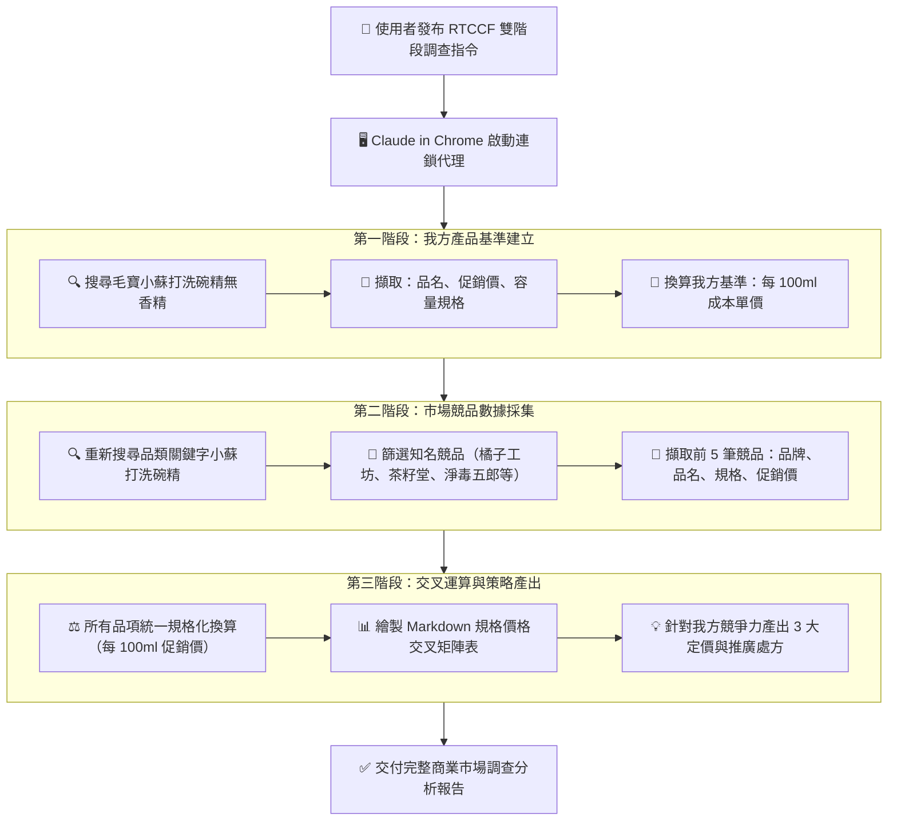

# 🔍 範例 3：雙階段競品市場調查與規格價格交叉對比分析

> 🟢 **難度等級**：**Level 3（深度分析・連鎖多階段任務）**  
> 💻 **適用環境**：Chrome 瀏覽器（已安裝 Claude in Chrome 擴充功能）+ Claude Desktop / Web  
> 💼 **適用角色**：產品經理 (PM)、品牌總監、市場研究員、定價策略顧問。  
> 🎯 **核心體驗**：
> - 🔄 **多階段連鎖查詢工作流**：第一階段鎖定我方產品基準 ➔ 第二階段擴大掃描市場 5 強競品 ➔ 第三階段進行深度數據交叉分析。
> - ⚖️ **單位規格標準化換算**：自動解析多樣化的包裝容量（g / ml / 瓶裝 / 補充包），統一換算為「每 100ml / 100g 單價」，消除容量陷阱。
> - 💡 **商業決策洞察自動化**：不只輸出數據表格，更能基於真實市場行情，產出具備商業說服力的 3 大定價與行銷策略建議。

---

## 🎭 職場痛點劇場：產品經理的「容量與價格換算陷阱」

> *「下週二要向行銷副總報告新一代『無香精小蘇打洗碗精』的電商上架定價策略。市面上競品五花八門：有的賣 500ml 壓頭瓶裝、有的賣 1200ml 補充包、有的賣 4 瓶組合價。每次手動整理，光是用計算機除以毫升數、拉 Excel 比較表就耗掉半天，還經常算錯……」*

**現在，運用 Claude in Chrome，將「多步驟跨頁搜尋 ➔ 規格換算 ➔ 競爭力診斷」一氣呵成！**

---

## 🛠️ 前置準備與網站授權

1. **連線與權限**：確認 Claude in Chrome 擴充功能已啟用，並授權存取 `https://www.momoshop.com.tw`。
2. **核准模式建議**：
   - 由於本任務包含多階段搜尋與頁面跳轉，推薦使用 **Auto（自動審查）** 模式，讓 Claude 連續自主推進。若需教學示範每一步操作，可選擇 **Manual（手動核准）**。

---

## 🔄 雙階段任務運作架構圖



---

## 🤖 RTCCF 結構化實戰 Prompt

請複製以下結構化 Prompt，貼入對話框發起任務：

```markdown
## Role
你是一名專精於 FMCG（快速消費品）的**資深產品策略經理 (Senior Product Manager)** 與**市場定價顧問**。

## Task
請使用 **Claude in Chrome** 開啟 momo 購物網（`https://www.momoshop.com.tw`），執行雙階段競品市場調查與交叉比對分析：

1. **第一階段（我方基準資料建立）**：
   - 於搜尋框輸入 **毛寶 小蘇打洗碗精 無香精** 並執行搜尋。
   - 記錄我方代表性單品的促銷價格、容量規格（ml 或 g），並換算出每 100ml 之單位售價。

2. **第二階段（市場競品數據採集）**：
   - 清空搜尋框，重新搜尋 **小蘇打洗碗精**。
   - 篩選出 5 款具代表性的主流競爭品牌（例如：**橘子工坊**、**茶籽堂**、**淨毒五郎**、**白貓**、**清淨海**等）。
   - 擷取這 5 筆競品的 **品牌名稱**、**完整商品名稱**、**包裝規格容量** 與 **促銷價格**。

3. **第三階段（規格標準化換算與商業策略產出）**：
   - 將我方產品與 5 筆競品統一換算為 **每 100ml 促銷單價 (NT$)**。
   - 產出 Markdown 綜合規格價格對比矩陣表。
   - 針對我方產品在該價格帶的性價比優勢與市場定位，提供 3 點具體可落地的定價調整或通路包裝策略建議。

## Context
- 目標電商平台：momo 購物網
- 我方基準產品：**毛寶 小蘇打洗碗精（無香精系列）**
- 執行工具：Claude in Chrome 擴充功能

## Constraint
- 容量換算必須百分之百精準，嚴防因組合包裝（多入組）導致每毫升單價失真。
- 策略建議須具備商業行銷邏輯（如 **高 CP 值突圍**、**家庭號量販策略**、**環保綠色溢價** 等），嚴禁空泛口號。
- 輸出語言一律使用**繁體中文**。

## Format
請輸出標準 Markdown 格式市場調研報告，包含：
1. **我方產品基準數據卡**
2. **市場小蘇打洗碗精主流 5 強規格價格對比總表**（含：**品牌**、**品名**、**促銷價**、**規格容量**、**換算每 100ml 單價**）
3. **定價競爭力綜合診斷與 3 大市場進擊處方**
```

---

## 📋 預期交付成果展示（Markdown 範例）

### 1. 我方產品基準數據卡
- **產品名稱**：毛寶 小蘇打植萃洗碗精 無香精配方（按壓瓶裝）
- **包裝容量**：1000ml / 瓶
- **目前促銷價格**：NT$ 129
- **單位基準單價**：**NT$ 12.9 / 100ml**

---

### 2. 市場主流競品規格價格交叉對比總表

| 品牌名稱 | 商品品名 | 促銷價格 | 包裝規格容量 | 換算每 100ml 單價 | 價格競爭力定位 |
| :--- | :--- | :---: | :---: | :---: | :---: |
| **毛寶（我方基準）** | 小蘇打植萃洗碗精 無香精 | **NT$ 129** | **1000ml** | **NT$ 12.9** | **高性價比大眾主流** ⭐ |
| **橘子工坊** | 天然濃縮去油小蘇打洗碗精 | NT$ 189 | 650g | NT$ 29.1 | 品牌天然高端溢價 |
| **淨毒五郎** | 蔬果小蘇打洗碗精按壓瓶 | NT$ 330 | 500ml | NT$ 66.0 | 母嬰有機綠色利基 |
| **茶籽堂** | 苦茶苷小蘇打洗潔液 | NT$ 380 | 550ml | NT$ 69.1 | 頂級植萃精品美學 |
| **清淨海** | 環保小蘇打洗碗精 | NT$ 99 | 500g | NT$ 19.8 | 綠標平價環保 |
| **白貓** | 濃縮小蘇打洗碗精補充包 | NT$ 149 | 1200g | NT$ 12.4 | 傳統超值量販 |

---

### 3. 定價競爭力綜合診斷與 3 大市場進擊處方

1. **確立「親民無負擔的大眾植萃第一品牌」定價護城河**：
   - 我方每 100ml 僅 **NT$ 12.9**，相比高端品牌（淨毒五郎 $66、茶籽堂 $69）具備壓倒性的性價比優勢，同時在容量上高達 1000ml，遠勝競品常見的 500ml 規格。
   - **行動處方**：於 momo 主圖上加大標註「1000ml 豪華大容量・每 100ml 僅需 $12.9」之視覺標籤，直擊精打細算的家庭主婦心智。
2. **迎戰白貓等超低價競品：推行「箱購補充包定期定額組合」**：
   - 白貓補充包每 100ml 來到 $12.4，略低於我方。為防守價格敏感型客群，建議將「1 瓶 + 3 補充包」組合定價在 $399，將平均單價壓低至 $11.5/100ml，全面封殺低價品牌防線。
3. **主打「敏弱肌無香精」差異化賣點，吸納中高階過敏客群**：
   - 橘子工坊與淨毒五郎主要訴求天然植萃，但定價高昂。我方產品兼具小蘇打去油與「無香精無刺激」雙重特色，可鎖定嬰兒餐具清洗族群，以半價不到的優勢吸引追求安全但不想花大錢的消費者。

---

## 💡 實戰技巧與常見問題 (FAQ)

> [!TIP]
> 1. **遇上不同單位（g 與 ml）如何處理？**  
>    在一般清潔劑比重約 1:1（1g ≈ 1ml）之物理常識下，Claude 能自動做出標準化近似換算，並在備註中清楚說明計算基準。
> 2. **想要匯出 Excel？**  
>    產出 Markdown 表格後，您可以直接對 Claude 下達：「請幫我將上表寫入一個 `competitive_analysis.csv` 檔案」，即可一秒下載。

---

← [返回 Claude in Chrome 主講義](../../README.md) | 🏠 [返回專案總首頁](../../../README.md)
