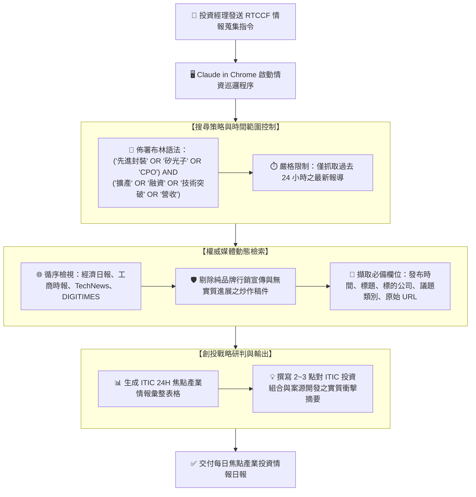

# 🏢 範例 4：企業實戰・ITIC 每日焦點產業新聞與投資情資自動化監測

> 🔵 **難度等級**：**Level 4（企業實務・布林檢索與情資過濾）**  
> 💻 **適用環境**：Chrome 瀏覽器（已安裝 Claude in Chrome 擴充功能）+ Claude Desktop / Web  
> 💼 **適用角色**：創投 (VC) 投資經理、技術轉移專家 (ITIC)、產業分析師、智庫研究員、企業策略投資部 (CVC)。  
> 🎯 **核心體驗**：
> - 🎯 **布林邏輯精準檢索**：運用 `AND` / `OR` 複合布林語法與過去 24 小時時間限制，過濾掉 95% 無關雜訊。
> - 📰 **權威科技財經媒體巡檢**：自動導航經濟日報、工商時報、TechNews 與 DIGITIMES 等權威產業媒體。
> - 🧠 **創投戰略影響自動評估**：不僅提取新聞事實，更進一步站在創投與技術移轉視角，產出實質的投後管理與案源評估摘要。

---

## 🎭 企業情境劇場：ITIC 創投團隊的清晨情報戰

> *「創新工業技術移轉股份有限公司 (ITIC) 作為台灣頂尖的技術商品化與創投資本機構，團隊每天清晨 8:30 的晨會必須掌握『半導體先進封裝 (CoWoS/FOPLP)』、『矽光子 (CPO)』與『AI 晶片硬體』的最新融資、擴產與研發突破。投資經理小張每天早上得瘋狂瀏覽四、五家財經媒體網站，手動截圖、複製貼上，深怕漏掉任何一條攸關投資標的之重大快訊……」*

**現在，讓 Claude in Chrome 充當您的頂級產業情報助理，自動巡檢媒體並生成晨會簡報！**

---

## 🛠️ 前置準備與網站授權

1. **連線狀態確認**：確認 Chrome 擴充功能連線正常。
2. **授權網域存取**：
   - 建議於設定中允許主流財經科技媒體網域，例如：
     - `https://udn.com`（經濟日報）
     - `https://www.ctee.com.tw`（工商時報）
     - `https://technews.tw`（科技新報）
     - `https://www.digitimes.com.tw`（電子時報）
3. **安全模式建議**：採用 **Auto** 模式，由 Claude 自動審核安全並持續推進抓取。

---

## 🔄 任務運作流程圖



---

## 🤖 RTCCF 結構化實戰 Prompt

請複製以下專門為 ITIC 與創投機構客製化的 RTCCF Prompt，貼入對話框發起任務：

```markdown
## Role
你是一名任職於**創新工業技術移轉股份有限公司 (ITIC)** 的**資深半導體與 AI 創投分析師**。

## Task
請使用 **Claude in Chrome** 執行『ITIC 每日焦點產業與重點投資標的新聞情報監測』任務：

1. **搜尋策略與時間範圍設定**：
   - 聚焦核心賽道：**半導體先進封裝 (CoWoS/FOPLP)**、**矽光子 (CPO)**、**AI 伺服器硬體供應鏈**。
   - 檢索布林邏輯組合：
     `("先進封裝" OR "矽光子" OR "CPO") AND ("擴產" OR "融資" OR "技術突破" OR "營收")`。
   - 時間範圍嚴格控制：僅限搜尋**過去 24 小時內**發布之最新報導。

2. **網頁巡檢與情報結構化提取**：
   - 自動開啟並巡檢國內外權威科技與財經媒體（例如：經濟日報、工商時報、科技新報 TechNews、電子時報 DIGITIMES）。
   - 嚴格剔除公關置入與炒作稿，擷取符合條件新聞之 5 大必備欄位：
     『發布時間』、『新聞標題』、『關鍵企業/機構』、『核心議題分類』與『真實原始連結』。

3. **結構化情報日報產出**：
   - 將搜集到的情報整理成 Markdown 表格輸出。
   - 於報告末尾，針對 ITIC 旗下投資組合公司與潛在技術移轉評估，提供 2~3 點具戰略價值的評估摘要。

## Context
- 監測機構：創新工業技術移轉股份有限公司 (ITIC)
- 執行工具：Claude in Chrome 擴充功能

## Constraint
- 新聞必須具備真實資訊源，每筆記錄必須附上完整可點擊之原始 URL。
- 戰略評估切忌泛泛之談，需直指擴產時程、資本支出、技術瓶頸或估值影響。
- 輸出語言一律使用**繁體中文**。

## Format
請產出結構完整的投資情資晨報，包含：
1. **【ITIC 每日焦點產業情報彙整總表】**（含時間、標題、標的公司、議題、連結）
2. **【重大產業動態對投資佈局與技術移轉之戰略影響評估】**
```

---

## 📋 預期交付成果展示（Markdown 範例）

### 【ITIC 每日焦點產業情報彙整總表】

| 發布時間 | 新聞標題 | 關鍵企業 / 機構 | 核心議題分類 | 原始來源連結 |
| :---: | :--- | :---: | :---: | :---: |
| **09-13 08:30** | 台積電擴大 CoWoS 產能！嘉義兩座先進封裝廠加速建置年底前裝機 | 台積電 (TSMC) | 資本支出 / 擴產 | [經濟日報報導連結](https://money.udn.com/) |
| **09-13 07:45** | 矽光子聯盟正式成軍！瞄準 CPO 光通訊商機，2026 年迎爆發成長 | 矽光子產業聯盟 / 日月光 | 技術標準 / 聯盟合作 | [TechNews報導連結](https://technews.tw/) |
| **09-12 18:20** | 面板級扇出型封裝 (FOPLP) 新突破：群創攜手晶片大廠切入車用雷達 | 群創光電 (Innolux) | FOPLP / 跨界轉型 | [工商時報報導連結](https://ctee.com.tw/) |

---

### 【重大產業動態對投資佈局與技術移轉之戰略影響評估】

1. **CoWoS 設備與耗材供應鏈維持高景氣度**：
   - 台積電嘉義廠裝機時程提前，反映 NVIDIA Blackwell 架構對晶圓級先進封裝需求強勁。
   - **ITIC 投資指引**：應優先檢視投資組合中負責「點膠機、濕製程設備、散熱材料」之被投資公司，評估其第二季追單能力與擴充產能資金需求。
2. **矽光子 (CPO) 進入標準制定階段，加速材料端專利佈局**：
   - 聯盟成立預示矽光子正由實驗室轉向試產期。
   - **技術移轉建議**：建議工研院光電所與電子所加快「矽光同質整合及高密度封裝耦合技術」之專利盤點，於今年第四季針對關鍵光纖陣列模組推動技術移轉授權。
3. **FOPLP 帶來長線成本破壞性優勢，關注利基型應用案源**：
   - 車用電子率先導入面板級封裝，證明其在中低階晶片具備成本競爭力。可留意具備相關封裝代工潛力之早期新創團隊。

---

## 💡 實戰技巧與常見問題 (FAQ)

> [!TIP]
> 1. **想設定每日早上自動發送？**  
>    您可以結合 Claude Cowork 的 `/schedule` 功能設定為晨間排程任務。若目標新聞站點為公開免登入頁面，建議優先考量免瀏覽器連線或 Playwright，避免排程因瀏覽器彈窗授權中斷。
> 2. **需要過濾付費訂閱牆（Paywall）嗎？**  
>    若該媒體文章需登入 VIP 帳號才能觀看，這正是 Claude in Chrome 的絕對優勢！只要您事先在 Chrome 登入會員帳號，Claude 便可直接閱讀全文內容。

---

← [返回 Claude in Chrome 主講義](../../README.md) | 🏠 [返回專案總首頁](../../../README.md)
