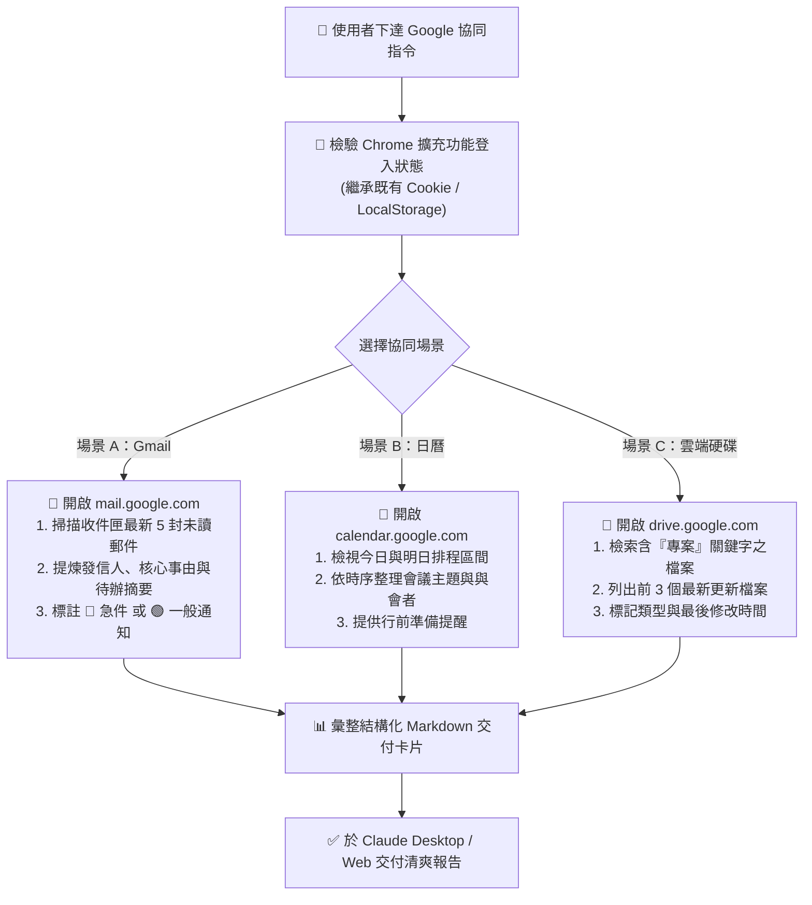

# 📬 範例 5：已登入 Session 整合實戰・Google Workspace 郵件、日曆與雲端硬碟全方位協同

> 🟣 **難度等級**：**Level 5（代理協同・已登入 Session 整合實戰）**  
> 💻 **適用環境**：Chrome 瀏覽器（已安裝 Claude in Chrome 擴充功能且已登入個人/企業 Google 帳號）+ Claude Desktop / Web  
> 💼 **適用角色**：高階主管幕僚、專案經理 (PM)、行政總務、業務主管、日常高度依賴 Google 生態系的知識工作者。  
> 🎯 **核心體驗**：
> - 🔑 **繼承已登入 Session（殺手級功能）**：無需配置繁瑣的 Google Cloud API 憑證或 OAuth 金鑰，直接沿用您本機 Chrome 的已登入狀態。
> - 📧 **Gmail 智慧秘書**：自動巡檢未讀郵件，擷取主旨、寄件者、重點摘要並標示待辦急件。
> - 📅 **Google Calendar 行程管家**：秒速清點今明兩天會議行程，提前發出備忘提醒與行前材料提示。
> - 📁 **Google Drive 專案尋寶**：快速定位近期異動的專案檔案，掌握最新修改者與更新時間。

---

## 🎭 職場痛點劇場：跨分頁切換的「注意力粉碎機」

> *「早上剛坐到辦公桌前，你就得依序打開 Gmail、Google 日曆、Google Drive 還有三個專案分頁。在 10 個分頁之間來回跳轉切換，看完日曆忘了信件、找完 Drive 檔案又被新郵件打斷……光是『搞清楚今天要做什麼』就耗掉半小時！」*

**現在，讓 Claude in Chrome 在同一個視窗中，幫您一站式打理 Google Workspace！**

---

## 🛠️ 前置準備與隱私安全守則

1. **瀏覽器登入狀態確認**：
   - 請確保您本機的 Chrome 瀏覽器已經正常登入您的 Google 帳號（個人帳號或企業 Google Workspace 帳號均可）。
2. **授權網域存取**：
   - 確保在 Claude Desktop 或擴充功能設定中，已允許存取以下 Google 服務網域：
     - `https://mail.google.com`（Gmail）
     - `https://calendar.google.com`（Google 日曆）
     - `https://drive.google.com`（Google 雲端硬碟）
3. **高敏感情境的安全核准建議**：
   > [!IMPORTANT]
   > 當指令涉及「回覆郵件」、「寄送郵件」或「刪除/修改日曆行程」等寫入行為時，強烈建議切換至 **Manual（手動核准）** 模式，由您親自按下「Allow」確認每一步操作，杜絕 AI 誤發信件或刪除行程的風險。

---

## 🔄 整合運作流程圖



---

## 🤖 3 大專用 RTCCF 結構化實戰 Prompt 庫

### 場景 A：Gmail 未讀郵件智慧整理與緊急度摘要

```markdown
## Role
你是一名敏銳高效的高階**行政特助**與**通訊情報秘書**。

## Task
請使用 **Claude in Chrome** 開啟我的 Gmail（`https://mail.google.com`），協助我快速掌握收件匣最新動態：
1. 檢視收件匣中最近的 **5 封未讀信件**。
2. 針對每封信件精準擷取：**寄件者名稱與單位**、**信件完整主旨** 與 **核心內文 2 句話摘要**。
3. 根據內容緊急度給予優先級標籤（**🔴 高：今日須回覆/主管指示**、**🟡 中：本週待辦**、**🟢 低：系統通報/廣告資訊**）。
4. 整理成清晰的 Markdown 表格回報。

## Context
- 目標網址：`https://mail.google.com`
- 執行工具：Claude in Chrome（沿用已登入之 Google 帳號）

## Constraint
- 嚴格僅讀取信件標題與摘要，**嚴禁自主點擊刪除、封存或回覆按鈕**。
- 若遇到含有驗證碼或個人密碼之機密郵件，摘要中請以星號遮蔽處理。
- 輸出語言一律使用**繁體中文**。

## Format
輸出 Markdown 結構化信件清單：
1. **收件匣未讀郵件緊急度總覽**（欄位：**優先級**、**寄件者**、**主旨**、**核心事由**、**建議行動**）
2. **特助今日優先行動提醒**
```

---

### 場景 B：Google 日曆今明行程盤點與備忘提醒

```markdown
## Role
你是一名專業的**專案管理日程秘書**。

## Task
請使用 **Claude in Chrome** 開啟我的 Google 日曆（`https://calendar.google.com`），檢視近期行程安排：
1. 查詢我 **今天與明天** 的所有預定會議與待辦排程。
2. 按照時間先後順序整理成清晰的時間軸清單，標示 **會議主題**、**時間區間** 與 **參與同仁**。
3. 檢查是否有會議時間重疊（Conflict）或間隔過於緊湊（少於 10 分鐘）的排程。
4. 針對各個會議，提醒我是否有需要提前準備的簡報、報告數據或注意事項。

## Context
- 目標網址：`https://calendar.google.com`
- 執行工具：Claude in Chrome 擴充功能

## Constraint
- 嚴禁修改、拖曳或新增任何日曆活動項目。
- 使用**繁體中文**輸出。

## Format
請產出 Markdown 日程卡片：
1. **今日行程時間軸**
2. **明日預約會議一覽**
3. **日程衝突診斷與行前準備備忘**
```

---

### 場景 C：Google Drive 專案相關檔案清點與異動追蹤

```markdown
## Role
你是一名細心的**知識庫管理員**與**專案文檔管制員**。

## Task
請使用 **Claude in Chrome** 開啟我的 Google 雲端硬碟（`https://drive.google.com`），協助我清點最新專案文件：
1. 在搜尋欄搜尋最近修改過，或檔名中含有 **專案** 關鍵字的文件。
2. 列出前 3 個相關度最高或最新修訂的檔案。
3. 擷取每個檔案的以下關鍵欄位：
   - **檔案完整名稱**
   - **檔案類型**（Google 文件 / 試算表 / 簡報 / PDF）
   - **最後修改時間與最後修改者名稱**
4. 整理為結構化條列清單輸出。

## Context
- 目標網址：`https://drive.google.com`
- 執行工具：Claude in Chrome 擴充功能

## Constraint
- 僅讀取檔案後設資料（Metadata），不可隨意開啟共享權限或移動檔案。
- 使用**繁體中文**輸出。

## Format
以簡潔 Markdown 卡片形式呈現清點結果。
```

---

## 📋 預期交付成果展示（Markdown 範例：Gmail 摘要）

### 收件匣未讀郵件緊急度總覽

| 優先級 | 寄件者 | 主旨 | 核心事由摘要 | 建議下一步行動 |
| :---: | :--- | :--- | :--- | :--- |
| **🔴 高** | 王總經理 (General Manager) | 【急件】Q4 雲端採購預算追加審核 | 請在今日 15:00 前確認追加預算金額並簽核上傳。 | 儘速比對財務表單並回信確認。 |
| **🟡 中** | IT 資訊安全小組 | [通知] 公司二階段驗證 (2FA) 政策更新 | 下週三起將全面強制啟用 FIDO2 金鑰認證。 | 本週五前抽空設定備用裝置。 |
| **🟢 低** | Google Cloud Platform | GCP Monthly Billing Statement | 8 月份伺服器雲端帳單已扣款完成，金額無異常。 | 轉發財務出納存查即可。 |

### 特助今日優先行動提醒
- ⚠️ **王總經理的信件時效緊急**，建議您優先處理「Q4 雲端採購預算追加」一案。

---

## 💡 實戰技巧與常見問題 (FAQ)

> [!TIP]
> 1. **多重 Google 帳號切換問題**：  
>    若您的 Chrome 同時登入了個人 Gmail 與公司 Workspace 帳號，Claude 會預設使用 Chrome 目前預設啟用的 Profile。若要操作特定帳號，請直接使用該帳號專屬的 Chrome 使用者個人資料夾（Chrome Profile）開啟連線。
> 2. **雙重認證 (2FA) 會卡住嗎？**  
>    完全不會！因為您是在本機平常就在使用的 Chrome 中操作，所有登入 Session、Cookie 早已驗證完成，Claude 直接接手，不需要每次重複輸入簡訊驗證碼或 Google Authenticator。

---

← [返回 Claude in Chrome 主講義](../../README.md) | 🏠 [返回專案總首頁](../../../README.md)
