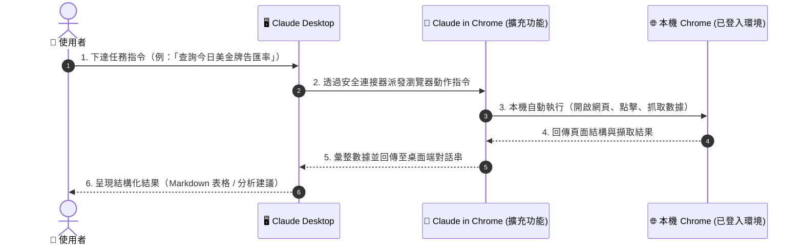
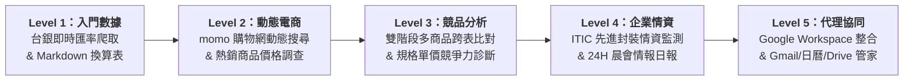

# Claude in Chrome 設定與使用教學

> 🟢 **方案需求**：**Claude Pro / Max / Team / Enterprise** 付費訂閱（全平台支援：Claude Desktop / Chrome 擴充功能）。  
> ⚠️ **免費版限制**：免費版（Free Plan）帳號無法啟用瀏覽器擴充功能連線。

---

## 📌 目錄導覽

- [一、什麼是 Claude in Chrome？](#一什麼是-claude-in-chrome)
- [二、安裝位置 vs 管理位置（核心觀念）](#二安裝位置-vs-管理位置核心觀念)
- [三、Claude Desktop 設定面板詳解](#三claude-desktop-設定面板詳解)
- [四、遠端協同運作架構（流程圖）](#四遠端協同運作架構流程圖)
- [五、三大安全核准機制](#五三大安全核准機制)
- [六、Claude in Chrome vs Playwright MCP 深度比較](#六claude-in-chrome-vs-playwright-mcp-深度比較)
- [七、排程自動化核心考量](#七排程自動化核心考量)
- [八、5 大職場實戰範例庫（由淺入深學習階梯）](#八5-大職場實戰範例庫由淺入深學習階梯)
  - [Level 1：台灣銀行牌告匯率即時擷取與換算表](#level-1台灣銀行牌告匯率即時擷取與換算表)
  - [Level 2：momo 購物網動態搜尋與商品比價](#level-2momo-購物網動態搜尋與商品比價)
  - [Level 3：競品市場調查與交叉對比分析](#level-3競品市場調查與交叉對比分析)
  - [Level 4：ITIC 每日焦點產業新聞與投資情資監測](#level-4itic-每日焦點產業新聞與投資情資監測)
  - [Level 5：Google Workspace 郵件、日曆與雲端硬碟全方位協同](#level-5google-workspace-郵件日曆與雲端硬碟全方位協同)
- [九、重點精華回顧（Cheat Sheet）](#九重點精華回顧cheat-sheet)

---

## 一、什麼是 Claude in Chrome？

**Claude in Chrome** 是 Anthropic 推出的 **Chrome 官方瀏覽器擴充功能**。安裝後可讓 Claude 直接進入您「**目前正在使用、已經登入**」的 Chrome 瀏覽器，代替您執行各項工作：

- 🌐 **分頁操作**：自動開啟新分頁、即時切換目標頁面
- 🖱️ **表單互動**：點擊按鈕、填寫輸入框、滾動捲軸
- 📖 **內容理解**：閱讀 DOM 結構、擷取動態渲染數據
- ⚡ **複雜工作流**：自主執行連鎖任務（例如：登入系統查詢 → 交叉比對 → 匯出表格）

### 💡 核心優勢：繼承已登入 Session
因為它直接操作的是您**真實的本機瀏覽器環境**，能完整沿用既有的登入狀態（Cookie、Session 與 Local Storage），特別適合需要身份驗證的內部環境：

- 公司內部系統（ERP / CRM / Confluence / Jira）
- Google Workspace（Gmail / Google 日曆 / Google Drive）
- 需登入帳號密碼的會員制網站與分析工具

> [!WARNING]
> **帳號權限說明**  
> Claude in Chrome 屬於進階代理功能，**免費版（Free Plan）帳號無法使用**。您必須登入具備 **Claude Pro、Max、Team 或 Enterprise** 付費授權的帳號，方可啟用並連結此瀏覽器擴充功能。

---

## 二、安裝位置 vs 管理位置（核心觀念）

初學者最容易混淆兩者的角色與設定位置，請先釐清以下心智模型：

| 項目 | 擴充功能端（Chrome）🧩 | 桌面應用端（Claude Desktop）🖥️ |
| :--- | :--- | :--- |
| **角色定位** | **動手實作的「手腳」**（安裝在 Chrome） | **下達指令的「大腦」與遠端中控面板** |
| **安裝途徑** | Chrome 線上應用程式商店安裝 | 本機安裝 Claude Desktop App |
| **管理位置** | 擴充功能右側圖示 → 設定頁面 | 左側選單 → **Claude in Chrome settings** |
| **同步機制** | 兩邊修改的是**同一份權限清單**，雲端與本機即時雙向同步，無需重複設定 |

> [!TIP]
> **一句話理解**：Claude Desktop 提供的畫面是一個「**遠端管理面板**」，讓您不必特意切換到 Chrome 分頁，也能在同一個視窗完成網站白名單與權限設定。

---

## 三、Claude Desktop 設定面板詳解

在 Claude Desktop 左側選單進入 **Claude in Chrome**，主要包含兩大核心設定：

### 1. Enable Claude in Chrome（連線開關）
- 控制 Claude Desktop 是否能連線至本機已安裝的 Chrome 擴充功能。
- **開啟後**：直接在 Claude Desktop 的對話框中輸入自然語言指令，Claude 便會自動驅動 Chrome 執行動作，不需要手動開啟 Chrome 側邊欄。

### 2. Site permissions（網站存取權限）
- **Default for all sites**：設定預設原則為「允許所有網站（Allow）」或「預設封鎖（Block）」。
- **Blocked sites**：黑名單清單，明確指定禁止 Claude 存取的機密網站。

> [!NOTE]
> 這份權限清單會同時套用於：
> 1. **Claude in Chrome 擴充功能本體**
> 2. **Claude Code / Desktop 內建瀏覽器**
>
> 無論從哪一個入口發起任務，都遵循同一套網址存取規則。

---

## 四、遠端協同運作架構（流程圖）

當啟用連接器後，Claude Desktop 與 Chrome 擴充功能之間的協同運作流程如下：

---

## 五、三大安全核准機制

無論從擴充功能側邊欄操作，或是由 Claude Desktop 遠端調用，系統皆嚴格遵循三大安全核准模式：

| 安全模式 | 運作機制 | 安全程度 | 建議適用場景 |
| :--- | :--- | :---: | :--- |
| **Manual** （手動核准） | Claude 進行每一步動作前皆會暫停， 等待使用者點擊「Allow」或「Deny」 | 🛡️ 最高 | **高敏感操作與教學示範**。 涉及信件寄送、日曆修改或帳戶異動時建議使用。 |
| **Auto** （自動安全審核） | Claude 連續自主推進，自動審查安全性； 僅在偵測到高風險操作時暫停詢問 | ⚖️ 平衡 | **日常例行任務與數據爬取**。 兼顧自動化流暢度與操作安全性。 |
| **Skip** （略過所有核准） | 完全不中斷詢問，全速自主執行 | ⚠️ 具風險 | **100% 信任的封閉或沙盒測試環境**。 需謹慎評估誤觸風險。 |

---

## 六、Claude in Chrome vs Playwright MCP 深度比較

學員最常見的疑問：**「使用 Playwright 爬蟲時，是不是要先開啟 Claude in Chrome？」**  
**答案：完全不需要，兩者是架構完全獨立的兩套工具！**

| 比較維度 | Playwright MCP 🤖 | Claude in Chrome 🧩 |
| :--- | :--- | :--- |
| **瀏覽器實體** | 由系統自動啟動一個**全新、無快取**的隔離瀏覽器 | 直接控制您電腦中**現有、已開啟**的 Chrome |
| **擴充功能依賴** | ❌ 完全不需安裝 Chrome 擴充功能 | ✅ 必須安裝 Claude in Chrome 擴充功能 |
| **登入狀態 / Cookie** | ❌ 無（全新訪客環境） | ✅ 具備（沿用既有 Cookie、Session 登入狀態） |
| **最佳適用場景** | 公開資訊爬取、免登入資料獲取、大規模重複性任務 | 需登入之內部系統（ERP / CRM）、個人信箱與日曆 |
| **定時排程穩定性** | ⭐️ 較高（無人值守運作穩定，不依賴擴充套件通訊） | ⚠️ 較低（授權狀態重跑時可能需人工介入，較適合有人在場時執行） |

> [!IMPORTANT]
> **選用決策口訣**：
> - **公開資料、不需登入** ➡️ 優先使用 **Playwright MCP** 或直接調用 API。
> - **私有服務、必須登入** ➡️ 使用 **Claude in Chrome** 代為操作已登入的環境。

---

## 七、排程自動化核心考量

若規劃將瀏覽器操作設定為定時自動執行（Scheduled Task），請務必留意以下原則：

1. **硬體與連線相依**：本機排程任務僅在電腦維持開機、且 Claude Desktop App 正常運作聯網時才能觸發。
2. **授權狀態保存限制**：雖然可設定「Always Allow」，但目前排程重跑時，擴充功能的權限信任設定仍有偶發性失效問題，容易中途暫停等待人工核准。
3. **優先考慮免瀏覽器途徑**：
   - 官方是否提供公開 RESTful API？
   - 頁面是否有直連的 `.csv` / `.json` / `.txt` 下載端點？
   - 凡能透過純資料連結解決者，應避免依賴瀏覽器 UI 互動，大幅提升穩定度。
4. **人機協同執行時機**：需要點擊互動的登入任務，建議排定於「人在電腦前」的時段，便於即時處理授權確認。

> [!TIP]
> 💡 **創投（VC）自動化進階導讀**：關於如何運用 Playwright MCP 免登入動態抓取新創官網、Pricing 頁面與競品資料，並結合 Custom Skill 產出盡職調查報告，請參閱 [創投 (VC) 專屬 Skill 與 Playwright MCP 自動化實戰](../Skills/VC_Playwright/README.md)。

---

## 八、5 大職場實戰範例庫（由淺入深學習階梯）

為幫助學員循序漸進掌握 Claude in Chrome 的操作心法，本單元規劃了 5 個由淺入深的職場實戰案例，全部採用標準 **RTCCF 結構化提示詞** 規範建構：

| 難度等級 | 實戰範例資料夾（點選進入） | 職場痛點劇場與核心亮點 | 對應核心技能與情境 |
| :---: | :--- | :--- | :--- |
| **Level 1** 入門體驗 | [**範例 1：台灣銀行牌告匯率即時擷取與換算表**](./Examples/01_Currency_Rates/) | **「告別手動抄表！」** 每天早上自動開啟台銀匯率頁面，鎖定美金、日圓與歐元，自動解析現鈔買賣價並產出 Markdown 匯率總表。 | • 🌐 公開網頁自動導航 • 📑 結構化表格精準解析 • 📊 即時匯率對照產出 |
| **Level 2** 實用技能 | [**範例 2：momo 購物網動態搜尋與商品定價情報比價**](./Examples/02_Ecommerce_Price_Comparison/) | **「檔期比價免苦工！」** 模擬使用者在電商首頁搜尋框鍵入關鍵字，滾動讀取動態渲染卡片，抓取前 5 名品項並計算平均促銷價格。 | • ⌨️ 動態輸入框搜尋互動 • 📜 滾動捲軸與卡片提取 • 💰 價格帶與平均單價換算 |
| **Level 3** 深度分析 | [**範例 3：雙階段競品市場調查與規格價格交叉對比分析**](./Examples/03_Competitive_Market_Analysis/) | **「打破容量迷思！」** 雙階段連鎖查詢：先抓我方基準品，再調查市場主流 5 強，統一換算為每 100ml 售價，輸出市場進擊處方。 | • 🔄 多階段跨頁查詢工作流 • ⚖️ 容量單位標準化換算 • 💡 商業定價戰略建議 |
| **Level 4** 企業實務 | [**範例 4：ITIC 每日焦點產業新聞與投資情資自動化監測**](./Examples/04_ITIC_Industry_Intelligence/) | **「創投晨報自動化！」** 佈署先進封裝、矽光子布林關鍵字與 24 小時時效限制，巡檢權威財經科技媒體，輸出投資影響評估摘要。 | • 🎯 布林邏輯組合檢索 • ⏱️ 嚴格時間範圍過濾 • 🧠 創投戰略影響研判 |
| **Level 5** 代理協同 | [**範例 5：已登入 Session 整合實戰・Google Workspace 全方位協同**](./Examples/05_Google_Workspace_Integration/) | **「直通個人工作空間！」** 無需申請 GCP API 憑證，直接繼承本機 Chrome 登入狀態，一站式檢視 Gmail 未讀急件、日曆會議與雲端硬碟檔案。 | • 🔑 繼承本機已登入 Cookie • 📧 Gmail 重要信件篩選摘要 • 📅 日曆衝突檢視與行前備忘 |

---

## 九、重點精華回顧（Cheat Sheet）

- [x] **擴充套件本質**：安裝於 Chrome 瀏覽器本體，Claude Desktop 僅為遠端管理與下達指令的中控台，兩端設定即時同步。
- [x] **視窗免切換**：桌面端開啟連線後，可直接在對話框派工，自動驅動 Chrome 完成分頁開啟、點擊與資料讀取。
- [x] **權限全面共用**：黑白名單規則於擴充功能本體與 Claude Code 內建瀏覽器間全面共用。
- [x] **工具選用原則**：
  - 不需要登入／公開資料 ➡️ **Playwright MCP** 或 **直接下載 / API**。
  - 需要既有 Cookie／企業內部系統 ➡️ **Claude in Chrome**。
- [x] **安全防護心法**：單純讀取資料使用 **Auto** 模式；涉及郵件發送、日曆增刪改等寫入操作，務必採用 **Manual** 手動核准。
- [x] **排程穩定策略**：無人值守排程優先採用免瀏覽器方案，避免因權限確認彈窗中斷自動化流程。

---

← [返回 Claude_AI 主講義](../README.md) | 🏠 [返回專案總首頁](../../README.md)
