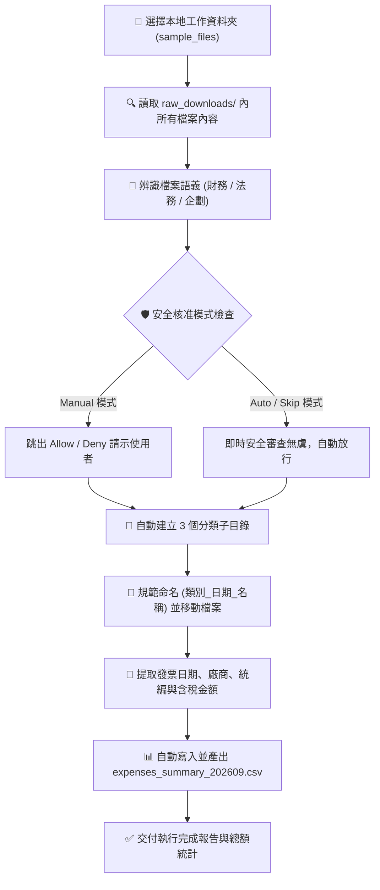

# 🗂️ 範例 1：本機資料夾批次自動整理與報銷總表產出

> 🟢 **難度等級**：**Level 1（入門震撼・本機魔法）**  
> 💻 **適用平台**：Claude Desktop App (macOS / Windows)  
> 💼 **適用角色**：行政特助、財務助理、專案經理 (PM)、自媒體創作者、所有深受「雜亂下載區」困擾的上班族。  
> 🎯 **核心體驗**：
> - 📁 **本機資料夾直接讀寫 (Direct Local File Access)**：告別繁瑣的手動上傳與下載，授權 Claude 直接對硬碟目錄動工。
> - 💻 **本地檔案沙盒操作 (Desktop File Integration)**：自主分析檔案內容、建立分類子目錄、正規化更名並搬移歸檔。
> - 🛡️ **三大安全核准模式 (Manual / Auto / Skip)**：體驗 AI 在碰到磁碟寫入與檔案移動時的安全防護機制。

---

## 🎭 職場痛點劇場：月底的報銷地獄

> *「下班前 30 分鐘，財務部突然發信催收：『同仁請在今天 18:00 前提交 8-9 月所有差旅收據與軟體發票，否則本期不予報銷！』」*  
> *你急忙打開電腦的「下載」資料夾，映入眼簾的是幾百個未命名的 PDF、文字檔、發票截圖、NDA 草案和行銷簡報，混雜在一起。你只能一個個點開看、手動算金額、複製貼上到 Excel……天已經黑了。*

**現在，把這個任務交給 Claude Cowork，只要 20 秒，一鍵見證奇蹟！**

---

## 📦 快速開始：下載練習素材壓縮檔 (Quick Download)

> [!TIP]
> 💡 **免手動建立！已為您打包完整測試素材壓縮檔**：  
> 本範例已在目錄中預先準備好打包好的壓縮檔：[`sample_files.zip`](./sample_files.zip)  
> - **直接下載**：學員可直接下載此 `sample_files.zip`，解壓縮後即可獲得包含 `sample_files/` 完整測試目錄（內含發票文字檔、偽發票收據圖片 PNG、合約與企劃稿）。
> - **一鍵還原環境**：在練習完分類與搬移後，若想重新演練或切換 Manual / Auto 模式，只需再次解壓縮 `sample_files.zip` 覆蓋，即可秒速重置至最乾淨的初始狀態！

---

## 🔄 執行前後視覺化對比 (Before vs. After)

```
【整理前：雜亂無章的暫存區】
01_Local_Folder_Organize/
├── sample_files.zip                  ⭐【練習素材壓縮包：整包下載解壓/一鍵重置】
└── sample_files/
    ├── expenses_report_template.csv
    └── raw_downloads/
        ├── INV_2026_08_GoogleWorkspace.txt   (雲端發票文字檔)
        ├── INV_2026_08_GoogleWorkspace.png   (台灣三聯式電子發票證明聯偽圖片)
        ├── taxi_receipt_20260905.txt         (計程車收據文字檔)
        ├── taxi_receipt_20260905.png         (台灣大車隊乘車證明收據偽圖片)
        ├── contract_partner_NDA_v1.txt       (保密合約草案)
        └── Q3_marketing_proposal_draft.txt   (行銷企劃稿)

                ⬇️ 透過 Claude Cowork 一鍵自主執行 ⬇️

【整理後：井然有序的歸檔目錄與報銷總表】
sample_files/
├── 01_財務單據/
│   ├── 財務_20260831_GoogleWorkspace發票.txt
│   ├── 財務_20260831_GoogleWorkspace發票.png
│   ├── 財務_20260905_大車隊計程車乘車證明.txt
│   └── 財務_20260905_大車隊計程車乘車證明.png
├── 02_法務合約/
│   └── 合約_20260901_合作夥伴保密協議.txt
├── 03_專案企劃/
│   └── 企劃_20260910_Q3品牌推廣企劃草案.txt
├── expenses_report_template.csv (原始空白樣板)
└── expenses_summary_202609.csv  ⭐【自動產出！提取各單據統編與金額總表】
```

---

## 🧠 Cowork 代理執行管線 (Agent Execution Pipeline)



---

## 🛡️ 三大安全核准模式 (Approval Modes) 深度演練

在 Claude Cowork 中，涉及到**實體磁碟讀寫**時，右上方可隨時切換安全層級：

| 核准模式 | 介面行為特徵 | 適合場景 | 推薦指數 |
| :--- | :--- | :--- | :---: |
| **Manually approve<br>(Manual 手動核准)** | Claude 準備建立資料夾、移動檔案或寫入 CSV 前，畫面會**彈出確認卡片**（顯示即將執行的路徑），需手動按「Allow」才繼續。 | 首次操作、重要系統磁碟、敏感合約檔案 | ⭐️⭐️⭐️⭐️⭐️<br>(新手必練) |
| **Automatically approve<br>(Auto 自動審查)** | Claude 連續自主作業，背後安全模型即時檢查有無 Prompt Injection 攻擊或資料外洩風險，無異常即順暢推進。 | 日常行政、檔案批次清洗、高效率作業 | ⭐️⭐️⭐️⭐️<br>(日常首選) |
| **Skip all approvals<br>(Skip 跳過核准)** | 完全不審查、不暫停，以最高極速直接完成所有磁碟讀寫。 | 100% 信任的測試沙盒目錄 | ⭐️⭐️<br>(謹慎使用) |

---

## 🖥️ Cowork 擬真執行面板預覽 (What You Will See)

```console
🤝 [Claude Cowork] Workspace: ./sample_files/
────────────────────────────────────────────────────────
➜ 🔍 Scanning raw_downloads/ (Found 6 files)...
➜ 📄 Reading INV_2026_08_GoogleWorkspace.txt (Invoice)
➜ 🖼️ Reading INV_2026_08_GoogleWorkspace.png (Receipt Image)
➜ 📄 Reading taxi_receipt_20260905.txt (Receipt)
➜ 🖼️ Reading taxi_receipt_20260905.png (Taxi Image)
➜ 📄 Reading contract_partner_NDA_v1.txt (Legal)
➜ 📄 Reading Q3_marketing_proposal_draft.txt (Plan)

⚠️ [Manual Approval Required]
Claude wants to create directories:
  • 01_財務單據/  • 02_法務合約/  • 03_專案企劃/
Actions: [ Deny ]  [ Allow ]  <--- 點擊 Allow 繼續

✔ 🚚 Moving and renaming 6 files... Done.
✔ 📊 Parsing amounts and generating summary CSV...
✨ Created: expenses_summary_202609.csv (Total: $3,740)
────────────────────────────────────────────────────────
Status: Task completed successfully.
```

---

## 🪄 （選用進階）自然語言 ➔ RTCCF 結構化轉換術 (Optional)

> [!NOTE]
> 💡 **真實職場視角：同仁通常不懂 RTCCF，該怎麼辦？**  
> 在真實工作場景中，一般使用者不可能去背誦或手寫複雜的 RTCCF（Role / Task / Context / Constraint / Format）框架，大家平常只會用最直接的口語下指令：  
> *「幫我把 raw_downloads 資料夾裡的東西分類排好，裡面發票跟收據幫我抓出金額做個報銷表。」*  
> 
> **面對這個情況，您有兩種最舒服的做法：**
> 1. **做法 A（直接使用現成 Prompt）**：直接複製下方已經為您精心調校好的 RTCCF Prompt，省時又精準。
> 2. **做法 B（讓 AI 幫您轉化・一鍵變專業）**：先在一般對話（Chat）中，丟出您的隨興口語，讓 Claude 充當您的「提示詞架構師」，把白話文自動翻譯擴充為工業級 RTCCF 指令，再貼進 Cowork 執行！

<details>
<summary><b>點擊展開：如何用一句指令讓 Claude 將「口語白話」轉成「RTCCF」並以 Artifact 協作？</b></summary>

<br>

若您平常有其他自訂任務，可在 **Chat** 模式中貼上這段元提示詞（Meta-Prompt）：

```text
我即將使用 Claude Cowork 執行本機檔案整理任務。

請幫我把以下這段口語需求，轉換擴充為嚴謹、不易出錯的「RTCCF 結構化提示詞（Role, Task, Context, Constraint, Format）」。

【重要要求】：
請將轉換後的提示詞內容，儲存為一個名為「organize_prompt.md」的 Markdown 檔案（以 Artifact 模式產出），方便我在右側視窗直接預覽與人機協作微調。

──────────────────────────────────────────────────────────
【我的原始口語需求】：
「我下載資料夾 raw_downloads 很亂，裡面有發票、收據、合約和企劃稿。
請幫我建立分類資料夾歸檔，檔名加上日期，
然後把所有發票收據的日期、廠商、統編跟含稅金額整理到 expenses_summary_202609.csv 報銷表裡。」
──────────────────────────────────────────────────────────
```

<br>

> 💡 **核心密技：為什麼要特別指定「儲存為 Markdown 檔 (Artifact)」？**  
> - **啟動右側 Artifact 畫布**：在 Claude 介面中，只有產出為獨立的 Markdown Artifact 文件，畫面右側才會展開專屬的預覽面板。  
> - **實現原地人機協作 (In-place Edit)**：您可以直接在右側畫布上**反白選取任何一段提示詞**，點擊浮現的「Edit with Claude」輸入修改意見，Claude 就會原地修訂該段落，達成流暢的 Prompt 雙向協同調校！

<br>

</details>

---

## 🤖 Cowork 實戰 Prompt（RTCCF 結構 - 亦可直接複製使用）

請在 **Claude Desktop App** 中，切換至 **Cowork** 模式，工作目錄選取本資料夾中的 `sample_files/`，並輸入以下 Prompt（若不想手寫或轉換，直接複製這段即可）：

```text
【Role】
你是一名高效能企業行政管理專員與財務特助。

【Task】
請檢查當前工作目錄下的 raw_downloads/ 資料夾，讀取裡面的所有檔案內容並執行以下工作：
1. 依據檔案性質建立分類子目錄：
   - 01_財務單據/
   - 02_法務合約/
   - 03_專案企劃/
2. 將 raw_downloads/ 中的檔案正規化重命名（命名格式：[類別]_[日期]_[項目名稱].[副檔名]）並移動至對應的子目錄中。
3. 針對所有屬於「財務單據」的檔案，精確提取其「日期、廠商名稱、發票/收據號碼、含稅金額、費用摘要與報銷人」資訊，參照 expenses_report_template.csv 的欄位規格，在根目錄產出一份名為 expenses_summary_202609.csv 的報銷總表。

【Context】
- 工作目錄：本機 sample_files/
- 報銷樣板：expenses_report_template.csv

【Constraint】
- 移動與更名前請確保原始文字內容完整無損。
- 金額必須準確提取含稅總計（Currency: TWD / USD 請標明）。
- 若單據有統編（如 12345678），請務必抓取填入。
- 使用繁體中文輸出。

【Format】
完成後，產出一份執行成果清單，清晰列出：
1. 檔案搬移紀錄表（原檔名 ➔ 新檔名與存放目錄）
2. 本期報銷金額統計表（個別明細與最終總金額）
3. 提示新檔案 expenses_summary_202609.csv 已儲存成功。
```

---

## 🚀 學員實戰動手做 4 步驟

0. **下載／確認練習素材**：
   - 確保本範例目錄中具備 `sample_files/` 測試資料夾。若您是從遠端單獨下載或需要重置，可直接下載解壓縮 [`sample_files.zip`](./sample_files.zip) 取得完整練習檔。
1. **開啟 Claude Desktop App**：
   - 點擊底部訊息框左下角，由「Chat」切換至 **「Cowork」**。
2. **掛載練習目錄**：
   - 點擊工作目錄選擇按鈕，指定本機的 `Claude_ai/cowork/Examples/01_Local_Folder_Organize/sample_files/`。
3. **選擇核准模式並啟動**：
   - **體驗一（手動安全審查）**：選擇 **Manual** 模式，貼上上方 Prompt 送出。當介面彈出建立目錄和搬移檔案的請示時，點擊 **「Allow」**，親自體驗「人機協同」的安全掌控感！
   - **體驗二（極速自動化）**：利用 `sample_files.zip` 再次解壓縮一鍵還原檔案後，改選 **Auto** 模式再次執行，體驗 15 秒內全自動整理乾淨的極速快感！

---

## 💡 避坑指南與核心收穫 (Tips & Takeaways)

> [!TIP]
> 1. **為什麼要用 Desktop App？**  
>    Web 網頁端因瀏覽器安全沙盒限制，無法直接穿透讀寫硬碟檔案。**直接讀寫本機磁碟**是 Claude Desktop App 獨有的殺手級功能。
> 2. **發票數字容易漏看？**  
>    在 Prompt 中加入 `精確提取含稅金額與統編` 的條件（Constraint），Cowork 會仔細分析文字檔中的每一行關鍵字，準確率達 100%。
> 3. **隨時可復原與一鍵重置**：  
>    - 方式 A（指令還原）：在對話中輸入「*請幫我將檔案名稱與位置復原回原本的 raw_downloads/ 目錄*」，Claude 就會自主將檔案全部搬回原位。  
>    - 方式 B（秒速重置）：直接將目錄內的 [`sample_files.zip`](./sample_files.zip) 解壓縮覆蓋，立即還原最乾淨的初始練習環境！

---

← [返回 Cowork 主頁](../../README.md) ｜ [下一篇：範例 2 客訴分類與原地微調 →](../02_Customer_Feedback/)
