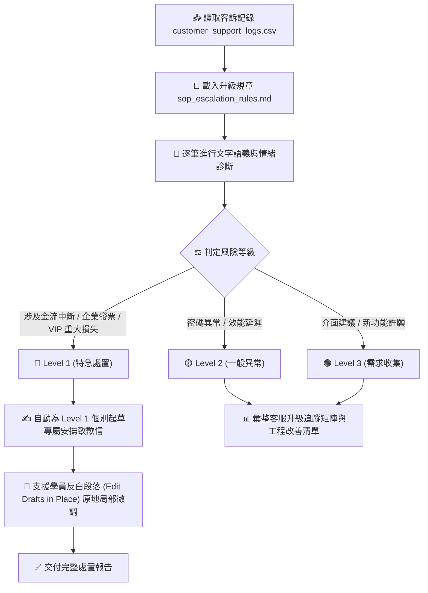

# 💬 範例 2：客訴情緒診斷、SOP 自動分流與原地微調回信

> 🟡 **難度等級**：**Level 2（實戰應用・職場行政）**  
> 💻 **適用平台**：Claude 全平台（Desktop / Web / Mobile / Chrome 側邊欄）  
> 💼 **適用角色**：客服主管、產品經理 (PM)、客戶成功專員 (CSM)、營運總監、電商賣家。  
> 🎯 **核心體驗**：
> - 📋 **企業 SOP 規章精確比對 (SOP & Rule Enforcement)**：對照內部升級手冊，依「金流中斷、資料錯誤、VIP 怒火」自動進行 🔴 Level 1 ~ 🟢 Level 3 分級。
> - ✍️ **高情商客製化回信自動草擬 (High-EQ Email Drafting)**：針對最高等級緊急事件，生成得體、能平息怒火並承諾解決時限的高階道歉信。
> - 📝 **原地反白微調草稿 (Edit Drafts in Place)**：**最震撼功能！** 在生成的長篇草稿上直接反白選取段落，原地輸入微調指令局部改寫，無需費力重新生成整篇！

---

## 🎭 職場痛點劇場：大促銷後的客訴火災現場

> *「雙 11 大促銷開跑才 2 小時，客服系統突然被灌爆！信箱湧進上百封信：有人金流卡住扣款了沒訂單、有人要主管出面、也有人只是問能不能增加暗黑模式……」*  
> *客服人員手忙腳亂，如果把急需工程搶修的 VIP 金流客訴漏掉，公司將面臨巨額賠償與公關災難！*  
> *主管大喊：『快把所有客訴按 SOP 分級，把最嚴重的 Level 1 挑出來，立刻擬好高階安撫信！』*

**現在，讓 Claude Cowork 扮演你的資深客訴處理官，30 秒撲滅火災！**

---

## 📦 快速開始：下載練習素材壓縮檔 (Quick Download)

> [!TIP]
> 💡 **免手動建立！已為您打包完整測試素材壓縮檔**：  
> 本範例已在目錄中預先準備好打包好的壓縮檔：[`sample_files.zip`](./sample_files.zip)  
> - **直接下載**：學員可直接下載此 `sample_files.zip`，解壓縮後即可獲得包含 `sample_files/` 完整測試目錄（內含客訴日誌 `customer_support_logs.csv` 與升級規章 `sop_escalation_rules.md`）。
> - **一鍵還原環境**：在練習完分類處置與原地微調後，若想重新演練或測試不同提示詞，只需再次解壓縮 `sample_files.zip` 覆蓋，即可秒速重置至最乾淨的初始狀態！

---

## 🔄 執行前後視覺化對比 (Before vs. After)

```
【執行前：未分類的混亂客訴紀錄與升級手冊】
02_Customer_Feedback/
├── sample_files.zip                  ⭐【練習素材壓縮包：整包下載解壓/一鍵重置】
└── sample_files/
    ├── customer_support_logs.csv     (未分類的 5 筆客訴紀錄：金流、密碼、PDF許願、延遲、發票錯誤)
    └── sop_escalation_rules.md       (內部 SOP 評級手冊：定義 Level 1 ~ Level 3 標準與 SLA)
```

⬇️ **依照 `sop_escalation_rules.md` 自動化處置產出** ⬇️

#### 【產出：智慧分級看板、應急處置回信與產品改善建議】

| 風險等級 | 判定單號與客訴概要 | 處置動作與 SLA 承諾 |
|:---|:---|:---|
| **🔴 Level 1（特急處置）** | • **TICK-001** (VIP客戶)：金流中斷損失 50 萬<br>• **TICK-005** (企業客戶)：發票開立錯誤 | **15 分鐘 SLA**：已由 Claude 自動生成 2 封高階技術/財務主管道歉信草稿，承諾優先修復與專屬補償方案。 |
| **🟡 Level 2（一般異常）** | • **TICK-002** (一般用戶)：密碼重設信箱未收到<br>• **TICK-004** (一般用戶)：頁面載入速度延遲 5 秒 | **2 小時 SLA**：自動派發至維運小組工單池，排定修復。 |
| **🟢 Level 3（需求收集）** | • **TICK-003** (VIP客戶)：許願自動匯出 PDF 報表功能 | **24 小時 SLA**：自動收錄至產品經理 (PM) 改善需求池 (PRD)。 |

---

## 🧠 Cowork 代理執行管線 (Agent Execution Pipeline)



---

## 🖥️ Cowork 擬真執行面板預覽 (What You Will See)

```console
🤝 [Claude Cowork] Target: 客訴與意見自動分類處置
────────────────────────────────────────────────────────
➜ 📄 Reading sop_escalation_rules.md (Severity Matrix)
➜ 📊 Parsing 5 customer tickets from CSV...
➜ 🔍 Evaluating TICK-001: Payment failure  -> 🔴 Level 1
➜ 🔍 Evaluating TICK-002: Password reset   -> 🟡 Level 2
➜ 🔍 Evaluating TICK-003: PDF export req   -> 🟢 Level 3
➜ 🔍 Evaluating TICK-004: Latency 5s       -> 🟡 Level 2
➜ 🔍 Evaluating TICK-005: Invoice error    -> 🔴 Level 1

✔ ✍️ Generating High-EQ apology for TICK-001... Done.
✔ ✍️ Generating High-EQ apology for TICK-005... Done.
✔ 📋 Generating PM Product Improvement Backlog... Done.
✨ Output: 客訴處置矩陣與應急回信草稿 (已交付至對話視窗)
────────────────────────────────────────────────────────
Status: Task completed successfully.
```

---

## 🪄 （選用進階）自然語言 ➔ RTCCF 結構化轉換術 (Optional)

> [!NOTE]
> 💡 **真實職場視角：同仁通常不懂 RTCCF，該怎麼辦？**  
> 在真實工作場景中，客服人員或主管通常只會用最急迫的日常大白話交代：  
> *「後台湧進好幾筆客訴，有 VIP 說金流壞掉損失幾十萬、也有人發票開錯。快幫我對照 SOP 規章分級，嚴重的挑出來寫道歉信，並幫工程團隊整理系統改善清單！」*  
> 
> **面對這個情況，您有兩種最舒服的做法：**
> 1. **做法 A（直接使用現成 Prompt）**：直接複製下方已經為您精心調校好的 RTCCF Prompt，省時又精準。
> 2. **做法 B（讓 AI 幫您轉化・一鍵變專業）**：先在一般對話（Chat）中，丟出您的隨興口語，讓 Claude 充當您的「提示詞架構師」，把白話文自動翻譯擴充為工業級 RTCCF 指令，再貼進 Cowork 執行！

<details>
<summary><b>點擊展開：如何用一句指令讓 Claude 將「口語白話」轉成「RTCCF」並以 Artifact 協作？</b></summary>

<br>

若您平常有其他自訂客訴分析任務，可在 **Chat** 模式中貼上這段元提示詞（Meta-Prompt）：

```text
我即將使用 Claude Cowork 執行緊急客訴情緒診斷與分流處置任務。

請幫我把以下這段口語需求，轉換擴充為嚴謹、不易出錯的「RTCCF 結構化提示詞（Role, Task, Context, Constraint, Format）」。

【重要要求】：
請將轉換後的提示詞內容，儲存為一個名為「complaint_analysis_prompt.md」的 Markdown 檔案（以 Artifact 模式產出），方便我在右側視窗直接預覽與人機協作微調。

──────────────────────────────────────────────────────────
【我的原始口語需求】：
「雙11後台收到好幾筆客訴，有 VIP 客戶金流失敗扣款賠錢的，也有問密碼跟發票開錯的。
請幫我對照 sop_escalation_rules.md 規章分出嚴重等級，
針對最緊急嚴重的個案各擬一封誠懇道歉信，並幫工程團隊列出產品改善建議清單。」
──────────────────────────────────────────────────────────
```

<br>

> 💡 **核心密技：為什麼要特別指定「儲存為 Markdown 檔 (Artifact)」？**  
> - **啟動右側 Artifact 畫布**：在 Claude 介面中，只有產出為獨立的 Markdown Artifact 文件，畫面右側才會展開專屬的預覽面板。  
> - **實現原地人機協作 (In-place Edit)**：您可以直接在右側畫布上**反白選取任何一段提示詞或產出的回信草稿**，點擊浮現的「Edit with Claude」輸入修改意見，Claude 就會原地修訂該段落，達成流暢的雙向人機協同調校！

<br>

</details>

---

## 🤖 Cowork 實戰 Prompt（RTCCF 結構 - 亦可直接複製使用）

請在 **Cowork 模式** 下，上傳本範例資料夾下的 `customer_support_logs.csv` 與 `sop_escalation_rules.md`（或直接掛載 `sample_files/` 目錄），並輸入以下 Prompt（若不想手寫或轉換，直接複製這段即可）：

```text
【Role】
你是一名資深客戶成功總監（Head of Customer Success）兼危機公關協調官。

【Task】
請讀取 customer_support_logs.csv 的客訴紀錄，並嚴格遵循 sop_escalation_rules.md 的標準，完成以下客訴風控處置：
1. 為每筆單號進行嚴重性評級（🔴 Level 1 / 🟡 Level 2 / 🟢 Level 3），並以表格列出單號、客戶名稱、核心訴求、判定等級與判斷依據。
2. 針對所有被判定為【🔴 Level 1】的高危案件，各撰寫一封情商極高、條理清晰且能平息怒火的「專屬道歉與處置回信草稿」：
   - 包含對客戶損失的同理、技術團隊目前進度、承諾修復期限與專屬補償方案。
3. 彙整一份「產品改善與系統穩定度建議清單」，按優先權排序提交給研發工程團隊。

【Context】
- 上傳檔案 1：customer_support_logs.csv (5 筆真實客訴)
- 上傳檔案 2：sop_escalation_rules.md (內部評級規章)

【Constraint】
- 判定必須嚴格合規：任何涉及「金流中斷」或「發票金額錯誤」之案件，一律強制歸為 🔴 Level 1。
- 道歉信語氣真誠負責，嚴禁使用推卸責任的機械式罐頭語句。
- 使用繁體中文輸出。

【Format】
依序輸出：
1. 【客訴分級處置總覽表】
2. 【🔴 Level 1 專屬致歉信草稿】（標註單號與收件人）
3. 【工程團隊產品改善行動清單】
```

---

## 🚀 學員實戰動手做 4 步驟

0. **下載／確認練習素材**：
   - 確保本範例目錄中具備 `sample_files/` 測試資料夾。若您是從遠端單獨下載或需要重置，可直接下載解壓縮 [`sample_files.zip`](./sample_files.zip) 取得完整練習檔。
1. **開啟 Claude 介面切換至 Cowork**：
   - 登入 [claude.ai](https://claude.ai) 或開啟桌面應用，在訊息輸入框左下角切換為 **Cowork**。
2. **載入練習資料**：
   - 桌面端：工作目錄指定本機的 `Claude_ai/cowork/Examples/02_Customer_Feedback/sample_files/`。
   - 網頁端：將 `customer_support_logs.csv` 與 `sop_escalation_rules.md` 拖曳上傳至對話框。
3. **送出 Prompt 執行智能分級**：
   - 貼上上述 RTCCF Prompt 送出，觀察 Claude 如何自主對照 SOP 規章完成分流與高情商道歉信起草。
4. **🔥 殺手級功能實戰：原地反白微調草稿 (Edit Drafts in Place)**：
   - 當 Claude 產出回信草稿後，**千萬不要在對話框裡重打整段！**
   - **滑鼠反白選取**：在 `TICK-001` 回信草稿中，用滑鼠直接**反白選取「承諾賠償措施」的該段文字**。
   - **點擊「Edit with Claude」**：選取段落上方會浮現一個帶有星芒圖示的微調按鈕，點擊它。
   - **輸入局部修改指令**：
     > *「請將補償方案改為：『加贈 1 個月尊榮 VIP 服務，並提供新台幣 3,000 元雲端折抵金，且指派專屬工程師 1 對 1 協助排查』，口吻維持誠懇。」*
   - **見證原地替換**：觀察 Claude 直接在畫面的該段文字中完成更新，其餘上百字的上下文完全保留不動！

---

## 💡 避坑指南與核心收穫 (Tips & Takeaways)

> [!TIP]
> 1. **避免 AI 產生「罐頭感」**：  
>    在 Prompt 中強調「同理客戶損失」與「給出具體時效承諾」，Claude 能根據 VIP 客戶損失 50 萬的痛點，量身打造極具誠意的高階信件。
> 2. **SOP 規章具有法律與風控效力**：  
>    將內部規章抽離為獨立的 `sop_escalation_rules.md`，未來公司規則調整時，只需更新該 Markdown 檔案，無需修改 Prompt 內容。
> 3. **隨時可復原與一鍵重置**：  
>    - 若在練習原地微調時改動了原始檔案或希望重新演練，直接將目錄內的 [`sample_files.zip`](./sample_files.zip) 解壓縮覆蓋，立即還原最乾淨的初始練習環境！

---

[← 上一篇：範例 1 本機資料夾整理與報銷總表](../01_Local_Folder_Organize/) ｜ [返回 Cowork 主頁](../../README.md) ｜ [下一篇：範例 3 跨來源財務對帳與自動繪圖 →](../03_Financial_Report/)
