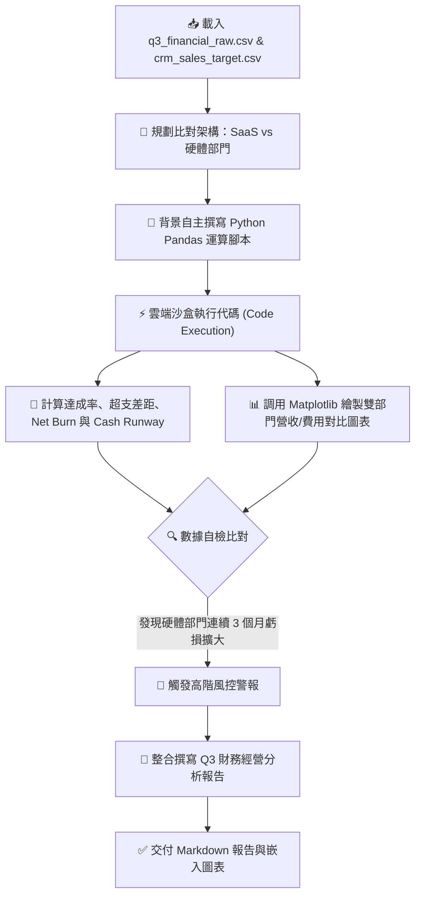

# 📈 範例 3：跨來源財務對帳、自動程式運算與營運圖表產出

> 🟠 **難度等級**：**Level 3（進階分析・數據對帳）**  
> 💻 **適用平台**：Claude 全平台（Desktop / Web / Mobile / Chrome 側邊欄）  
> 💼 **適用角色**：財務長 (CFO)、財務分析師 (FP&A)、營運總監 (COO)、創投風控經理、電商對帳人員。  
> 🎯 **核心體驗**：
> - 🤖 **背景自動寫 Python 運算 (Agentic Code Execution)**：告別大語言模型「計算數字會胡言亂語」的刻板印象，Cowork 會自主在雲端隔離沙盒中撰寫 Python 程式碼，交叉合併多份 CSV 進行精確數學計算。
> - 🔍 **異常超支與虧損自動警報 (Deficit & Overrun Detection)**：自動找出達成率落後、預算嚴重超支的危險部門。
> - 📊 **自動繪製專業視覺化圖表 (Data Visualization)**：生成並匯入包含長條圖與折線圖的營運趨勢對比圖。

---

## 🎭 職場痛點劇場：董事會前夕的對帳噩夢

> *「下週一就是 Q3 季末董事會，CEO 交代：『把會計系統導出的實際支出，跟業務部 CRM 的業績目標拉出來對一下，算清楚各部門達成率，還有我們的現金還能燒幾個月（Cash Runway）！』」*  
> *你手上有兩份不同系統匯出的 CSV，欄位名稱不同、月份分開。你打開 Excel 寫 VLOOKUP，一下公式報錯 `#N/A`，一下算錯淨利。好不容易拉出來的圖表，還被財務長指出數值加總對不上……*

**把這兩份 CSV 丟進 Claude Cowork，讓 AI 背景自動寫 Python 程式碼，30 秒產出零誤差的董事會級財務報告！**

---

## 🔄 執行前後視覺化對比 (Before vs. After)

```
【輸入：兩份不同業務系統導出的分散數據】
1. q3_financial_raw.csv (實際財務流水：營收、費用、現金餘額、Net Burn)
2. crm_sales_target.csv (銷售目標：預估營收、費用預算上限、毛利目標)

                ⬇️ 透過 Cowork 背景 Code Execution 交叉比對 ⬇️

【產出：高階管理層財務摘要、超支警報與營收對比圖表】
┌────────────────────────────────────────────────────────────────────────┐
│ 📊 Q3 財務績效與營運目標對比總表                                        │
├─────────┬──────────┬──────────┬──────────┬──────────┬─────────────────┤
│ 部門    │ 目標營收 │ 實際營收 │ 達成率   │ 費用超支 │ 風險狀態        │
├─────────┼──────────┼──────────┼──────────┼──────────┼─────────────────┤
│ SaaS訂閱│ $375,000 │ $405,000 │ 108.0%   │ +$15,000 │ 🟢 表現優異     │
│ 硬體設備│ $150,000 │ $113,000 │  75.3%   │ +$32,000 │ 🔴 嚴重虧損預警 │
├─────────┴──────────┴──────────┴──────────┴──────────┴─────────────────┤
│ 💡 關鍵營運指標 (KPIs)：                                                │
│   • 全公司 Q3 總營收：$518,000 USD (整體目標達成率 98.7%)               │
│   • 硬體部門累計淨虧損：-$84,000 USD (9月單月燒錢暴增至 $45,000)       │
│   • 期末現金餘額：$1,680,000 USD                                       │
│   • 現金跑道 (Cash Runway)：預估剩餘 20.0 個月 (需立即整頓硬體供應鏈)   │
│ 📈 已自動產出並嵌入：q3_revenue_vs_target_chart.png                     │
└────────────────────────────────────────────────────────────────────────┘
```

---

## 🧠 Cowork 代理執行管線 (Agent Execution Pipeline)



---

## 🖥️ Cowork 擬真執行面板預覽 (What You Will See)

```
┌────────────────────────────────────────────────────────┐
│ 🤝 Cowork: 正在執行跨檔案財務對帳與分析                  │
├────────────────────────────────────────────────────────┤
│ ▹ 📄 Reading q3_financial_raw.csv (Actuals)            │
│ ▹ 📄 Reading crm_sales_target.csv (Budgets)            │
│ ▹ 💻 Writing Python script to merge datasets on ['月份','部門']│
│ ▹ ⚡ Executing Code in sandbox:                         │
│   ```python                                            │
│   import pandas as pd                                  │
│   df = pd.merge(actuals, targets, on=['月份', '部門']) │
│   df['達成率'] = df['實際營收_USD'] / df['預估目標營收_USD']│
│   # Calculating Cash Runway = Cash / Avg Monthly Burn  │
│   ```                                                  │
│ ▹ 📈 Generating Chart: q3_revenue_vs_target_chart.png...│
│ ▹ ⚠️ Risk Alert Triggered: Hardware unit net loss -$84K│
│ ▹ ✨ Output: Q3 財務營運對比報告 (含圖表與3大改善處方) │
└────────────────────────────────────────────────────────┘
```

---

## 🤖 Cowork 實戰 Prompt（RTCCF 結構）

請在 **Cowork 模式** 下，上傳本資料夾中的 `q3_financial_raw.csv` 與 `crm_sales_target.csv`，並輸入以下 Prompt：

```text
【Role】
你是一名擁有 CPA 執照的資深企業財務分析師兼營運風控主管（Financial Controller）。

【Task】
請讀取上傳的 q3_financial_raw.csv 與 crm_sales_target.csv 兩份檔案，透過背景撰寫 Python 程式碼（Code Execution）執行精密交叉比對，完成以下 Q3 財務營運分析：
1. 以「月份」與「部門」為維度交叉比對，計算各部門的「目標營收達成率 (%)」、「費用超支金額 (實際費用 - 預算上限)」與「毛利現況」。
2. 評估全公司財務健全度：計算全季總營收、總費用、總淨損益，並依據 9 月底的期末現金餘額與平均月燒錢率，精準試算「可支撐營運月數（Cash Runway）」。
3. 產生一張「各部門 Q3 實際營收 vs 目標營收長條對比圖」，清晰標註數值並嵌入報告中。
4. 針對「硬體設備部門」連續虧損擴大的現象，提出 3 個具體且具可操作性的止血改善建議。

【Context】
- 上傳檔案 1：q3_financial_raw.csv (實際各月財務數據)
- 上傳檔案 2：crm_sales_target.csv (各月營運目標與預算)

【Constraint】
- 所有百分比、超支金額與 Cash Runway 必須 100% 透過 Python 程式碼計算，嚴禁臆測推算。
- 若硬體部門出現淨虧損，必須在報告中以 🔴 高度警訊標註。
- 使用繁體中文輸出。

【Format】
產出一份結構完整的 Markdown 專業報告，包含：
1. 【Q3 財務績效執行摘要卡】（總營收、達成率、Cash Runway）
2. 【部門維度對比總表】（SaaS 訂閱 vs 硬體設備）
3. 【視覺化圖表展示】
4. 【重大財務警訊剖析與 3 大改善處方】
```

---

## 🚀 學員實戰動手做 3 步驟

1. **切換為 Cowork 模式**：
   - 登入 [claude.ai](https://claude.ai) 或開啟桌面應用，在訊息輸入框左下角切換為 **Cowork**。
2. **上傳檔案並送出 Prompt**：
   - 將 `q3_financial_raw.csv` 與 `crm_sales_target.csv` 拖曳至對話框，貼上上述 RTCCF Prompt 送出。
3. **展開程式碼查看運算細節**：
   - 在執行過程中，點擊 Claude 畫面上的「View code」或「Analysis」，您會看見 Claude 自動寫出並執行的 Pandas 與 Matplotlib 程式碼，體驗**零數學幻覺**的強大威力！

---

## 💡 避坑指南與核心收穫 (Tips & Takeaways)

> [!TIP]
> 1. **大語言模型算術不可靠？交給 Code Execution！**  
>    在純文字 Chat 模式下，LLM 遇到多位數除法或複合公式容易產生幻覺。在 Cowork 中，指定「透過背景撰寫 Python 程式碼」，Claude 會將計算交給真實的 Python 解譯器，保證 100% 精準。
> 2. **跨檔案鍵值合併 (Key Merge)**：  
>    只要在 Prompt 中指明共同欄位（如「月份」與「部門」），Cowork 會自動完成類似 SQL `JOIN` 或 Excel `VLOOKUP` 的操作，免去手動整理欄位的苦工。
> 3. **圖表下載與簡報再利用**：  
>    產出的圖表可以直接右鍵下載儲存為 PNG，直接貼進 Google Slides 或 PowerPoint 簡報中。

---

[← 上一篇：範例 2 客訴分類與原地微調](../02_Customer_Feedback/README.md) ｜ [返回 Cowork 主頁](../../README.md) ｜ [下一篇：範例 4 每日情報監測與定時排程 →](../04_Daily_News_Brief/README.md)
