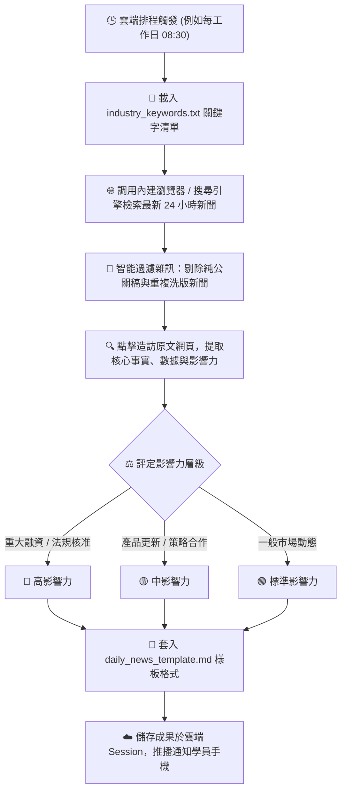

# 📰 範例 4：全自動產業情報監測、內建瀏覽器檢索與雲端定時晨報

> 🟣 **難度等級**：**Level 4（情報蒐集・雲端自動化排程）**  
> 💻 **適用平台**：Claude 全平台（Desktop / Web / Mobile / Chrome 側邊欄）  
> 💼 **適用角色**：創投分析師 (VC)、市場研究員 (Market Intelligence)、行銷企劃總監、行政祕書、商業開發 (BD)。  
> 🎯 **核心體驗**：
> - 🌐 **內建瀏覽器自主聯網 (Built-in Browser & Web Search)**：由 Claude 自主開啟外部網頁、閱讀最新 24 小時報導、辨識公關業配廢話並嚴格過濾。
> - 🕒 **雲端排程自動化 (`/schedule`)**：設定定時任務，每工作日早晨自動執行，告別每天早起手動爬新聞的痛苦。
> - ☁️ **雲端隔離運算 (Sessions in the Cloud)**：**筆電關機睡覺照常跑！** 純雲端任務無須依賴本機開機，隨時在手機 App 收成。

---

## 🎭 職場痛點劇場：每天清晨的「剪報地獄」

> *「主管每天早上 09:00 晨會的第一句話永遠是：『大家看一下今天產業有什麼大事？競品有沒有最新融資或發布新技術？』」*  
> *為了這句話，你每天 07:30 就得爬起來，一邊喝咖啡一邊焦慮地翻閱 TechCrunch、科技報橘、數位時代、工商時報……*  
> *更痛苦的是，還要手動把文字、連結複製貼上整理成 Markdown 晨報，稍微慢一點就趕不上主管會前閱讀的時間。*

**現在，讓 Claude Cowork 成為你的 24 小時無休駐點情報員，設定一次排程，每天早晨自動送上精美晨報！**

---

## 📦 快速開始：下載練習素材壓縮檔 (Quick Download)

> [!TIP]
> 💡 **免手動建立！已為您打包完整測試素材壓縮檔**：  
> 本範例已在目錄中預先準備好打包好的壓縮檔：[`sample_files.zip`](./sample_files.zip)  
> - **直接下載**：學員可直接下載此 `sample_files.zip`，解壓縮後即可獲得包含 `sample_files/` 完整測試目錄（內含監測指標清單 `industry_keywords.txt` 與標準簡報樣板 `daily_news_template.md`）。
> - **一鍵還原環境**：在練習完情報檢索與排程設定後，若想重新演練或測試不同關鍵字，只需再次解壓縮 `sample_files.zip` 覆蓋，即可秒速重置至最乾淨的初始狀態！

---

## 🔄 執行前後視覺化對比 (Before vs. After)

```
【執行前：監測關鍵字與晨報格式樣板】
04_Daily_News_Brief/
├── sample_files.zip                  ⭐【練習素材壓縮包：整包下載解壓/一鍵重置】
└── sample_files/
    ├── industry_keywords.txt         (監測重點關鍵字、追蹤指標與媒體清單)
    └── daily_news_template.md        (每日產業情報與競品趨勢簡報標準格式)
```

⬇️ **透過 Cowork 內建瀏覽器檢索 + 雲端排程產出** ⬇️

#### 【產出：每天早上 08:30 雲端自動產出之高階情報簡報】

| # | 新聞標題 | 涉及企業/領域 | 影響力評級 | 核心重點摘要 | 來源連結 |
|:---:|:---|:---|:---:|:---|:---:|
| **1** | 美國 FDA 核准首款生成式放射科影像輔助診斷系統 | MedTech AI (Series A) | 🔴 高 | 獲得 510(k) 許可，為首個將胸部 X 光異常篩檢時間縮短 60% 的臨床演算法。 | [閱讀原文](https://example.com/news1) |
| **2** | 專注永續農業之台灣新創完成 300 萬美元 Pre-A 融資 | GreenAgri (綠能科技) | 🟡 中 | 由知名永續基金領投，資金將用於擴建智慧感測溫室與海外市場拓展。 | [閱讀原文](https://example.com/news2) |

> **💡 戰略亮點剖析**：醫療 AI 領域正從「單點影像判讀」加速轉向「臨床工作流無縫整合」；法規通過速度比去年同期顯著加快。  
> **📌 建議下一步行動**：請 BD 團隊於週五前連繫 MedTech 亞太區業務代表，評估代理或院內合作可行性。

---

## 🧠 Cowork 代理執行管線 (Agent Execution Pipeline)



---

## 🖥️ Cowork 擬真執行面板預覽 (What You Will See)

```console
🤝 [Claude Cowork] Target: 每日產業情報自動檢索與排程
────────────────────────────────────────────────────────
➜ 📄 Loaded industry_keywords.txt (3 focus areas)
➜ 🌐 Browsing Web: "智慧醫療 FDA 認證 2026" (Found 12 sources)
➜ 🌐 Browsing Web: "TechCrunch AI Biotech Early Stage"
➜ 🧹 Filtering out 4 press release clickbaits... Done.
➜ 🔍 Visiting original report: MedTech AI regulatory path...
➜ 📊 Evaluating impact: FDA approval -> 🔴 High Impact
➜ 📝 Injecting insights into daily_news_template.md...
✨ Generated: daily_news_20260912.md
🕒 Next scheduled run: 明天早上 08:30 (雲端自動執行)
────────────────────────────────────────────────────────
Status: Task completed successfully.
```

---

## 🪄 （選用進階）自然語言 ➔ RTCCF 結構化轉換術 (Optional)

> [!NOTE]
> 💡 **真實職場視角：同仁通常不懂 RTCCF，該怎麼辦？**  
> 在真實工作場景中，團隊同仁通常只會用口語交代搜尋任務：  
> *「幫我每天盯一下生醫跟 AI 融資的新聞，挑重要的大事整理成晨報，記得附上原文連結，別抓到業配新聞！」*  
> 
> **面對這個情況，您有兩種最舒服的做法：**
> 1. **做法 A（直接使用現成 Prompt）**：直接複製下方已經為您精心調校好的 RTCCF Prompt，省時又精準。
> 2. **做法 B（讓 AI 幫您轉化・一鍵變專業）**：先在一般對話（Chat）中，丟出您的隨興口語，讓 Claude 充當您的「提示詞架構師」，把白話文自動翻譯擴充為工業級 RTCCF 指令，再貼進 Cowork 執行！

<details>
<summary><b>點擊展開：如何用一句指令讓 Claude 將「口語白話」轉成「RTCCF」並以 Artifact 協作？</b></summary>

<br>

若您平常有其他自訂新聞追蹤任務，可在 **Chat** 模式中貼上這段元提示詞（Meta-Prompt）：

```text
我即將使用 Claude Cowork 執行全自動產業情報聯網監測任務。

請幫我把以下這段口語需求，轉換擴充為嚴謹、不易出錯的「RTCCF 結構化提示詞（Role, Task, Context, Constraint, Format）」。

【重要要求】：
請將轉換後的提示詞內容，儲存為一個名為「news_brief_prompt.md」的 Markdown 檔案（以 Artifact 模式產出），方便我在右側視窗直接預覽與人機協作微調。

──────────────────────────────────────────────────────────
【我的原始口語需求】：
「我要每天自動監測智慧醫療、AI醫療影像和創投融資動態。
請幫我依照 industry_keywords.txt 裡面的領域關鍵字連網搜尋最新24小時新聞，
過濾公關廢話，挑3則重大突破新聞填入 daily_news_template.md 樣板，
產出附帶真實來源網址與戰略行動建議的每日晨報。」
──────────────────────────────────────────────────────────
```

<br>

> 💡 **核心密技：為什麼要特別指定「儲存為 Markdown 檔 (Artifact)」？**  
> - **啟動右側 Artifact 畫布**：在 Claude 介面中，只有產出為獨立的 Markdown Artifact 文件，畫面右側才會展開專屬的預覽面板。  
> - **實現原地人機協作 (In-place Edit)**：您可以直接在右側畫布上**反白選取任何一段提示詞或產出的新聞晨報重點**，點擊浮現的「Edit with Claude」輸入修改意見，Claude 就會原地修訂該段落，達成流暢的雙向人機協同調校！

<br>

</details>

---

## 🤖 Cowork 實戰 Prompt（RTCCF 結構 - 亦可直接複製使用）

請在 **Cowork 模式** 下，上傳本資料夾中的 `industry_keywords.txt` 與 `daily_news_template.md`（或直接掛載 `sample_files/` 目錄），並輸入以下 Prompt（若不想手寫或轉換，直接複製這段即可）：

```text
【Role】
你是一名專職的科技產業情報分析師與創投競品研究員（Market Intelligence Analyst）。

【Task】
請根據上傳的 industry_keywords.txt 中所列的領域關鍵字與目標媒體清單，利用內建瀏覽器檢索最新 24 小時內的國內外產業新聞與市場動態。
嚴格剔除純公關宣傳與無實質進展的炒作稿，篩選出 3 則最具戰略價值的要聞，將事實、數據與原文連結完全依據 daily_news_template.md 樣板格式整理，產出一份「每日產業情報與競品趨勢簡報」。

【Context】
- 監測指標檔：industry_keywords.txt
- 輸出格式樣板：daily_news_template.md

【Constraint】
- 新聞事件必須為最新 24 小時內發布之報導。
- 數據（融資金額、認證名稱、合作對象）須 100% 精準，每則新聞必須附上可點擊之真實來源 URL。
- 依據市場衝擊程度標記影響力：🔴 高（重大監管突破/大額融資）、🟡 中（產品重大改版）、🟢 標準（一般市場活動）。
- 必須撰寫「專題亮點洞察」與「建議採取的下一步行動（Action Items）」。
- 使用繁體中文輸出。

【Format】
完全遵循 daily_news_template.md 樣板輸出，不加入多餘寒暄贅字。
```

---

## 🚀 學員實戰動手做 4 步驟

0. **下載／確認練習素材**：
   - 確保本範例目錄中具備 `sample_files/` 測試資料夾。若您是從遠端單獨下載或需要重置，可直接下載解壓縮 [`sample_files.zip`](./sample_files.zip) 取得完整練習檔。
1. **開啟 Claude 介面切換至 Cowork**：
   - 登入 [claude.ai](https://claude.ai) 或開啟桌面應用，在訊息輸入框左下角切換為 **Cowork**。
2. **載入練習資料並送出 Prompt**：
   - 將 `industry_keywords.txt` 與 `daily_news_template.md` 拖曳上傳（或指定工作目錄），貼上上述 RTCCF Prompt 送出。
   - 親眼觀察 Claude 如何調用內建瀏覽器自主連網檢索最新報導並套入 Markdown 樣板。
3. **啟用雲端定時排程 (`/schedule`)**：
   - 在 Cowork 對話框中直接輸入指令：
     > `/schedule`
   - 或點選介面右上角的 **「Schedule this task」** 按鈕。
   - 設定執行頻率：選擇 **「Every weekday (每工作日)」**，時間設定為 **「08:00 AM」**，確認建立排程！
4. **🔥 殺手級功能實戰：體驗「關機也能跑」的爽快感**：
   - 闔上你的筆電、關掉所有瀏覽器分頁。
   - 第二天早上 08:05，打開手機上的 Claude App，你將在 **Scheduled Tasks** 中看到新鮮出爐的晨報，已經靜靜地躺在雲端工作空間等候你查閱！

---

## 💡 避坑指南與核心收穫 (Tips & Takeaways)

> [!TIP]
> 1. **什麼樣的排程需要開機？什麼不需要？**  
>    - **純雲端任務（本範例）**：使用聯網搜尋、Web 檢索或雲端 Connector（Google Drive）的任務，**完全不需要保持電腦開機**，由 Anthropic 雲端伺服器在背景準時完成！
>    - **本機檔案任務（如範例 1）**：若任務需要直接讀寫你筆電硬碟裡的實體資料夾，執行當下該台電腦的 Claude Desktop 必須維持連線。
> 2. **如何防止新聞幻覺？**  
>    在 Prompt 中加入 `每則新聞必須附上可點擊之真實來源 URL`，會強制 Agent 點擊進入目標網站驗證連結合法性，根絕假新聞。
> 3. **隨時可復原與一鍵重置**：  
>    - 若在練習檢索或調整樣板後想重新演練，直接將目錄內的 [`sample_files.zip`](./sample_files.zip) 解壓縮覆蓋，立即還原最乾淨的初始練習環境！

---

[← 上一篇：範例 3 跨來源財務對帳與自動繪圖](../03_Financial_Report/) ｜ [返回 Cowork 主頁](../../README.md) ｜ [下一篇：範例 5 資料夾指令與專案日誌 →](../05_Folder_Instructions_Project/)
