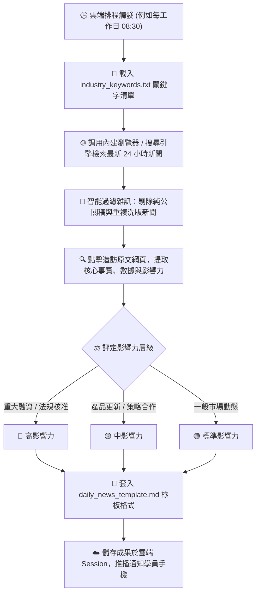

# 📰 範例 4：全自動產業情報監測、內建瀏覽器檢索與雲端定時晨報

> 🟣 **難度等級**：**Level 4（情報蒐集・雲端自動化排程）**  
> 💻 **適用平台**：Claude 全平台（Desktop / Web / Mobile / Chrome 側邊欄）  
> 💼 **適用角色**：創投分析師 (VC)、市場研究員 (Market Intelligence)、行銷企劃總監、行政祕書、商業開發 (BD)。  
> 🎯 **核心體驗**：
> - 🌐 **內建瀏覽器自主聯網 (Built-in Browser & Web Search)**：由 Claude 自主開啟外部網頁、閱讀最新 24 小時報導、辨識公關業配廢話並嚴格過濾。
> - 🕒 **雲端排程自動化 (Scheduled Tasks)**：設定定時任務，每工作日早晨自動執行，告別每天早起手動爬新聞的痛苦。
> - ☁️ **兩種執行架構解密（本機連動 vs. 純雲端）**：
>   - **本機連動排程**：自動讀寫筆電資料夾、存取實體硬碟，但電腦須維持開機喚醒。
>   - **純雲端排程（關機也能跑）**：將需求自給自足嵌於 Prompt，Anthropic 雲端伺服器全自動運算，筆電關機睡覺照常於手機 App 收成！

---

## 🎭 職場痛點劇場：每天清晨的「剪報地獄」

> *「主管每天早上 09:00 晨會的第一句話永遠是：『大家看一下今天產業有什麼大事？競品有沒有最新融資或發布新技術？』」*  
> *為了這句話，你每天 07:30 就得爬起來，一邊喝咖啡一邊焦慮地翻閱 TechCrunch、科技報橘、數位時代、工商時報……*  
> *更痛苦的是，還要手動把文字、連結複製貼上整理成 Markdown 晨報，稍微慢一點就趕不上主管會前閱讀的時間。*

**現在，讓 Claude Cowork 成為你的 24 小時無休駐點情報員，設定一次排程，每天早晨自動送上精美晨報！**

---

## 📦 快速開始：下載練習素材壓縮檔 (Quick Download)

> [!TIP]
> 💡 **免手動建立！已為您打包完整測試素材壓縮檔**：  
> 本範例已在目錄中預先準備好打包好的壓縮檔：[`sample_files.zip`](./sample_files.zip)  
> - **直接下載**：學員可直接下載此 `sample_files.zip`，解壓縮後即可獲得包含 `sample_files/` 完整測試目錄（內含監測指標清單 `industry_keywords.txt` 與標準簡報樣板 `daily_news_template.md`）。
> - **一鍵還原環境**：在練習完情報檢索與排程設定後，若想重新演練或測試不同關鍵字，只需再次解壓縮 `sample_files.zip` 覆蓋，即可秒速重置至最乾淨的初始狀態！

---

## 🔄 執行前後視覺化對比 (Before vs. After)

```
【執行前：監測關鍵字與晨報格式樣板】
04_Daily_News_Brief/
├── sample_files.zip                  ⭐【練習素材壓縮包：整包下載解壓/一鍵重置】
└── sample_files/
    ├── industry_keywords.txt         (監測重點關鍵字、追蹤指標與媒體清單)
    └── daily_news_template.md        (每日產業情報與競品趨勢簡報標準格式)
```

⬇️ **透過 Cowork 內建瀏覽器檢索 + 雲端排程產出** ⬇️

#### 【產出：每天早上 08:30 雲端自動產出之高階情報簡報】

| # | 新聞標題 | 涉及企業/領域 | 影響力評級 | 核心重點摘要 | 來源連結 |
|:---:|:---|:---|:---:|:---|:---:|
| **1** | 美國 FDA 核准首款生成式放射科影像輔助診斷系統 | MedTech AI (Series A) | 🔴 高 | 獲得 510(k) 許可，為首個將胸部 X 光異常篩檢時間縮短 60% 的臨床演算法。 | [閱讀原文](https://example.com/news1) |
| **2** | 專注永續農業之台灣新創完成 300 萬美元 Pre-A 融資 | GreenAgri (綠能科技) | 🟡 中 | 由知名永續基金領投，資金將用於擴建智慧感測溫室與海外市場拓展。 | [閱讀原文](https://example.com/news2) |

> **💡 戰略亮點剖析**：醫療 AI 領域正從「單點影像判讀」加速轉向「臨床工作流無縫整合」；法規通過速度比去年同期顯著加快。  
> **📌 建議下一步行動**：請 BD 團隊於週五前連繫 MedTech 亞太區業務代表，評估代理或院內合作可行性。

---

## 🧠 Cowork 代理執行管線 (Agent Execution Pipeline)



---

## 🪄 （選用進階）自然語言 ➔ RTCCF 結構化轉換術 (Optional)

> [!NOTE]
> 💡 **真實職場視角：同仁通常不懂 RTCCF，該怎麼辦？**  
> 在真實工作場景中，團隊同仁通常只會用口語交代搜尋任務：  
> *「幫我每天盯一下生醫跟 AI 融資的新聞，挑重要的大事整理成晨報，記得附上原文連結，別抓到業配新聞！」*  
> 
> **面對這個情況，您有兩種最舒服的做法：**
> 1. **做法 A（直接使用現成 Prompt）**：直接複製下方已經為您精心調校好的 RTCCF Prompt，省時又精準。
> 2. **做法 B（讓 AI 幫您轉化・一鍵變專業）**：先在一般對話（Chat）中，丟出您的隨興口語，讓 Claude 充當您的「提示詞架構師」，把白話文自動翻譯擴充為工業級 RTCCF 指令，再貼進 Cowork 執行！

<details>
<summary><b>點擊展開：如何用一句指令讓 Claude 將「口語白話」轉成「RTCCF」並以 Artifact 協作？</b></summary>

<br>

若您平常有其他自訂新聞追蹤任務，可在 **Chat** 模式中貼上這段元提示詞（Meta-Prompt）：

```markdown
我即將使用 Claude Cowork 執行全自動產業情報聯網監測任務。

請幫我把以下這段口語需求，轉換擴充為嚴謹、不易出錯的「RTCCF 結構化提示詞（Role, Task, Context, Constraint, Format）」。

【重要要求】：
1. 請使用標準 Markdown 語法排版，各段落使用「## Role」、「## Task」、「## Context」、「## Constraint」、「## Format」等二級標題，核心關鍵字使用「**重點粗體**」標註。
2. 請將轉換後的提示詞內容，儲存為一個名為「news_brief_prompt.md」的 Markdown 檔案（以 Artifact 模式產出），方便我在右側視窗直接預覽與人機協作微調。

──────────────────────────────────────────────────────────
【我的原始口語需求】：
「我要每天自動監測智慧醫療、AI醫療影像和創投融資動態。
請幫我依照 industry_keywords.txt 裡面的領域關鍵字連網搜尋最新24小時新聞，
過濾公關廢話，挑3則重大突破新聞填入 daily_news_template.md 樣板，
產出附帶真實來源網址與戰略行動建議的每日晨報。」
──────────────────────────────────────────────────────────
```

<br>

> 💡 **核心密技：為什麼要特別指定「儲存為 Markdown 檔 (Artifact)」？**  
> - **啟動右側 Artifact 畫布**：在 Claude 介面中，只有產出為獨立的 Markdown Artifact 文件，畫面右側才會展開專屬的預覽面板。  
> - **實現原地人機協作 (In-place Edit)**：您可以直接在右側畫布上**反白選取任何一段提示詞或產出的新聞晨報重點**，點擊浮現的「Edit with Claude」輸入修改意見，Claude 就會原地修訂該段落，達成流暢的雙向人機協同調校！

<br>

</details>

---

## 🤖 Cowork 實戰 Prompt（RTCCF 結構 - 亦可直接複製使用）

請在 **Cowork 模式** 下，上傳本資料夾中的 `industry_keywords.txt` 與 `daily_news_template.md`（或直接掛載 `sample_files/` 目錄），並輸入以下 Prompt（若不想手寫或轉換，直接複製這段即可）：

```markdown
## Role
你是一名專職的**科技產業情報分析師**與**創投競品研究員（Market Intelligence Analyst）**。

## Task
請根據上傳的 `industry_keywords.txt` 中所列的領域關鍵字與目標媒體清單，利用**內建瀏覽器**檢索最新 24 小時內的國內外產業新聞與市場動態。
**嚴格剔除純公關宣傳與無實質進展的炒作稿**，篩選出 **3 則最具戰略價值** 的要聞，將事實、數據與原文連結完全依據 `daily_news_template.md` 樣板格式整理，產出一份 **每日產業情報與競品趨勢簡報**。

## Context
- 監測指標檔：`industry_keywords.txt`
- 輸出格式樣板：`daily_news_template.md`

## Constraint
- 新聞事件必須為 **最新 24 小時內** 發布之報導。
- 數據（融資金額、認證名稱、合作對象）須 **100% 精準**，每則新聞必須附上 **可點擊之真實來源 URL**。
- 依據市場衝擊程度標記影響力：**🔴 高**（重大監管突破/大額融資）、**🟡 中**（產品重大改版）、**🟢 標準**（一般市場活動）。
- 必須撰寫 **專題亮點洞察** 與 **建議採取的下一步行動（Action Items）**。
- 使用**繁體中文**輸出。

## Format
完全遵循 `daily_news_template.md` 樣板輸出，不加入多餘寒暄贅字。
```

---

## 🚀 學員實戰動手做 4 步驟

0. **下載／確認練習素材**：
   - 確保本範例目錄中具備 `sample_files/` 測試資料夾。若您是從遠端單獨下載或需要重置，可直接下載解壓縮 [`sample_files.zip`](./sample_files.zip) 取得完整練習檔。
1. **開啟 Claude 介面切換至 Cowork**：
   - 登入 [claude.ai](https://claude.ai) 或開啟桌面應用，在訊息輸入框左下角切換為 **Cowork**。
2. **載入練習資料並送出 Prompt**：
   - 將 `industry_keywords.txt` 與 `daily_news_template.md` 拖曳上傳（或指定工作目錄），貼上上述 RTCCF Prompt 送出。
   - 親眼觀察 Claude 如何調用內建瀏覽器自主連網檢索最新報導並套入 Markdown 樣板。
3. **在對話中直接下達指令建立定時排程 (Scheduled Tasks)**：
   本範例**無須離開對話或手動填寫繁複設定**！在剛才產出晨報的同一個 Cowork 對話框中，直接用自然語言交代 Claude 即可：

   #### 💬 建立排程推薦指令（二選一或都建立）：

   - **指令 A（建立本機連動版・電腦開機時寫回資料夾）**：
     > 「**請幫我把這個每日產業情報任務建立為定時排程，設定在每個工作日早上 08:00 自動執行。**」
     >
     > *Claude 會自動綁定桌面版與 `sample_files/`，並在排程面板中開啟 `Require this computer` 開關。*

   - **指令 B（建立真・純雲端版・筆電關機睡覺照常跑！⭐ 最推薦）**：
     > 「**再幫我建立一個雲端版的每日產業情報簡報，同樣在工作日早上 08:00 執行，但不要綁定我的電腦，完全在雲端跑。**」
     >
     > *Claude 會自動把關鍵字與樣板固化在雲端指令中、關閉 `Require this computer` 開關，無需電腦開機即可在背景準時運算！*

   ---

   #### 📊 本機版 vs. 雲端版排程 完整規格對照表

   | 比較項目 | 💻 本機連動版（Local Desktop） | ☁️ 純雲端版（Pure Cloud・推薦 ⭐） |
   |:---|:---|:---|
   | **如何建立** | 對話交代：「請幫我把這個任務建立為定時排程...」 | 對話交代：「再幫我建立一個雲端版的排程，不綁定電腦...」 |
   | **是否需要電腦開機** | **需要**（電腦需開機且連網，維持喚醒） | **不需要**（筆電完全關機休眠照常跑） |
   | **Require this computer 開關** | 自動**開啟 (ON)** | 自動**關閉 (OFF)** |
   | **檢索工具** | Claude 桌面版內建瀏覽器 (Browser) | 雲端網路檢索 (WebSearch / WebFetch) |
   | **資料來源** | 自動讀取您本機資料夾的 `sample_files/` | 排程指令內固定的關鍵字與樣板結構 |
   | **簡報是否寫回本機硬碟** | **會**（自動存入您電腦的資料夾中） | **不會**（透過雲端對話傳送與推播手機） |
   | **預設產出檔名** | `daily_industry_brief_YYYY-MM-DD.md` | `daily_industry_brief_cloud_YYYY-MM-DD.md` |
   | **最佳使用情境** | 每天上班開著電腦，希望檔案直接存進本機者 | 習慣在通勤路上用手機 Claude App 查閱晨報者 |

4. **🔥 殺手級功能實戰：體驗「關機也能跑」的爽快感**：
   - 吩咐 Claude 建立好 **雲端版排程** 後，放心闔上筆電、關閉電源。
   - 第二天早上 08:05，打開手機上的 Claude App，點入 **Scheduled** 頁面，熱騰騰的產業晨報已由雲端伺服器在背景全自動備妥，隨點隨讀！

---

## 💡 避坑指南與核心收穫 (Tips & Takeaways)

> [!TIP]
> 1. **為什麼沒看到「Schedule this task」按鈕或 `/schedule`？**  
>    - **無需找按鈕，一句話搞定**：在 Cowork 模式下，直接在對話框輸入「`請幫我把這個每日產業情報任務建立為定時排程...`」，Claude 就會直接調用後台排程工具為您配置好，完全不需要手動填寫複雜參數！
>    - 若需要檢視、修改或暫停排程，隨時點擊 **左側導覽列的「Scheduled」** 專區即可管理。
> 2. **深入理解 `Require this computer`（綁定電腦）開關機制**：
>    - **什麼時候該打開？** 需要 Claude 存取電腦本機資料夾讀寫檔案、或使用桌面版環境操作本機 Chrome 時。此時**電腦必須處於開機且連網狀態**。
>    - **什麼時候該關閉？** 想要筆電完全關機休眠、人在通勤路上用手機看結果時。吩咐 Claude「不要綁定電腦」即可自動配置為純雲端版。
> 3. **若設了本機排程但電腦剛好關機，會發生什麼事？**  
>    - Claude 雲端排程具有容錯備援（Fallback）機制：時間一到雲端仍會觸發，但因連不上桌面版，會改用雲端預設的網路搜尋方式盡力產生簡報，並在對話中提醒「目前連線不到您的本機電腦，因此簡報僅保留在對話中，未寫回本機資料夾」。
> 4. **如何防止新聞幻覺？**  
>    在 Prompt 中加入 `每則新聞必須附上可點擊之真實來源 URL`，會強制 Agent 檢核來源網站的合法性，根絕假新聞。
> 5. **隨時可復原與一鍵重置**：  
>    - 若在練習檢索或調整樣板後想重新演練，直接將目錄內的 [`sample_files.zip`](./sample_files.zip) 解壓縮覆蓋，立即還原最乾淨的初始練習環境！

---

[← 上一篇：範例 3 跨來源財務對帳與自動繪圖](../03_Financial_Report/) ｜ [返回 Cowork 主頁](../../README.md) ｜ [下一篇：範例 5 資料夾指令與專案日誌 →](../05_Folder_Instructions_Project/)
