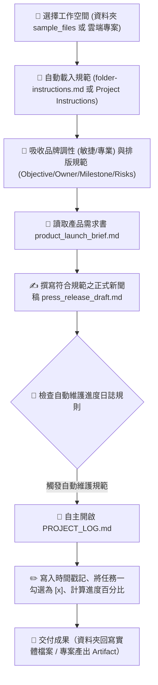

# 🎯 範例 5：資料夾指令 vs 雲端專案規範、日誌自主維護與跨裝置自治中樞

> 🔴 **難度等級**：**Level 5（終極代理・專案自治中樞）**  
> 💻 **適用平台**：Claude 全平台（Desktop / Web / Mobile / Chrome 側邊欄）  
> 💼 **適用角色**：專案總監 (PMO)、產品行銷主管 (PMM)、品牌公關總監、創業團隊負責人。  
> 🎯 **核心體驗**：
> - 🏢 **雙軌工作空間（專案 vs 資料夾）**：搞懂 Cowork 連結「**雲端專案 (Project)**」與「**本機資料夾 (Folder)**」的底層架構，自由切換團隊雲端協同或本機硬碟直連。
> - 🎯 **永久規範約束 (Persistent Instructions)**：透過 `folder-instructions.md` 或 `Project Instructions`，賦予 AI 永久品牌語氣與交付規章，無需在每次對話重複贅述。
> - 📝 **專案進度日誌自主維護 (Self-Maintaining Project Log)**：**極具自主性的 Agent 特徵！** 每次任務完成後，Claude 會自主開啟並更新 `PROJECT_LOG.md`，自動打勾完成里程碑、記錄時間戳記與摘要。
> - 📱 **跨裝置無縫接續 (Work from Anywhere)**：在辦公室電腦啟動專案，出門在手機 App 檢視進度與給予回饋，回家打開筆電一鍵收成。

---

## 🔍 Cowork 核心解密：連結「專案 (Project)」與「資料夾 (Folder)」有何不同？

在 Claude Cowork 輸入框下方點擊 **`Project or folder`**（右側預設狀態顯示為 **`Auto`** 自動偵測）時，會展開工作空間下拉選單，提供 **`+ Add folder`（連結資料夾）** 與 **`+ New project / Search projects`（建立或搜尋專案）** 等選擇（如下圖選單）：

```
┌────────────────────────────────────────────────────────┐
│ 🔍 Search projects                                  🎛️ │
├────────────────────────────────────────────────────────┤
│ 🗃️ 矽光子與邊緣 AI 晶片 (Silicon Photonics & Edge AI)  │
│ 📁 課程規劃 (/Users/.../課程規劃)                      │
│ 📁 工研院產業學院 (/Users/.../工研院產業學院)          │
│ 📁 workflow-productivity (/Users/.../workflow-...)     │
├────────────────────────────────────────────────────────┤
│ ➕ New project                                         │
│ 📁 Add folder                                          │
└────────────────────────────────────────────────────────┘
```

這兩者在儲存位置、規範設定、檔案讀寫與使用情境上有本質上的不同：

### 📊 專案 (Project) vs. 資料夾 (Folder) 完整規格對照表

| 比較維度 | 📁 連結資料夾 (Folder Mode) | 🗂️ 連結專案 (Project Mode) |
|:---|:---|:---|
| **底層本質** | 使用者電腦上的**實體硬碟目錄**（Local Filesystem） | Claude 伺服器上的**雲端隔離知識庫**（Cloud Project） |
| **建立與入口** | 點擊 `Project or folder` ➜ 選取 **`+ Add folder`** 瀏覽電腦目錄 | 點擊 `Project or folder` ➜ 選取 **`+ New project`**（亦支援在視窗中按 `+ Use a folder` 融合本機目錄） |
| **長效規範如何設定** | 在資料夾根目錄放置 **`folder-instructions.md`**（或 `CLAUDE.md`） | 在專案建立時填入 **`What are you trying to achieve?`**，或在專案設定中的 **`Project Instructions`** |
| **參考資料庫 (Context)**| 直接讀取該資料夾內的所有實體檔案 | 上傳至 **`Project Knowledge`（專案知識庫）**（支援 RAG 檢索，或透過 `+ Use a folder` 直連本地檔案） |
| **產出結果與回寫** | **直接寫入實體硬碟**（可新增檔案、原地修改與覆寫） | 輸出在雲端對話中、或生成 **Artifacts** 畫布供預覽（若綁定 folder 亦可回寫硬碟） |
| **硬體連線依賴** | 依賴 Claude Desktop 應用程式維持電腦連網連線 | **100% 雲端運行**，電腦完全關機休眠也能在手機 App 隨時操作 |
| **團隊協同能力** | 僅限這台電腦單機使用（除非資料夾為 Dropbox/iCloud） | 支援 Team / Enterprise **多人共享專案、共同沉澱知識** |
| **最佳適用情境** | 習慣在本地 VS Code/Finder 管理大量實體程式碼或文件 | 跨設備隨時辦公（手機/平板/公司電腦）、重視團隊知識共用 |

---

## 🎭 職場痛點劇場：重複說明的疲憊與版本混亂

> *「每次為了新產品上線發布打開 AI，你都得把同一段話打一次：『我們是 B2B 科技品牌、調性要敏捷專業不可浮誇、章節要有 Owner 和風險評估……』」*  
> *更崩潰的是，一個多星期的專案跑下來，產生了十幾份檔案，你根本記不清哪一份是最新版、哪一項任務已經完成，還得花額外時間手動維護 Excel 專案進度表。*  
> *下班搭車時，主管突然傳訊追問進度，你只能乾等回家開筆電……*

**現在，讓 Claude Cowork 透過「資料夾指令」或「專案規範」，將工作空間升級為「具備長效記憶與自主維護能力的智慧中樞」！**

---

## 📦 快速開始：下載練習素材壓縮檔 (Quick Download)

> [!TIP]
> 💡 **免手動建立！已為您打包完整測試素材壓縮檔**：  
> 本範例已在目錄中預先準備好打包好的壓縮檔：[`sample_files.zip`](./sample_files.zip)  
> - **直接下載**：學員可直接下載此 `sample_files.zip`，解壓縮後即可獲得包含 `sample_files/` 完整測試目錄：
>   - `folder-instructions.md`（定義品牌語氣、四章節排版、自動更新日誌規則）
>   - `product_launch_brief.md`（新產品上線需求書）
>   - `PROJECT_LOG.md`（初始狀態：進度 0%，里程碑皆為 `[ ]`）
> - **一鍵還原環境**：在練習完公關稿撰寫與日誌自動打勾後，若想重新演練，只需再次解壓縮 `sample_files.zip` 覆蓋，即可秒速重置至最乾淨的初始狀態！

---

## 🔄 執行前後視覺化對比 (Before vs. After)

```
【執行前：只有規範與初始需求】
sample_files/
├── folder-instructions.md        (定義品牌語氣、四章節排版、自動更新日誌規則)
├── product_launch_brief.md       (新產品上線需求書)
└── PROJECT_LOG.md                (初始狀態：進度 0%，里程碑皆為 [ ])

            ⬇️ 透過 Claude Cowork 自主理解並執行（資料夾或專案模式） ⬇️

【執行後：產出符合規範之公關草案，並自主更新專案日誌】
├── press_release_draft.md        ⭐【新生成！完全符合 4 大章節與專業語氣】
└── PROJECT_LOG.md                ⭐【自動更新！進度提升至 33%，自動勾選已完成】
    ├── 紀錄歷史：新增執行紀錄與產生 press_release_draft.md
    └── 里程碑狀態：
        - [x] 任務一：新聞稿草案撰寫 (由 Claude 自主打勾完成！)
        - [ ] 任務二：社群推廣規劃
        - [ ] 任務三：Sales Battlecard 製作
```

---

## 🧠 Cowork 代理執行管線 (Agent Execution Pipeline)



---

## 🤖 Cowork 實戰 Prompt（RTCCF 結構 - 通用於資料夾與專案）

在 Cowork 模式下連結資料夾或專案後，輸入以下極簡 Prompt——請特別留意：**我們完全不需要在 Prompt 裡重複說明品牌語氣與排版規定，因為資料夾指令／專案指示已全權代勞！**

```markdown
## Role
你是一名**資深科技產品行銷經理 (PMM)** 與**公關策略總監**。

## Task
請讀取 **`product_launch_brief.md`**，並嚴格遵循專案規範執行以下任務：
1. 為 SmartFlow AI 撰寫一份正式對外發布的新聞稿草稿，命名為 **`press_release_draft.md`**。
2. 新聞稿架構與語氣必須百分之百符合專案規範的 4 大核心結構（包含 🎯 Objective、👥 Owner、⏱️ Milestone 與 ⚠️ Risks & Mitigations）。
3. 任務完成後，務必落實自動維護規範：主動開啟並更新 **`PROJECT_LOG.md`**，將 **任務一：新聞稿草案撰寫** 標記為已完成 **`[x]`**，進度更新為 **33%**，並追加一筆包含時間戳記與執行摘要的歷史記錄。

## Context
- 專案需求書：`product_launch_brief.md`
- 專案進度表：`PROJECT_LOG.md`

## Constraint
- 語氣必須精準符合規範規定之 **專業、敏捷、充滿前瞻感，嚴禁浮誇**。
- 必須 **主動落實自動維護進度筆記規則**，更新 `PROJECT_LOG.md`。
- 使用**繁體中文**輸出。

## Format
完成後，交付 **`press_release_draft.md`** 草稿，並展示更新後的 **`PROJECT_LOG.md`** 內容。
```

---

## 🚀 學員實戰動手做：雙軌選擇演練

學員可依個人使用偏好，選擇 **軌道 A（本機資料夾模式）** 或 **軌道 B（雲端專案模式）** 進行實作演練：

### 🅰️ 軌道 A：本機資料夾模式（Folder Mode・本機硬碟直連回寫）

1. **下載解壓**：下載並解壓縮 [`sample_files.zip`](./sample_files.zip) 取得測試資料夾 `sample_files/`。
2. **切換 Cowork 並連結資料夾**：
   - 登入 Claude Desktop 桌面版，在輸入框上方或切換為 **Cowork** 模式。
   - 點擊輸入框下方的 **`Project or folder`**（預設顯示為 `Auto`）。
   - 在彈出選單底部點擊 **`+ Add folder`**，選取解壓縮後的 `sample_files` 資料夾。
3. **送出 Prompt**：
   - 貼上上述 RTCCF Prompt 送出。
4. **驗證成果**：
   - 執行完成後，打開您電腦上的 `sample_files/` 資料夾，您會親眼看到：
     - 自動多了一份實體檔案 **`press_release_draft.md`**！
     - 原本的 **`PROJECT_LOG.md`** 被 Claude **原地修改**，任務一自動打勾 `[x]`，並補上了時間戳記與成果紀錄！

---

### 🅱️ 軌道 B：雲端專案模式（Project Mode・全雲端跨裝置協同 ⭐）

1. **開啟建立專案視窗**：
   - 在 Cowork 模式輸入框下方點擊 **`Project or folder`**。
   - 在選單最底部點選 **`+ New project`**，此時會彈出 **「Create a project」** 視窗。
2. **填寫專案設定（精準對應介面欄位）**：
   - **What are you working on?**：填入專案名稱，例如：`SmartFlow AI 上線發布專案`。
   - **What are you trying to achieve?**：填入專案目標與指令規範（可直接將 `sample_files/folder-instructions.md` 內容貼於此處作為長效規範）。
   - 💡 **二合一彈性功能（`+ Use a folder`）**：
     - 若希望此專案**兼具本機硬碟直連讀寫能力**，可點擊視窗下方的 **`+ Use a folder`** 並選取 `sample_files` 資料夾！
     - 若希望維持**純雲端模式（不綁定本機路徑）**，則不點擊該按鈕，直接點擊右下角 **`Create project`** 建立。
3. **配置專案知識庫 (Knowledge)（純雲端專案適用）**：
   - 若為未掛載本地資料夾的純雲端專案，進入專案後點擊知識庫的「Add content」，將 `product_launch_brief.md` 與 `PROJECT_LOG.md` 拖曳上傳至專案知識庫中。
4. **在 Cowork 中選取專案並執行**：
   - 在 Cowork 輸入框下方的 **`Project or folder`** 下拉選單中，點選剛才建立的 **`SmartFlow AI 上線發布專案`**。
   - 貼上上述 RTCCF Prompt 送出。
5. **體驗跨裝置隨時收成**：
   - Claude 會依據專案目標與規範自動產出新聞稿，並在畫面右側展開 **Artifact**，產出自動打勾 `[x]` 的更新版 `PROJECT_LOG.md`。
   - **手機隨時接續**：此時拿出您的手機打開 Claude App，進入該專案與對話，新聞稿與最新日誌完全同步在雲端，隨時都能在通勤路上接續指派後續任務！

---

## 💡 避坑指南與核心收穫 (Tips & Takeaways)

> [!TIP]
> 1. **該選「資料夾」還是「專案」？**  
>    - **選資料夾**：需要直接在電腦 Finder/檔案總管中產生或編輯實體檔案（如程式碼專案、本地試算表、本機報告）。
>    - **選專案**：需要跨裝置（辦公室電腦、手機 App、家用筆電）隨時接續進度，或是團隊多人需要共享同一套品牌規範與知識庫時。
> 2. **日誌自主維護的震撼價值**：  
>    讓 AI 自動在產出成果後主動更新進度日誌（Self-reflection & Self-logging），是現代自主代理（Agentic AI）與傳統聊天機器人最大的差別。透過規範的引導，專案進度再也不需要人肉催繳與手動填寫。
> 3. **隨時可復原與一鍵重置**：  
>    - 若在練習多次更新日誌後想重新演練或重設進度為 0%，直接將目錄內的 [`sample_files.zip`](./sample_files.zip) 解壓縮覆蓋，立即還原最乾淨的初始練習環境！

---

[← 上一篇：範例 4 產業情報監測與定時晨報](../04_Daily_News_Brief/) ｜ [返回 Cowork 主頁](../../README.md)
