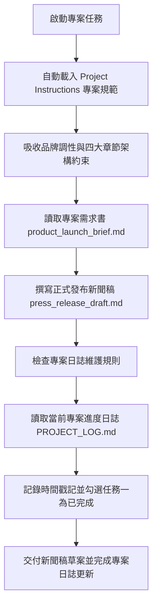

# 🎯 範例 5：雲端專案規範、日誌自主維護與跨裝置自治中樞

> 🔴 **難度等級**：**Level 5（終極代理・專案自治中樞）**  
> 💻 **適用平台**：Claude 全平台（Desktop / Web / Mobile / Chrome 側邊欄）  
> 💼 **適用角色**：專案總監 (PMO)、產品行銷主管 (PMM)、品牌公關總監、創業團隊負責人。  
> 🎯 **核心體驗**：
> - 🏢 **雲端專案自治體系 (Claude Projects)**：建立具備長效記憶、規範約束與資產管理的專案中樞，徹底搞懂專案右側面板的模組分工。
> - 🎯 **永久專案指示 (Project Instructions)**：將品牌調性、四章節排版與自動日誌規章注入專案大腦，所有專案對話自動繼承，無需重複贅述。
> - 📝 **專案日誌自主維護 (Self-Maintaining Project Log)**：**極具自主性的 Agent 特徵！** 任務完成後，Claude 自主讀取並更新 `PROJECT_LOG.md`，自動打勾完成里程碑、記錄時間戳記與摘要。
> - 📱 **跨裝置無縫接續 (Work from Anywhere)**：在辦公室電腦啟動專案，出門在手機 App 檢視進度與給予回饋，回家打開筆電一鍵收成。

---

## 🔍 Claude 專案核心解密：解剖專案管理面板

在 Claude 建立「專案 (Project)」後，專案便成為一個獨立隔離的智慧工作空間。專案面板完整劃分了以下核心支柱：

```
┌────────────────────────────────────────────────────────┐
│ How can I help you today?                              │
│ [＋ Chat] [Cowork]                       Sonnet 5 High │
│                                                        │
│ SmartFlow AI 上線發布專案  Auto                        │
└────────────────────────────────────────────────────────┘
    │
    ▼ 右側專案管理面板 (Project Panel)
┌────────────────────────────────────────────────────────┐
│ Instructions                                         ➕│
│ 專案長效指示：定義角色、品牌語氣與交付排版規則         │
├────────────────────────────────────────────────────────┤
│ Memory                                       🔒Only you│
│ 專案記憶：Claude 隨對話累積的互動偏好與背景資訊        │
├────────────────────────────────────────────────────────┤
│ Context                                              ➕│
│ 專案上下文庫：包含專案連結的資料夾、參考文件與背景知識 │
├────────────────────────────────────────────────────────┤
│ Scheduled                                            ➕│
│ 專案定時排程：設定定時觸發的自動化任務                 │
└────────────────────────────────────────────────────────┘
```

### 專案三大核心支柱

1. **專案指示 (Project Instructions)**：
   - 專案的「憲法與大腦」。
   - 設定後，該專案下的每一個對話、每一次任務，都會自動嚴格遵守，徹底免去每次在對話框重複貼 Prompt 規則的痛苦。
2. **專案上下文 (Context & Project Assets)**：
   - 專案所需的工作資料庫與資產。
   - 包含專案需求書（`product_launch_brief.md`）、進度日誌（`PROJECT_LOG.md`），使專案具備完整的上下文參照能力。
3. **專案日誌自主維護機制 (Autonomous Project Logging)**：
   - 專案指示要求 AI 在每次完成階段任務後，主動讀取並更新 `PROJECT_LOG.md`。
   - 自動將已完成的里程碑打勾、計算進度百分比，並記錄執行日誌，形成專案自治閉環。

---

## 🎭 職場痛點劇場：專案管理的重複疲勞與進度脫節

> *「每次為了新產品上線發布打開 AI，你都得把同一段話打一次：『我們是 B2B 科技品牌、調性要敏捷專業不可浮誇、章節要有 Owner 和風險評估……』」*  
> *更崩潰的是，一個多星期的專案跑下來，產生了十幾份檔案，你根本記不清哪一份是最新版、哪一項任務已經完成，還得花額外時間手動維護 Excel 專案進度表。*  
> *下班搭車時，主管突然傳訊追問進度，你只能乾等回家開筆電……*

**現在，讓 Claude 專案成為你的智慧自治中樞：專案指示永久鎖定規範，專案日誌自動打勾推進！**

---

## 📦 快速開始：下載練習素材壓縮檔 (Quick Download)

> [!TIP]
> 💡 **免手動建立！已為您打包完整測試素材壓縮檔**：  
> 本範例已在目錄中預先準備好打包好的壓縮檔：[`sample_files.zip`](./sample_files.zip)  
> - **直接下載**：學員可直接下載此 `sample_files.zip`，解壓縮後即可獲得包含 `sample_files/` 完整測試目錄：
>   - `folder-instructions.md`（定義品牌語氣、四章節排版、自動更新日誌規則）
>   - `product_launch_brief.md`（新產品上線需求書）
>   - `PROJECT_LOG.md`（初始狀態：進度 0%，里程碑皆為 `[ ]`）
> - **一鍵還原環境**：在練習完公關稿撰寫與日誌自動打勾後，若想重新演練，只需再次解壓縮 `sample_files.zip` 覆蓋，即可秒速重置至最乾淨的初始狀態！

---

## 🔄 執行前後視覺化對比 (Before vs. After)

```
【執行前：只有初始需求與空白進度】
SmartFlow AI 專案空間
├── folder-instructions.md        (定義品牌語氣、四章節排版、自動更新日誌規則)
├── product_launch_brief.md       (新產品上線需求書)
└── PROJECT_LOG.md                (初始狀態：進度 0%，里程碑皆為 [ ])

            ⬇️ 透過 Claude 專案指示約束與 Cowork 自主執行 ⬇️

【執行後：產出符合專案規範之公關草案，並自主更新專案進度日誌】
├── press_release_draft.md        ⭐【新生成！完全符合 4 大章節與專業語氣】
└── PROJECT_LOG.md                ⭐【自動更新！進度提升至 33%，自動勾選已完成】
    ├── 紀錄歷史：新增執行紀錄與產生 press_release_draft.md
    └── 里程碑狀態：
        - [x] 任務一：新聞稿草案撰寫 (由 Claude 自主打勾完成！)
        - [ ] 任務二：社群推廣規劃
        - [ ] 任務三：Sales Battlecard 製作
```

---

## 🧠 專案代理執行管線 (Project Agent Execution Pipeline)



---

## 🤖 專案實戰 Prompt（RTCCF 結構）

在專案內發起任務時，輸入以下極簡 Prompt——**我們完全不需要在 Prompt 裡重複說明品牌語氣與排版規定，因為專案指示已全權代勞！**

```markdown
## Role
你是一名**資深科技產品行銷經理 (PMM)** 與**公關策略總監**。

## Task
請讀取專案內的 **`product_launch_brief.md`**，並嚴格遵循專案規範執行以下任務：
1. 為 SmartFlow AI 撰寫一份正式對外發布的新聞稿草稿，命名為 **`press_release_draft.md`**。
2. 新聞稿架構與語氣必須百分之百符合專案規範的 4 大核心結構（包含 🎯 Objective、👥 Owner、⏱️ Milestone 與 ⚠️ Risks & Mitigations）。
3. 任務完成後，務必落實自動維護規範：主動開啟並更新專案內的 **`PROJECT_LOG.md`**，將 **任務一：新聞稿草案撰寫** 標記為已完成 **`[x]`**，進度更新為 **33%**，並追加一筆包含時間戳記與執行摘要的歷史記錄。

## Context
- 專案需求書：`product_launch_brief.md`
- 專案進度表：`PROJECT_LOG.md`

## Constraint
- 語氣必須精準符合規範規定之 **專業、敏捷、充滿前瞻感，嚴禁浮誇**。
- 必須 **主動落實自動維護進度筆記規則**，更新 `PROJECT_LOG.md`。
- 使用**繁體中文**輸出。

## Format
完成後，交付 **`press_release_draft.md`** 草稿，並展示更新後的 **`PROJECT_LOG.md`** 內容。
```

---

## 🚀 專案實戰動手做：建立專案自治中樞

請跟隨以下步驟，在 Claude 中建立一個具備規範約束與自主日誌維護能力的正式專案：

### 步驟 1：建立 Claude 專案 (Create a Project)
1. 在輸入框下方的工作空間選擇器（顯示 `Project or folder`，預設為 `Auto`）展開選單。
2. 點選底部的 **`+ New project`**，彈出 **「Create a project」** 對話框：
   - **What are you working on?**：輸入專案名稱，例如：`SmartFlow AI 上線發布專案`。
   - **What are you trying to achieve?**：輸入專案宗旨描述（例如：`推進 SmartFlow AI 上線發布，包含正式新聞稿撰寫、進度日誌自主維護與行銷規劃。`）。
   - **掛載專案資料夾**：點擊對話框下方的 **`+ Use a folder`** 按鈕，選取解壓縮後的 `sample_files` 資料夾。
   - 點擊 **`Create project`** 建立專案。

### 步驟 2：設定專案長效指示 (Set Project Instructions)
1. 進入剛建立的專案主頁面。
2. 檢視右側專案面板頂部的 **`Instructions`** 區塊，點擊 **`+`**（或直接點擊編輯）：
3. 將 `sample_files/folder-instructions.md` 中的核心規範貼入專案指示中：
   - **品牌調性**：敏捷、專業、簡潔、富前瞻性。
   - **四大核心章節**：Objective、Owner、Milestone、Risks & Mitigations。
   - **自主維護規章**：每次任務產出後，必須主動更新 `PROJECT_LOG.md`，打勾對應里程碑並記錄時間戳記。
4. 儲存 Instructions。此後該專案下的所有對話皆自動受此約束！

### 步驟 3：在專案中啟動任務對話
1. 確保工作空間處於 **`SmartFlow AI 上線發布專案`** 之下。
2. 將輸入模式切換為 **Cowork**。
3. 貼上上述 **RTCCF 實戰 Prompt** 送出。

### 步驟 4：檢視專案自治成果
1. **新聞稿產出**：Claude 嚴格遵循四大章節規範，產出專業的 `press_release_draft.md`。
2. **專案日誌自主打勾**：Claude 主動開啟 `PROJECT_LOG.md`，將「任務一：新聞稿草案撰寫」自動勾選為 `[x]`，整體進度自動躍升為 **33%**，並留下一筆包含時間戳記與摘要的完整變更記錄。
3. **跨對話延續**：即使下週開啟新對話，Claude 仍會基於專案內的最新進度日誌，無縫推進「任務二：社群推廣規劃」！

---

## 💡 專案自治避坑指南與核心價值 (Tips & Takeaways)

> [!IMPORTANT]
> 1. **專案指示 (Instructions) 的力量**：  
>    專案指示是團隊協同與代理自治的基石。只要在專案層級設定一次，團隊任何成員在該專案提問，產出的格式、語氣與日誌規則都將保持 100% 的統一水準。
> 2. **日誌自主維護的 Agent 精神**：  
>    傳統 AI 只是「你問一句，它回一句」；而具備專案自治能力的 Agent，會在完成產出後主動回顧任務清單（Self-Reflection）、自動打勾更新專案進度，讓專案狀態隨時保持在最新狀態。
> 3. **隨時一鍵還原演練環境**：  
>    若在多次演練日誌打勾後想重新演練或重設進度為 0%，只需再次解壓縮目錄內的 [`sample_files.zip`](./sample_files.zip) 覆蓋，即可秒速還原初始狀態！

---

[← 上一篇：範例 4 產業情報監測與定時晨報](../04_Daily_News_Brief/) ｜ [返回 Cowork 主頁](../../README.md)
