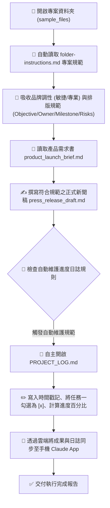

# 🎯 範例 5：資料夾指令規範、專案日誌自主維護與跨裝置無縫接續

> 🔴 **難度等級**：**Level 5（終極代理・專案自治中樞）**  
> 💻 **適用平台**：Claude 全平台（Desktop / Web / Mobile / Chrome 側邊欄）  
> 💼 **適用角色**：專案總監 (PMO)、產品行銷主管 (PMM)、品牌公關總監、創業團隊負責人。  
> 🎯 **核心體驗**：
> - 🎯 **資料夾專屬指令 (Folder Instructions)**：賦予特定資料夾「永久靈魂與記憶」，自動約束品牌語氣、排版規章，無需在每次對話重複贅述。
> - 📝 **專案進度日誌自主維護 (Self-Maintaining Project Log)**：**極具自主性的 Agent 特徵！** 每次任務完成後，Claude 會自主開啟並更新 `PROJECT_LOG.md`，自動打勾完成里程碑、記錄時間戳記與摘要。
> - 📱 **跨裝置無縫接續 (Work from Anywhere)**：在辦公室電腦啟動專案，出門在手機 App 檢視進度與給予回饋，回家打開筆電一鍵收成。

---

## 🎭 職場痛點劇場：重複說明的疲憊與版本混亂

> *「每次為了新產品上線發布打開 AI，你都得把同一段話打一次：『我們是 B2B 科技品牌、調性要敏捷專業不可浮誇、章節要有 Owner 和風險評估……』」*  
> *更崩潰的是，一個多星期的專案跑下來，產生了十幾份檔案，你根本記不清哪一份是最新版、哪一項任務已經完成，還得花額外時間手動維護 Excel 專案進度表。*  
> *下班搭車時，主管突然傳訊追問進度，你只能乾等回家開筆電……*

**現在，讓 Claude Cowork 將你的專案資料夾升級為「具備長效記憶與自主維護能力的智慧中樞」！**

---

## 📦 快速開始：下載練習素材壓縮檔 (Quick Download)

> [!TIP]
> 💡 **免手動建立！已為您打包完整測試素材壓縮檔**：  
> 本範例已在目錄中預先準備好打包好的壓縮檔：[`sample_files.zip`](./sample_files.zip)  
> - **直接下載**：學員可直接下載此 `sample_files.zip`，解壓縮後即可獲得包含 `sample_files/` 完整測試目錄（內含資料夾指令 `folder-instructions.md`、專案需求書 `product_launch_brief.md` 與初始日誌 `PROJECT_LOG.md`）。
> - **一鍵還原環境**：在練習完公關稿撰寫與日誌自動打勾後，若想重新演練或測試不同指令，只需再次解壓縮 `sample_files.zip` 覆蓋，即可秒速重置至最乾淨的初始狀態！

---

## 🔄 執行前後視覺化對比 (Before vs. After)

```
【執行前：只有規範與初始需求】
05_Folder_Instructions_Project/
├── sample_files.zip                  ⭐【練習素材壓縮包：整包下載解壓/一鍵重置】
└── sample_files/
    ├── folder-instructions.md        (定義品牌語氣、四章節排版、自動更新日誌規則)
    ├── product_launch_brief.md       (新產品上線需求書)
    └── PROJECT_LOG.md                (初始狀態：進度 0%，里程碑皆為 [ ])

                ⬇️ 透過 Claude Cowork 自主理解並執行 ⬇️

【執行後：產出符合規範之公關草案，並自主更新專案日誌】
sample_files/
├── folder-instructions.md
├── product_launch_brief.md
├── press_release_draft.md            ⭐【新生成！完全符合 4 大章節與專業語氣】
└── PROJECT_LOG.md                    ⭐【自動更新！進度提升至 33%，自動勾選已完成】
    ├── 紀錄歷史：新增 2026-09-12 執行紀錄與產生 press_release_draft.md
    └── 里程碑狀態：
        - [x] 任務一：新聞稿草案撰寫 (由 Claude 自主打勾完成！)
        - [ ] 任務二：社群推廣規劃
        - [ ] 任務三：Sales Battlecard 製作
```

---

## 🧠 Cowork 代理執行管線 (Agent Execution Pipeline)



---

## 🪄 （選用進階）自然語言 ➔ RTCCF 結構化轉換術 (Optional)

> [!NOTE]
> 💡 **真實職場視角：同仁通常不懂 RTCCF，該怎麼辦？**  
> 在真實工作場景中，專案經理或行銷人員通常只會隨口交代：  
> *「幫我照著資料夾裡的規定，把產品新聞稿寫好存起來，寫完記得去把進度表打勾，補上今天的進度紀錄。」*  
> 
> **面對這個情況，您有兩種最舒服的做法：**
> 1. **做法 A（直接使用現成 Prompt）**：直接複製下方已經為您精心調校好的 RTCCF Prompt，省時又精準。
> 2. **做法 B（讓 AI 幫您轉化・一鍵變專業）**：先在一般對話（Chat）中，丟出您的隨興口語，讓 Claude 充當您的「提示詞架構師」，把白話文自動翻譯擴充為工業級 RTCCF 指令，再貼進 Cowork 執行！

<details>
<summary><b>點擊展開：如何用一句指令讓 Claude 將「口語白話」轉成「RTCCF」並以 Artifact 協作？</b></summary>

<br>

若您平常有其他自訂專案自治任務，可在 **Chat** 模式中貼上這段元提示詞（Meta-Prompt）：

```markdown
我即將使用 Claude Cowork 執行專案自治中樞與自動維護進度任務。

請幫我把以下這段口語需求，轉換擴充為嚴謹、不易出錯的「RTCCF 結構化提示詞（Role, Task, Context, Constraint, Format）」。

【重要要求】：
1. 請使用標準 Markdown 語法排版，各段落使用「## Role」、「## Task」、「## Context」、「## Constraint」、「## Format」等二級標題，核心關鍵字使用「**重點粗體**」標註。
2. 請將轉換後的提示詞內容，儲存為一個名為「project_launch_prompt.md」的 Markdown 檔案（以 Artifact 模式產出），方便我在右側視窗直接預覽與人機協作微調。

──────────────────────────────────────────────────────────
【我的原始口語需求】：
「請幫我照著 folder-instructions.md 的規矩，
讀取 product_launch_brief.md 寫一份 SmartFlow AI 的正式對外發布新聞稿 press_release_draft.md。
寫完後要自己去把 PROJECT_LOG.md 打開，把任務一打勾，
進度更新成 33%，並追加一筆今天的執行時間與成果摘要紀錄。」
──────────────────────────────────────────────────────────
```

<br>

> 💡 **核心密技：為什麼要特別指定「儲存為 Markdown 檔 (Artifact)」？**  
> - **啟動右側 Artifact 畫布**：在 Claude 介面中，只有產出為獨立的 Markdown Artifact 文件，畫面右側才會展開專屬的預覽面板。  
> - **實現原地人機協作 (In-place Edit)**：您可以直接在右側畫布上**反白選取任何一段提示詞或產出的新聞稿段落**，點擊浮現的「Edit with Claude」輸入修改意見，Claude 就會原地修訂該段落，達成流暢的雙向人機協同調校！

<br>

</details>

---

## 🤖 Cowork 實戰 Prompt（RTCCF 結構 - 亦可直接複製使用）

在 **Cowork 模式** 下開啟此資料夾（或上傳本範例練習檔案），輸入以下極簡 Prompt——請特別留意：**我們完全不需要在 Prompt 裡重複說明品牌語氣與排版規定，因為資料夾指令已全權代勞！**

```markdown
## Role
你是一名**資深科技產品行銷經理 (PMM)** 與**公關策略總監**。

## Task
請讀取 **`product_launch_brief.md`**，並嚴格遵循 **`folder-instructions.md`** 中的專案規範執行以下任務：
1. 為 SmartFlow AI 撰寫一份正式對外發布的新聞稿草稿，命名為 **`press_release_draft.md`** 存入本目錄中。
2. 新聞稿架構與語氣必須百分之百符合 **`folder-instructions.md`** 的 4 大核心結構（包含 🎯 Objective、👥 Owner、⏱️ Milestone 與 ⚠️ Risks & Mitigations）。
3. 任務完成後，務必落實自動維護規範：主動開啟並更新 **`PROJECT_LOG.md`**，將 **任務一：新聞稿草案撰寫** 標記為已完成 **`[x]`**，進度更新為 **33%**，並追加一筆包含時間戳記與執行摘要的歷史記錄。

## Context
- 資料夾指令：**`folder-instructions.md`**
- 專案需求書：**`product_launch_brief.md`**
- 專案進度表：**`PROJECT_LOG.md`**

## Constraint
- 語氣必須精準符合 `folder-instructions.md` 規定之 **專業、敏捷、充滿前瞻感，嚴禁浮誇**。
- 必須 **主動落實自動維護進度筆記規則**，更新 `PROJECT_LOG.md`。
- 使用**繁體中文**輸出。

## Format
完成後，產出 **`press_release_draft.md`** 草稿，並展示更新後的 **`PROJECT_LOG.md`** 內容。
```

---

## 🚀 學員實戰動手做 4 步驟

0. **下載／確認練習素材**：
   - 確保本範例目錄中具備 `sample_files/` 測試資料夾。若您是從遠端單獨下載或需要重置，可直接下載解壓縮 [`sample_files.zip`](./sample_files.zip) 取得完整練習檔。
1. **開啟 Claude 介面切換至 Cowork**：
   - 登入 [claude.ai](https://claude.ai) 或開啟桌面應用，在訊息輸入框左下角切換為 **Cowork**。
2. **載入練習資料並送出 Prompt**：
   - 指定本機目錄或上傳練習檔案，貼上上述 RTCCF Prompt 送出。
3. **親眼見證「自主維護日誌」的震撼**：
   - 任務結束後，親自點開 [`sample_files/PROJECT_LOG.md`](./sample_files/PROJECT_LOG.md)：
   - 你會發現 Claude **完全不需要你第二次指令提醒**，就自動在表格末尾追加了剛剛執行的紀錄，並將任務一打上了漂亮的 `[x]`！這就是自主代理人（Agentic Workflow）的強大魅力！
4. **🔥 殺手級功能實戰：體驗「跨裝置無縫接續 (Work from Anywhere)」**：
   - **在電腦啟動**：在辦公室電腦啟動任務後，闔上筆電。
   - **在手機檢視**：走出門搭車時，打開手機上的 **Claude App**，點進同一個 Cowork Session，你會看到剛剛在電腦上產出的草案與日誌已經完整呈現在手機畫面上。
   - **直接追加任務**：在手機直接語音輸入：「*請接著幫我準備任務二的社群推廣文案大綱*」。
   - **在另一台設備收成**：回到家打開另一台電腦的瀏覽器，任務已自動推進，專案日誌也同步累積！

---

## 💡 避坑指南與核心收穫 (Tips & Takeaways)

> [!TIP]
> 1. **資料夾專屬指令的優先級**：  
>    `folder-instructions.md` 相當於該專案的 System Prompt，會自動約束該目錄下的每一次 Cowork 任務。若團隊更換規範，只需修改該檔案一次，所有成員與後續任務皆自動生效。
> 2. **日誌維護的原子性**：  
>    在指令中要求「先完成實體產出，再更新日誌紀錄」，能確保專案進度表與真實成果嚴格保持同步，杜絕虛報進度。
> 3. **隨時可復原與一鍵重置**：  
>    - 若在練習多次更新日誌後想重新演練或重設進度為 0%，直接將目錄內的 [`sample_files.zip`](./sample_files.zip) 解壓縮覆蓋，立即還原最乾淨的初始練習環境！

---

[← 上一篇：範例 4 產業情報監測與定時晨報](../04_Daily_News_Brief/) ｜ [返回 Cowork 主頁](../../README.md)
