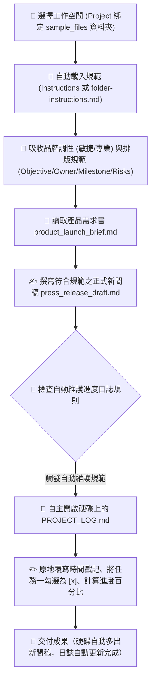

# 🎯 範例 5：資料夾指令 vs 雲端專案規範、日誌自主維護與跨裝置自治中樞

> 🔴 **難度等級**：**Level 5（終極代理・專案自治中樞）**  
> 💻 **適用平台**：Claude 全平台（Desktop / Web / Mobile / Chrome 側邊欄）  
> 💼 **適用角色**：專案總監 (PMO)、產品行銷主管 (PMM)、品牌公關總監、創業團隊負責人。  
> 🎯 **核心體驗**：
> - 🏢 **五大模組分工體系**：解密 Claude 專案右側面板（**Instructions**、**Memory**、**Context**、**Folder**、**Scheduled**）的底層定位。
> - ⚡ **快取機制 (Prompt Caching) vs. 本機直連 (Folder)**：搞懂為什麼雲端 Context 會被快取（靜態唯讀），而本機 Folder 則是動態讀寫、自動原地回寫。
> - 📝 **專案進度日誌自主維護 (Self-Maintaining Project Log)**：**極具自主性的 Agent 特徵！** 任務完成後，Claude 自主開啟並更新硬碟上的 `PROJECT_LOG.md`，自動打勾完成里程碑、記錄時間戳記，**完全零手動**！
> - 🌟 **專案 + 資料夾二合一終極形態 (Project with Folder)**：結合雲端專案的統一規範與本機硬碟的自動化檔案閉環，打造真正的 AI 工作中樞。

---

## 🔍 Cowork 核心解密：解剖「專案首頁」與「對話視窗」的兩大面板

在操作 Claude 專案與 Cowork 時，隨著所在頁面不同，右側面板會呈現兩種不同型態：

### 視圖 A：專案首頁管理面板 (Project Settings Dashboard)
當您剛進入專案主頁時，右側清楚劃分了 5 個核心模組：

```
┌────────────────────────────────────────────────────────┐
│ How can I help you today?                              │
│ [＋ Chat] [Cowork]                       Sonnet 5 High │
│                                                        │
│ SmartFlow AI 上線發布專案  Auto                        │
└────────────────────────────────────────────────────────┘
    │
    ▼ 右側專案管理面板 (Project Panel)
┌────────────────────────────────────────────────────────┐
│ Instructions                                         ➕│
│ 定義長效角色語氣、產出規章與排版規範 (所有對話自動繼承)   │
├────────────────────────────────────────────────────────┤
│ Memory                                       🔒Only you│
│ Claude 隨對話次數自主記住的偏好與重要背景              │
├────────────────────────────────────────────────────────┤
│ Context                                              ➕│
│ 雲端靜態參考資料庫（產品白皮書、法規手冊 PDF，享快取折扣）│
├────────────────────────────────────────────────────────┤
│ Folder                                                 │
│ 📁 sample_files                                        │
│ On this computer（本地實體硬碟直連，即時動態讀寫回寫） │
├────────────────────────────────────────────────────────┤
│ Scheduled                                            ➕│
│ 定時自動排程任務（例如每天早上自動巡檢進度並發晨報）     │
└────────────────────────────────────────────────────────┘
```

### 視圖 B：任務對話工作面板 (Task / Chat Session Dashboard)
當您在專案中開始對話時，右側面板會轉變為即時任務追蹤面版：

```
┌────────────────────────────────────────────────────────┐
│ Progress >                                             │
├────────────────────────────────────────────────────────┤
│ Outputs >                                              │
├────────────────────────────────────────────────────────┤
│ Context ∨                                            ➕│
│ 📁 sample_files                                        │
└────────────────────────────────────────────────────────┘
```

---

## 🧠 深度剖析：為什麼對話面板的 `Context ∨` 裡面會出現 `📁 sample_files`？它被快取鎖住了嗎？

學員在看到對話面板右側時，最常提出的核心疑問：  
> **「既然 Folder 出現在右側的 `Context ∨` 清單中，那它是不是已經被 Cached 了？這樣更新的 `PROJECT_LOG.md` 還能自動讀到最新版嗎？」**

### 1. UI 視覺定義 vs. 底層技術架構

* **UI 視覺層面（為什麼放在 Context 底下？）**：  
  在對話視窗中，Claude 將「**當前對話可供參照的所有資源**」統稱為 Context（上下文來源）。無論是雲端靜態上傳的 PDF，還是本機連結的實體資料夾 `sample_files`，都會被條列在 `Context ∨` 清單中供您隨時檢視與管理。
* **底層執行層面（最硬核的技術證據！）**：  
  當您送出任務後，觀察 Claude 思考區間的執行回報：
  > 🛠️ **`Used 5 tools, ran a command · 1 note`**  
  > 💬 **「Both檔案已直接寫入您連結的資料夾（`/Users/.../Downloads/sample_files`），不需要另外下載。」**

這行狀態清楚證明了：**列在 Context 裡的本機資料夾，底層是透過 Local Agent Tools 與本機終端指令（ran a command）即時動態連線至 macOS/Windows 實體硬碟！**

### 2. 靜態 Context vs. 本機 Folder 快取與讀寫對照表

| 比較維度 | 📄 純靜態檔案（上傳到 Context） | 📁 本機資料夾（顯示於 Context ∨ 的 Folder） |
|:---|:---|:---|
| **本質與位置** | 雲端伺服器上的靜態檔案複本 | **您電腦硬碟上的真實實體目錄**（Local Filesystem） |
| **快取機制 (Caching)** | **100% 靜態鎖定快取 (Prompt Caching)**<br>不可變動，享受 90% 費用折扣與極速回應。 | **動態即時讀寫 (Local Tool Execution)**<br>不被靜態舊快取卡死，每次存取皆即時呼叫工具讀寫硬碟。 |
| **AI 修改能力** | ❌ **唯讀**：Claude 無法透過對話回寫修改雲端檔案。 | ✅ **雙向讀寫**：Claude 可直接新增實體檔案、原地修改硬碟日誌。 |
| **日誌更新後** | 若上傳至此，雲端永遠鎖在 0% 舊快取。 | **硬碟直接改為 33%**，下次任務讀取**保證是硬碟最新內容**！ |

### 3. 更新後的 `PROJECT_LOG.md` 完全自動生效，絕不需手動！

- 由於 Cowork 是直接透過工具改寫硬碟裡的 `sample_files/PROJECT_LOG.md`，硬碟裡的檔案當下就已經是 33% 的打勾狀態。
- 下一次執行新任務時，Claude 再次呼叫讀取工具，**讀到的必然是硬碟最新的實體內容，完全零手動**！
- ⚠️ **切記唯一禁忌**：**千萬不要把 `PROJECT_LOG.md` 手動上傳到右側 Context 裡的「Add PDFs, documents」按鈕！** 否則雲端靜態快取將鎖定舊版本，反而干擾本地硬碟的自動化流轉。

### 4. 為什麼要有 Folder？解放三大手動折磨

**有了 Folder，就是為了徹底消滅「每次都要手動」的人工疲憊：**

```mermaid
flowchart LR
    A["💻 電腦硬碟 (sample_files)"] -->|1. Cowork 本機工具即時讀取| B["🧠 Claude 大腦 (依 Instructions/規範約束)"]
    B -->|2. Used tools 撰寫公關稿 & 自動打勾| C["⚡ 本地指令回寫"]
    C -->|3. 原地覆寫 PROJECT_LOG.md (33%) & 新增新聞稿| A
```

1. **免手動上傳**：電腦資料夾一連結，Claude 自動隨需讀取。
2. **免手動下載存檔**：公關稿直接長在您的硬碟資料夾中。
3. **免手動維護日誌**：進度與時間戳記直接原地覆寫，下個任務自動無縫接續！

---

## 📊 專案 (Project) vs. 資料夾 (Folder) 完整規格對照表

| 比較維度 | 📁 連結資料夾 (Folder Mode) | 🗂️ 專案融合資料夾 (Project + Folder ⭐) | ☁️ 純雲端專案 (Cloud-Only Project) |
|:---|:---|:---|:---|
| **底層架構** | 純本機硬碟目錄直連 | **雲端專案規範 + 本機硬碟讀寫（最佳實踐）** | 100% 雲端隔離沙盒 |
| **入口路徑** | `Project or folder` ➜ `+ Add folder` | `+ New project` ➜ 點選 **`+ Use a folder`** | `+ New project`（不選 folder） |
| **長效規範設定** | 目錄下的 `folder-instructions.md` | 右側面板的 **`Instructions`** | 右側面板的 **`Instructions`** |
| **動態作業區** | 本機資料夾（直接讀寫） | **右側 Folder 區塊（直接讀寫實體硬碟）** | 雲端對話框與 Artifact 畫布 |
| **靜態參考資料** | 放在同目錄下的參考檔 | **右側 Context 區塊（享 Prompt Caching）** | 右側 Context 區塊（享 Prompt Caching）|
| **日誌回寫方式** | 原地覆寫本機 `PROJECT_LOG.md` | **原地覆寫本機 `PROJECT_LOG.md`（零手動！）** | 輸出為 Artifact 畫布（需手動存檔）|
| **適用情境** | 本地單機快速任務、程式碼開發 | **企業正式專案、團隊長效標準作業流程** | 外出手機 App 應急、無本機電腦環境 |

---

## 🎭 職場痛點劇場：重複說明的疲憊與版本混亂

> *「每次為了新產品上線發布打開 AI，你都得把同一段話打一次：『我們是 B2B 科技品牌、調性要敏捷專業不可浮誇、章節要有 Owner 和風險評估……』」*  
> *更崩潰的是，一個多星期的專案跑下來，產生了十幾份檔案，你根本記不清哪一份是最新版、哪一項任務已經完成，還得花額外時間手動維護 Excel 專案進度表。*  

**現在，讓 Claude 透過「專案指示」與「本機資料夾連線」，將工作空間升級為「具備長效記憶與自主維護能力的智慧中樞」！**

---

## 📦 快速開始：下載練習素材壓縮檔 (Quick Download)

> [!TIP]
> 💡 **免手動建立！已為您打包完整測試素材壓縮檔**：  
> 本範例已在目錄中預先準備好打包好的壓縮檔：[`sample_files.zip`](./sample_files.zip)  
> - **直接下載**：學員可直接下載此 `sample_files.zip`，解壓縮後即可獲得包含 `sample_files/` 完整測試目錄：
>   - `folder-instructions.md`（定義品牌語氣、四章節排版、自動更新日誌規則）
>   - `product_launch_brief.md`（新產品上線需求書）
>   - `PROJECT_LOG.md`（初始狀態：進度 0%，里程碑皆為 `[ ]`）
> - **一鍵還原環境**：在練習完公關稿撰寫與日誌自動打勾後，若想重新演練，只需再次解壓縮 `sample_files.zip` 覆蓋，即可秒速重置至最乾淨的初始狀態！

---

## 🔄 執行前後視覺化對比 (Before vs. After)

```
【執行前：只有規範與初始需求】
sample_files/
├── folder-instructions.md        (定義品牌語氣、四章節排版、自動更新日誌規則)
├── product_launch_brief.md       (新產品上線需求書)
└── PROJECT_LOG.md                (初始狀態：進度 0%，里程碑皆為 [ ])

            ⬇️ 透過 Claude Cowork 自主理解並執行 ⬇️

【執行後：產出符合規範之公關草案，並自主更新專案日誌】
├── press_release_draft.md        ⭐【新生成！完全符合 4 大章節與專業語氣】
└── PROJECT_LOG.md                ⭐【自動更新！進度提升至 33%，自動勾選已完成】
    ├── 紀錄歷史：新增執行紀錄與產生 press_release_draft.md
    └── 里程碑狀態：
        - [x] 任務一：新聞稿草案撰寫 (由 Claude 自主打勾完成！)
        - [ ] 任務二：社群推廣規劃
        - [ ] 任務三：Sales Battlecard 製作
```

---

## 🧠 Cowork 代理執行管線 (Agent Execution Pipeline)



---

## 🤖 Cowork 實戰 Prompt（RTCCF 結構）

在 Cowork 模式下連結資料夾或專案後，輸入以下極簡 Prompt——**我們完全不需要在 Prompt 裡重複說明品牌語氣與排版規定，因為規範已全權代勞！**

```markdown
## Role
你是一名**資深科技產品行銷經理 (PMM)** 與**公關策略總監**。

## Task
請讀取 **`product_launch_brief.md`**，並嚴格遵循專案規範執行以下任務：
1. 為 SmartFlow AI 撰寫一份正式對外發布的新聞稿草稿，命名為 **`press_release_draft.md`**。
2. 新聞稿架構與語氣必須百分之百符合專案規範的 4 大核心結構（包含 🎯 Objective、👥 Owner、⏱️ Milestone 與 ⚠️ Risks & Mitigations）。
3. 任務完成後，務必落實自動維護規範：主動開啟並更新 **`PROJECT_LOG.md`**，將 **任務一：新聞稿草案撰寫** 標記為已完成 **`[x]`**，進度更新為 **33%**，並追加一筆包含時間戳記與執行摘要的歷史記錄。

## Context
- 專案需求書：`product_launch_brief.md`
- 專案進度表：`PROJECT_LOG.md`

## Constraint
- 語氣必須精準符合規範規定之 **專業、敏捷、充滿前瞻感，嚴禁浮誇**。
- 必須 **主動落實自動維護進度筆記規則**，更新 `PROJECT_LOG.md`。
- 使用**繁體中文**輸出。

## Format
完成後，交付 **`press_release_draft.md`** 草稿，並展示更新後的 **`PROJECT_LOG.md`** 內容。
```

---

## 🚀 學員實戰動手做：三種玩法實作演練

學員可依使用情境選擇最合適的模式進行演練，**強烈推薦「玩法 ②（專案融合資料夾）」作為正式工作模式**：

### 🌟 玩法 ②：專案融合資料夾模式（Project + Folder・終極最佳實踐 ⭐）

這正是兼具「雲端專案規範 (Instructions)」與「本地硬碟自動回寫 (Folder)」的最高境界：

1. **開啟建立專案視窗**：
   - 在輸入框下方點擊 **`Project or folder`**（預設顯示 `Auto`）。
   - 在彈出面板最下方點擊 **`+ New project`**，彈出 **「Create a project」** 視窗。
2. **填寫專案設定（精準對應介面欄位）**：
   - **What are you working on?**：填入專案名稱，例如：`SmartFlow AI 上線發布專案`。
   - **What are you trying to achieve?**：**這是「專案描述 / 宗旨目標 (Project Description)」**，會顯示在專案標題下方。用簡明的一兩句話描述即可（例如：`推進 SmartFlow AI 上線發布，包含正式新聞稿撰寫、進度日誌自主維護與後續行銷規劃。`）。
   - ⭐ **關鍵步驟（`+ Use a folder`）**：
     - 點擊對話框下方的 **`+ Use a folder`** 按鈕。
     - 選取解壓縮後的 **`sample_files`** 資料夾。
     - 點擊 **`Create project`**。
3. **確認專案右側面板與長效規範設定**：
   - 進入專案後，右側會出現：
     - **Folder**：顯示 `📁 sample_files` 與 `On this computer`（硬碟連線成功！）。
     - **Context**：保持空白即可（**切勿上傳 `PROJECT_LOG.md`！**）。
     - **Instructions**：
       - 💡 **免手動填寫！** 因為已綁定 `Folder`，Claude Cowork 在執行時會**自動讀取資料夾內的 `folder-instructions.md`** 作為約束！
       - （亦可點擊右側 `Instructions (+)` 貼入規範備用，兩者皆通）。
4. **送出 Prompt 執行**：
   - 切換至 **Cowork** 模式，貼上上述 RTCCF Prompt 送出。
   - 此時右側工作面版會展開為 `Progress`、`Outputs` 與 **`Context ∨`**（裡面列著 **`📁 sample_files`**）。
5. **見證硬碟自動化奇蹟**：
   - 執行時您會親眼目睹 Claude 思考區顯示 **`Used 5 tools, ran a command`**（調用本機讀寫工具）。
   - 完成後 Claude 會明確告知：**「Both檔案已直接寫入您連結的資料夾，不需要另外下載。」**
   - 打開您電腦上的 `sample_files/` 資料夾：
     - 實體檔案 **`press_release_draft.md`** 已自動誕生！
     - 原本的 **`PROJECT_LOG.md`** 被 Claude **原地修改**，任務一自動打勾 `[x]`，進度升為 33%！**整個過程完全零手動！**

---

### 🅰️ 玩法 ①：純本機資料夾模式（Folder Mode Only・單機輕量首選）

如果您只是想在本地快速處理一組檔案，不想在雲端建立專案：

1. **切換 Cowork 並連結資料夾**：
   - 在輸入框切換為 **Cowork** 模式。
   - 點擊輸入框下方的 **`Project or folder`**（顯示 `Auto`）。
   - 在選單最底部點擊 **`+ Add folder`**，選取解壓縮後的 `sample_files` 資料夾。
2. **送出 Prompt**：
   - 貼上上述 RTCCF Prompt 送出。
   - Claude 會直接自動讀取資料夾根目錄的 `folder-instructions.md` 作為規範，並自動修改實體硬碟中的檔案。

---

### ☁️ 玩法 ③：純雲端專案模式（Cloud-Only Project・無電腦手機應急）

當您身處戶外、手邊只有手機或 iPad，電腦沒有開機時：

1. 建立專案時**不點選 `+ Use a folder`**，直接建立純雲端專案。
2. 規範填入 **Instructions**；靜態參考檔案上傳至右側 **Context**。
3. 此時 Claude 產出的公關稿與打勾日誌將會以 **Artifact** 畫布呈現，供您在手機螢幕上即時預覽與檢閱進度。

---

## 💡 避坑指南與核心收穫 (Tips & Takeaways)

> [!IMPORTANT]
> 1. **「Context」與「Folder」該放什麼？**  
>    - **放 Context**：永遠不變的**靜態參考聖經**（如產品規格書 PDF、品牌規章），享受 100% Prompt Caching 快取折扣。
>    - **放 Folder**：需要**動態編輯、產出或打勾維護的實體檔案**（如需求書、草稿、`PROJECT_LOG.md`）。
> 2. **絕對不要把動態日誌上傳到 Context！**  
>    Context 是唯讀靜態的，一旦上傳就會被快取鎖定。動態日誌留在 Folder 才能享受本機原地讀寫、零手動同步的威力！
> 3. **隨時一鍵還原練習環境**：  
>    若演練多次後想重設進度為 0%，只需再次解壓縮目錄內的 [`sample_files.zip`](./sample_files.zip) 覆蓋，即可秒速還原初始狀態！

---

[← 上一篇：範例 4 產業情報監測與定時晨報](../04_Daily_News_Brief/) ｜ [返回 Cowork 主頁](../../README.md)
